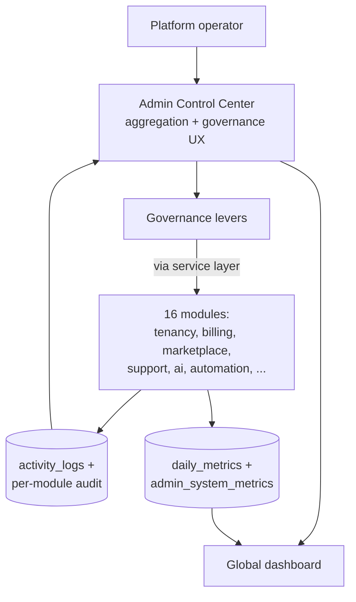
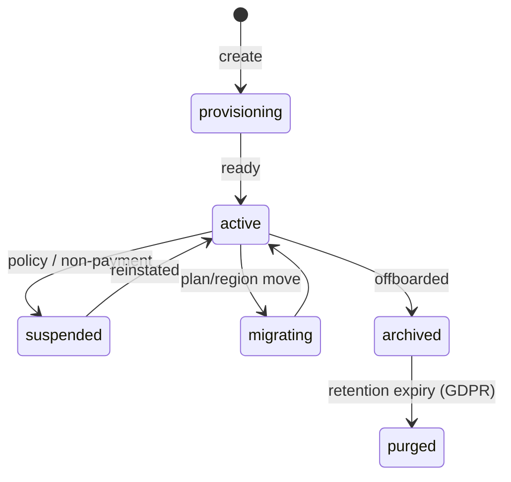
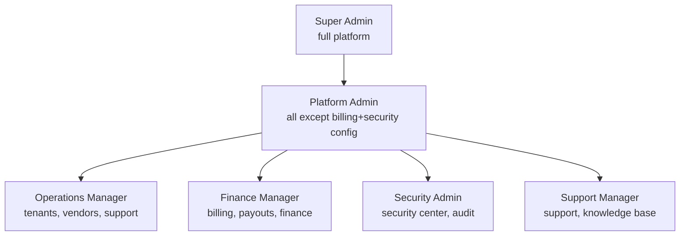

# Admin Control Center — Multi-Tenant Multi-Vendor SaaS

The platform's **governance control plane**: a single command center for
super-admins + platform operators to run the whole marketplace — tenants,
vendors, customers, finance, security, compliance, AI ops, and system
configuration.

This is the **capstone module**. It owns almost no new domain logic;
instead it is the unified administrative surface over the sixteen
modules already designed. Every section here **delegates to the owning
module doc** for the underlying engine and exposes its admin/oversight
view. Think of it as the platform-operator lens onto everything.

| This center's section | Delegates to |
|---|---|
| Global dashboard | [`dashboard`](dashboard-architecture.md) (super-admin) + [`analytics`](analytics-architecture.md) |
| Tenant / subscription / billing | [`billing`](billing-architecture.md) + tenancy (`Tenant`/`TenantSubscription`) |
| Vendor / customer / marketplace | [`marketplace`](marketplace-architecture.md) + [`crm`](crm-architecture.md) |
| Project / task admin | [`projects`](projects-architecture.md) + [`tasks`](tasks-architecture.md) |
| Support / messaging admin | [`support`](support-architecture.md) + [`messaging`](messaging-architecture.md) |
| File / KB admin | [`file-manager`](file-manager-architecture.md) + [`knowledge-base`](knowledge-base-architecture.md) |
| AI ops | [`ai`](ai-architecture.md) (§17 tokens, §19 audit) |
| Automation admin | [`workflow-automation`](workflow-automation-architecture.md) §12 |
| Notifications | [`notifications`](notifications-architecture.md) |
| Security / audit | the auth security batch (sessions, `activity_logs`) + every module's audit log |

Follows the shipped/planned convention of the other sixteen docs.

## Table of contents

1. [Overview](#1-overview)
2. [Global dashboard](#2-global-dashboard)
3. [Tenant management](#3-tenant-management)
4. [Vendor management](#4-vendor-management)
5. [Customer management](#5-customer-management)
6. [Subscription management](#6-subscription-management)
7. [Billing & finance center](#7-billing--finance-center)
8. [Marketplace administration](#8-marketplace-administration)
9. [Project administration](#9-project-administration)
10. [CRM administration](#10-crm-administration)
11. [Support administration](#11-support-administration)
12. [Messaging administration](#12-messaging-administration)
13. [File management administration](#13-file-management-administration)
14. [Knowledge base administration](#14-knowledge-base-administration)
15. [Security center](#15-security-center)
16. [Audit logs center](#16-audit-logs-center)
17. [Compliance center](#17-compliance-center)
18. [Analytics command center](#18-analytics-command-center)
19. [AI operations center](#19-ai-operations-center)
20. [Automation administration](#20-automation-administration)
21. [Notification center](#21-notification-center)
22. [Feature flags & configuration](#22-feature-flags--configuration)
23. [System configuration](#23-system-configuration)
24. [User & role management](#24-user--role-management)
25. [Monitoring & observability](#25-monitoring--observability)
26. [Database design](#26-database-design)
27. [API design](#27-api-design)
28. [Frontend architecture](#28-frontend-architecture)
29. [Performance](#29-performance)
30. [Multi-tenant governance](#30-multi-tenant-governance)
31. [Scalability](#31-scalability)

### Status snapshot (today)

| Layer | Shipped | Planned in this doc |
|---|---|---|
| **Admin gate** | `EnsureUserIsAdmin` (Spatie `admin`/`super-admin` + `is_admin` fallback) | super-admin vs platform-admin vs ops/finance/security role tiers |
| **Super-admin dashboard** | `dashboard/super-admin` (revenue, vendors, customers, approvals, trend) | the full executive global dashboard (§2) |
| **Admin CRUD** | `Admin\ProductController`, `Admin\BrandingController`, `Admin\UserController` + pages | the per-module admin surfaces (§3–§14) |
| **Config / feature flags** | `Setting` (cached key-value store) + `PlanGate` (plan feature limits) | `admin_feature_flags` + config center (§22/§23) |
| **Audit** | `activity_logs` + per-module append-only logs | unified audit center (§16) |
| **Security** | auth: 2FA, session management, login activity (the auth batch) | security center aggregation (§15) |
| **Tables** | `settings`, `activity_logs`, `tenants`, `tenant_subscriptions` | the `admin_*` aggregation/control tables |

> The control center is the most-composed module — most of its building blocks ship across the other sixteen. Its own job is **aggregation, governance controls, and the operator UX**: one place to see everything and a small set of platform-level levers (suspend a tenant, flip a feature flag, override a quota, resolve a flagged event) that reach into the modules through their service layers.

---

## 1. Overview

### Governance strategy

The platform operator needs **one console** to run a marketplace of
thousands of tenants. The control center provides:
- **Visibility** — aggregated health across every module (one dashboard, drill into any).
- **Control** — platform-level actions (tenant suspend/migrate, feature flags, quota overrides, dispute arbitration, content moderation).
- **Accountability** — every admin action audited (§16); RBAC-tiered (§24) so finance can't flip security settings.

### Strategies

| Strategy | Approach |
|---|---|
| Operational | Real-time health + alerts; act on anomalies before they escalate |
| Security | Aggregated login/session/threat monitoring; lock down on signal |
| Financial | Revenue/commission/payout oversight; reconciliation health (payments §6) |
| Growth | MRR/ARR/churn/cohort KPIs (analytics) driving decisions |

### Principle: the operator acts through service layers

The control center has **no privileged back doors**. Suspending a tenant
calls the tenancy service; moderating a product calls the marketplace
service; refunding a dispute calls the billing service. So every
platform action re-applies the same validation + audit + events a normal
flow would — the admin UX is a *lens + lever*, not a parallel
implementation. (Same principle as the workflow engine, automation §19.)



---

## 2. Global dashboard

The executive view (extends the shipped `dashboard/super-admin`):
total + active tenants, total vendors, total customers, total projects,
total + monthly revenue, MRR, ARR, churn rate, system health, active
sessions.

- **Real-time** — live counters (Redis, analytics §10) for active sessions + today's revenue/orders; WebSocket-pushed.
- **Reads from rollups** — MRR/ARR/churn/tenants from `analytics_snapshots` + `financial_reports` (billing §12 / analytics §18) — never live aggregation.
- **System health** — a composite from the monitoring center (§25): API/DB/queue/error status as a single green/amber/red.
- **Drill-down** — every tile links into the relevant admin section.

---

## 3. Tenant management

(Tenancy: `Tenant` + `TenantSubscription`, shipped; `ResolveTenant`, `BelongsToTenant`.)



Create / activate / suspend / delete / **migrate** / settings. The
operator can: suspend a tenant (freezes access, preserves data),
migrate (plan change, region move, data export/import), configure
white-label (branding §, BrandingService), set plans + **resource
allocation** (quota overrides on top of the plan, §22). `admin_tenant_controls`
records platform-level overrides + suspension reasons. Lifecycle audited.

---

## 4. Vendor management

(Delegates to [`marketplace`](marketplace-architecture.md) §11 + [`crm`](crm-architecture.md) §7.)
Verification, approval, suspension, performance, risk monitoring; vendor
health scores (analytics §4). The control center surfaces the platform's
vendor queue (pending approvals, at-risk vendors, fraud flags) and the
levers (approve/suspend/verify) — calling the marketplace vendor service.
`admin_vendor_controls` holds platform overrides (manual risk flags,
commission overrides).

---

## 5. Customer management

(Delegates to [`crm`](crm-architecture.md) + auth.) Customer accounts,
teams, activity, risk scores, support history. The operator can view a
customer 360 (crm §6), see their orders/projects/tickets, flag/suspend
an abusive account, and handle GDPR requests (§17). Customer risk scores
(fraud, chargebacks) from billing + AI moderation (ai §16).

---

## 6. Subscription management

(Delegates to [`billing`](billing-architecture.md) §3.) Plans (tenant +
vendor), upgrades, downgrades, renewals, trials. The operator manages
the plan catalogue (`plans`), grants comp/trial extensions, and sees the
subscription lifecycle health (trialing → active → past_due → churned)
across all tenants. Plan changes call the billing service (proration,
Stripe).

---

## 7. Billing & finance center

(Delegates to [`billing`](billing-architecture.md) + [`payments`](payments-architecture.md).)
Monitor revenue, commissions, payouts, refunds, failed payments, taxes,
financial reports. Plus operator levers: approve large withdrawals
(billing §7), arbitrate refund disputes (support §10 → billing §11),
review **reconciliation health** (payments §6 — any ledger drift is a
red alert here). `admin_finance_reports` snapshots are the
operator-facing financial summaries.

---

## 8. Marketplace administration

(Delegates to [`marketplace`](marketplace-architecture.md).) Products,
categories, reviews, promotions, featured listings, vendor stores +
**content moderation**: the AI-flagged queue (fake products/reviews,
ai §16) for human decision; feature/unfeature listings; manage the
category taxonomy; curate homepage promotions/banners.

---

## 9. Project administration

(Delegates to [`projects`](projects-architecture.md) + [`tasks`](tasks-architecture.md).)
Monitor projects, tasks, milestones, team performance, project risks
(AI risk detection, projects §18). Operational reports: at-risk/delayed
projects across tenants, delivery-time trends. Read-mostly oversight
(the operator intervenes in disputes, not day-to-day project work).

---

## 10. CRM administration

(Delegates to [`crm`](crm-architecture.md).) Monitor leads,
opportunities, customer lifecycle, sales pipelines, segments. Platform
CRM insights: conversion trends, pipeline health across tenants —
governance-level, not per-vendor selling.

---

## 11. Support administration

(Delegates to [`support`](support-architecture.md).) Ticket volume, SLA
compliance, support agents, CSAT, escalations. The operator manages the
support org (agents, teams, SLA policies), monitors the breach queue,
and arbitrates escalated disputes. The support-manager role lives here.

---

## 12. Messaging administration

(Delegates to [`messaging`](messaging-architecture.md).) Conversations,
message volume, **abuse reports + moderation events** (the AI/report
moderation queue, messaging §16). The operator reviews flagged messages,
acts on abuse, and sees communication analytics — without reading
private conversations except under audited legal-hold.

---

## 13. File management administration

(Delegates to [`file-manager`](file-manager-architecture.md).) Storage
usage, upload/download activity, quotas, **storage providers**. The
operator manages provider config (§23), monitors per-tenant storage
(cost attribution), handles quarantined-file review (malware, file §19),
and adjusts quotas.

---

## 14. Knowledge base administration

(Delegates to [`knowledge-base`](knowledge-base-architecture.md).)
Articles, documentation, FAQs, content reviews, knowledge analytics +
editorial workflows. The knowledge-manager role approves/publishes,
reviews the content-gap report (failed searches, kb §18), and manages
the editorial queue.

---

## 15. Security center

(Aggregates the auth security batch: 2FA, session management, login
activity.) Monitor login activity, failed logins, suspicious activity,
security events, user sessions, device activity. Plus: **security
alerts** (threshold-based — failed-login spikes, impossible-travel,
privilege-escalation attempts), threat detection (anomaly scoring),
risk monitoring. The security-admin role acts here: force-logout a
user/device, lock an account, require re-auth, review the security
event stream. `admin_security_events` aggregates security signals from
across modules.

---

## 16. Audit logs center

(Aggregates `activity_logs` + every module's append-only audit log.)
A unified, **immutable** audit trail: user actions, admin actions,
billing events, security events, data changes, workflow executions. Each
module writes its own append-only log; this center provides the unified
**search + filter + export** across all of them (by actor, action,
subject, tenant, date). `admin_audit_logs` is the platform-admin-action
log specifically (who suspended which tenant, who flipped which flag) —
the most sensitive trail, tamper-evident.

```php
admin_audit_logs
  id, actor_id (admin), action, target_type, target_id
  tenant_id (nullable = platform-level), before jsonb, after jsonb
  ip, user_agent, created_at   // append-only, no update/delete
  index (actor_id, created_at), index (target_type, target_id), index (action, created_at)
```

---

## 17. Compliance center

GDPR, data retention, data export/deletion requests, consent management.
- **Export/delete requests** — a queue of customer GDPR requests; fulfillment orchestrates across modules (each module exposes export/delete hooks: file-manager §27, messaging §23, kb, crm). One request → fan-out → packaged export or coordinated purge, tracked in `admin_compliance_records`.
- **Retention** — per-tenant retention policies enforced by each module's purge jobs; the center monitors compliance.
- **Consent** — consent records (marketing, AI data use — ai §21) auditable.
- **Reports** — compliance reports (who requested what, fulfillment SLA) for DPO/legal.

---

## 18. Analytics command center

(Delegates to [`analytics`](analytics-architecture.md).) Platform KPIs,
revenue KPIs, vendor KPIs, customer KPIs, growth KPIs; executive
reports. The operator's BI surface — cross-tenant aggregates
(`tenant_id IS NULL` platform rollups, super-admin only), cohort
analysis, AI executive summaries (analytics §23). Custom KPIs +
report builder (analytics §11/§12) at platform scope.

---

## 19. AI operations center

(Delegates to [`ai`](ai-architecture.md) §17, §19.) Manage AI models
(the `ai_models` registry), AI usage, AI costs, AI requests, AI
performance, AI insights. The operator: monitors per-tenant AI spend +
margin (real provider cost vs credits sold), sets model routing tiers
(ai §22), reviews the AI audit log (`/admin/ai/audit`, ai §21), and
manages provider keys + budgets. AI cost is a direct margin lever.

---

## 20. Automation administration

(Delegates to [`workflow-automation`](workflow-automation-architecture.md) §12.)
Workflow executions, failures, trigger events, automation usage. The
operator monitors platform-wide automation health (failure rates, DLQ
depth), can disable a runaway tenant workflow (the circuit breaker,
automation §14), and sees automation-usage reports.

---

## 21. Notification center

(Delegates to [`notifications`](notifications-architecture.md).) Manage
email/push/SMS notifications + system alerts; notification templates
(platform defaults, notifications §9). The operator broadcasts platform
announcements (to all tenants/users), manages global templates, and
monitors delivery health (delivery/bounce rates, notifications §17).

---

## 22. Feature flags & configuration

(Built on the shipped `Setting` store + `PlanGate`.)

```php
admin_feature_flags
  id, key, description
  scope enum('global','tenant','vendor','plan','user','percentage')
  enabled bool, conditions jsonb     // tenant_ids, plan, % rollout, date window
  created_by_id, timestamps
  index (key), index (scope)
```

- **Feature toggles** — global on/off.
- **Beta features** — opt-in tenants/users.
- **Tenant-specific** — a feature for one tenant.
- **Vendor-specific** — a capability for certain vendors.
- **Percentage rollout** — gradual release (X% of tenants).

A `FeatureFlag::active($key, $context)` check (cached in Redis, like
`Setting`) gates code paths. Distinct from `PlanGate` (which gates by
*plan entitlement*); feature flags gate by *rollout/experiment*. The two
compose: a feature may require both a plan + an active flag.

---

## 23. System configuration

(Built on the shipped `Setting` store.) Global settings, branding,
localization, **email providers, storage providers, payment providers,
API settings**. The config center is the operator UI over the provider
registries each module defines (`storage_providers` file §2,
`ai_tokens` ai §18, payment gateways billing §5, notification channels).
Provider credentials encrypted; changes audited; a "test connection"
per provider. `admin_configurations` versions config changes for
rollback.

---

## 24. User & role management

(Built on the shipped Spatie roles + `Admin\UserController`.)



RBAC (Spatie, shipped), granular permissions, teams, access policies.
The control center itself is **RBAC-tiered**: a finance manager sees the
finance center but not security config; a support manager sees support
but not payouts. Each admin section checks a permission
(`admin.finance.view`, `admin.security.manage`, …). `admin_roles` +
`admin_permissions` extend the Spatie tables with admin-scoped
permissions; the shipped admin users page manages assignment.

---

## 25. Monitoring & observability

Track API performance, database performance, queue performance, error
rates, system availability.

```php
admin_system_metrics
  id, metric enum('api_latency_p95','db_query_p95','queue_depth','error_rate','availability', ...)
  scope (nullable: endpoint/queue/service), value, recorded_at
  index (metric, recorded_at)

admin_system_alerts
  id, type, severity enum('info','warning','critical'), title, body
  source, status enum('open','acknowledged','resolved'), metadata jsonb
  triggered_at, resolved_at
  index (status, severity, triggered_at)
```

- **Metrics** — API p50/p95 latency, DB query time, queue depth + throughput, error rate, uptime — scraped from the app (middleware timing, queue stats) + infra (Prometheus/`/metrics`).
- **Alerts** — threshold + anomaly-based → `admin_system_alerts` + notification/page; the dashboard's "system health" composite (§2) reads these.
- **Observability** — structured logs + traces (OpenTelemetry) + the `/up` health endpoint (already in `bootstrap/app.php`); error tracking (Sentry-style) surfaced here.
- **Event streaming** — high-volume metrics via Redis streams → aggregated, not per-event DB writes.

---

## 26. Database design

| Table | Purpose |
|---|---|
| `admin_settings` | Platform config (shipped `settings`, extended) |
| `admin_feature_flags` | Feature toggles + rollout (§22) |
| `admin_roles` / `admin_permissions` | Admin-scoped RBAC (extends Spatie) |
| `admin_users` | Admin/operator accounts (or `users` + role) |
| `admin_audit_logs` | Platform-admin action trail (immutable) |
| `admin_security_events` | Aggregated security signals (§15) |
| `admin_system_alerts` | Operational alerts (§25) |
| `admin_tenant_controls` | Per-tenant platform overrides (suspension, quota) |
| `admin_vendor_controls` | Per-vendor platform overrides (risk, commission) |
| `admin_finance_reports` | Operator financial summaries |
| `admin_ai_usage` | Aggregated AI usage/cost (from ai `ai_usage_logs`) |
| `admin_system_metrics` | Observability metrics (§25) |
| `admin_configurations` | Versioned config changes |
| `admin_compliance_records` | GDPR request tracking (§17) |
| `admin_notification_templates` | Platform notification templates |
| `admin_monitoring_events` | Monitoring event stream |

### Particulars

- `admin_*` tables are mostly **aggregation + control overlays** — the source data lives in the module tables; these hold platform-level overrides, snapshots, and the admin-action audit.
- `admin_audit_logs` + `admin_security_events` + `admin_monitoring_events` append-only, partitioned by month.
- Most tables are **not** `tenant_id`-scoped (they're platform-level); `admin_tenant_controls` / `admin_vendor_controls` reference a tenant/vendor but are operator-owned. Super-admin-only access (§24).
- Reuses the shipped `settings`, `activity_logs`, `tenants`, `tenant_subscriptions`.

---

## 27. API design

Super-admin / platform-operator scoped (RBAC-tiered §24); behind
`/admin` + `EnsureUserIsAdmin` + per-section permission; every mutating
call audited to `admin_audit_logs`.

| Verb | URL | Purpose |
|---|---|---|
| `GET` | `/admin/overview` | Global dashboard metrics |
| `GET` | `/admin/tenants` | Tenant list (filter status/plan, search) |
| `POST` | `/admin/tenants/{id}/suspend` / `/activate` / `/migrate` | Tenant control |
| `PATCH` | `/admin/tenants/{id}/limits` | Quota override |
| `GET/POST` | `/admin/vendors` | Vendor list + approve/suspend/verify |
| `GET` | `/admin/customers` | Customer admin |
| `GET` | `/admin/finance` | Finance center (revenue/commission/payout) |
| `POST` | `/admin/withdrawals/{id}/approve` | Approve payout |
| `GET` | `/admin/security/events` | Security event stream |
| `POST` | `/admin/security/sessions/{id}/revoke` | Force logout |
| `GET` | `/admin/audit` | Unified audit search/export |
| `GET` | `/admin/compliance/requests` | GDPR queue |
| `POST` | `/admin/compliance/requests/{id}/fulfill` | Fulfill export/delete |
| `GET` | `/admin/analytics` | Platform KPIs + reports |
| `GET` | `/admin/ai/usage` | AI cost/usage |
| `GET` | `/admin/automation` | Automation health |
| `GET/POST` | `/admin/feature-flags` | Manage flags |
| `GET/PUT` | `/admin/config` | System configuration |
| `GET/POST` | `/admin/roles` | Admin role/permission management |
| `GET` | `/admin/monitoring` | Observability metrics + alerts |

Lists support filter/search/sort + cursor pagination; exports queued
(signed-URL). Read-heavy endpoints cached; every action audited.

---

## 28. Frontend architecture

```
resources/js/
├── pages/admin/                # (shipped: products/, branding/, users/)
│   ├── overview.tsx            # executive global dashboard
│   ├── tenants.tsx + tenant-detail.tsx
│   ├── vendors.tsx
│   ├── customers.tsx
│   ├── finance.tsx
│   ├── security.tsx            # security center
│   ├── audit.tsx               # audit logs center
│   ├── monitoring.tsx          # observability
│   ├── ai-operations.tsx
│   ├── automation.tsx
│   ├── compliance.tsx
│   ├── feature-flags.tsx
│   ├── configuration.tsx       # system config center
│   ├── roles.tsx               # user & role management
│   └── analytics.tsx           # analytics command center
├── components/admin/
│   ├── KpiWidget.tsx
│   ├── MonitoringChart.tsx     # latency/error/uptime
│   ├── AuditTable.tsx          # filterable, virtualized
│   ├── TenantCard.tsx + VendorCard.tsx
│   ├── SecurityPanel.tsx       # event stream + actions
│   ├── RevenueDashboard.tsx
│   ├── SystemHealthBadge.tsx   # green/amber/red composite
│   ├── FeatureFlagToggle.tsx
│   ├── ProviderConfigForm.tsx  # email/storage/payment/AI providers
│   ├── ComplianceQueue.tsx
│   └── AdminSidebar.tsx        # RBAC-filtered nav (sections by permission)
├── hooks/admin/
│   ├── useGlobalMetrics.ts     # live KPIs
│   ├── useAuditSearch.ts
│   ├── useTenantControls.ts
│   └── useSystemHealth.ts
└── lib/admin/{permissions,formatters}.ts
```

- The **AdminSidebar** is RBAC-filtered — an operator sees only the sections their role permits (§24).
- Built on the shipped `AppLayout` (sidebar shell) + the admin pages already present (products/branding/users); reuses every module's widget/chart components.
- Live metrics via the dashboard's Reverb channel; React Query for tables; every action confirms + audits.

---

## 29. Performance

Target: millions of users + events daily, enterprise-scale ops.

| Concern | Approach |
|---|---|
| Dashboards | Read pre-aggregated rollups (`daily_metrics`, `analytics_snapshots`, `admin_system_metrics`) — never live cross-tenant aggregation |
| Live counters | Redis (active sessions, today's revenue), WebSocket-pushed |
| Audit search | Indexed + partitioned `admin_audit_logs`; cursor pagination; exports async |
| Monitoring | Metrics via Redis streams → aggregated; not per-event DB writes |
| Aggregated metrics | Nightly + near-real-time rollup jobs (analytics engine) |
| Caching | Redis: config, feature flags, role permissions, dashboard tiles |
| Background jobs | Report generation, compliance fulfillment, metric aggregation, exports |
| Event streaming | High-volume signals (security, monitoring) streamed, sampled, rolled up |

---

## 30. Multi-tenant governance

The operator's tenant-governance levers:
- **Manage tenant resources** — quota overrides on top of the plan (storage, AI credits, products, seats) via `admin_tenant_controls`.
- **Define tenant limits** — per-tenant caps beyond the plan defaults (billing §2 / PlanGate).
- **Configure tenant features** — feature flags scoped to a tenant (§22).
- **Manage tenant billing** — comp plans, trial extensions, manual invoicing (billing §3).
- **Suspend/migrate** — lifecycle control (§3).

All scoped to super-admin / platform-admin; tenant-owners govern *within*
their tenant (the per-module admin surfaces), the platform operator
governs *across* tenants. The two tiers never overlap — a tenant-owner
can't see another tenant, and the platform operator's cross-tenant views
are super-admin-gated + audited.

---

## 31. Scalability

100k+ tenants, millions of users + transactions, global ops:

- **Rollup-driven** — every dashboard + report reads pre-aggregated tables; the control center never scans OLTP cross-tenant.
- **Partitioned** audit + security + monitoring logs by month; cold-archived.
- **Read replicas** — all admin reads hit replicas; the few writes (controls, config, flags) hit the primary.
- **Event streaming** — security + monitoring signals via Redis streams / a log pipeline, sampled + aggregated, not per-event persisted.
- **Cached governance state** — feature flags, config, role permissions in Redis (busted on change) — checked on the hot path of every request platform-wide.
- **Async heavy ops** — compliance fulfillment, exports, report generation all queued.
- **Multi-region** — the control plane reads regional rollups; cross-region aggregation is eventual.

---

## File map for the next phase

| Path | Status |
|---|---|
| `database/migrations/*_create_admin_feature_flags_table.php` | planned |
| `database/migrations/*_create_admin_audit_logs_table.php` (partitioned) + `_security_events_` + `_monitoring_events_` | planned |
| `database/migrations/*_create_admin_system_alerts_table.php` + `_system_metrics_` | planned |
| `database/migrations/*_create_admin_tenant_controls_table.php` + `_vendor_controls_` | planned |
| `database/migrations/*_create_admin_configurations_table.php` + `_compliance_records_` | planned |
| `app/Domain/Admin/{TenantControlService,FeatureFlagService,SecurityCenter,AuditAggregator,ComplianceService,SystemMonitor}.php` | planned |
| `app/Models/{AdminFeatureFlag,AdminAuditLog,AdminSecurityEvent,AdminSystemAlert,AdminTenantControl,AdminConfiguration,AdminComplianceRecord}.php` | planned |
| `app/Http/Middleware/EnsureAdminPermission.php` (RBAC-tiered, extends EnsureUserIsAdmin) | planned |
| `app/Http/Controllers/Admin/{Overview,Tenant,Vendor,Customer,Finance,Security,Audit,Monitoring,AiOps,Automation,Compliance,FeatureFlag,Configuration,Role}Controller.php` | planned (Product/Branding/User shipped) |
| `app/Jobs/Admin/{AggregateSystemMetrics,FulfillComplianceRequest,GenerateAdminReport}.php` | planned |
| `app/Listeners/Admin/{RecordAdminAction,CollectSecurityEvent,RaiseSystemAlert}.php` | planned |
| `resources/js/pages/admin/*` (overview/tenants/vendors/finance/security/audit/monitoring/ai-ops/automation/compliance/feature-flags/configuration/roles/analytics) | planned |
| `resources/js/components/admin/*` + `hooks/admin/*` | planned |
| `tests/Feature/Admin/*` (RBAC-tiered access, tenant suspend/control, feature-flag rollout, audit immutability, compliance fulfillment, security force-logout) | planned |

The next pass commits `EnsureAdminPermission` (the RBAC tiers on top of
the shipped `EnsureUserIsAdmin`), the `admin_audit_logs` +
`admin_feature_flags` + `admin_tenant_controls` tables, the
`TenantControlService` + `FeatureFlagService` + `AuditAggregator`, and
the executive overview + tenant-management pages — extending the shipped
super-admin dashboard + admin product/branding/user surfaces into the
full control center. The remaining per-module admin sections are
operator lenses over modules that ship independently.

---

## The architecture doc set — complete

This is the seventeenth and **capstone** architecture doc — the
governance layer over the sixteen module docs. The complete set under
`docs/`:

| # | Doc | Role |
|---|---|---|
| 1 | `dashboard-architecture.md` | Role-aware dashboards |
| 2 | `payments-architecture.md` | Wallet, ledger, idempotent webhooks |
| 3 | `projects-architecture.md` | Project delivery |
| 4 | `tasks-architecture.md` | Task execution |
| 5 | `notifications-architecture.md` | Multi-channel delivery |
| 6 | `billing-architecture.md` | Subscriptions, commissions, payouts |
| 7 | `ai-architecture.md` | Provider gateway, RAG, credits |
| 8 | `analytics-architecture.md` | Event pipeline, BI, forecasting |
| 9 | `workflow-automation-architecture.md` | Visual workflow engine |
| 10 | `marketplace-architecture.md` | Catalog, orders, vendor stores |
| 11 | `mobile-architecture.md` | Responsive + PWA (cross-cutting) |
| 12 | `crm-architecture.md` | Leads, pipelines, accounts |
| 13 | `messaging-architecture.md` | Real-time chat engine |
| 14 | `support-architecture.md` | Tickets, SLA, disputes |
| 15 | `file-manager-architecture.md` | Storage, versioning, sharing |
| 16 | `knowledge-base-architecture.md` | Docs, RAG content, help center |
| 17 | `admin-control-center-architecture.md` | **Governance control plane** |

All in the same shipped-vs-planned format, cross-referenced, each ending
with a concrete "File map for the next phase". Together they describe a
complete enterprise multi-tenant multi-vendor SaaS marketplace, built
incrementally on the working Laravel + Inertia + React foundation that
ships today.
