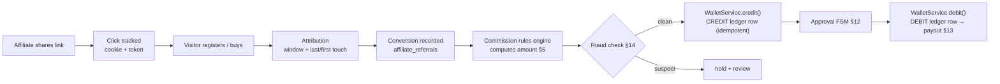
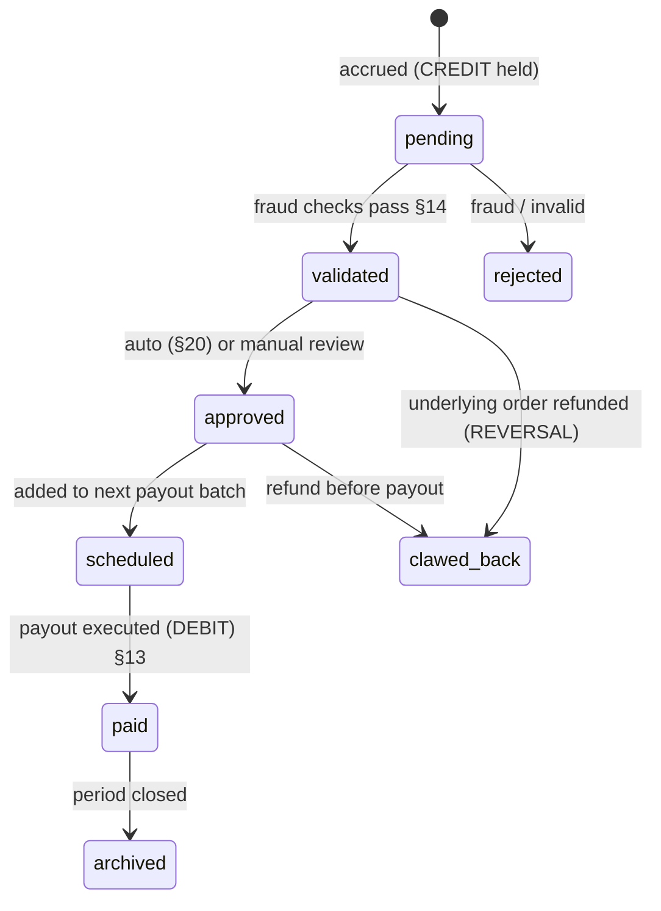

# Affiliate & Referral Module — Multi-Tenant Multi-Vendor SaaS

Affiliate marketing, referral programs, partner management, a flexible
commission engine, secure payouts, AI fraud detection, and multi-level
rewards — built so growth is a first-class, measurable, *financially
correct* part of the platform.

This module is unusual: its hardest part — **moving money correctly** —
is **already built**. Commissions, payouts, clawbacks, wallets, and
reconciliation are not new systems to design; they are the shipped
payments primitives with affiliate context attached. This doc's job is to
build the **growth machinery** (affiliates, links, attribution, rules,
campaigns, fraud) *on top of* that proven money core.

### What ships today (verified)

The entire **money spine** an affiliate system needs already exists from
the payments work:

- **`Wallet`** — `balance_cents` (BIGINT) + optimistic `version`; balance math happens **only** through `WalletService` (the model warns against `$wallet->balance_cents += X` — it races). `transactions()` history; `getBalanceAttribute()` via the `Money` helper.
- **`WalletService`** — `credit($wallet, $cents, $idempotencyKey, ?Payment, ?Order, ?reference, ?metadata)`, `debit(...)`, `refund(...)`, `computedBalance($wallet)` (re-derive from the ledger), all under `lockForUpdate` with a `version` bump. **The `$idempotencyKey` is the no-double-pay guard.**
- **`LedgerTransaction`** — **append-only**: `public const UPDATED_AT = null;` *and* an overridden `update()` that throws. Typed with a sign map used by reconciliation:
  ```php
  SIGN = [ CREDIT => +1, REFUND => +1, DEBIT => -1, REVERSAL => -1, ADJUSTMENT => +1 ];
  ```
  Carries `amount_cents`, `balance_after_cents`, `currency`, `idempotency_key`, `reference`, `metadata` (jsonb), and links to `payment`/`order`.
- **`Money`** — `toCents()` / `fromCents()` — integer cents, **never floats**.
- **`ReconciliationService`** — drift detection (stored balance vs `computedBalance` from history).
- **`Coupon`** — `BelongsToTenant`, `TYPE_PERCENTAGE` / `TYPE_FIXED`, `code`, `value`, `min_order_amount`, `max_uses`, `used_count`, `max_uses_per_user`, `starts_at`/`expires_at`, `is_active`, `isUsable()`, `hasMany(Order)`.
- **`Order`** + `OrderPaymentProcessor` — the purchase event a commission attaches to.

> The mapping that makes this module mostly *reuse, not rebuild*:
> | Affiliate concept | Shipped primitive |
> |---|---|
> | Affiliate balance | a `Wallet` owned by the affiliate |
> | Commission earned | a **`CREDIT`** `LedgerTransaction` (idempotency key `commission:{referral}:{level}`) |
> | Payout sent | a **`DEBIT`** `LedgerTransaction` |
> | Commission clawback / refund-driven reversal | a **`REVERSAL`** `LedgerTransaction` |
> | Money math | `Money` (BIGINT cents) + `WalletService` (locked, versioned) |
> | "Did we double-pay?" | the `idempotency_key` UNIQUE guard — impossible by construction |
> | "Do the books balance?" | `ReconciliationService.computedBalance()` |
> | Referral coupon | the shipped `Coupon` + affiliate/campaign attribution |
>
> So `affiliate_wallets` and `affiliate_transactions` (the prompt's table names) are **the shipped `Wallet` / `LedgerTransaction`** — a wallet scoped to an affiliate owner, ledger rows whose `metadata` carries the referral/commission context. We do **not** build a second money system; building one would risk the exact float/race/double-pay bugs the shipped code already prevents.

The genuinely-new work is the **growth layer**: affiliate lifecycle,
referral link/click/attribution tracking, the commission *rules* engine,
multi-level, campaigns, and fraud detection (which reuses the audit
security-detection engine).

It composes:

- **Money** ← [`payments-architecture.md`](payments-architecture.md) (wallet/ledger/Money/reconciliation — **the spine**).
- **Recurring commissions + plan gating** ← [`billing-architecture.md`](billing-architecture.md) (subscription renewal events; `PlanGate`).
- **Trigger events + vendor campaigns** ← [`marketplace-architecture.md`](marketplace-architecture.md) (order/purchase events fire commissions; commission ⊂ the marketplace commission model).
- **Attribution targets** ← [`crm-architecture.md`](crm-architecture.md) (leads/contacts/customers).
- **Funnel + ROI** ← [`analytics-architecture.md`](analytics-architecture.md) (the `daily_metrics` rollup pattern).
- **Fraud + financial audit trail** ← [`audit-logs-architecture.md`](audit-logs-architecture.md) (detection engine; immutable commission history).
- **Auto-approval/payout rules** ← [`workflow-automation-architecture.md`](workflow-automation-architecture.md).
- **Alerts** ← [`notifications-architecture.md`](notifications-architecture.md); **fraud/forecasting** ← [`ai-architecture.md`](ai-architecture.md).

Follows the shipped/planned convention of the prior twenty docs.

## Table of contents

1. [Module overview](#1-module-overview)
2. [Affiliate management](#2-affiliate-management)
3. [Referral program](#3-referral-program)
4. [Referral tracking](#4-referral-tracking)
5. [Commission engine](#5-commission-engine)
6. [Multi-level referral system](#6-multi-level-referral-system)
7. [Vendor affiliate program](#7-vendor-affiliate-program)
8. [Tenant referral program](#8-tenant-referral-program)
9. [Campaign management](#9-campaign-management)
10. [Rewards system](#10-rewards-system)
11. [Coupon & promo codes](#11-coupon--promo-codes)
12. [Commission approval workflow](#12-commission-approval-workflow)
13. [Payout management](#13-payout-management)
14. [Fraud detection](#14-fraud-detection)
15. [AI growth features](#15-ai-growth-features)
16. [Affiliate dashboard](#16-affiliate-dashboard)
17. [Referral analytics](#17-referral-analytics)
18. [CRM integration](#18-crm-integration)
19. [Notification center](#19-notification-center)
20. [Automation](#20-automation)
21. [Database design](#21-database-design)
22. [API design](#22-api-design)
23. [Frontend architecture](#23-frontend-architecture)
24. [Security](#24-security)
25. [Performance](#25-performance)
26. [Multi-tenant architecture](#26-multi-tenant-architecture)
27. [Compliance](#27-compliance)
28. [Scalability](#28-scalability)
29. [Future expansion](#29-future-expansion)

### Status snapshot (today)

| Layer | Shipped | Planned in this doc |
|---|---|---|
| **Commission as money** | `LedgerTransaction` CREDIT (append-only, idempotent) | accrual logic + rules (§5) |
| **Affiliate balance** | `Wallet` (cents + version, `WalletService`) | affiliate-owned wallets (§13) |
| **Payout / clawback** | `DEBIT` / `REVERSAL` ledger types | payout workflow + methods (§13) |
| **No double-pay** | `idempotency_key` UNIQUE guard | commission keying (§5) |
| **Reconciliation** | `ReconciliationService` drift detection | covers affiliate wallets (§24) |
| **Coupons** | `Coupon` (percentage/fixed, usable rules) | + affiliate/campaign attribution (§11) |
| **Fraud detection** | audit security-detection engine | affiliate-specific rules (§14) |
| **Tracking / attribution** | — | links, clicks, cookies, windows (§4) |
| **Tables** | `wallets`, `ledger_transactions`, `coupons` | 19 affiliate/referral tables (§21) |

---

## 1. Module overview

### Strategy

| Concern | Approach |
|---|---|
| Affiliate marketing | Partners drive traffic via tracked links; earn commission on attributed conversions — paid through the shipped ledger |
| Referral programs | Existing users/vendors/tenants refer new ones for rewards (cash/credit/coupon) |
| Commission management | A rules engine decides *how much*; the shipped ledger handles *the money* — clean separation |
| Growth | Every conversion is attributable, every payout auditable, every campaign measurable (ROI) — growth as an instrumented system |

### The core loop (grounded in shipped money)



The left half (link → click → attribution → conversion → rule) is the new
growth layer; the right half (`credit` → approve → `debit`) is the
**shipped ledger**, untouched.

### Integration

Marketplace order events trigger commissions; billing renewals trigger
recurring commissions; CRM holds the attributed contacts; analytics
reports the funnel; notifications announce earnings; automation
auto-approves; audit makes commission history immutable; AI scores fraud.

---

## 2. Affiliate management

```php
affiliates
  id, tenant_id, user_id → users (nullable — external affiliates allowed)
  code (unique), status enum('pending','approved','suspended','rejected','banned')
  category_id, parent_affiliate_id (nullable — multi-level §6)
  approved_by_id, approved_at, created_at

affiliate_profiles
  id, affiliate_id, display_name, bio, website, social jsonb
  payout_method, payout_details_encrypted, tax_info_encrypted, kyc_status
```

Lifecycle: **registration → approval → verification → active →
(suspend/ban)** — an FSM (the order-status pattern). Registration can be
self-serve or invite-only (§7); approval is manual or auto (§20). Profiles
hold payout + tax info (encrypted at rest, §27). Categories segment
affiliates (influencer / content / partner). Every status transition is
audited (the shipped audit core).

---

## 3. Referral program

```php
referral_programs
  id, tenant_id, name, type enum('customer','vendor','tenant','upgrade','purchase','service')
  reward_rule jsonb, eligibility jsonb, is_active, starts_at, ends_at

referral_codes
  id, referral_program_id, owner_user_id, code (unique), uses, max_uses
```

Referrals for: new customers, new vendors, new tenants, subscription
upgrades, product purchases, service purchases. Each referrer gets a
**unique referral link + code** (`?ref=CODE` or `/r/CODE`) — codes are
short, collision-checked, and map to the owner + program. Referral
(user-refers-user) and affiliate (marketer-drives-traffic) share the
tracking + commission machinery; they differ in who participates and the
reward shape.

---

## 4. Referral tracking

```php
affiliate_links
  id, affiliate_id, campaign_id (nullable), slug (unique), target_url, utm jsonb

affiliate_clicks
  id, affiliate_link_id, tenant_id, visitor_token, ip_hash, user_agent
  referrer_url, landing_url, country, created_at   // PARTITIONED by created_at

affiliate_referrals
  id, tenant_id, affiliate_id, referral_code_id (nullable), level smallint
  visitor_token, referred_user_id (nullable), order_id (nullable)
  event enum('click','signup','purchase','upgrade'), status, attributed_at
```

```mermaid
flowchart LR
    HIT[GET /r/{slug}] --> LOG[record click\nset 1st-party cookie ref_token]
    LOG --> RDR[302 → target]
    RDR --> ACT[visitor signs up / buys]
    ACT --> MATCH[match cookie/token → affiliate]
    MATCH --> WIN{within attribution window?}
    WIN -->|yes| CONV[create affiliate_referral conversion]
    WIN -->|no| DROP[no attribution]
```

- **Cookie tracking** — a first-party `ref_token` cookie set on click; read at signup/purchase.
- **Referral tokens** — the token also encoded in the URL + persisted server-side (cookie-less fallback).
- **Attribution windows** — configurable (e.g. 30/60/90 days); a conversion outside the window doesn't pay.
- **Attribution model** — last-touch default; first-touch / multi-touch configurable per program.
- **Cross-device** — when a referred visitor later authenticates, the token binds to the user, stitching devices (best-effort).

Clicks are high-volume → `affiliate_clicks` is **partitioned by
`created_at`** (the audit/usage pattern) and aggregated to rollups (§17).
Writes are queued so the redirect stays instant.

---

## 5. Commission engine

The engine decides **how much**; the shipped `WalletService` moves it.

```php
affiliate_commission_rules
  id, tenant_id, scope enum('platform','tenant','vendor','campaign','program')
  scope_id, model enum('fixed','percentage','recurring','one_time','tiered','bonus')
  amount_cents (fixed), rate_bps (percentage, basis points), tiers jsonb
  recurring_months (nullable), max_payout_cents, currency, priority

affiliate_commissions
  id, tenant_id, affiliate_id, affiliate_referral_id, commission_rule_id
  level smallint, base_amount_cents, commission_cents, currency
  status enum('pending','validated','approved','scheduled','paid','rejected','clawed_back','archived')
  ledger_transaction_id → ledger_transactions (nullable until accrued)
  period (for recurring), created_at
```

Models: **fixed** amount, **percentage** (basis points — integer math,
no float drift, consistent with `Money`), **recurring** (re-accrues each
billing period — driven by billing subscription-renewal events),
**one-time**, **performance bonuses** (threshold-triggered), **tiered**
(rate rises with volume). Rules resolve by scope + priority.

**Accrual** = compute `commission_cents` from the rule + the order/sub
amount, then:

```php
$wallet = $walletService->forUser($affiliate->user, $currency, $tenantId);
$tx = $walletService->credit(
    $wallet, $commissionCents,
    "commission:{$referralId}:{$level}",          // ← idempotency: re-runs never double-credit
    order: $order,
    reference: "affiliate:{$affiliate->id}",
    metadata: ['referral_id' => $referralId, 'level' => $level, 'rule_id' => $ruleId],
);
$commission->update(['ledger_transaction_id' => $tx->id, 'status' => 'validated']);
```

The idempotency key makes commission accrual **safe to retry** — the same
referral+level can never pay twice (the UNIQUE guard rejects the dup).
Recurring commissions accrue on each renewal event with a period-scoped
key (`commission:{sub}:{period}:{level}`). Refund of the underlying order
→ a **`REVERSAL`** (clawback, §12).

---

## 6. Multi-level referral system

```php
// affiliates.parent_affiliate_id builds the referral tree
// L1 = direct referrer, L2 = their referrer, L3 = ...
```

When affiliate A (referred by B, who was referred by C) drives a
conversion, the engine walks up `parent_affiliate_id` to the configured
**depth** and accrues a commission per level (each a separate `CREDIT`
with `level` in the key + metadata). Per-level rates come from the rule's
`tiers`/level config. Platform admins **enable/disable** multi-level and
set max depth (a platform feature flag — the shipped `Setting`/`PlanGate`
pattern). Depth is bounded (typically ≤3) to keep accrual O(depth) and
avoid MLM-style abuse; the cap is enforced server-side.

---

## 7. Vendor affiliate program

(Integrates with [`marketplace-architecture.md`](marketplace-architecture.md).)
Vendors create affiliate campaigns for *their* products, define commission
rules (scoped `vendor`/`campaign`), invite affiliates, and track
performance. A vendor's affiliate commission is funded from the vendor's
revenue share — it composes with the **marketplace commission**: on a
sale, the platform takes its cut, the vendor nets the rest, and the
affiliate commission is deducted from the vendor's net (all as distinct,
typed ledger entries against the right wallets — the shipped ledger
handles the multi-party split atomically).

---

## 8. Tenant referral program

Each tenant creates referral campaigns, customizes rewards, and configures
eligibility — all `tenant_id`-scoped (the global tenant scope; a tenant
never sees another's affiliates/commissions). A white-labeled tenant runs
*their* referral program under *their* brand (white-label §). Tenant
program config is bounded by platform limits (`PlanGate` — e.g. max active
campaigns per plan).

---

## 9. Campaign management

```php
affiliate_campaigns
  id, tenant_id, vendor_id (nullable), name, slug
  starts_at, ends_at, budget_cents, spent_cents
  target_audience jsonb, commission_rule_id, assets jsonb
  status enum('draft','scheduled','active','paused','ended'), created_at
```

Campaigns carry start/end dates, a **budget** (cap on total commission —
enforced against `spent_cents`; accrual stops when exhausted), target
audience, reward rules, and promotional assets (banners/links via the
file-manager). Scheduling is handled by the queue/scheduler (the shipped
worker) — a campaign auto-activates at `starts_at`, auto-ends at `ends_at`.

---

## 10. Rewards system

```php
affiliate_rewards / referral_rewards
  id, tenant_id, recipient_user_id, source_type, source_id
  type enum('cash','store_credit','coupon','sub_discount','marketplace_credit','trial_extension','custom')
  amount_cents (nullable), payload jsonb, status, granted_at
```

Reward types map to existing rails:

| Reward | Mechanism (shipped/owning module) |
|---|---|
| Cash | `CREDIT` to the affiliate wallet → payout (§13) |
| Store credit / marketplace credit | `CREDIT` to the user's wallet (the shipped `Wallet`) |
| Coupon | a generated `Coupon` (shipped model, §11) |
| Subscription discount | a billing coupon/credit (billing module) |
| Free trial extension | extend the subscription trial (billing) |
| Custom | `payload`-defined, handler-dispatched |

Distribution is a queued workflow (§20) — grant → notify → (for wallet
credits) ledger entry. Most rewards are just a `CREDIT` or a `Coupon`, so
the shipped primitives cover them directly.

---

## 11. Coupon & promo codes

Built on the **shipped `Coupon`** model (percentage/fixed, usage caps,
validity window, `isUsable()`):

```php
affiliate_coupons          // links a Coupon to an affiliate/campaign
  id, coupon_id → coupons, affiliate_id (nullable), campaign_id (nullable)
  attribution enum('affiliate','referral','campaign')
```

Generate referral coupons, affiliate coupons, campaign coupons;
single-use (`max_uses = 1`) or reusable (`max_uses = N`) — both already
supported by the shipped `Coupon` (`max_uses`, `max_uses_per_user`,
`used_count`). Redemption history is the shipped `Coupon.hasMany(Order)`
relation; a redeemed affiliate coupon both discounts the buyer *and*
attributes the conversion (the coupon carries the affiliate link). This
is the dual-purpose case: discount + attribution in one code.

---

## 12. Commission approval workflow

A finite-state machine (the order-status FSM pattern):



- **Pending** — accrued but held (the `CREDIT` exists; balance may be "pending" vs "available").
- **Validated** — passed fraud detection (§14).
- **Approved** — manual review or auto-approval rule (§20).
- **Scheduled** — batched for the next payout run.
- **Paid** — `WalletService.debit()` executed; payout sent (§13).
- **Archived** — period closed (kept immutably for audit/tax, §27).
- **Clawed back** — a refund of the underlying order triggers a `REVERSAL` (the shipped reversal type) — the commission is reversed cleanly, books stay balanced.

Manual review queues suspect/large commissions for a human; the FSM +
the ledger make every transition auditable and reversible-by-new-entry
(never by mutation).

---

## 13. Payout management

Payouts are **`DEBIT`s** from the affiliate wallet + an external transfer
record:

```php
affiliate_payouts
  id, tenant_id, affiliate_id, wallet_id → wallets
  amount_cents, currency, method enum('bank','paypal','stripe_connect','wise','wallet','manual')
  status enum('pending','processing','paid','failed','reversed')
  ledger_transaction_id → ledger_transactions, batch_id
  provider_ref, requested_at, paid_at, failure_reason
```

Methods: bank transfer, PayPal, Stripe Connect, Wise, marketplace wallet
(internal — just leave it as wallet balance), manual. A payout run:
batches `scheduled` commissions per affiliate → debits the wallet (one
`DEBIT` per payout, idempotency-keyed `payout:{batch}:{affiliate}`) →
calls the provider → records `provider_ref`. A failed transfer →
`REVERSAL` (re-credit) so the balance is restored. Minimum-payout
thresholds, payout schedules (weekly/monthly), and currency handling all
sit above the shipped wallet. **Reconciliation** (`ReconciliationService`)
verifies affiliate wallet balances against the ledger exactly as it does
for payment wallets — drift is detected, not assumed-away.

---

## 14. Fraud detection

Reuses the **audit security-detection engine** (Redis sliding windows,
the failed-login detection pattern → affiliate-specific rules):

```php
affiliate_fraud_events
  id, tenant_id, affiliate_id (nullable), referral_id (nullable)
  type enum('self_referral','duplicate','fake_account','suspicious','ip_repeat','bot','velocity')
  severity, score, evidence jsonb, action enum('flag','hold','reject','ban'), created_at
```

| Signal | Detection |
|---|---|
| Self-referral | referred_user == affiliate user, or shared payment instrument/email/device |
| Duplicate referrals | same visitor_token/ip_hash converting repeatedly |
| Fake accounts | signup velocity + disposable-email + no real activity |
| Suspicious activity | conversion patterns outside the affiliate's baseline (AI, §15) |
| Repeated IP usage | many conversions from one `ip_hash` (the audit Redis-window pattern) |
| Bot detection | click velocity, no JS/cookie, UA heuristics, headless signatures |

Matches write `affiliate_fraud_events` and gate the commission FSM
(`pending → rejected`/`hold`). The detection engine is the same one the
audit module specs (§7 there) — affiliate rules are additional rule
definitions, not a new engine. High-severity events alert operators (§19)
and feed AI scoring (§15).

---

## 15. AI growth features

(Via [`ai-architecture.md`](ai-architecture.md), credit-gated.)

```php
affiliate_ai_insights
  id, tenant_id, affiliate_id (nullable), campaign_id (nullable)
  type enum('fraud','commission_opt','campaign_rec','conversion_analysis','referral_score','forecast')
  score numeric, summary, evidence jsonb, created_at
```

- **AI fraud detection** — anomaly scoring over conversion/click patterns (feeds §14).
- **AI commission optimization** — suggest rate/tier changes to maximize ROI.
- **AI campaign recommendations** — which audiences/assets/affiliates to invest in.
- **AI conversion analysis** — where the funnel leaks (§17).
- **AI referral scoring** — rank affiliates by predicted future value.
- **AI revenue forecasting** — project commission liability + program ROI (the analytics forecasting layer).

Queued jobs over aggregated data; outputs are advisory (a human/automation
acts). AI never writes ledger entries — it informs the rules + review.

---

## 16. Affiliate dashboard

The affiliate's executive view: clicks, conversions, revenue, **pending
commissions** (held in the FSM), **paid commissions** (DEBIT history),
campaign performance, and the referral funnel. Data comes from the
rollups (§17) + the affiliate's wallet/ledger (the shipped
`Wallet.transactions()`). Real-time-ish (cached, refreshed on conversion
events). Rendered with the components in §23, reusing the dashboard
module's chart primitives.

---

## 17. Referral analytics

(Via [`analytics-architecture.md`](analytics-architecture.md), the
`daily_metrics` rollup pattern.)

```php
referral_analytics        // daily rollups per affiliate/campaign/program
  id, tenant_id, date, affiliate_id, campaign_id
  clicks, signups, conversions, revenue_cents, commission_cents
  unique=(tenant_id, date, affiliate_id, campaign_id)
```

Tracks: referral sources, conversion rates, top affiliates, revenue
generated, customer LTV (joins billing), campaign **ROI**
(`revenue / commission + budget`). Built by an aggregation job rolling up
`affiliate_clicks` + `affiliate_referrals` + commissions nightly (the
shipped metrics-aggregator pattern) — dashboards read rollups, not raw
events, so they're fast at billions of clicks.

---

## 18. CRM integration

(Via [`crm-architecture.md`](crm-architecture.md).) Referral attribution
connects to contacts, leads, customers, opportunities, and segments: a
referred signup creates/links a CRM contact tagged with its **referral
source**; the affiliate becomes the lead's attributed origin; segments
can target "customers acquired via affiliates". This closes the loop —
the CRM knows *how* each customer arrived, and the affiliate gets credit
through the full lifecycle (signup → opportunity → purchase → recurring).

---

## 19. Notification center

(Via [`notifications-architecture.md`](notifications-architecture.md).)
Notify about: new referral, new conversion, commission approved,
commission paid, campaign updates, reward earned — over email / push /
in-app (the notification module's channels). Affiliates get real-time
"you earned $X" moments (a retention driver); operators get fraud/large-
commission alerts. Templates are branded per tenant (white-label).

---

## 20. Automation

(Via [`workflow-automation-architecture.md`](workflow-automation-architecture.md).)
Rules: auto-approval (commissions below a threshold + clean fraud score
→ auto-approve), auto commission calculation (event-driven accrual §5),
auto reward distribution (§10), auto payout scheduling (batch
`scheduled → paid` on a cron), and general workflow automation (e.g.
"affiliate hits 100 conversions → grant bonus + notify"). These are
workflow definitions in the automation engine triggered by affiliate
domain events — no bespoke scheduler.

---

## 21. Database design

| Table | Purpose | Note |
|---|---|---|
| `affiliates` | Affiliate principal + lifecycle | §2 |
| `affiliate_profiles` | Payout/tax/KYC (encrypted) | §2 |
| `affiliate_campaigns` | Campaigns + budget | §9 |
| `affiliate_links` | Trackable links | §4 |
| `affiliate_clicks` | Click events (**partitioned**) | §4 |
| `affiliate_referrals` | Attributed conversions | §4 |
| `affiliate_commissions` | Computed commissions + FSM | §5/§12 |
| `affiliate_commission_rules` | Rate/model rules | §5 |
| `affiliate_payouts` | Payout runs + provider refs | §13 |
| `affiliate_rewards` | Granted rewards | §10 |
| `affiliate_coupons` | Coupon ↔ affiliate/campaign | §11 (→ shipped `coupons`) |
| `affiliate_wallets` | **= the shipped `Wallet`** (affiliate owner) | §13 |
| `affiliate_transactions` | **= the shipped `LedgerTransaction`** (commission/payout rows) | §5/§13 |
| `affiliate_fraud_events` | Fraud detections | §14 |
| `affiliate_ai_insights` | AI outputs | §15 |
| `referral_programs` | Referral program config | §3 |
| `referral_codes` | Per-user referral codes | §3 |
| `referral_rewards` | Referral reward grants | §10 |
| `referral_analytics` | Daily rollups | §17 |

### Money tables = the shipped primitives (do **not** duplicate)

```php
// affiliate_wallets → reuse `wallets` with an owner:
//   wallets already keyed by user + currency (+ tenant); an affiliate's
//   wallet is just the affiliate user's wallet (or owner_type='affiliate').
// affiliate_transactions → reuse `ledger_transactions`:
//   commission = TYPE_CREDIT, payout = TYPE_DEBIT, clawback = TYPE_REVERSAL,
//   metadata carries { referral_id, level, rule_id, campaign_id }.
```

### `affiliate_commissions` (the new accounting bridge)

```php
Schema::create('affiliate_commissions', function (Blueprint $t) {
    $t->id();
    $t->foreignId('tenant_id')->constrained()->cascadeOnDelete();
    $t->foreignId('affiliate_id')->constrained()->cascadeOnDelete();
    $t->foreignId('affiliate_referral_id')->constrained();
    $t->foreignId('commission_rule_id')->constrained('affiliate_commission_rules');
    $t->unsignedSmallInteger('level')->default(1);
    $t->bigInteger('base_amount_cents');           // the order/sub amount
    $t->bigInteger('commission_cents');            // computed payout
    $t->string('currency', 3);
    $t->string('status', 16)->default('pending');  // FSM §12
    $t->foreignId('ledger_transaction_id')->nullable()->constrained('ledger_transactions');
    $t->string('period')->nullable();              // recurring
    $t->timestamps();
    $t->index(['tenant_id', 'affiliate_id', 'status']);
    $t->index(['affiliate_referral_id', 'level']);
    $t->unique(['affiliate_referral_id', 'level', 'period']); // no duplicate accrual
});
```

### Particulars

- **`affiliate_commissions` ↔ `ledger_transactions`** — the commission row is the *business* record (rule, status, FSM); the ledger row is the *money* record (immutable, reconcilable). One-to-one once accrued.
- **`unique(referral_id, level, period)`** — a second guard against double-accrual, complementing the ledger `idempotency_key`.
- `affiliate_clicks` partitioned by `created_at`; rolled to `referral_analytics`.
- Every table `tenant_id` + `BelongsToTenant` (the shipped trait); `coupons` already has it.
- Payout/tax/KYC fields encrypted at rest (§24/§27).

---

## 22. API design

REST under `/api/v1` (the shipped versioned, Sanctum-authenticated API);
scoped (affiliate sees own; tenant/vendor admin sees their program;
operator sees all); cross-tenant → 404; cursor pagination + the
`{data,…}` envelope (shipped conventions).

| Verb | URL | Purpose |
|---|---|---|
| `POST` | `/api/v1/affiliates` | Register (status `pending`) |
| `GET/PATCH` | `/api/v1/affiliates/{id}` | Profile / approve (admin) |
| `GET/POST` | `/api/v1/affiliate/links` | List/create trackable links |
| `GET` | `/r/{slug}` | Public click → cookie + 302 (no auth) |
| `GET/POST` | `/api/v1/affiliate/campaigns` | Campaigns |
| `GET/POST` | `/api/v1/affiliate/commission-rules` | Rules (admin/vendor) |
| `GET` | `/api/v1/affiliate/commissions` | Commissions (filter by status) |
| `POST` | `/api/v1/affiliate/commissions/{id}/approve` | Approve (review) |
| `GET/POST` | `/api/v1/affiliate/payouts` | Payout history / request |
| `GET/POST` | `/api/v1/affiliate/coupons` | Coupons (→ shipped `Coupon`) |
| `GET` | `/api/v1/affiliate/rewards` | Reward grants |
| `GET` | `/api/v1/affiliate/analytics` | Funnel + ROI rollups |
| `GET` | `/api/v1/referral-programs` + `/referral-codes` | Referral config + codes |
| `GET` | `/api/v1/admin/affiliate/fraud-events` | Fraud queue (operator) |

The public click endpoint is the only unauthenticated one — it sets the
cookie, records the click (queued), and redirects; it carries a signed
slug so links can't be forged (§24).

---

## 23. Frontend architecture

```
resources/js/
├── pages/affiliate/
│   ├── dashboard.tsx          # affiliate executive dashboard (§16)
│   ├── referral-center.tsx    # links, codes, share tools
│   ├── campaigns.tsx          # campaign manager
│   ├── commissions.tsx        # commission center (FSM states)
│   ├── payouts.tsx            # payout center + timeline
│   ├── rewards.tsx            # rewards center
│   └── analytics.tsx          # affiliate analytics (funnel, ROI)
├── pages/admin/affiliate/
│   ├── review.tsx             # commission review + fraud queue
│   └── programs.tsx           # program + rules config
├── components/affiliate/
│   ├── AffiliateCard.tsx
│   ├── ReferralFunnel.tsx     # clicks → signups → conversions
│   ├── RevenueChart.tsx       # reuses dashboard chart primitives
│   ├── CommissionTable.tsx    # status-colored, filterable
│   ├── PayoutTimeline.tsx
│   ├── CouponManager.tsx      # built on the shipped coupon admin
│   ├── ShareTools.tsx         # copy link, QR, social
│   └── WalletBalance.tsx      # reads the shipped Wallet balance
├── hooks/affiliate/
│   ├── useCommissions.ts
│   ├── usePayouts.ts
│   └── useReferralStats.ts
└── lib/affiliate/
    ├── attribution.ts         # client-side ref_token handling
    └── format.ts              # money via the shared cents→display helper
```

Money is displayed via the shipped `Money::fromCents` shape (cents in the
API, formatted in the UI). Charts reuse the dashboard/analytics
primitives.

---

## 24. Security

| Concern | Mitigation |
|---|---|
| Tenant isolation | `BelongsToTenant` on every table (shipped trait); 404 cross-tenant |
| Secure referral links | Signed slugs (HMAC) so links/codes can't be forged or enumerated |
| Signed URLs | Promotional assets via signed file-manager URLs |
| RBAC | `affiliate.view/manage`, `affiliate.approve`, `affiliate.payout` permissions (Spatie) |
| Audit logs | Every commission/payout/approval/fraud action audited — immutable trail (shipped audit core) |
| Fraud | §14 detection engine gates accrual |
| Duplicate commissions | **Structurally impossible**: ledger `idempotency_key` UNIQUE + `unique(referral,level,period)` |
| Unauthorized access | Scopes + ownership checks (the shipped `abort_unless` pattern) |
| PII / financial data | Payout/tax/KYC encrypted at rest; payout details never returned in full |
| Payout integrity | `WalletService` locked + versioned; reconciliation detects drift |

The double-pay class of bug — the scariest in affiliate systems — is
prevented *by construction* via the shipped idempotent ledger, not by
hopeful application checks.

---

## 25. Performance

| Concern | Approach |
|---|---|
| Redis caching | Affiliate dashboards, leaderboards, rate lookups cached |
| Queue processing | Clicks, accrual, fraud checks, payouts, reward distribution all queued (the shipped worker) |
| Analytics aggregation | Nightly rollups to `referral_analytics` (the metrics pattern) — dashboards read rollups |
| Background commission calc | Accrual is event-driven + queued — never in the buyer's checkout path |
| Click ingestion | The redirect records async (queued); partition `affiliate_clicks` by month |
| Hot-path money | `WalletService` locked per-wallet — concurrent accruals serialize safely |

Designed for **millions of referrals + clicks**: queued ingestion,
partitioned click table, rollup-backed analytics, and the proven locked
wallet for correctness under concurrency.

---

## 26. Multi-tenant architecture

Each tenant configures affiliate programs, defines commission rules,
customizes referral rewards, and views tenant-specific analytics — all
`tenant_id`-scoped via the shipped global scope. Complete isolation:
affiliates, commissions, wallets, and analytics never cross tenants. Plan
limits (`PlanGate`) bound program size per tenant; white-labeled tenants
present the affiliate portal under their brand (white-label §). The
platform operator governs across tenants (admin control center) — fraud
oversight, payout approval limits, multi-level enable/disable.

---

## 27. Compliance

(Via [`audit-logs-architecture.md`](audit-logs-architecture.md) + the
immutable ledger.)
- **Tax reporting** — payout totals per affiliate per year (1099/equivalent); tax info collected (§2) + exportable.
- **Financial audit trails** — the append-only `LedgerTransaction` *is* the audit trail; every commission/payout is immutable + reconcilable.
- **GDPR** — affiliate data export/erase (erase honors financial-retention holds — a paid commission's record is retained for tax even if the account is deleted, anonymized).
- **Commission history** — never mutated (the ledger guarantee); corrections are new entries.
- **Exportable reports** — commission/payout/tax reports as PDF/CSV/Excel (the audit reports pattern).

Financial correctness + immutability are inherited from the shipped
payments core, which is exactly what compliance auditors check.

---

## 28. Scalability

100k+ tenants, millions of affiliates, **billions of referral events**,
global:
- **Queued, partitioned click ingestion** — redirects stay fast; clicks land async into monthly partitions, archived cold.
- **Rollup analytics** — dashboards read `referral_analytics`, never raw clicks.
- **Locked per-wallet money** — correctness scales because contention is per-affiliate, not global.
- **Event-driven accrual** — commissions computed off the queue, absorbing conversion spikes.
- **Idempotent everything** — safe retries under load (the ledger guarantee).
- **Multi-region** — clicks recorded region-locally; money + reconciliation centralized for consistency.

---

## 29. Future expansion

| Feature | Approach |
|---|---|
| Influencer management | A richer affiliate category + content/UGC tracking |
| Ambassador programs | Tiered, application-based affiliate programs (extends §2 lifecycle) |
| Partner portal | A branded portal for strategic partners (white-label + the developer-portal pattern) |
| Affiliate marketplace | A directory where vendors find affiliates + vice-versa (a marketplace product type) |
| AI growth copilot | An assistant proposing campaigns/rates/audiences from the data (§15 + ai chat) |
| Cross-platform tracking | Server-to-server postbacks + a tracking API for external traffic sources |

All extend the link/attribution/rules model + the shipped ledger — the
money core never changes.

---

## File map for the next phase

| Path | Status |
|---|---|
| `app/Models/{Wallet,LedgerTransaction}.php` + `app/Domain/Payments/WalletService.php` + `app/Support/Money.php` | **shipped — reused as the money spine** |
| `app/Domain/Payments/ReconciliationService.php` (extends to affiliate wallets) | **shipped** |
| `app/Models/Coupon.php` (extends with affiliate/campaign attribution) | **shipped** |
| `database/migrations/*_create_affiliates_profiles_tables.php` | planned |
| `database/migrations/*_create_affiliate_campaigns_links_tables.php` | planned |
| `database/migrations/*_create_affiliate_clicks_table.php` (partitioned) + `_referrals_` | planned |
| `database/migrations/*_create_affiliate_commission_rules_commissions_tables.php` | planned |
| `database/migrations/*_create_affiliate_payouts_rewards_tables.php` | planned |
| `database/migrations/*_create_affiliate_coupons_fraud_ai_tables.php` | planned |
| `database/migrations/*_create_referral_programs_codes_rewards_analytics_tables.php` | planned |
| `database/migrations/*_add_affiliate_attribution_to_coupons.php` | planned (extends shipped) |
| `app/Domain/Affiliate/{CommissionEngine,AttributionService,ReferralTracker,PayoutProcessor,FraudDetector}.php` | planned |
| `app/Domain/Affiliate/CommissionEngine.php` — computes amount, calls the shipped `WalletService::credit()` | planned |
| `app/Models/{Affiliate,AffiliateCampaign,AffiliateLink,AffiliateReferral,AffiliateCommission,AffiliatePayout,ReferralProgram,ReferralCode}.php` | planned |
| `app/Listeners/{AccrueCommissionOnOrder,AccrueRecurringOnRenewal,AttributeReferralOnSignup}.php` | planned |
| `app/Jobs/{RecordClick,RunPayoutBatch,RollupReferralAnalytics,ScoreAffiliateFraud}.php` | planned |
| `app/Http/Controllers/Api/V1/Affiliate/*Controller.php` (follows shipped NotificationController template) | planned |
| `resources/js/pages/affiliate/*` + `components/affiliate/*` + `hooks/affiliate/*` | planned |
| `tests/Feature/Affiliate/*` (idempotent accrual / no double-pay, clawback via REVERSAL, attribution windows, multi-level depth, payout reconciliation, fraud gating, tenant isolation) | planned |

The next pass is **growth machinery on a finished money core**: build the
`AttributionService` + `ReferralTracker` (links/clicks/cookies/windows),
the `CommissionEngine` (rules → amount → the shipped
`WalletService::credit()` with a `commission:{referral}:{level}`
idempotency key), the approval FSM, and the `PayoutProcessor` (batch →
`WalletService::debit()`), then the fraud rules on the audit detection
engine and the affiliate portal UI. Because commissions, payouts,
clawbacks, wallets, and reconciliation are the **shipped, idempotent,
append-only ledger**, the financial correctness is inherited — the work
is attribution, rules, and growth UX, not reinventing money handling.

---

## The architecture doc set

This is the twenty-first architecture doc. The complete set under `docs/`:

1. `dashboard-architecture.md`
2. `payments-architecture.md`
3. `projects-architecture.md`
4. `tasks-architecture.md`
5. `notifications-architecture.md`
6. `billing-architecture.md`
7. `ai-architecture.md`
8. `analytics-architecture.md`
9. `workflow-automation-architecture.md`
10. `marketplace-architecture.md`
11. `mobile-architecture.md`
12. `crm-architecture.md`
13. `messaging-architecture.md`
14. `support-architecture.md`
15. `file-manager-architecture.md`
16. `knowledge-base-architecture.md`
17. `admin-control-center-architecture.md`
18. `white-label-architecture.md`
19. `audit-logs-architecture.md`
20. `api-developer-portal-architecture.md`
21. `affiliate-referral-architecture.md`

All in the same shipped-vs-planned format, cross-referenced, each ending
with a concrete "File map for the next phase". The affiliate & referral
module is the growth engine — and the one whose riskiest part (paying
money, exactly once, reconcilably) is already solved by the shipped
append-only ledger, wallet, and `Money` primitives.
