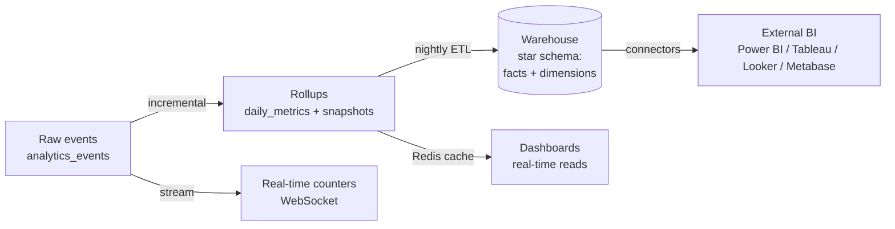

# Analytics & Reporting Module — Multi-Tenant Multi-Vendor SaaS

The platform-wide business-intelligence layer: event tracking,
pre-aggregated rollups, executive/vendor/customer/project dashboards,
configurable KPIs, exportable reports, forecasting, an AI insight
engine, and a data-warehouse-ready pipeline.

This doc is the **BI foundation** that unifies the per-module analytics
already speced elsewhere — it owns the *data pipeline, storage model,
and reporting/export/forecast infrastructure* those modules read from:

- [`dashboard-architecture.md`](dashboard-architecture.md) — role dashboards + widget protocol (the consumer of these rollups)
- [`billing-architecture.md`](billing-architecture.md) §12 — MRR/ARR/churn/LTV/CAC + `financial_reports` (owns the financial *formulae*; this doc owns how they're computed + stored)
- [`projects-architecture.md`](projects-architecture.md) §11 — project analytics
- [`tasks-architecture.md`](tasks-architecture.md) §15 — task/productivity analytics
- [`ai-architecture.md`](ai-architecture.md) §10 — AI analytics + insight generation

Follows the shipped/planned convention of the other seven docs.

## Table of contents

1. [Overview](#1-overview)
2. [Executive dashboard](#2-executive-dashboard)
3. [Marketplace analytics](#3-marketplace-analytics)
4. [Vendor analytics](#4-vendor-analytics)
5. [Customer analytics](#5-customer-analytics)
6. [Project analytics](#6-project-analytics)
7. [Task analytics](#7-task-analytics)
8. [Billing analytics](#8-billing-analytics)
9. [AI analytics](#9-ai-analytics)
10. [Real-time analytics](#10-real-time-analytics)
11. [KPI management](#11-kpi-management)
12. [Reports module](#12-reports-module)
13. [Data warehouse architecture](#13-data-warehouse-architecture)
14. [Event tracking system](#14-event-tracking-system)
15. [Database design](#15-database-design)
16. [API design](#16-api-design)
17. [Frontend architecture](#17-frontend-architecture)
18. [Data visualization](#18-data-visualization)
19. [Security](#19-security)
20. [Performance](#20-performance)
21. [Multi-tenant analytics](#21-multi-tenant-analytics)
22. [Future BI integrations](#22-future-bi-integrations)
23. [AI-powered insights](#23-ai-powered-insights)
24. [Scalability](#24-scalability)

### Status snapshot (today)

| Layer | Shipped (dashboard module, `2026_06_06`) | Planned in this doc |
|---|---|---|
| **Rollup store** | `daily_metrics` (tenant_id, metric_key, dimension_key, value, currency, recorded_on) + `UNIQUE(tenant_id, metric_key, dimension_key, recorded_on)` idempotent upsert | + `analytics_events` (raw), `analytics_snapshots`, `analytics_kpis`, star-schema fact/dim tables |
| **Metric keys** | `DailyMetric`: revenue_cents, orders_count, new_customers, refunds_cents, product_views, vendor_signups, active_subscriptions | + every module's metrics, custom KPIs |
| **Aggregator** | `MetricsAggregator` (`rebuildRange`, `rebuildDay`; per-tenant + platform-wide `tenant_id NULL`) | + event-driven incremental aggregation, ETL jobs, materialized views |
| **Reads** | `DashboardService` reads `daily_metrics` via Redis cache | + report builder, exports (PDF/Excel/CSV), forecasts, insight engine |

> The shipped `daily_metrics` + `MetricsAggregator` are the seed of this module's rollup layer. This doc extends them into a full event-tracking → ETL → warehouse → reporting/forecast/insight pipeline without discarding what works — `daily_metrics` becomes one (the daily-grain) table in a larger star schema.

---

## 1. Overview

### Business objectives

- **Decisions, not data**: turn millions of raw events into the 5 numbers an executive acts on.
- **Vendor success**: vendors see what sells, what's reviewed well, where they're losing customers — and improve.
- **Platform health**: super-admins spot churn, fraud, and growth inflection points early.
- **Monetization**: advanced analytics is a plan differentiator (billing doc §2 — Business/Enterprise tiers).

### Data strategy

Three tiers, hot → cold:



1. **Events** — append-only `analytics_events`, the source of truth for "what happened".
2. **Rollups** — pre-aggregated `daily_metrics` (shipped) + `analytics_snapshots` (point-in-time KPIs). Dashboards read these, never raw events. **< 200ms reads** (the dashboard doc's TTFB target).
3. **Warehouse** — nightly ETL into a star schema for ad-hoc BI + external tools.

### KPI strategy

Every KPI is **defined once** (in `analytics_kpis`), computed by the
aggregator, snapshotted, and rendered identically wherever it appears.
No metric is computed two different ways in two places — the seam that
prevents "the dashboard says X, the report says Y".

### Reporting & executive goals

- Scheduled + on-demand reports (PDF/Excel/CSV).
- AI executive summaries (§23) translate the numbers into prose + recommended actions.
- Drill-down everywhere: every executive number links to its breakdown.

### Integration

Every module emits domain events (the event-driven backbone used by
notifications + automation). The analytics module is a **subscriber**
that records them to `analytics_events` and rolls them up — modules
stay ignorant of analytics, exactly as they're ignorant of notification
delivery.

---

## 2. Executive dashboard

Super-admin (platform-wide) + tenant-owner (their workspace) view.

| Metric | Source | Computation |
|---|---|---|
| Total / Monthly Revenue | `daily_metrics` revenue_cents | SUM over window |
| ARR / MRR | `analytics_snapshots` + `tenant_subscriptions` | normalized recurring (billing §12) |
| Active Vendors / Customers | snapshots | distinct active in window |
| Total / Completed Projects | project rollups | count by status |
| Growth Rate | snapshots | (period − prior) / prior |
| Churn Rate | subscription transitions | cancelled / active-at-start |

Rendered with the dashboard module's widget protocol (`type: 'stat'`,
`'chart'`); strategic insights come from the AI engine (§23). Every
card is a drill-down link.

---

## 3. Marketplace analytics

Orders, order trends, marketplace revenue, conversion, refund rate,
best-selling + most-viewed products, vendor growth.

- **Conversion rate** = orders / product_views (both shipped metric keys) over the window.
- **Best-selling** — `order_items` aggregated by product (rollup `dimension_key = 'product:{id}'`).
- **Most-viewed** — `product_views` by product dimension.
- **Refund rate** = refunds_cents / revenue_cents.

Funnel chart (view → cart → checkout → paid) from event-stage counts;
trend lines from `daily_metrics`.

---

## 4. Vendor analytics

Per-vendor dashboard (vendor sees only their own — tenant + ownership scoped).

Revenue · earnings · orders · conversion · customer ratings · refund
rate · retention · product performance.

### Vendor performance scoring

```php
// app/Domain/Analytics/VendorScore.php
// Composite 0–100, weighted, snapshotted nightly to analytics_snapshots.
score =  0.30 * normalize(gmv)
       + 0.20 * (1 - refund_rate)
       + 0.20 * normalize(avg_rating)
       + 0.15 * on_time_delivery_rate
       + 0.15 * customer_retention_rate
```

Drives marketplace ranking signals + the AI vendor-improvement
suggestions (§23) + commission tiering (billing doc).

---

## 5. Customer analytics

Acquisition · LTV · purchase frequency · retention · churn · engagement
score · subscription behavior.

### Segmentation

`analytics_segments` stores computed cohorts (RFM: recency/frequency/
monetary; lifecycle: new/active/at-risk/churned; value: high/mid/low).
A nightly `RecomputeSegments` job re-buckets customers; segments drive
targeted campaigns + retention strategies (AI §23).

- **LTV** = avg order value × purchase frequency × avg lifespan (billing §12 formula, computed here).
- **Engagement score** = weighted recent activity (logins, views, orders).

---

## 6. Project analytics

(Formulae owned by [`projects-architecture.md`](projects-architecture.md) §11.)

Completion rate · avg delivery time · team productivity · resource
utilization · delayed projects · milestone completion. Rolled up nightly
into `daily_metrics` with `metric_key = 'project.*'`; project-health
report combines them into a RAG (red/amber/green) status per project.

---

## 7. Task analytics

(Formulae owned by [`tasks-architecture.md`](tasks-architecture.md) §15.)

Completion rate · productivity score · team workload · avg resolution
time · overdue tasks · team efficiency. The workload heatmap reads
`SUM(estimated_hours) GROUP BY assignee, week` (tasks doc §6).

---

## 8. Billing analytics

(Financial formulae owned by [`billing-architecture.md`](billing-architecture.md) §12.)

Revenue · recurring revenue · subscription growth · failed payments ·
refunds · withdrawals · commission revenue. This module computes +
stores them in `financial_reports` (billing) + `analytics_snapshots`;
the dashboards/exports here render them. The MRR/ARR/churn/LTV/CAC
snapshot job lives here (it's an analytics concern), writing the
billing doc's `financial_reports` rows.

---

## 9. AI analytics

(Engine owned by [`ai-architecture.md`](ai-architecture.md) §10, §23.)

Revenue forecasts · growth/churn predictions · vendor-success
predictions · customer-behavior predictions · risk analysis. This
module **provides the grounded inputs** (rollups + snapshots) the AI
engine summarizes; the AI never invents numbers (ai doc §10). Forecasts
persist to `analytics_forecasts`; recommendations to `analytics_insights`.

---

## 10. Real-time analytics

Live revenue · orders · users · notifications · activities.

```mermaid
flowchart LR
    EV[Domain event] --> LIS[Analytics listener]
    LIS --> RC[Redis counter INCR\nlive:{tenant}:{metric}:{day}]
    LIS --> WS[Reverb broadcast\nanalytics.{tenant}]
    RC --> API[GET /analytics/live\nreads counters]
    WS --> UI[Live dashboard tiles]
```

- **Redis counters** (`INCR`) for live tiles — no DB hit on the hot path; flushed into `daily_metrics` by the aggregator.
- **Reverb** broadcasts on `analytics.{tenant}` (private channel, auth like the notifications doc §7) so live tiles tick without polling.
- Real-time is **approximate** (counters); the rollup is **authoritative** (reconciled nightly). The UI labels live tiles as such.

---

## 11. KPI management

Configurable KPIs at four scopes: global, tenant, vendor, team.

```php
// analytics_kpis
analytics_kpis
  id, tenant_id (nullable = global), scope enum('global','tenant','vendor','team')
  key, name, description
  formula      jsonb   // { source: 'daily_metrics', metric: 'revenue_cents', agg: 'sum', window: '30d' }
  unit, format, target_value, direction enum('up_good','down_good')
  is_active, position, timestamps
  unique (tenant_id, scope, key)
```

A KPI is a **declarative definition**, not code — the `KpiEvaluator`
reads the `formula` JSON and computes against the rollups. Custom KPIs
(tenant-defined) use the same evaluator, so a tenant can build
"avg deal size" without a deploy. This is the SOLID open/closed seam:
new KPIs are data.

---

## 12. Reports module

| Report | Content |
|---|---|
| Financial | revenue, MRR/ARR, commissions, refunds, tax |
| Sales | orders, conversion, top products |
| Vendor | per-vendor performance + earnings |
| Customer | acquisition, LTV, segments |
| Project | health, delivery, completion |
| Task | productivity, workload |
| Subscription | growth, churn, plan mix |

### Generation & export

- **Builder**: `analytics_reports` stores a report definition (metrics, filters, grouping, date range, format).
- **Export**: queued jobs — `ExportReportPdf` (dompdf), `ExportReportExcel` (PhpSpreadsheet), `ExportReportCsv` (streamed). Output → S3 → signed-URL download. Never generated in the request cycle.
- **Scheduled**: a `report_schedules` cron-like config; a scheduled job generates + emails (or notifies) on cadence (daily/weekly/monthly).
- **History**: `analytics_exports` tracks every generated file (who, when, params, signed-URL, expiry).

---

## 13. Data warehouse architecture

### Star schema (nightly ETL target)

```mermaid
erDiagram
    fact_orders }o--|| dim_date : on
    fact_orders }o--|| dim_tenant : for
    fact_orders }o--|| dim_vendor : by
    fact_orders }o--|| dim_customer : to
    fact_orders }o--|| dim_product : of
    fact_subscriptions }o--|| dim_date : on
    fact_subscriptions }o--|| dim_plan : on
    fact_events }o--|| dim_date : on
    fact_events }o--|| dim_user : by
```

- **Facts**: `fact_orders`, `fact_subscriptions`, `fact_events`, `fact_tasks` — additive measures (amounts, counts, durations) at the lowest grain.
- **Dimensions**: `dim_date`, `dim_tenant`, `dim_vendor`, `dim_customer`, `dim_product`, `dim_plan`, `dim_user` — slowly-changing (SCD type 2 where history matters).
- **ETL**: nightly `RunEtlPipeline` job extracts from OLTP, transforms (denormalize, conform dimensions), loads facts. Incremental by `recorded_on` watermark — only new/changed rows.

The warehouse lives in the same PostgreSQL initially (separate schema
`analytics`), with a clean migration path to a dedicated warehouse
(Snowflake/BigQuery/Redshift) — the ETL job's load target is an
interface.

---

## 14. Event tracking system

### `analytics_events` — the source of truth

```php
Schema::create('analytics_events', function (Blueprint $t) {
    $t->bigIncrements('id');
    $t->foreignId('tenant_id')->nullable()->index();
    $t->foreignId('user_id')->nullable()->index();
    $t->string('event', 64);              // user.registered, order.created, …
    $t->string('subject_type', 48)->nullable();
    $t->unsignedBigInteger('subject_id')->nullable();
    $t->jsonb('properties')->nullable();  // event-specific payload
    $t->string('session_id', 64)->nullable();
    $t->string('source', 24)->default('web');  // web|api|mobile|system
    $t->timestamp('occurred_at')->index();
    // No updated_at — append-only.
    $t->index(['tenant_id', 'event', 'occurred_at']);
    $t->index(['subject_type', 'subject_id']);
});
```

### Tracked events

`user.registered`, `user.login`, `project.created`, `task.completed`,
`order.created`, `payment.completed`, `subscription.activated`,
`vendor.registered`, `review.submitted` — plus any domain event a
module emits.

### Capture

A single `RecordAnalyticsEvent` listener subscribes to the platform's
domain events and writes the `analytics_events` row (queued, so it
never slows the originating request). High-frequency events (page
views) batch-insert via a Redis buffer flushed every few seconds.

---

## 15. Database design

| Table | Status | Purpose |
|---|---|---|
| `daily_metrics` | shipped | Daily-grain rollup (the hot read path) |
| `analytics_events` | planned | Append-only raw event log (source of truth) |
| `analytics_metrics` | planned | Metric definitions registry (key, agg, unit) |
| `analytics_snapshots` | planned | Point-in-time KPI snapshots (MRR/ARR/score/etc.) |
| `analytics_reports` | planned | Saved report definitions |
| `analytics_dashboards` | planned | Custom dashboard layouts (per user/tenant) |
| `analytics_widgets` | planned | Widget instances on a dashboard |
| `analytics_filters` | planned | Saved filter sets |
| `analytics_exports` | planned | Generated export files (audit + download) |
| `analytics_forecasts` | planned | AI forecast outputs |
| `analytics_insights` | planned | AI insight/recommendation cards |
| `analytics_segments` | planned | Computed customer cohorts |
| `analytics_kpis` | planned | Declarative KPI definitions (§11) |

### `analytics_snapshots`

```php
Schema::create('analytics_snapshots', function (Blueprint $t) {
    $t->id();
    $t->foreignId('tenant_id')->nullable()->index();
    $t->string('kpi_key', 64);            // mrr_cents, churn_rate_bps, vendor_score, …
    $t->string('dimension_key', 64)->default('total'); // vendor:42, plan:pro, segment:at_risk
    $t->string('period_type', 12);        // day|week|month|quarter|year
    $t->date('period_date');
    $t->bigInteger('value');              // integer (cents, bps, count)
    $t->jsonb('breakdown')->nullable();   // sub-values for drill-down
    $t->timestamp('computed_at')->useCurrent();
    $t->unique(['tenant_id', 'kpi_key', 'dimension_key', 'period_type', 'period_date']);
    $t->index(['tenant_id', 'kpi_key', 'period_date']);
});
```

(Same idempotent-upsert pattern as the shipped `daily_metrics`.)

### Indexes & particulars

- `daily_metrics` / `analytics_snapshots`: the `UNIQUE` composite *is* the upsert key + the read index.
- `analytics_events`: partitioned by month (PostgreSQL declarative partitioning); `(tenant_id, event, occurred_at)` covering index for funnel queries.
- Integer measures everywhere (cents, bps, counts) — no floats, consistent with the payments/billing convention.
- Every table carries `tenant_id` + `BelongsToTenant` global scope; platform-wide rows use `tenant_id IS NULL` (the shipped convention).

---

## 16. API design

Tenant-scoped; heavy reads cached; cross-tenant → 404.

| Verb | URL | Purpose |
|---|---|---|
| `GET` | `/analytics/overview` | Executive metric cards (cached) |
| `GET` | `/analytics/metrics` | Time-series for a metric (`?key=&from=&to=&dimension=`) |
| `GET` | `/analytics/live` | Real-time counters |
| `GET` | `/analytics/kpis` | KPI definitions + current values |
| `POST` | `/analytics/kpis` | Create a custom KPI |
| `GET` | `/analytics/segments` | Customer segments |
| `GET` | `/analytics/forecasts` | AI forecasts |
| `GET` | `/analytics/insights` | AI insight cards |
| `GET` | `/analytics/reports` | Saved reports |
| `POST` | `/analytics/reports` | Define a report |
| `POST` | `/analytics/reports/{id}/export` | Queue an export `{format}` |
| `GET` | `/analytics/exports/{id}/download` | Signed-URL download |
| `GET` | `/analytics/dashboards` | Custom dashboards |
| `POST` | `/analytics/dashboards` | Create a dashboard layout |

### Time-series response

```json
{
  "key": "revenue_cents",
  "dimension": "total",
  "currency": "USD",
  "granularity": "day",
  "series": [
    { "date": "2026-06-01", "value": 4839221 },
    { "date": "2026-06-02", "value": 5120044 }
  ],
  "summary": { "total": 9959265, "change_pct": 5.8 },
  "cached_at": "2026-06-12T08:00:00Z"
}
```

### Caching strategy

- Overview + time-series cached in Redis keyed by `(tenant, key, dimension, window)`, 5-min TTL, version-busted on aggregator run.
- `?fresh=1` bypasses cache (admin only, rate-limited).
- Exports are async (202 + poll/notify), never inline.

---

## 17. Frontend architecture

```
resources/js/
├── pages/analytics/
│   ├── index.tsx              # analytics home (metric overview)
│   ├── executive.tsx          # executive dashboard
│   ├── vendors.tsx            # vendor analytics
│   ├── customers.tsx          # customer analytics + segments
│   ├── financial.tsx          # financial reports
│   ├── forecasting.tsx        # forecast center
│   └── reports.tsx            # report builder + exports
├── components/analytics/
│   ├── MetricCard.tsx          # KPI stat + sparkline + delta
│   ├── RevenueChart.tsx        # line/area
│   ├── KpiWidget.tsx           # target vs actual gauge
│   ├── ReportBuilder.tsx       # metric/filter/group picker
│   ├── DataTable.tsx           # sortable, paginated, exportable
│   ├── ForecastPanel.tsx       # actual + predicted band
│   ├── FunnelChart.tsx
│   ├── HeatMap.tsx
│   ├── SegmentBreakdown.tsx
│   └── InsightCard.tsx         # AI insight (reuses ai AiInsightCard)
├── hooks/analytics/
│   ├── useMetricSeries.ts      # React Query time-series + cache
│   ├── useLiveCounters.ts      # Reverb subscription for live tiles
│   ├── useReportBuilder.ts
│   └── useExport.ts            # trigger + poll export
└── lib/analytics/
    ├── charts.ts               # chart config presets (recharts/visx)
    ├── formatters.ts           # cents→currency, bps→%, compact numbers
    └── kpi.ts                  # KPI metadata + targets
```

- **Charting**: Recharts (or visx) wrapped in preset components so every chart is consistent.
- **Inertia props** seed the first dashboard render; **React Query** for drill-downs + filter changes; **`useLiveCounters`** subscribes to Reverb for live tiles.

---

## 18. Data visualization

| Chart | Use |
|---|---|
| **Line** | Trends over time (revenue, MRR) |
| **Area** | Cumulative / stacked composition over time |
| **Bar** | Category comparison (revenue by plan, by vendor) |
| **Pie / Donut** | Composition snapshot (plan mix) — sparingly, ≤ 5 slices |
| **Funnel** | Conversion stages (view → cart → paid) |
| **Heat map** | Workload by assignee×week, activity by hour×day |
| **KPI cards** | Single number + delta + sparkline |

### Recommendations

- **Default to line/bar**; reserve pie for true part-of-whole with few slices.
- **Always show the delta** (vs prior period) on metric cards — a number without context isn't insight.
- **Consistent color semantics**: brand indigo for primary series, emerald for positive, rose for negative.
- **Dark-mode aware** (CSS variables, like the rest of the UI).
- **Empty + loading states**: skeletons, never a blank chart.
- **Accessible**: every chart has a screen-reader summary + an underlying data table toggle.

---

## 19. Security

| Concern | Mitigation |
|---|---|
| **Tenant isolation** | Every analytics table `tenant_id` + global scope; platform-wide rows (`tenant_id NULL`) only readable by super-admin |
| **Data permissions** | A vendor sees only their own rollups; a customer sees only their own activity; RBAC checked at the query layer |
| **Report permissions** | Report definitions scoped to creator/tenant; sharing is explicit |
| **Cross-tenant exposure** | Aggregations always carry the tenant filter; a missing filter is a failing test, not a runtime risk |
| **Secure exports** | Signed-URL, short expiry; `analytics_exports` audits every generated file; exports respect the requester's permission scope (you can't export data you can't see) |
| **Audit** | Export + custom-KPI + dashboard changes logged to `activity_logs` |
| **PII** | Customer analytics aggregate by default; row-level PII access gated + audited; export anonymization option |

---

## 20. Performance

Target: millions of events/day, large-scale reporting, real-time
dashboards.

| Concern | Approach |
|---|---|
| **Read path** | Dashboards read pre-aggregated `daily_metrics`/`analytics_snapshots`, never raw events — < 200ms (dashboard doc target) |
| **Rollups** | Incremental aggregation: the aggregator processes only the new day/delta, not a full rescan |
| **Materialized views** | PostgreSQL materialized views for expensive cross-table aggregates (e.g. vendor leaderboards), refreshed on a schedule with `REFRESH MATERIALIZED VIEW CONCURRENTLY` |
| **Event ingestion** | Queued writes + Redis batch buffer for high-frequency events (page views) flushed every few seconds |
| **Partitioning** | `analytics_events` partitioned by month; old partitions detached to cold storage |
| **Caching** | Redis per-(tenant, metric, window), 5-min TTL, version-busted on aggregator run |
| **Queue-based reporting** | All exports + scheduled reports on dedicated `analytics-reports` / `analytics-etl` queues |
| **Real-time** | Redis `INCR` counters for live tiles; the DB rollup reconciles nightly |
| **ETL** | Incremental by watermark; runs off-peak; never blocks OLTP |

---

## 21. Multi-tenant analytics

Each tenant can (white-label):

- **Custom dashboards** — drag-drop widget layouts saved to `analytics_dashboards` / `analytics_widgets`.
- **Custom reports** — the report builder (§12).
- **Custom KPIs** — declarative definitions (§11), no deploy needed.
- **Analytics permissions** — control which team roles see which dashboards/reports.
- **Branding** — charts + exported PDFs use the tenant's logo/colors (via `BrandingService`).

Platform-wide analytics (`tenant_id NULL`) remain super-admin-only; a
tenant never sees cross-tenant or platform aggregate data.

---

## 22. Future BI integrations

The warehouse star schema (§13) is the integration surface.

| Tool | Mechanism |
|---|---|
| **Power BI** | DirectQuery / import against the `analytics` schema (read-only role) or a published dataset |
| **Tableau** | PostgreSQL connector against the warehouse views |
| **Looker** | LookML models over the star schema |
| **Metabase** | Direct connection (read replica) — quickest to stand up |

- A dedicated **read-only `analytics_reader` DB role** scoped to the `analytics` schema; external tools never touch OLTP.
- A clean migration path to Snowflake/BigQuery: the ETL load target is an interface, so the warehouse can move off PostgreSQL without changing extract/transform.
- **Embedded analytics** (white-label dashboards inside the tenant's own product) via signed-embed tokens — a later phase.

---

## 23. AI-powered insights

(Engine + guardrails owned by [`ai-architecture.md`](ai-architecture.md) §10, §23.)

The **AI Insight Engine** consumes this module's rollups + snapshots and
generates:

- **Automated executive summaries** — "Revenue up 8% MoM, driven by 3 new Enterprise tenants; churn ticked up in the Starter cohort."
- **Business recommendations** — prioritized actions from the data.
- **Revenue opportunities** — underpriced vendors, upsell-ready customers.
- **Vendor improvement suggestions** — from the performance score's weakest factor.
- **Customer retention strategies** — per at-risk segment.

### Architecture

A queued `GenerateInsights` job builds a context bundle from
`analytics_snapshots` (never raw rows — bounded, grounded), calls the AI
gateway (ai doc §2) with structured output, and persists to
`analytics_insights`. The model **summarizes provided numbers, never
invents them** (ai doc §10). Insights render as cards on the executive
dashboard + a weekly AI digest email (notifications doc §18).

---

## 24. Scalability

Designed for 100k+ tenants, millions of events/day, real-time
dashboards, global operations:

- **Tiered storage** — hot rollups (Redis + `daily_metrics`), warm snapshots, cold partitioned events, archived warehouse.
- **Incremental everything** — aggregation + ETL process deltas, never full scans.
- **Partition + detach** — `analytics_events` monthly partitions; old ones to object storage.
- **Read replicas** — analytics reads (dashboards, BI tools) hit replicas; the primary handles ingestion.
- **Dedicated warehouse** — at extreme scale, ETL targets Snowflake/BigQuery; OLTP stays lean.
- **Backpressure** — per-tenant fair-share on the event-ingestion queue so one noisy tenant can't delay everyone's rollups.
- **Approximate where fine** — live counters are approximate (Redis), reconciled by the authoritative nightly rollup; HyperLogLog for high-cardinality distinct counts (unique visitors) at scale.

---

## File map for the next phase

| Path | Status |
|---|---|
| `database/migrations/*_create_analytics_events_table.php` (partitioned) | planned |
| `database/migrations/*_create_analytics_snapshots_table.php` | planned |
| `database/migrations/*_create_analytics_kpis_table.php` | planned |
| `database/migrations/*_create_analytics_segments_table.php` | planned |
| `database/migrations/*_create_analytics_reports_table.php` + `_exports_` + `_dashboards_` + `_widgets_` + `_filters_` | planned |
| `database/migrations/*_create_analytics_forecasts_table.php` + `_insights_` | planned |
| `database/migrations/*_create_warehouse_star_schema.php` (facts + dims, `analytics` schema) | planned |
| `app/Domain/Analytics/{EventRecorder,KpiEvaluator,SegmentBuilder,VendorScore}.php` | planned |
| `app/Domain/Analytics/Etl/{Extract,Transform,Load}.php` + `RunEtlPipeline` | planned |
| `app/Domain/Analytics/Reports/{ReportBuilder,PdfExporter,ExcelExporter,CsvExporter}.php` | planned |
| `app/Models/{AnalyticsEvent,AnalyticsSnapshot,AnalyticsKpi,AnalyticsSegment,AnalyticsReport,AnalyticsExport,AnalyticsDashboard,AnalyticsForecast,AnalyticsInsight}.php` | planned |
| `app/Listeners/Analytics/RecordAnalyticsEvent.php` (subscribes to all domain events) | planned |
| `app/Jobs/Analytics/{AggregateDaily,RecomputeSegments,RunEtlPipeline,ExportReport,GenerateInsights,SnapshotKpis}.php` | planned |
| `app/Http/Controllers/Analytics/*Controller.php` | planned |
| `resources/js/pages/analytics/*` + `components/analytics/*` + `hooks/analytics/*` | planned |
| `tests/Feature/Analytics/*` (tenant isolation in aggregation, KPI evaluator, incremental rollup idempotency, export permission scope) | planned |

The next pass commits `analytics_events` + the `EventRecorder`
listener + `analytics_snapshots` + the `KpiEvaluator` — extending the
shipped `MetricsAggregator`/`daily_metrics` into the full event →
rollup → snapshot pipeline before the report builder, ETL warehouse,
and AI insight engine layer on. This is the eighth and final module
architecture doc; the set now spans dashboard, payments, projects,
tasks, notifications, billing, ai, and analytics.
