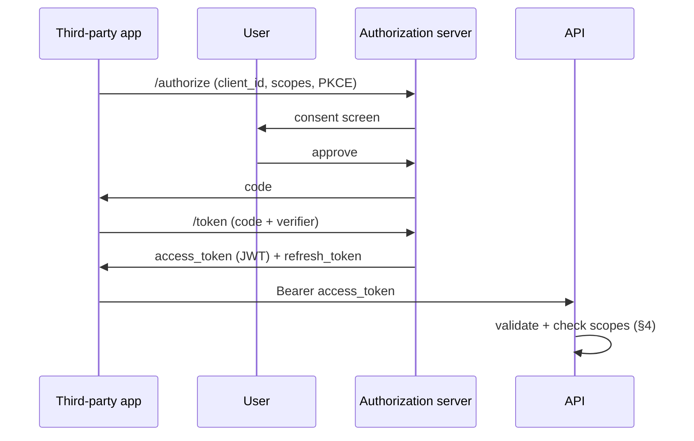

# API & Developer Portal — Multi-Tenant Multi-Vendor SaaS

A secure, scalable, developer-friendly ecosystem: third-party developers,
vendors, partners, and enterprise integrators build on the platform
through versioned REST APIs, webhooks, SDKs, and a self-serve developer
portal — with per-tenant isolation, scope-based access, rate limiting,
usage metering, and monetization.

This is the **most API-first-grounded** module of the set: a real,
working, versioned, Sanctum-authenticated REST API **already ships**.
This doc's job is to grow that working `/api/v1` into a full API gateway
+ developer portal + monetizable API marketplace.

### What ships today (verified)

- **A working versioned REST API** — `routes/api.php` declares `Route::prefix('v1')->middleware('auth:sanctum')` with real, named endpoints:
  - `GET /api/v1/user` (`api.v1.user`) — identity + roles + the token's abilities.
  - `GET /api/v1/dashboard` (`api.v1.dashboard`) — role-aware payload.
  - `GET/PATCH/POST/DELETE /api/v1/notifications…` — full notifications CRUD (`Api\V1\NotificationController`).
- **Sanctum bearer auth** — `auth:sanctum`; `User` uses `HasApiTokens`. Requests carry `Authorization: Bearer <token>`.
- **Token scopes (abilities)** — `Settings\ApiTokenController::SUPPORTED_ABILITIES` = `read` / `write` / `admin`; `createToken($name, $abilities)`; the plaintext token is **shown once** then forgotten; `last_used_at` tracked.
- **Token lifecycle is audited** — `ActivityLog::record('api_token.created' | 'api_token.revoked', …)` (the shipped audit core, see [`audit-logs-architecture.md`](audit-logs-architecture.md)).
- **Token management UI** — the `settings/api-tokens` page (create with ability checkboxes, list, copy-once, revoke).
- **Tenant isolation in the API** — `Api\V1\NotificationController` relies on the `BelongsToTenant` global scope (reads auto-narrow to the resolved tenant) + per-resource `403` ownership checks.
- **JSON conventions already in place** — `{ data, next_cursor, unread_count }` envelope, **cursor pagination**, `per_page` clamp (1–100), consistent `response()->json(...)`.
- **Inbound webhook idempotency** — `webhook_events` (UNIQUE `gateway_event_id`, append-only) — the exactly-once dedup gate (the payments pattern).
- **Rate-limit precedent** — `LoginRequest` uses Laravel's throttle; `RateLimiter` is available.
- **`config/sanctum.php`** present.

> The leap this doc specs: keep the working `/api/v1` + Sanctum tokens + the audited token lifecycle + the JSON envelope, and grow them into a **gateway** (uniform auth/authz/rate-limit/validation/monitoring middleware stack), richer **auth** (OAuth2/OIDC/M2M/service accounts *on top of* the shipped tokens), **scope-based authz** (generalizing the shipped `read/write/admin` abilities into resource scopes), **outbound webhooks** (reusing the inbound idempotency + adding signature + retry + DLQ), **per-tenant/key/plan rate limits** (generalizing the shipped throttle + the `PlanGate` 402-on-limit pattern), **usage metering + monitoring**, a **developer portal** (OpenAPI/Swagger/Redoc/explorer/sandbox), **SDKs**, and a **monetizable API marketplace** (tying the shipped ledger + billing usage metering + marketplace revenue-share). None of it discards the working API.

It composes:

- **Webhook idempotency + revenue ledger** ← [`payments-architecture.md`](payments-architecture.md) (the `webhook_events` gate + `LedgerTransaction`).
- **Usage-based billing + limits** ← [`billing-architecture.md`](billing-architecture.md) + `PlanGate` (the 402-on-limit pattern).
- **API products + revenue share** ← [`marketplace-architecture.md`](marketplace-architecture.md) (§19, §20).
- **Token/API events** → [`audit-logs-architecture.md`](audit-logs-architecture.md) (already audited).
- **Webhook delivery** → [`notifications-architecture.md`](notifications-architecture.md) (the dispatcher/retry discipline).
- **Operator oversight** → [`admin-control-center-architecture.md`](admin-control-center-architecture.md) (API monitoring, key governance).

Follows the shipped/planned convention of the prior nineteen docs.

## Table of contents

1. [Developer platform overview](#1-developer-platform-overview)
2. [API gateway architecture](#2-api-gateway-architecture)
3. [API authentication](#3-api-authentication)
4. [API authorization](#4-api-authorization)
5. [REST API architecture](#5-rest-api-architecture)
6. [GraphQL support](#6-graphql-support)
7. [Webhooks system](#7-webhooks-system)
8. [API versioning](#8-api-versioning)
9. [API rate limiting](#9-api-rate-limiting)
10. [API usage analytics](#10-api-usage-analytics)
11. [API monitoring](#11-api-monitoring)
12. [Developer portal](#12-developer-portal)
13. [Interactive API documentation](#13-interactive-api-documentation)
14. [API explorer](#14-api-explorer)
15. [SDK management](#15-sdk-management)
16. [Developer accounts](#16-developer-accounts)
17. [Application management](#17-application-management)
18. [Sandbox environment](#18-sandbox-environment)
19. [API marketplace](#19-api-marketplace)
20. [API billing & monetization](#20-api-billing--monetization)
21. [API security](#21-api-security)
22. [AI developer features](#22-ai-developer-features)
23. [API search system](#23-api-search-system)
24. [Database design](#24-database-design)
25. [API design standards](#25-api-design-standards)
26. [Frontend architecture](#26-frontend-architecture)
27. [Performance](#27-performance)
28. [Multi-tenant API architecture](#28-multi-tenant-api-architecture)
29. [Compliance](#29-compliance)
30. [Scalability](#30-scalability)
31. [Future expansion](#31-future-expansion)

### Status snapshot (today)

| Layer | Shipped | Planned in this doc |
|---|---|---|
| **Versioned REST** | `/api/v1/*` (user, dashboard, notifications) | full module coverage (§5) |
| **Auth** | Sanctum bearer tokens (`HasApiTokens`) | + OAuth2/OIDC/M2M/service accounts (§3) |
| **Scopes** | `read`/`write`/`admin` abilities | resource-scoped permissions (§4) |
| **Token lifecycle** | create/revoke, shown-once, audited | rotation, IP rules, app-bound keys (§17, §21) |
| **Tenant isolation** | `BelongsToTenant` in API | per-tenant API config (§28) |
| **Envelope** | `{data, next_cursor}` cursor pages | the platform standard (§25) |
| **Webhooks** | inbound idempotency (`webhook_events`) | outbound delivery + retry + DLQ (§7) |
| **Rate limit** | login throttle | per-tenant/key/plan limits (§9) |
| **Portal** | `settings/api-tokens` | full developer portal (§12) |
| **Tables** | `personal_access_tokens`, `webhook_events` | 21 `api_*` tables (§24) |

---

## 1. Developer platform overview

### Strategy

| Concern | Approach |
|---|---|
| API ecosystem | Everything the UI does is an API call (API-first); the shipped `/api/v1` proves it — the React app and third parties hit the same surface |
| Developer experience | Self-serve: register → create an app → get keys → read docs → test in the explorer → ship; the shipped `settings/api-tokens` is step one |
| Third-party integration | Apps + OAuth + webhooks + SDKs; integrators never touch internals |
| Extensibility | The platform is a product *and* a platform — vendors publish + monetize their own APIs (§19) |

### The big picture

```mermaid
flowchart LR
    DEV[Developer / Vendor app] --> GW[API Gateway\nauth · authz · rate-limit · validate · meter]
    GW --> V1[/api/v1 REST/]
    GW --> GQL[/graphql/]
    V1 --> MOD[Module services\n(marketplace, billing, projects, ...)]
    GQL --> MOD
    MOD --> EVT[Domain events] --> WH[Outbound webhooks\nsigned · retried · DLQ]
    WH --> DEV
    GW --> METER[(usage logs)] --> BILL[usage-based billing §20]
    GW --> MON[monitoring + audit §11]
```

The gateway is the single front door; module services do the work (the
shipped controllers already delegate to `NotificationService`,
`DashboardController`, etc.); events drive outbound webhooks; every call
is metered + monitored + audited.

### Integration

Every module exposes a REST resource under `/api/v1` (the shipped
notifications/dashboard endpoints are the template); this module owns the
**gateway, auth, webhooks, portal, metering, monetization** — the
cross-cutting API plane — not the per-module business logic.

---

## 2. API gateway architecture

A centralized request pipeline (Laravel middleware stack + edge proxy),
not a separate service to start — the shipped `auth:sanctum` group is the
seed.

```mermaid
flowchart LR
    REQ[Request] --> TLS[TLS termination]
    TLS --> RT[ResolveTenant\nby key/domain]
    RT --> AUTH[Authenticate\nSanctum / OAuth / JWT]
    AUTH --> AUTHZ[Authorize\nscopes + RBAC]
    AUTHZ --> RL[Rate limit\nper key/tenant/plan]
    RL --> VAL[Validate request\nForm Requests / OpenAPI]
    VAL --> ROUTE[Route → module controller]
    ROUTE --> XFORM[Response transform\n{data,...} envelope]
    XFORM --> METER[Meter + log + monitor]
    METER --> RESP[Response]
```

Responsibilities: authentication, authorization, rate limiting/throttling,
request validation, response transformation (the shipped `{data,…}`
envelope), API monitoring, traffic management. Implemented as ordered
middleware (`api` group) — the shipped `auth:sanctum` middleware is the
first stage; each subsequent concern is a middleware added to the group.
At scale, an edge gateway (Kong/APIfront/cloud API gateway) fronts TLS +
coarse rate-limiting; the Laravel stack owns auth/authz/business
validation.

---

## 3. API authentication

The shipped **Sanctum personal access tokens** (bearer, `HasApiTokens`,
abilities, shown-once) cover the developer-token case today. Generalized:

| Method | Use | Builds on |
|---|---|---|
| **API keys** | Server-to-server, simple | a keyed variant of the shipped token (prefix + hash) |
| **Personal access tokens** | Individual devs | **shipped** (Sanctum) |
| **OAuth 2.0** | Third-party apps acting for a user (auth code + PKCE, client credentials) | Passport/league-oauth2 on top of the user model |
| **OpenID Connect** | Federated identity / SSO | OIDC layer over OAuth |
| **JWT** | Stateless short-lived access tokens | issued post-OAuth |
| **M2M** | Service-to-service (client credentials grant) | service accounts |
| **Service accounts** | Non-human principals (a vendor's backend) | `actor_type='api'` (the audit model already has this) |



Tokens are hashed at rest (Sanctum already does); plaintext shown once
(shipped); OAuth secrets stored encrypted; all issuance/revocation
audited (the shipped `api_token.created/revoked` events, extended).

---

## 4. API authorization

Generalizes the shipped `read`/`write`/`admin` abilities into a scope
system layered over the existing Spatie RBAC:

| Layer | Mechanism |
|---|---|
| **RBAC** | The shipped Spatie roles (super-admin…customer) — the principal's base permissions |
| **Scope-based** | Token scopes like `marketplace.products.read`, `billing.invoices.write` (the shipped abilities, namespaced per resource) |
| **Tenant-level** | `BelongsToTenant` scope (shipped) — a token only ever sees its tenant |
| **Vendor-level** | A vendor token is scoped to the vendor's owned resources |
| **Resource-level** | Per-record ownership checks (the shipped `abort_unless($notification->user_id === …, 403)` pattern) |

Effective permission = **RBAC ∩ token scopes ∩ tenant scope ∩ resource
ownership** — every layer must allow. A request is authorized only if the
token's scopes include the endpoint's required scope *and* the user's
role grants it *and* the resource belongs to the token's tenant. Scopes
are declared per endpoint (`->middleware('scope:marketplace.products.read')`).

---

## 5. REST API architecture

Every module gets a `/api/v1/{resource}` surface following the shipped
template (`Api\V1\NotificationController`):

| Domain | Resource | Status |
|---|---|---|
| Auth/identity | `/user`, `/auth/*` | **shipped** (`/user`) |
| Dashboard | `/dashboard` | **shipped** |
| Notifications | `/notifications` | **shipped** (full CRUD) |
| Users / tenants / vendors | `/users`, `/tenants`, `/vendors` | planned |
| Marketplace | `/products`, `/orders`, `/categories` | planned |
| Projects / tasks | `/projects`, `/tasks` | planned |
| CRM | `/leads`, `/accounts`, `/deals` | planned |
| Support / messaging | `/tickets`, `/conversations` | planned |
| Files | `/files` | planned |
| Billing | `/subscriptions`, `/invoices`, `/usage` | planned |
| Analytics / KB | `/metrics`, `/articles` | planned |
| Automation | `/workflows`, `/runs` | planned |

Conventions (already exhibited by the shipped controller): resource
nouns, plural collections, HTTP verbs map to actions, `{data,…}` envelope,
cursor pagination, `per_page` clamp, `403` on cross-ownership, thin
controllers delegating to module services. Standards consolidated in §25.

---

## 6. GraphQL support

An **optional** GraphQL layer (Lighthouse) over the same module services
— not a replacement for REST:

- **Queries** — graph traversal (a project + its tasks + assignees in one round-trip) — great for the dashboard/mobile clients.
- **Mutations** — same validation + service layer as REST.
- **Subscriptions** — real-time over the WebSocket layer (messaging/notifications Reverb).

Use REST for simple/CRUD + third-party integrations (broadest tooling);
GraphQL for rich first-party clients that over-fetch with REST. Both pass
through the §2 gateway (auth/scope/rate-limit/meter) — GraphQL
complexity-scored to prevent abusive deep queries.

---

## 7. Webhooks system

The platform already does **inbound** webhooks idempotently
(`webhook_events`, UNIQUE gate). This adds **outbound** delivery (platform
→ developer endpoints) reusing that discipline:

```mermaid
flowchart LR
    EVT[Domain event\n(order.created, invoice.paid, ...)] --> MATCH[Match subscriptions\nby event + filter]
    MATCH --> ENQ[Enqueue delivery]
    ENQ --> SIGN[Sign payload\nHMAC-SHA256 secret]
    SIGN --> POST[POST endpoint]
    POST -->|2xx| OK[delivered]
    POST -->|fail| RETRY[exponential backoff\nretry schedule]
    RETRY -->|exhausted| DLQ[(dead letter queue)]
    DLQ --> REPLAY[manual replay from portal]
```

- **Event subscriptions** — a developer subscribes an endpoint to events (`order.created`, `invoice.paid`, `project.updated`, `task.completed`, `ticket.created`, `user.registered`).
- **Endpoints** — registered URL + a generated signing secret.
- **Retries** — exponential backoff (queued jobs); the delivery row tracks attempts.
- **Signature verification** — every payload signed `X-Signature: HMAC-SHA256(secret, body)` + timestamp (replay-protected) so the receiver verifies authenticity — the mirror of how the platform verifies *inbound* Stripe signatures.
- **Dead letter queue** — after max retries, delivery lands in DLQ; replayable from the portal.
- **Event filtering** — subscribe to a subset (only `order.*`, only this tenant's events).

`api_webhook_events` (the catalog) + `api_webhook_deliveries` (per-attempt
log, the outbound analog of the shipped inbound `webhook_events`).

---

## 8. API versioning

The shipped API is already `v1` (`/api/v1`, `Route::prefix('v1')`) — the
versioning foundation exists.

- **URI versioning** — `/api/v1`, `/api/v2` (the shipped scheme); each version is a route group + a controller namespace (`Api\V1`, `Api\V2`).
- **Backward compatibility** — additive changes stay in `v1`; breaking changes start `v2`; `v1` keeps working.
- **Deprecation policy** — deprecated endpoints return a `Sunset` header + a deprecation notice in the response meta; a published timeline (e.g. 12 months) before removal.
- **Migration** — a per-version changelog (§24 `api_changelogs`) + a migration guide in the portal; both versions run side-by-side during the window.

---

## 9. API rate limiting

Generalizes the shipped login throttle + the `PlanGate` 402-on-limit
pattern (the same code that caps products today):

| Scope | Limit |
|---|---|
| Per user | baseline req/min |
| Per tenant | aggregate tenant ceiling |
| Per vendor | vendor app ceiling |
| Per API key | per-credential limit |
| Subscription-based | the plan tier sets the ceiling (the `PlanGate` usage pattern) |

Enforced via Laravel `RateLimiter` keyed by token/tenant/plan; Redis
sliding-window counters (the audit module already uses this pattern for
detection). On breach: `429 Too Many Requests` + `Retry-After` +
`X-RateLimit-{Limit,Remaining,Reset}` headers. Plan limits reuse the
shipped `PlanGate` — a tenant on a higher plan gets a higher ceiling
(monetizes throughput, §20). Breaches are logged + can alert (§11).

---

## 10. API usage analytics

```php
api_usage_logs   // one row per request (sampled/aggregated at scale)
  id, tenant_id, api_key_id, application_id (nullable)
  method, path, route_name, version, status, duration_ms
  request_bytes, response_bytes, scope_used, created_at
  // PARTITIONED by created_at (monthly), aggregated to rollups
```

Tracks: requests, response times, error rates, usage trends, top
endpoints, top consumers. The gateway meters every call (the shipped
`last_used_at` is the seed — generalized to per-request metering).
Aggregated to daily rollups (mirrors the analytics `daily_metrics`
pattern) for fast dashboards; raw rows partitioned + archived (the audit
partitioning pattern). Powers both the developer's usage view (§26) and
billing (§20).

---

## 11. API monitoring

Monitors: availability, latency (p50/p95/p99), failures, rate-limit
violations, security events, webhook failures.

```php
api_monitoring_events
  id, tenant_id (nullable), type enum('latency','error','availability','ratelimit','webhook_fail','security')
  endpoint, value, threshold, severity, context jsonb, created_at
```

Built on the usage stream (§10) + the audit/observability layer
([`audit-logs-architecture.md`](audit-logs-architecture.md) §26). Threshold
breaches (latency spike, error-rate jump, webhook endpoint failing) raise
alerts (§16 of the notifications/audit flow) and surface in the operator's
API monitoring center (admin control center). Webhook delivery health
(§7) is first-class — a developer's failing endpoint is flagged to them.

---

## 12. Developer portal

The self-serve hub — the shipped `settings/api-tokens` page is its first
brick:

| Feature | Status |
|---|---|
| API documentation | planned (§13) |
| API explorer | planned (§14) |
| Developer dashboard | planned (usage, apps, keys) |
| API keys management | **shipped** (`settings/api-tokens`) → generalizes |
| Webhook management | planned (§7) |
| Usage analytics | planned (§10) |
| SDK downloads | planned (§15) |
| Changelog | planned (§8) |
| Developer support | planned (ties to support module) |

A dedicated `/developers` area (distinct from the tenant app) where
developers manage apps, keys, webhooks, read docs, test, and monitor
usage. Built on the shipped token UI + Inertia pages.

---

## 13. Interactive API documentation

- **OpenAPI 3.1** — the spec is the source of truth, generated from route + Form Request annotations (the shipped Form Request validation classes become schema). A build step emits `openapi.json`.
- **Swagger UI + Redoc** — both rendered from the spec (Swagger for try-it, Redoc for reading).
- **Code examples** — auto-generated per endpoint in each SDK language (§15).
- **Request testing + response examples** — live, via the explorer (§14), using the developer's sandbox key.

Docs are **generated, never hand-maintained** — they can't drift from the
real API because they derive from the routes + validation rules that
already exist (the shipped `auth:sanctum` group + Form Requests).

---

## 14. API explorer

A sandboxed try-it console: developers test endpoints, generate/scope
tokens, view live responses, and simulate requests — against the **sandbox
environment** (§18), never production data by default. Built on the
OpenAPI spec (§13): pick an endpoint, fill params (validated client-side
from the schema), send with a sandbox key, see the response + the
equivalent SDK snippet. The shipped `GET /api/v1/user` is the perfect
"hello world" first call.

---

## 15. SDK management

```php
api_sdk_versions
  id, language enum('php','javascript','typescript','python','java','go','csharp')
  version, openapi_hash, artifact_url (file-manager), changelog, published_at
```

SDKs for PHP, JS, TS, Python, Java, Go, C# — **generated from the OpenAPI
spec** (openapi-generator) on each release, versioned, downloadable from
the portal. Because they're generated from the same spec the API serves,
they stay in sync. TypeScript types match the platform's own (dogfooded —
the React app could consume the TS SDK). Published via the file-manager
with signed download URLs.

---

## 16. Developer accounts

```php
api_clients            // a developer/organization principal
  id, tenant_id (nullable), type enum('individual','organization')
  name, owner_user_id, verified bool, status, created_at
```

Supports: developer registration, profiles, organizations, teams,
applications, API credentials. A developer account layers on the shipped
`User` (+ a developer profile); organizations group developers into teams
with shared apps. Vendor developers (marketplace vendors building
integrations) and third-party developers share this model, distinguished
by `type` + their tenant relationship.

---

## 17. Application management

```php
api_applications
  id, api_client_id, tenant_id (nullable), name, description
  redirect_uris jsonb, client_id (unique), client_secret_hash
  scopes jsonb, environment enum('sandbox','production')
  status, logo_file_id, created_at

api_keys
  id, application_id, tenant_id, name, key_prefix, key_hash
  scopes jsonb, last_used_at, expires_at, ip_allowlist jsonb, revoked_at
```

Developers create apps, configure OAuth redirect URLs, manage credentials
(generate/rotate keys — §21), set scopes (§4), and view per-app usage
(§10). `api_keys` generalizes the shipped Sanctum tokens (prefix + hash,
shown-once, `last_used_at` — all shipped behaviors) but **bound to an
application** and carrying IP allowlists + expiry. App lifecycle (create →
sandbox → request production → live → suspend) with operator approval for
production (admin governance).

---

## 18. Sandbox environment

A safe parallel environment: a testing API base, seeded **demo data**,
mock responses for destructive/paid operations, **webhook testing** (a
request-bin-style inspector so developers see signed deliveries), and API
simulations (force error/latency/rate-limit responses to test handling).
Sandbox keys (`environment='sandbox'`) hit isolated tenant data; nothing
in sandbox touches production billing or the real ledger. The explorer
(§14) defaults here.

```php
api_sandbox_accounts
  id, api_client_id, tenant_id, seed_profile, reset_at, created_at
```

---

## 19. API marketplace

(Integrates with [`marketplace-architecture.md`](marketplace-architecture.md).)
Vendors **publish APIs** as marketplace products, **monetize** them, sell
**API access**, and define **pricing plans**:

```php
api_marketplace_listings
  id, vendor_id, product_id → products, api_application_id
  pricing_model enum('free','flat','usage','tiered','freemium')
  base_price_cents, unit_price_cents, included_units, plans jsonb
  status enum('draft','review','published'), published_at
```

An "API product" is a marketplace product type (the marketplace doc's
catalog) whose fulfillment is **API access** (provisioning a scoped key +
a subscription) rather than a download. A buyer purchasing an API product
gets a key scoped to that vendor's API; usage is metered (§10) and billed
(§20); revenue flows through the marketplace's commission + the shipped
ledger.

---

## 20. API billing & monetization

(Via [`billing-architecture.md`](billing-architecture.md) + the shipped
ledger.) Models: usage-based, subscription, freemium, quota-based,
pay-as-you-go.

```php
api_subscriptions
  id, tenant_id, api_marketplace_listing_id, plan, status
  included_units, current_period_usage, renews_at

api_billing_records
  id, tenant_id, api_subscription_id, period
  units_used, amount_cents, ledger_transaction_id → ledger_transactions
```

The §10 usage stream is the **billable meter**: aggregated per period
against the plan's included units; overage priced per unit. Charges post
through the shipped **append-only ledger** (`LedgerTransaction`) and the
billing engine — so API revenue uses the exact same money-handling
(BIGINT cents, idempotent, reconcilable) as the rest of the platform.
Vendor API revenue is split via the marketplace commission. Quota
enforcement reuses `PlanGate` (429/402 at the limit).

---

## 21. API security

| Control | Mechanism |
|---|---|
| TLS | All API traffic HTTPS-only; HSTS |
| Key rotation | Rotate without downtime (overlapping validity); shown-once on issue (shipped) |
| Webhook signing | HMAC-SHA256 + timestamp (§7); receivers verify (mirror of inbound Stripe verification) |
| IP restrictions | Per-key `ip_allowlist` (§17) |
| Request signing | Optional HMAC request signing for high-trust M2M |
| Threat detection | Rate-limit + anomaly detection over the usage stream (the audit detection engine) |
| Abuse prevention | Per-key/tenant/plan rate limits (§9); auto-suspend on abuse |
| Credential leakage | Secret-scanning hooks; auto-revoke leaked keys; keys hashed at rest (shipped) |
| Unauthorized access | Scopes + RBAC + tenant + resource checks (§4); 401/403/404 (never leak existence cross-tenant) |

```php
api_security_events
  id, tenant_id, api_key_id (nullable), type, severity, context jsonb, created_at
```

Security events flow into the audit security center (the shipped audit
core already records token create/revoke; this extends it to API abuse).

---

## 22. AI developer features

(Via [`ai-architecture.md`](ai-architecture.md), credit-gated.)

```php
api_ai_insights
  id, tenant_id, type enum('doc_gen','assistant','sdk_gen','integration_suggest','error_explain','code_example')
  context jsonb, output, created_at
```

- **AI documentation generator** — enrich endpoint docs from the OpenAPI spec (descriptions, examples).
- **AI API assistant** — a portal chat grounded (RAG) in the docs + spec ("how do I paginate orders?").
- **AI SDK generator** — generate idiomatic snippets/wrappers beyond the base SDK.
- **AI integration suggestions** — "you call `/orders` often — here's a webhook to avoid polling."
- **AI error explanations** — turn a `422` body into a plain-English fix.
- **AI code examples** — per-endpoint, per-language, contextual.

All read the spec + docs; outputs cached; AI usage metered against credits.

---

## 23. API search system

Developer-friendly discovery across the portal: endpoint search,
documentation search, SDK search, webhook (event) search, and **AI
semantic search** (embeddings over the docs + spec, the KB/AI RAG
pattern). Backed by the platform search index (Meilisearch/OpenSearch);
semantic search uses the AI module's embeddings (pgvector). A developer
types "refund" and finds the endpoint, the doc, the webhook event, and
the SDK method.

---

## 24. Database design

| Table | Purpose |
|---|---|
| `api_clients` | Developer/org principals (§16) |
| `api_keys` | App-bound API keys (generalizes Sanctum tokens) (§17) |
| `api_tokens` | Personal access tokens (the shipped `personal_access_tokens`) |
| `api_scopes` | Scope catalog (§4) |
| `api_permissions` | Scope ↔ endpoint mapping (§4) |
| `api_rate_limits` | Per scope/key/plan limits (§9) |
| `api_usage_logs` | Per-request metering (partitioned) (§10) |
| `api_webhooks` | Registered endpoints + secrets (§7) |
| `api_webhook_events` | Event-type catalog (§7) |
| `api_webhook_deliveries` | Per-attempt delivery log + DLQ (§7) |
| `api_applications` | OAuth apps (§17) |
| `api_sdk_versions` | Generated SDK releases (§15) |
| `api_documentation` | Doc/spec versions (§13) |
| `api_changelogs` | Per-version changes (§8) |
| `api_subscriptions` | API access subscriptions (§20) |
| `api_marketplace_listings` | Published/monetized APIs (§19) |
| `api_billing_records` | Usage → ledger charges (§20) |
| `api_monitoring_events` | Availability/latency/error events (§11) |
| `api_security_events` | API abuse/threat events (§21) |
| `api_sandbox_accounts` | Sandbox env state (§18) |
| `api_ai_insights` | AI dev-feature outputs (§22) |

### `api_keys` (generalizes the shipped Sanctum tokens)

```php
Schema::create('api_keys', function (Blueprint $t) {
    $t->id();
    $t->foreignId('application_id')->constrained('api_applications')->cascadeOnDelete();
    $t->foreignId('tenant_id')->constrained()->cascadeOnDelete();
    $t->string('name', 80);                         // shipped: token name
    $t->string('key_prefix', 12)->index();          // shown for identification
    $t->string('key_hash');                          // hashed at rest (shipped behavior)
    $t->jsonb('scopes');                             // shipped: abilities, namespaced
    $t->jsonb('ip_allowlist')->nullable();
    $t->timestamp('last_used_at')->nullable();       // shipped field
    $t->string('environment', 12)->default('production'); // sandbox|production
    $t->timestamp('expires_at')->nullable();
    $t->timestamp('revoked_at')->nullable();
    $t->timestamps();
    $t->index(['tenant_id', 'application_id']);
});
```

### Particulars

- **`api_keys`** carries forward every shipped Sanctum-token property (name, hash, abilities/scopes, `last_used_at`, shown-once) and adds app-binding, IP allowlist, expiry, environment.
- **`api_usage_logs`** + **`api_webhook_deliveries`** are high-volume → range-partitioned by `created_at` (the audit pattern), aggregated to rollups.
- **`api_billing_records.ledger_transaction_id`** links to the shipped append-only `ledger_transactions` — API revenue uses the same money rails.
- Every table `tenant_id` + global scope (platform-level rows nullable); `webhook_events` (inbound, shipped) sits alongside `api_webhook_deliveries` (outbound).

---

## 25. API design standards

Consolidated from what the shipped API already does:

| Standard | Rule |
|---|---|
| Naming | Plural resource nouns (`/products`), kebab-case paths, snake_case JSON fields |
| Errors | `{ message, errors: { field: [..] } }` (Laravel's shape) + correct HTTP status; `429`+`Retry-After`, `402` on plan limit (shipped pattern), `403`/`404` never leak cross-tenant |
| Pagination | **Cursor** by default (`next_cursor`) — the shipped envelope; `page`-based offered where stable ordering allows |
| Filtering | `?filter[status]=open` query params; whitelisted per endpoint |
| Sorting | `?sort=-created_at` (`-` = desc) |
| Versioning | URI (`/api/v1`) — shipped; `Sunset` header on deprecation (§8) |
| Response format | `{ data, meta?, next_cursor? }` envelope — the shipped `{data, next_cursor, unread_count}` shape, standardized |
| Rate-limit headers | `X-RateLimit-{Limit,Remaining,Reset}` |
| Idempotency | `Idempotency-Key` header on POST → dedup (the `webhook_events` UNIQUE pattern generalized) |

These are the platform contract every module's `/api/v1` controller
follows — the shipped `NotificationController` is the reference
implementation.

---

## 26. Frontend architecture

```
resources/js/
├── pages/developers/             # (shipped: settings/api-tokens.tsx → generalizes here)
│   ├── dashboard.tsx             # developer dashboard (apps, keys, usage)
│   ├── explorer.tsx              # API explorer / try-it
│   ├── docs.tsx                  # documentation viewer (Swagger/Redoc embed)
│   ├── keys.tsx                  # API keys manager (generalizes settings/api-tokens)
│   ├── webhooks.tsx              # webhook manager + delivery logs
│   ├── applications.tsx          # application manager (OAuth apps)
│   ├── usage.tsx                 # usage analytics
│   └── support.tsx               # developer support center
├── components/developers/
│   ├── ApiTester.tsx             # request builder + send (explorer engine)
│   ├── DocumentationViewer.tsx   # OpenAPI render
│   ├── UsageCharts.tsx           # requests/latency/errors over time
│   ├── WebhookLogs.tsx           # deliveries + retries + replay
│   ├── SdkDownloads.tsx          # per-language SDK list
│   ├── ChangelogViewer.tsx
│   ├── KeyCard.tsx               # generalizes the shipped token card (copy-once, revoke)
│   └── ScopeSelector.tsx         # generalizes the shipped abilities checkboxes
├── hooks/developers/
│   ├── useApiKeys.ts             # built on the shipped token CRUD
│   ├── useUsage.ts
│   └── useWebhookDeliveries.ts
└── lib/developers/
    ├── openapi.ts                # spec loader for explorer/docs
    └── sign.ts                   # webhook signature helper (docs)
```

The shipped `settings/api-tokens.tsx` (ability checkboxes, copy-once
token, revoke) is the seed for `KeyCard` + `ScopeSelector` + the keys
page; the portal wraps these in a developer-focused shell.

---

## 27. Performance

| Concern | Approach |
|---|---|
| Redis caching | Token/scope lookups, rate-limit counters, hot read endpoints cached |
| Response caching | Cacheable GETs with ETag/Cache-Control; conditional requests |
| Queue processing | Webhook delivery, usage aggregation, SDK/doc generation all queued (the shipped worker) |
| Gateway caching | Edge cache for public/cacheable responses |
| CDN | SDK artifacts, docs, OpenAPI spec served from CDN |
| Metering at scale | Usage written async (sampled/buffered), aggregated to rollups — never blocks the response |

Designed for **millions of requests/day**: stateless API behind a load
balancer, Redis for hot-path lookups + rate limits, async metering, queued
webhooks, partitioned usage logs.

---

## 28. Multi-tenant API architecture

Each tenant can create their own API surface config, manage API keys
(the shipped per-user tokens, generalized to tenant apps), configure
webhooks, and control API access — all `tenant_id`-scoped. The shipped
`Api\V1\NotificationController` already proves tenant isolation in the API
(reads auto-narrow via `BelongsToTenant`). A tenant's keys, webhooks,
usage, and limits are strictly their own; cross-tenant API access is
impossible (the global scope + 404 rule). White-labeled tenants present
the API + docs under their own brand (white-label §17).

---

## 29. Compliance

(Via [`audit-logs-architecture.md`](audit-logs-architecture.md).)
GDPR, SOC 2, ISO 27001 supported through: full **audit logging** of API
access (token issuance/revocation already audited; every API call
auditable via the gateway), API **retention policies** (usage logs
partitioned + retained/archived per policy), data-access logging, and
compliance reports projecting the API audit trail. Data-subject requests
(export/erase) cover API-held data. PII minimized in usage logs.

---

## 30. Scalability

100k+ tenants, millions of consumers, **billions of requests**, global:
- **Stateless API** — horizontal scale behind a load balancer; tokens self-contained.
- **Edge gateway** — TLS + coarse rate-limiting at the edge; regional PoPs.
- **Redis** — distributed rate-limit counters + caches.
- **Async + partitioned metering** — usage never bottlenecks requests; logs partitioned + archived.
- **Queued webhooks** — delivery scales with workers; DLQ absorbs failures.
- **Read replicas** — heavy read APIs hit replicas; writes to primary.
- **Multi-region** — API + docs + SDKs CDN-fronted globally; data residency respected per tenant.

---

## 31. Future expansion

| Feature | Approach |
|---|---|
| API marketplace revenue sharing | Extend §19/§20 splits via the marketplace commission + ledger |
| Low-code integration builder | Visual builder emitting workflow-automation flows (the workflow module) calling APIs |
| Workflow integrations | First-class API actions/triggers in the automation engine |
| Public plugin ecosystem | Apps (§17) that extend the platform UI/behavior — a plugin manifest + sandboxed runtime |
| Extension marketplace | Plugins sold via the marketplace (a product type) |
| AI agents API | Expose platform capabilities as tools for external AI agents (MCP-style) — scoped, metered, audited |

All extend the gateway + app + scope model — the foundation doesn't change.

---

## File map for the next phase

| Path | Status |
|---|---|
| `routes/api.php` — the versioned `/api/v1` group | **shipped** |
| `app/Http/Controllers/Api/V1/{Notification,Dashboard}Controller.php` | **shipped** |
| `app/Http/Controllers/Settings/ApiTokenController.php` + `settings/api-tokens.tsx` | **shipped** |
| `app/Http/Controllers/Api/V1/*Controller.php` (marketplace, projects, billing, … — per §5) | planned |
| `app/Http/Middleware/Api/{Authenticate,CheckScope,RateLimitByPlan,MeterUsage,TransformResponse}.php` (the gateway stack) | planned |
| `app/Domain/Api/{ScopeRegistry,UsageMeter,WebhookDispatcher,WebhookSigner,SdkGenerator,OpenApiGenerator}.php` | planned |
| `app/Jobs/{DeliverWebhook,AggregateApiUsage,GenerateSdk,PublishOpenApiSpec}.php` | planned |
| `app/Models/{ApiClient,ApiApplication,ApiKey,ApiScope,ApiWebhook,ApiWebhookDelivery,ApiSubscription,ApiMarketplaceListing}.php` | planned |
| `database/migrations/*_create_api_clients_applications_keys_tables.php` | planned |
| `database/migrations/*_create_api_scopes_permissions_rate_limits_tables.php` | planned |
| `database/migrations/*_create_api_usage_logs_table.php` (partitioned) + `_monitoring_` + `_security_events_` | planned |
| `database/migrations/*_create_api_webhooks_events_deliveries_tables.php` | planned |
| `database/migrations/*_create_api_subscriptions_marketplace_billing_tables.php` | planned |
| `database/migrations/*_create_api_sdk_docs_changelogs_sandbox_ai_tables.php` | planned |
| OAuth2 server (Passport/league-oauth2) + OIDC | planned |
| `resources/js/pages/developers/*` + `components/developers/*` + `hooks/developers/*` (generalizes settings/api-tokens) | planned |
| `tests/Feature/Api/*` (scope enforcement, tenant isolation, rate limits, webhook signing/retry/DLQ, usage metering→billing, OAuth flows, idempotency) | planned |

The next pass grows the **working `/api/v1`**: add the gateway middleware
stack (auth/scope/rate-limit/meter/transform) around the existing
`auth:sanctum` group, expand controller coverage to every module following
the shipped `NotificationController` template, generalize Sanctum tokens
into app-bound `api_keys` with scopes/IP/expiry, build the outbound
`WebhookDispatcher` (reusing the inbound `webhook_events` idempotency +
adding signing + retry + DLQ), generate OpenAPI + SDKs from the routes,
and build the developer portal on top of the shipped `settings/api-tokens`
page. OAuth2/OIDC, the API marketplace, monetization (through the shipped
ledger), and AI dev features layer on after the gateway + apps + scopes
core is solid.

---

## The architecture doc set

This is the twentieth architecture doc. The complete set under `docs/`:

1. `dashboard-architecture.md`
2. `payments-architecture.md`
3. `projects-architecture.md`
4. `tasks-architecture.md`
5. `notifications-architecture.md`
6. `billing-architecture.md`
7. `ai-architecture.md`
8. `analytics-architecture.md`
9. `workflow-automation-architecture.md`
10. `marketplace-architecture.md`
11. `mobile-architecture.md`
12. `crm-architecture.md`
13. `messaging-architecture.md`
14. `support-architecture.md`
15. `file-manager-architecture.md`
16. `knowledge-base-architecture.md`
17. `admin-control-center-architecture.md`
18. `white-label-architecture.md`
19. `audit-logs-architecture.md`
20. `api-developer-portal-architecture.md`

All in the same shipped-vs-planned format, cross-referenced, each ending
with a concrete "File map for the next phase". The API & developer portal
is the module that makes "API-first" literal — and it's grounded in a
**genuinely working, versioned, Sanctum-authenticated REST API with
scoped, audited tokens** that already ships and already serves the
platform's own frontend today.
