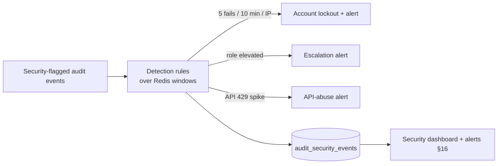

# Audit Logs & Activity Center — Multi-Tenant Multi-Vendor SaaS

Centralized, immutable, tamper-evident activity tracking across the whole
platform: who did what, when, to which resource, from where — plus the
compliance reporting, security monitoring, and investigation tooling
built on top of that record.

Unlike most of the advanced modules, audit logging **already has a real,
working, append-only core** in the codebase. This doc's job is to
generalize that proven core into a platform-wide audit + activity center.

### What ships today (verified)

- **`ActivityLog` model** — a genuine **append-only** audit record: `public const UPDATED_AT = null;` (rows are never updated).
- **`ActivityLog::record($event, $user = null, $properties = [], $description = null)`** — the write helper; auto-pulls `ip_address` + truncated `user_agent` from the request and falls back to `Auth::user()`; accepts a `null` user (for untrusted events like failed logins).
- **`activity_logs` table** — `id`, `user_id` (nullable FK, `nullOnDelete`), `event` (varchar 64, e.g. `auth.login`), `description`, `properties` (json), `ip_address` (45), `user_agent` (512), `created_at` (`useCurrent`, **no `updated_at`**); indexed `[user_id, event]` + `created_at`.
- **Already wired across the security surface** — `record()` is called from login, registration, 2FA challenge, password change, session revocation, API-token create/revoke, and payment reconciliation (`auth.login`, `auth.login.failed`, `password.changed`, …).
- **Read-only UI** — `Settings\ActivityController` → the `settings/activity` page shows the signed-in user their last 50 events.

**Append-only / immutability precedents also shipped:**

- **`webhook_events`** — a `UNIQUE` idempotency gate (a row that exists proves the event was processed exactly once).
- **`LedgerTransaction`** — the append-only financial ledger (never mutated; corrections are new rows).

> The leap this doc specs: keep `ActivityLog`'s append-only contract and `record()` ergonomics, but add a **category/event taxonomy** (§4), a **`tenant_id`** dimension + **polymorphic subject** (the audited resource), **before/after snapshots** (§6), a **hash chain** for tamper-evidence (§19, building directly on the append-only + ledger precedent), **table partitioning** for billions of rows (§24), and the **security / compliance / AI / investigation** layers on top. None of this discards the working core — it grows it.

It is the natural consumer of every other module's events:

- **Event source** ← every module emits domain events; the audit listener records them (event-driven, §1).
- **Admin surfacing** → [`admin-control-center-architecture.md`](admin-control-center-architecture.md) §16 (audit logs center) + §15 (security center) render this module.
- **Alerts** → [`notifications-architecture.md`](notifications-architecture.md) (security/compliance alerts, §16).
- **Compliance** → GDPR/SOC2 evidence consumed by admin §17.
- **AI intelligence** ← [`ai-architecture.md`](ai-architecture.md) (anomaly/threat scoring, §17).

Follows the shipped/planned convention of the prior eighteen docs.

## Table of contents

1. [Audit center overview](#1-audit-center-overview)
2. [Activity tracking system](#2-activity-tracking-system)
3. [Audit logging system](#3-audit-logging-system)
4. [Event classification](#4-event-classification)
5. [User activity timeline](#5-user-activity-timeline)
6. [Change history tracking](#6-change-history-tracking)
7. [Security event monitoring](#7-security-event-monitoring)
8. [Tenant audit logs](#8-tenant-audit-logs)
9. [Vendor activity center](#9-vendor-activity-center)
10. [Customer activity center](#10-customer-activity-center)
11. [System event tracking](#11-system-event-tracking)
12. [Compliance logging](#12-compliance-logging)
13. [Audit search engine](#13-audit-search-engine)
14. [Audit reports](#14-audit-reports)
15. [Activity feed](#15-activity-feed)
16. [Notifications & alerts](#16-notifications--alerts)
17. [AI-powered audit intelligence](#17-ai-powered-audit-intelligence)
18. [Data retention policies](#18-data-retention-policies)
19. [Audit log integrity](#19-audit-log-integrity)
20. [Database design](#20-database-design)
21. [API design](#21-api-design)
22. [Frontend architecture](#22-frontend-architecture)
23. [Security](#23-security)
24. [Performance](#24-performance)
25. [Multi-tenant audit architecture](#25-multi-tenant-audit-architecture)
26. [Monitoring & observability](#26-monitoring--observability)
27. [Scalability](#27-scalability)
28. [Future expansion](#28-future-expansion)

### Status snapshot (today)

| Layer | Shipped | Planned in this doc |
|---|---|---|
| **Append-only record** | `ActivityLog` (`UPDATED_AT = null`) | keep; add hash chain (§19) |
| **Write helper** | `record()` — auto IP/UA, null user | keep; add subject + category + snapshot |
| **Event vocabulary** | flat `event` string (`auth.login`, …) | category + event taxonomy (§4) |
| **Coverage** | auth + reconciliation | every module via event-driven listener (§2) |
| **Tenant dimension** | — (single-tenant today) | `tenant_id` + isolation (§8, §25) |
| **Change snapshots** | `properties` jsonb | before/after `audit_snapshots` (§6) |
| **Security monitoring** | failed-login events recorded | detection rules + alerts (§7, §16) |
| **UI** | `settings/activity` (own last 50) | audit dashboard, search, investigations (§22) |
| **Tables** | `activity_logs` | 17 `audit_*` tables (§20) |

---

## 1. Audit center overview

### Strategy

| Concern | Approach |
|---|---|
| Audit logging | Append-only, tamper-evident records of every consequential action — the shipped `ActivityLog` contract, platform-wide |
| Security monitoring | Detection rules over the audit stream (failed logins, escalations, abuse) → alerts |
| Compliance | The audit log *is* the evidence trail; reports project it for GDPR/SOC2/ISO/HIPAA |
| Activity tracking | Every module emits events; one listener records them uniformly |
| Event monitoring | Real-time feed + AI anomaly scoring over the stream |

### Event-driven capture (the core mechanism)

```mermaid
flowchart LR
    subgraph Modules
      A[Auth] --> E
      B[Billing] --> E
      C[Marketplace] --> E
      D[Projects / CRM / Support / ...] --> E
    end
    E[Domain events] --> L[AuditListener\n(queued)]
    L --> REC["AuditLogger.record()\n(generalized ActivityLog::record)"]
    REC --> WRITE[(audit_logs\nappend-only, partitioned)]
    WRITE --> HASH[hash chain\nprev_hash → hash]
    WRITE --> FEED[Redis stream\nactivity feed]
    WRITE --> AI[AI anomaly scoring]
    FEED --> ALERT[security / compliance alerts]
```

Modules never call the audit layer directly for cross-cutting events —
they **emit domain events**; a single queued `AuditListener` records them.
This keeps modules decoupled and guarantees uniform capture. (The shipped
auth code calls `ActivityLog::record()` inline today — that direct path
stays valid for the security-critical auth events; the event-driven path
is added for everything else.) Recording is **queued** so audit never
slows the request.

### Integration

Audit is a **horizontal consumer** of the whole platform — every module
(§2 lists all 16) is a source. The admin control center (§15 security,
§16 audit, §17 compliance) is the primary reader; notifications carry
alerts; AI scores the stream.

---

## 2. Activity tracking system

One listener records activity from **all sources**: users, tenants,
vendors, customers, projects, tasks, CRM, marketplace, billing, support,
messaging, knowledge base, automation, AI, files, notifications.

```php
// every module emits; the listener records uniformly
class AuditListener
{
    public function handle(object $event): void
    {
        AuditLogger::fromDomainEvent($event);   // maps event → category + audit row
    }
}
```

Each module already (or will) fire domain events (`ProductCreated`,
`InvoicePaid`, `TicketEscalated`, …). The audit module subscribes to a
catalog of auditable events and records them — so adding audit coverage
to a new module is *emitting an event*, not editing the audit module.
The shipped inline `ActivityLog::record()` calls in auth remain (auth is
security-critical and synchronous-by-design).

---

## 3. Audit logging system

Captures: create / update / delete / login / logout / permission change /
role change / configuration change / billing / security events — as
**immutable records** (the shipped append-only contract: `UPDATED_AT =
null`, no update path, hash-chained §19).

```php
audit_logs   // generalizes the shipped activity_logs
  id (bigint, partitioned by created_at)
  tenant_id (nullable — platform events have none)
  actor_id → users (nullable; null = system or untrusted)
  actor_type enum('user','system','api','automation','ai')
  category_id → audit_categories            // §4
  event varchar(96)                          // 'product.updated' (shipped: 'auth.login')
  action enum('create','update','delete','login','logout','access','config','security')
  subject_type, subject_id                   // polymorphic — the audited resource
  description
  properties jsonb                           // shipped field, kept
  ip_address inet, user_agent, device jsonb, geo jsonb
  prev_hash, hash                            // §19 chain
  created_at (useCurrent, no updated_at)
```

The shipped row (`user_id`, `event`, `description`, `properties`,
`ip_address`, `user_agent`, `created_at`) is a strict subset — migration
is **additive** (`actor_id` ← `user_id`, new nullable columns, backfill
`category`/`hash`).

---

## 4. Event classification

A two-level taxonomy replaces the flat `event` string:

```php
audit_categories
  id, key (unique), label, severity_default, color, is_system
  // Authentication, Authorization, Billing, Projects, Tasks, CRM,
  // Marketplace, Support, Messaging, Storage, Automation, AI, Security, System

audit_events    // the catalog of known event types
  id, category_id, key (unique)   // 'auth.login', 'product.deleted', 'invoice.paid'
  label, default_severity enum('info','notice','warning','critical')
  is_security bool, is_compliance bool, retention_days
```

The shipped events (`auth.login`, `auth.login.failed`, `password.changed`,
…) seed the `Authentication`/`Security` categories. Custom categories
allowed (tenant/module-defined, `is_system = false`). Severity +
`is_security`/`is_compliance` flags drive routing (alerts §16, compliance
§12, retention §18).

---

## 5. User activity timeline

The generalized record already carries the full "who/when/what/where" —
this section is the **read model** over it (the shipped `settings/activity`
page generalized):

| Field | Source |
|---|---|
| Who | `actor_id` + `actor_type` |
| When | `created_at` |
| Affected resource | `subject_type` + `subject_id` |
| Previous / new values | `audit_snapshots` (§6) |
| IP | `ip_address` (shipped) |
| Device | `user_agent` (shipped) + parsed `device` jsonb |
| Location | `geo` jsonb (IP → coarse geo at write time) |

A timeline query is `audit_logs WHERE actor_id = ? ORDER BY id DESC`
(the shipped query, plus tenant scope + richer columns). Rendered as the
`ActivityTimeline` component (§22).

---

## 6. Change history tracking

For mutations on Projects, Tasks, Invoices, Subscriptions, CRM records,
Marketplace products, Support tickets, KB articles, Files — store
**before/after snapshots**:

```php
audit_snapshots
  id, audit_log_id → audit_logs
  subject_type, subject_id
  before jsonb, after jsonb         // dirty-attribute diff
  changed_keys text[]               // fast "what changed" filter
```

Captured via a reusable `Auditable` model trait hooking Eloquent
`updated`/`deleted` events — it diffs `getDirty()` vs `getOriginal()` and
writes the snapshot linked to the audit row. Sensitive attributes
(passwords, tokens) are redacted from snapshots. This is the
"time machine" for any auditable record.

---

## 7. Security event monitoring

Builds on the **already-recorded** `auth.login.failed` events (the
shipped login flow records these with `user = null` + the attempted
email in `properties`).



Monitors: failed logins, repeated failures, password resets, permission
escalations, suspicious activity, account lockouts, API abuse. Detection
rules run over Redis sliding-window counters keyed off the audit stream;
matches write `audit_security_events` (with a status/severity/assignee
for triage) and fire alerts (§16). This is the data layer behind the
admin **security center** (admin §15).

---

## 8. Tenant audit logs

Each tenant accesses **their own** user / billing / project / team /
config activity — `audit_logs WHERE tenant_id = ?` (the global tenant
scope, same guarantee as every other module). Tenant owners/admins see
their tenant's audit; they **cannot** see other tenants or platform-level
(`tenant_id IS NULL`) events. Strict isolation (§25, §23).

---

## 9. Vendor activity center

Vendor logins, product changes, order activities, revenue events, store
updates, review responses — filtered by the vendor's actor + their
owned subjects. Vendor admins get a vendor-scoped activity report
(marketplace §-vendor events feed this). A vendor sees their store's
activity, not the tenant's or other vendors'.

---

## 10. Customer activity center

Purchases, projects, messages, tickets, invoices, profile changes —
the customer's own actions across modules, assembled into a unified
history (support agents use it for context; the customer sees it as
"your activity"). Same record, filtered by actor + subject ownership.

---

## 11. System event tracking

Non-user events (`actor_type = 'system'`): API requests (sampled),
queue jobs, background tasks, webhooks (the shipped `webhook_events`
already records inbound webhooks idempotently — they feed here),
scheduled jobs, integrations, system errors, infrastructure events.

```php
audit_system_events
  id, tenant_id (nullable), type enum('api','queue','webhook','cron','integration','error','infra')
  source, status, duration_ms, error jsonb, context jsonb, created_at
```

Provides operational visibility; the heavy/high-volume operational
stream is separated from the user `audit_logs` (different retention §18,
different partition cadence §24) so user-audit queries stay fast.

---

## 12. Compliance logging

The audit log **is** the compliance evidence trail.

| Framework | What the audit log provides |
|---|---|
| **GDPR** | Access/export/erasure events; consent changes; "right to be forgotten" = legal-hold-aware purge (§18); data-access logging |
| **SOC 2** | Immutable activity trail, access logs, change management, the integrity chain (§19) as the "logging" control |
| **ISO 27001** | Access control + event logging evidence |
| **HIPAA-ready** | PHI-access logging, encryption (§23), retention (§18) — architecture supports it; not certified |

```php
audit_compliance_records
  id, tenant_id, framework enum('gdpr','soc2','iso27001','hipaa')
  control_ref, audit_log_id (nullable), evidence jsonb, period, generated_at
```

Compliance reports (§14) project the audit log into framework-specific
evidence; GDPR data-subject requests (export/erase) are themselves
audited events.

---

## 13. Audit search engine

Investigation-grade search:

| Filter | Mechanism |
|---|---|
| Event / category | indexed `event`, `category_id` |
| User / actor | indexed `actor_id` |
| Resource | `subject_type` + `subject_id` |
| Date range | partition pruning on `created_at` (§24) |
| IP | indexed `ip_address` |
| Full-text | Postgres FTS / Meilisearch over `description` + `properties` |
| Advanced | composite filters, saved searches |

For billions of rows, search hits a **search index** (Meilisearch/OpenSearch)
or partition-pruned Postgres with the right composite indexes — not a
full scan. Saved searches power investigations (§22). The shipped
`[user_id, event]` + `created_at` indexes are the seed.

---

## 14. Audit reports

```php
audit_reports
  id, tenant_id (nullable), type, params jsonb, schedule (cron, nullable)
  format enum('pdf','xlsx','csv'), last_run_at, recipients jsonb

audit_exports
  id, report_id (nullable), tenant_id, requested_by_id
  format, status, file_id → files, row_count, expires_at, signed (hash)
```

Report types: user activity, security, compliance, billing, system,
vendor, tenant. Formats: PDF / Excel / CSV. **Scheduled** reports run via
the queue (the shipped `composer dev` queue worker) and deliver via
notifications. Generation is a background job (§24); exports are stored
via the file-manager with signed URLs + an integrity signature, and
expire. Exports are themselves audited (who exported what).

---

## 15. Activity feed

Real-time monitoring surface (admin + tenant scoped):

```php
audit_activity_feeds
  id, scope enum('platform','tenant','vendor'), scope_id
  audit_log_id → audit_logs, pinned bool, created_at
```

Displays recent events, security alerts, critical changes, platform
activity, system notifications — **live**, pushed over the WebSocket
layer (messaging/notifications Reverb channel) from the Redis stream the
`AuditListener` writes to. Scoped per viewer (platform operators see all;
tenant admins see their tenant). Powers the admin dashboard's live tile
(admin §2).

---

## 16. Notifications & alerts

(Via [`notifications-architecture.md`](notifications-architecture.md).)

```php
audit_alerts
  id, tenant_id (nullable), rule_key, severity, audit_log_id / security_event_id
  status enum('open','ack','resolved'), assigned_to_id, channels jsonb, created_at
```

Administrators are notified about security incidents, suspicious activity,
permission changes, critical errors, compliance violations — over email /
SMS / push / in-app (the notification module's channels). Alert rules map
event severity + detection matches (§7) to recipients; alerts have a
triage lifecycle (open → ack → resolved) and are deduplicated/rate-limited
so a burst doesn't flood (the notification dispatcher handles batching).

---

## 17. AI-powered audit intelligence

(Via [`ai-architecture.md`](ai-architecture.md), gated by AI credits.)

```php
audit_ai_insights
  id, tenant_id (nullable), type enum('anomaly','threat','behavior','compliance','risk','recommendation')
  audit_log_id / actor_id (nullable), score numeric, summary, evidence jsonb
  status, created_at
```

- **Anomaly detection** — baseline per actor (typical hours/IPs/actions); flag deviations (impossible travel, 3am bulk delete).
- **Threat detection** — pattern-match known attack sequences over the stream.
- **Behavior analysis** — actor behavior profiles; drift scoring.
- **Compliance monitoring** — flag events that violate policy.
- **Risk scoring** — per-actor / per-tenant risk score from recent activity.
- **Security recommendations** — actionable next steps ("enforce 2FA for this admin").

Runs as queued jobs over batches (not in the request path); insights feed
the security dashboard + alerts. The AI layer reads the audit stream — it
never writes to `audit_logs` directly (insights are a separate table, so
the audit trail stays purely factual).

---

## 18. Data retention policies

```php
audit_retention_policies
  id, tenant_id (nullable), category_id (nullable)
  retain_days, archive_after_days, action enum('archive','purge'), legal_hold bool

audit_archives
  id, period, partition_name, file_id → files (cold storage)
  row_count, hash_root, archived_at
```

- **Retention rules** — per category/tenant (security/compliance events kept longest; operational shortest, §11).
- **Archiving** — old partitions exported to cold storage (object store) + dropped from hot tables; archive carries a `hash_root` (§19) so archived data stays verifiable.
- **Legal hold** — flagged records/tenants are **never** purged regardless of retention (GDPR-erasure honors holds — a held record is anonymized-but-retained).
- **Purging** — a scheduled job drops expired partitions (fast — drop, not delete).
- **Compliance retention** — frameworks (§12) set minimums that override shorter rules.

---

## 19. Audit log integrity

Tamper-evidence built on the shipped append-only contract + the ledger
precedent (`LedgerTransaction` is already never-mutated):

```mermaid
flowchart LR
    R1[row N-1\nhash = H_{n-1}] --> R2[row N]
    R2 --> COMP["hash = SHA256(prev_hash + canonical(row))"]
    COMP --> R3[row N+1\nprev_hash = H_n]
    R3 --> ANCHOR[periodic hash_root\nsigned + externally anchored]
```

- **Immutable logs** — no update/delete path in code; DB grant denies UPDATE/DELETE on `audit_logs` to the app role.
- **Hash chain** — each row's `hash = SHA256(prev_hash ‖ canonical(row))`; `prev_hash` links to the previous row. Any altered row breaks every subsequent hash.
- **Tamper detection** — a verification job recomputes the chain; a mismatch = an alert (§16).
- **Chain validation** — periodic `hash_root` (Merkle root of a partition) signed and optionally anchored externally (a WORM bucket / timestamping service) so even a DBA can't silently rewrite history.
- **Audit verification** — `audit_integrity_hashes` stores the roots; an operator can prove a record existed unaltered at a point in time.

```php
audit_integrity_hashes
  id, partition_name, period, hash_root, signature, anchored_ref, verified_at
```

---

## 20. Database design

| Table | Purpose |
|---|---|
| `audit_logs` | Core immutable event record (generalizes shipped `activity_logs`) |
| `audit_categories` | Top-level taxonomy |
| `audit_events` | Known event-type catalog (severity/flags/retention) |
| `audit_snapshots` | Before/after change diffs (§6) |
| `audit_changes` | Field-level change index (fast "who changed field X") |
| `audit_security_events` | Detected security incidents (§7) |
| `audit_activity_feeds` | Live feed entries (§15) |
| `audit_alerts` | Alert instances + triage state (§16) |
| `audit_reports` | Report definitions + schedules (§14) |
| `audit_exports` | Generated export artifacts (§14) |
| `audit_retention_policies` | Retention/archive/hold rules (§18) |
| `audit_archives` | Cold-storage partition manifests (§18) |
| `audit_integrity_hashes` | Chain roots + signatures (§19) |
| `audit_compliance_records` | Framework evidence mapping (§12) |
| `audit_ai_insights` | AI anomaly/threat/risk findings (§17) |
| `audit_investigations` | Investigation cases (linked logs + notes) |
| `audit_system_events` | Operational/system stream (§11) |

### `audit_logs` (the core — generalizes the shipped table)

```php
Schema::create('audit_logs', function (Blueprint $t) {
    $t->bigIncrements('id');
    $t->foreignId('tenant_id')->nullable()->index();
    $t->foreignId('actor_id')->nullable()->constrained('users')->nullOnDelete(); // ← shipped user_id
    $t->string('actor_type', 16)->default('user');
    $t->foreignId('category_id')->nullable()->constrained('audit_categories');
    $t->string('event', 96)->index();              // shipped: varchar(64) event
    $t->string('action', 16)->nullable();
    $t->nullableMorphs('subject');                 // the audited resource
    $t->string('description')->nullable();         // shipped
    $t->jsonb('properties')->nullable();           // shipped
    $t->ipAddress('ip_address')->nullable();       // shipped
    $t->string('user_agent', 512)->nullable();     // shipped
    $t->jsonb('device')->nullable();
    $t->jsonb('geo')->nullable();
    $t->string('prev_hash', 64)->nullable();       // §19
    $t->string('hash', 64)->nullable();            // §19
    $t->timestamp('created_at')->useCurrent();     // shipped — NO updated_at (append-only)
    $t->index(['tenant_id', 'created_at']);
    $t->index(['actor_id', 'event']);              // shipped index, kept
    $t->index(['subject_type', 'subject_id']);
    $t->index('category_id');
})
// PARTITION BY RANGE (created_at) — monthly (§24)
```

### Particulars

- **Append-only** preserved: no `updated_at`; the app DB role is granted INSERT + SELECT only on `audit_logs` (no UPDATE/DELETE) — the contract enforced at the database, not just in code.
- **Partitioned by `created_at`** (monthly) — billions of rows, fast pruning, cheap archival (drop a partition).
- Every table (except platform-level) carries `tenant_id` + global scope (§25).
- `audit_snapshots` / `audit_changes` link to `audit_logs.id`; redaction applied before write.
- The migration from `activity_logs` is **additive + backfill** — the shipped rows map directly (`user_id`→`actor_id`, infer `category`, compute `hash` chain on backfill).

---

## 21. API design

Role-gated (super-admin / platform-admin / security-admin / compliance-officer
see broad; tenant-owner/vendor see scoped); cross-tenant → 404; **all
endpoints read-only** (no write/delete API for audit logs — the only
writer is the internal listener).

| Verb | URL | Purpose |
|---|---|---|
| `GET` | `/audit/logs` | Search/filter logs (paginated, cursor) |
| `GET` | `/audit/logs/{id}` | One record + its snapshot + chain proof |
| `GET` | `/audit/timeline/{actorType}/{id}` | Actor or resource timeline |
| `GET` | `/audit/feed` | Live activity feed (scoped) |
| `GET` | `/audit/security-events` | Security incidents |
| `PATCH` | `/audit/security-events/{id}` | Triage (ack/resolve/assign) |
| `GET/POST` | `/audit/alerts` | Alerts + triage |
| `GET/POST` | `/audit/reports` | Report defs + schedules |
| `POST` | `/audit/exports` | Request an export (queued) |
| `GET` | `/audit/exports/{id}` | Export status + signed download |
| `GET` | `/audit/compliance` | Compliance evidence/records |
| `GET/POST` | `/audit/investigations` | Investigation cases |
| `POST` | `/audit/verify` | Verify integrity of a range/partition (§19) |
| `GET` | `/audit/insights` | AI insights (§17) |

Cursor pagination (keyset on `id`) for the huge tables; filtering is the
§13 search. Responses never expose another tenant's data.

---

## 22. Frontend architecture

```
resources/js/
├── pages/audit/                  # (shipped: settings/activity.tsx → generalizes here)
│   ├── dashboard.tsx             # audit dashboard (volume, top events, alerts)
│   ├── activity.tsx              # activity center / timeline
│   ├── security.tsx              # security events center
│   ├── compliance.tsx            # compliance center + evidence
│   ├── investigations.tsx        # investigations center
│   └── reports.tsx               # report builder + scheduled reports
├── components/audit/
│   ├── ActivityTimeline.tsx      # who/when/what/where (generalizes shipped settings/activity)
│   ├── EventTable.tsx            # virtualized, filterable log table
│   ├── AuditFilters.tsx          # category/user/resource/date/IP/full-text
│   ├── AlertWidget.tsx           # alert cards + triage
│   ├── SecurityDashboard.tsx     # incident overview + risk scores
│   ├── InvestigationViewer.tsx   # linked-event case view
│   ├── SnapshotDiff.tsx          # before/after rendering (§6)
│   ├── ChainProof.tsx            # integrity verification badge (§19)
│   └── ExportManager.tsx         # request/download exports
├── hooks/audit/
│   ├── useAuditSearch.ts         # cursor pagination + filters
│   ├── useActivityFeed.ts        # live WebSocket feed (§15)
│   └── useSecurityEvents.ts
└── lib/audit/
    ├── event-format.ts           # event-key → human label/icon/color
    └── filters.ts
```

- The shipped `settings/activity` page is the seed for `ActivityTimeline` — it already renders event/description/properties/IP/user-agent/time.
- `EventTable` is virtualized (millions of rows); search is server-driven (§13).
- The admin control center (admin §15/§16/§17) embeds these components — this module provides them, admin composes them.

---

## 23. Security

| Concern | Mitigation |
|---|---|
| Tenant isolation | `tenant_id` global scope on every audit table; 404 cross-tenant |
| RBAC | Read scopes by role: platform/security/compliance see broad; tenant/vendor see own; **no role can write/edit logs** |
| Audit permissions | `audit.view`, `audit.security`, `audit.compliance`, `audit.export` permissions (Spatie) |
| Encryption | Sensitive `properties`/snapshot fields encrypted at rest; PII minimized + redacted at write |
| Secure exports | Exports via signed, expiring file-manager URLs + integrity signature; export action itself audited |
| Tampering | DB-level INSERT/SELECT-only grant + hash chain (§19) — even an admin can't silently alter |
| Self-audit | Audit-config changes (retention edits, export requests) are themselves audited (no blind spots) |

The auditor cannot be the audited's editor: viewing is permissioned;
**writing is exclusively the internal listener**; mutation is impossible
by design (append-only + DB grant + chain).

---

## 24. Performance

| Concern | Approach |
|---|---|
| Event streaming | `AuditListener` is **queued** — writes never block the request (the shipped queue worker) |
| Redis caching | Detection-rule counters + the live-feed stream in Redis; hot dashboards cached |
| Partitioned tables | `audit_logs` + `audit_system_events` range-partitioned by month → fast pruning, cheap archive |
| Data archiving | Cold partitions exported + dropped (§18) — hot set stays small |
| Background processing | Reports, exports, AI insights, integrity verification all queued |
| Write throughput | Batched inserts from the queue; `audit_system_events` (high volume) separated from user logs |
| Search | Dedicated search index (Meilisearch/OpenSearch) for full-text; Postgres for filtered/partition-pruned |

Designed for **billions of events**: append-only + partitioned + queued
writes + archived cold storage keeps the hot path O(append) and queries
partition-pruned.

---

## 25. Multi-tenant audit architecture

Each tenant can: access their own audit logs (§8), configure retention
policies (§18, within platform-set minimums), generate audit reports
(§14), and configure alerts (§16) — all `tenant_id`-scoped. Strict
separation: a tenant query can never return another tenant's or
platform-level rows (global scope + the 404 rule). Platform operators see
across tenants (admin §16). Per-tenant retention overrides cannot go
*below* compliance minimums (§12) — the platform floor wins.

---

## 26. Monitoring & observability

The audit center *is* part of the observability story, and integrates
with the rest:

| Signal | Integration |
|---|---|
| Application monitoring | App errors → `audit_system_events` (type `error`) + APM (Sentry/Telescope in dev) |
| Infrastructure | Infra events ingested as system events |
| API monitoring | API request audit (sampled) + rate-limit/abuse detection (§7) |
| Queue monitoring | Queue job audit (the shipped queue worker) + failure alerts |
| Error tracking | Errors correlated to the audit timeline for root-cause |

Unified observability = the audit stream (business/security events) +
operational telemetry (system events) in one queryable, correlated place.
Feeds the admin monitoring center (admin §27).

---

## 27. Scalability

100k+ tenants, **billions of audit events**, millions of daily
activities, global:
- **Append-only + partitioned** — writes are O(append); month partitions pruned/archived/dropped.
- **Queued, batched writes** — absorb spikes; back-pressure via the queue, never the request.
- **Separated streams** — high-volume system/API events apart from user audit.
- **Search offloaded** — to a dedicated index, not the OLTP tables.
- **Cold archival** — old data in object storage, still hash-verifiable.
- **Multi-region** — audit written region-locally, replicated; tenant data residency respected.

---

## 28. Future expansion

| Feature | Approach |
|---|---|
| SIEM integration | Stream audit events to Splunk/Datadog/Elastic (the queued listener forks a SIEM sink) |
| External compliance tools | Export evidence via API to GRC platforms |
| Security data lake | Land the stream in a lake (S3 + Athena/BigQuery) for long-range analysis |
| Advanced threat intelligence | Enrich events with threat feeds (known-bad IPs) before scoring (§17) |
| Cross-system audit federation | Federate audit across multiple platform instances / acquired products under one chain-of-custody |

All build on the event-driven stream + the hash chain — the listener
gains sinks; the model doesn't change.

---

## File map for the next phase

| Path | Status |
|---|---|
| `app/Models/ActivityLog.php` — keep append-only `record()`; the security-critical inline path stays | **shipped** |
| `database/migrations/*_generalize_activity_logs_to_audit_logs.php` (additive: tenant_id, actor_*, category, subject morph, geo/device, hash chain; partition) | planned (refactors shipped) |
| `database/migrations/*_create_audit_categories_events_tables.php` | planned |
| `database/migrations/*_create_audit_snapshots_changes_tables.php` | planned |
| `database/migrations/*_create_audit_security_events_alerts_tables.php` | planned |
| `database/migrations/*_create_audit_reports_exports_tables.php` | planned |
| `database/migrations/*_create_audit_retention_archives_integrity_tables.php` | planned |
| `database/migrations/*_create_audit_compliance_ai_investigations_system_tables.php` | planned |
| `app/Domain/Audit/{AuditLogger,HashChain,RetentionManager,IntegrityVerifier}.php` | planned |
| `app/Domain/Audit/Detection/{SecurityRuleEngine,AnomalyScorer}.php` | planned |
| `app/Listeners/AuditListener.php` (subscribes to module domain events) | planned |
| `app/Models/Concerns/Auditable.php` (model trait → before/after snapshots) | planned |
| `app/Models/{AuditLog,AuditSnapshot,AuditSecurityEvent,AuditAlert,AuditReport,AuditExport,AuditInvestigation}.php` | planned |
| `app/Jobs/{GenerateAuditReport,RunRetention,VerifyIntegrityChain,ScoreAuditAnomalies}.php` | planned |
| `app/Http/Controllers/Audit/*Controller.php` (generalizes Settings\ActivityController) | planned |
| `resources/js/pages/audit/*` + `components/audit/*` + `hooks/audit/*` (generalizes settings/activity.tsx) | planned |
| `tests/Feature/Audit/*` (append-only enforcement, hash-chain tamper detection, tenant isolation, retention + legal hold, security detection rules, export signing) | planned |

The next pass keeps the **working append-only `ActivityLog` core
untouched in spirit** and grows it: an additive migration to `audit_logs`
(tenant + subject + category + hash chain + partitioning), a queued
`AuditListener` that records every module's domain events through the
generalized `record()`, the `Auditable` snapshot trait, the hash-chain
integrity layer (mirroring the shipped ledger's never-mutate discipline),
and the audit dashboard/search/investigations UI on top of the shipped
`settings/activity` page. Security detection, AI scoring, compliance
reporting, and SIEM sinks layer on after the generalized record + chain
are in place.

---

## The architecture doc set

This is the nineteenth architecture doc. The complete set under `docs/`:

1. `dashboard-architecture.md`
2. `payments-architecture.md`
3. `projects-architecture.md`
4. `tasks-architecture.md`
5. `notifications-architecture.md`
6. `billing-architecture.md`
7. `ai-architecture.md`
8. `analytics-architecture.md`
9. `workflow-automation-architecture.md`
10. `marketplace-architecture.md`
11. `mobile-architecture.md`
12. `crm-architecture.md`
13. `messaging-architecture.md`
14. `support-architecture.md`
15. `file-manager-architecture.md`
16. `knowledge-base-architecture.md`
17. `admin-control-center-architecture.md`
18. `white-label-architecture.md`
19. `audit-logs-architecture.md`

All in the same shipped-vs-planned format, cross-referenced, each ending
with a concrete "File map for the next phase". The audit center is the
spine that records and proves everything the other eighteen modules do —
and the module with a real, working, append-only core (`ActivityLog`)
already in the codebase to grow from.
