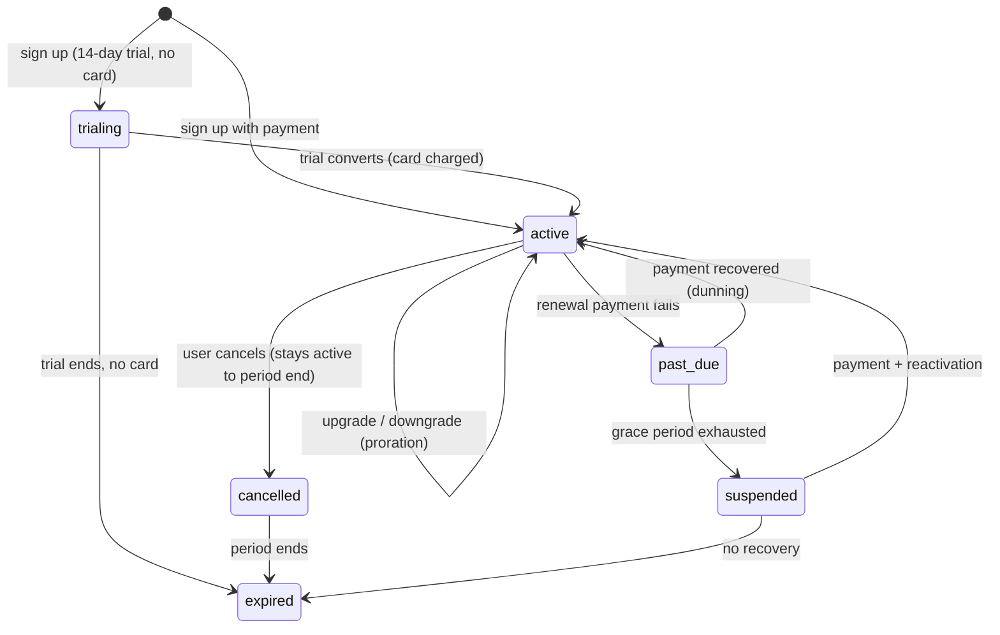
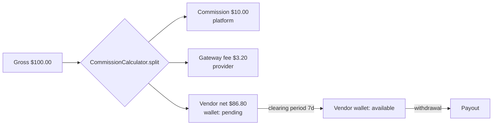
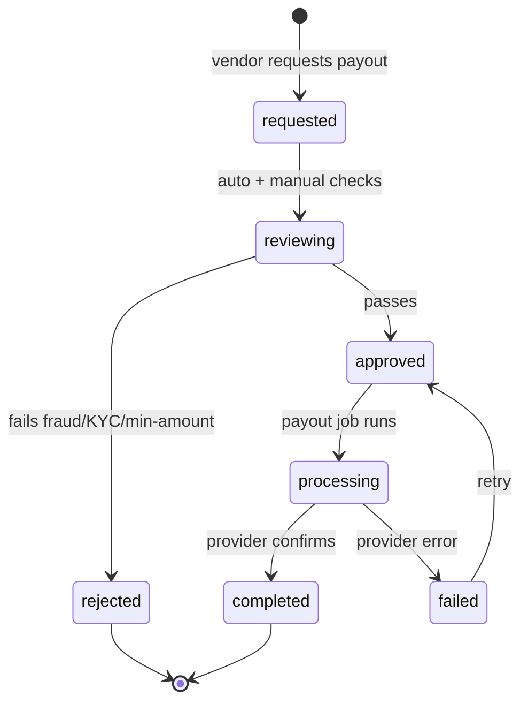
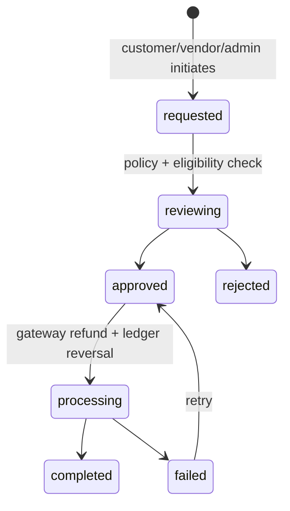

# Billing & Subscription Module — Multi-Tenant Multi-Vendor SaaS

A FinTech-grade billing system spanning two distinct money flows:

1. **Platform SaaS billing** — tenants pay *us* a recurring subscription
   (Free/Pro/Business/Enterprise) for using the platform.
2. **Marketplace billing** — customers pay *vendors* for products/services;
   the platform takes a commission and routes the rest to vendor wallets
   for withdrawal.

This doc owns: plans, subscription lifecycle, the marketplace revenue
model, commissions, vendor earnings + withdrawals, invoices, taxes,
coupons, refunds, and financial reporting.

It is the **commercial-logic companion** to
[`payments-architecture.md`](payments-architecture.md), which owns the
*money-movement primitives*: the wallet, the append-only ledger,
idempotent webhook processing, and reconciliation. Where this doc says
"credit the vendor wallet" or "the webhook fires", the *how* lives in
the payments doc. No duplication — this doc cites it.

Follows the shipped/planned convention of the other four architecture
docs.

## Table of contents

1. [Overview](#1-overview)
2. [Subscription plans](#2-subscription-plans)
3. [Subscription lifecycle](#3-subscription-lifecycle)
4. [Marketplace revenue model](#4-marketplace-revenue-model)
5. [Payment processing](#5-payment-processing)
6. [Vendor earnings](#6-vendor-earnings)
7. [Withdrawal system](#7-withdrawal-system)
8. [Invoice management](#8-invoice-management)
9. [Tax management](#9-tax-management)
10. [Coupons & promotions](#10-coupons--promotions)
11. [Refund management](#11-refund-management)
12. [Financial reporting](#12-financial-reporting)
13. [Billing notifications](#13-billing-notifications)
14. [Database design](#14-database-design)
15. [API design](#15-api-design)
16. [Frontend architecture](#16-frontend-architecture)
17. [Security (FinTech-grade)](#17-security-fintech-grade)
18. [Performance](#18-performance)
19. [AI financial features](#19-ai-financial-features)
20. [Multi-tenant billing](#20-multi-tenant-billing)
21. [Future scalability](#21-future-scalability)

### Status snapshot (today)

| Layer | Shipped | Planned in this doc |
|---|---|---|
| **Platform plans** | `plans` table + `Plan` model (Free/Pro/Business/Enterprise, `limitFor`, `hasFeature`); `tenant_subscriptions` + `TenantSubscription` (trialing/active/past_due/cancelled/expired, monthly/annual) | + per-tenant plan customization, AI-credit metering |
| **Plan gating** | `PlanGate` (`allows`, `withinLimit`, `snapshot`) + `UsageReader` | usage-based overage billing |
| **Stripe** | `BillingService` (ensureCustomer, checkoutSession, portalSession, cancelAtPeriodEnd, attachFreePlan); `StripeGateway`; `StripeWebhookProcessor` (subscription lifecycle) | PayPal adapter, payment abstraction interface, provider failover |
| **Money primitives** | `Wallet`, `LedgerTransaction`, idempotent `payments` (see [payments doc](payments-architecture.md)) | — (reused) |
| **Marketplace** | `Coupon`, `Invoice`, `Payment` models | commissions, revenue split, vendor earnings ledger, withdrawals, tax engine, refund workflow, financial reports |

---

## 1. Overview

### Business objectives

- **Two revenue streams**: platform subscription fees (predictable MRR) + marketplace commission (scales with GMV).
- **Vendor liquidity**: vendors get paid reliably and can withdraw, or they churn.
- **Financial correctness**: every cent is traceable through the append-only ledger; books always balance.
- **Global reach**: multi-currency, multi-region, tax-compliant.

### Marketplace monetization model

```
Customer pays $100 for a vendor's product
  ├─ Platform commission (10%)         → $10  → platform revenue
  ├─ Payment processing fee (2.9%+30¢) → $3.20 → passed to gateway
  └─ Vendor net                        → $86.80 → vendor wallet (pending → available)
```

Three configurable models (§4): commission-based, subscription-based,
hybrid.

### Subscription model (platform SaaS)

Tenants subscribe to a plan to use the platform. The plan gates
features and usage limits via the shipped `PlanGate`. This is the
recurring SaaS revenue, billed by Stripe, tracked in
`tenant_subscriptions`.

### Financial workflows & integration

| Module | Billing touchpoint |
|---|---|
| **Projects** | Milestone approval releases escrowed payment → vendor wallet credit + commission |
| **Tasks** | Billable time entries → invoice line items (tasks doc §10) |
| **Orders** | Marketplace purchase → `payments` → wallet credit (payments doc) |
| **Subscriptions** | Plan billing → `tenant_subscriptions` via Stripe |
| **Dashboard** | Revenue/MRR/churn widgets read billing rollups |
| **Notifications** | Payment success/failure, renewal, withdrawal, refund events |

---

## 2. Subscription plans

The shipped `Plan` model has slugs `free`, `pro`, `business`,
`enterprise`. This doc maps the requested 5-tier model onto it
(`starter` = `pro`, adds an explicit `professional` if a 5th tier is
wanted — the catalogue is data, not code).

| Plan | Price (mo/yr) | Projects | Team | Storage | API | AI credits | Analytics |
|---|---|---|---|---|---|---|---|
| **Free** | $0 | 1 | 2 | 1 GB | – | 0 | basic |
| **Starter** | $19 / $190 | 5 | 5 | 10 GB | read | 100/mo | basic |
| **Professional** | $49 / $490 | 25 | 15 | 100 GB | read+write | 1,000/mo | advanced |
| **Business** | $149 / $1,490 | 100 | 50 | 500 GB | full | 5,000/mo | advanced + exports |
| **Enterprise** | custom | ∞ | ∞ | custom | full + SLA | custom | advanced + SSO/audit |

### Feature gating (shipped)

Already implemented in `PlanGate`:

```php
$gate->allows($tenant, 'advanced_analytics');     // boolean feature flag
$gate->withinLimit($tenant, 'products', 1);       // usage limit + delta
$gate->snapshot($tenant);                          // full plan/usage state for UI
```

The `plans.features` (JSON) + `plans.limits` (JSON) columns drive both.
A new feature flag is a config + a `hasFeature()` check — no schema
change. This is the existing pattern used by
`Admin\ProductController::store()` (returns 402 when over the product
limit).

### Plan storage

```php
// plans (shipped)
plans
  id, slug (unique), name, description
  price_monthly_cents, price_yearly_cents, currency
  features    jsonb   // ['advanced_analytics' => true, 'api' => 'full', …]
  limits      jsonb   // ['projects' => 25, 'team' => 15, 'storage_mb' => 102400, 'ai_credits' => 1000]
  stripe_price_monthly_id, stripe_price_yearly_id
  is_active, position, timestamps
```

### AI credits (planned)

A metered resource: `subscription_usage` tracks consumption per period;
`PlanGate::withinLimit($tenant, 'ai_credits', $n)` gates each AI call
(tasks doc §21, notifications doc §18). Overage either blocks or bills
per-unit (config).

---

## 3. Subscription lifecycle

The shipped `TenantSubscription` already models:
`trialing → active → past_due → cancelled → expired` + `monthly|annual`.



> The shipped enum lacks `suspended` — it's added in the next migration as a state between `past_due` and `cancelled`. Two-column-safe: the existing values keep working.

### Transitions driven by Stripe webhooks (shipped)

`StripeWebhookProcessor` (payments doc territory for idempotency)
already maps:
- `customer.subscription.created/updated` → upsert + `mapStatus()`
- `customer.subscription.deleted` → cancelled
- `invoice.paid` → past_due → active recovery
- `invoice.payment_failed` → past_due

### Trials, grace, renewals, up/downgrades

- **Free trial**: `trial_ends_at` set on creation; `onTrial()` shipped. No card required for Free→trial of Pro.
- **Grace period**: `past_due` tolerated for N days (config) with dunning emails before `suspended`.
- **Auto-renewal**: Stripe handles the charge; the webhook advances `current_period_end`.
- **Upgrade**: immediate, prorated (Stripe proration); new limits apply at once.
- **Downgrade**: scheduled at period end (avoid mid-cycle feature loss); a `pending_plan_id` column holds the target.

### Dunning

Failed renewal → `past_due` → retry schedule (Stripe Smart Retries) +
escalating notifications (day 1, 3, 7) → `suspended` at day N. All
via the billing notification events (§13).

---

## 4. Marketplace revenue model

### Configurable per-tenant (or per-category)

```php
// commission_rules
commission_rules
  id, tenant_id (nullable = platform default), category_id (nullable)
  model        enum('commission','subscription','hybrid')
  percent_bps  int          // basis points: 1000 = 10.00%
  flat_fee_cents int         // fixed per-transaction fee
  min_fee_cents  int
  effective_from, effective_to
  timestamps
```

### Models

| Model | How the platform earns |
|---|---|
| **Commission-based** | % of each sale (`percent_bps`) + optional flat fee |
| **Subscription-based** | Vendor pays a monthly platform plan; 0% commission |
| **Hybrid** | Lower commission % *and* a vendor subscription |

### Split calculation (the core money math)

```php
// app/Domain/Billing/CommissionCalculator.php
final class CommissionCalculator
{
    public function split(int $grossCents, CommissionRule $rule, int $gatewayFeeCents): RevenueSplit
    {
        $commission = max(
            (int) round($grossCents * $rule->percent_bps / 10_000) + $rule->flat_fee_cents,
            $rule->min_fee_cents,
        );
        $vendorNet = $grossCents - $commission - $gatewayFeeCents;

        return new RevenueSplit(
            gross: $grossCents,
            commission: $commission,        // → platform revenue
            gatewayFee: $gatewayFeeCents,   // → payment provider
            vendorNet: max(0, $vendorNet),  // → vendor wallet (pending)
        );
    }
}
```



The split is recorded as ledger entries (payments doc): a `commission`
debit-to-platform and a `credit` to the vendor wallet, both carrying
the `payment_id` so reconciliation can verify
`gross == commission + fee + vendor_net`.

---

## 5. Payment processing

### Abstraction layer (planned — Stripe shipped concretely)

The shipped `StripeGateway` becomes one implementation of a
`PaymentGateway` interface so PayPal/Paddle/Lemon Squeezy drop in:

```php
interface PaymentGateway
{
    public function key(): string;                                   // 'stripe' | 'paypal'
    public function createCustomer(Tenant $tenant): string;
    public function checkoutSession(CheckoutIntent $intent): string; // returns redirect URL / client secret
    public function charge(ChargeIntent $intent): ChargeResult;      // one-time
    public function refund(string $gatewayPaymentId, int $cents): RefundResult;
    public function verifyWebhook(Request $request): WebhookEvent;   // signature check
}
```

```php
// app/Domain/Billing/Gateways/{StripeGateway, PayPalGateway}.php
// resolved by App\Domain\Billing\GatewayManager::for('stripe')
```

### Payment types

| Type | Path |
|---|---|
| **One-time** (marketplace order) | `charge()` → `payments` row → wallet credit (payments doc) |
| **Subscription** (platform plan) | `checkoutSession()` → Stripe-managed recurring → webhooks |
| **Recurring** (vendor subscription in hybrid model) | same subscription rail, different price |

### Validation & idempotency

All inbound webhooks go through the idempotent processor
(payments doc §3): signature verification → `webhook_events` UNIQUE
insert → queued processing. Client-initiated charges carry an
`idempotency_key` (payments doc §2) so a double-click can't double-charge.

---

## 6. Vendor earnings

Built on the shipped `Wallet` + `LedgerTransaction` (payments doc §2).
A vendor's wallet has **balance buckets** derived from ledger entry
states rather than separate columns:

| Bucket | Definition |
|---|---|
| **Pending** | Vendor-net credits still inside the clearing period (e.g. 7 days post-sale, for chargeback risk) |
| **Available** | Cleared credits, withdrawable |
| **Held** | Frozen for dispute/chargeback/fraud review |
| **Withdrawal (in-flight)** | Debited from available, not yet paid out |

```php
// Derived, not stored separately — single source of truth is the ledger.
final class VendorBalance
{
    public function buckets(Wallet $wallet): array
    {
        return [
            'pending'   => $this->sumWhere($wallet, 'pending'),
            'available' => $this->sumWhere($wallet, 'available'),
            'held'      => $this->sumWhere($wallet, 'held'),
            'lifetime_earned' => $this->sumCredits($wallet),
        ];
    }
}
```

A `clearing` job moves pending → available after the window
(`ledger_transactions.metadata.clears_at`). Tracked events: sales
(credit), commissions (informational), refunds (debit/reversal),
chargebacks (held → debit), withdrawals (debit).

---

## 7. Withdrawal system

### Workflow



### Tables

```php
withdrawal_requests
  id, tenant_id, vendor_id (user), wallet_id
  amount_cents, currency
  method        enum('paypal','bank_transfer','payoneer','manual')
  destination   jsonb   // masked payout details (never raw bank numbers in plaintext)
  status        enum('requested','reviewing','approved','processing','completed','failed','rejected')
  reviewed_by_id, reviewed_at, review_note
  ledger_transaction_id   // the debit entry
  provider_payout_id
  requested_at, completed_at, timestamps
  index (vendor_id, status), index (status, requested_at)
```

### Mechanics

1. **Request**: validates `amount ≤ available balance`, ≥ minimum, vendor KYC complete. Immediately debits **available → withdrawal-in-flight** (a `debit` ledger entry) so the same funds can't be requested twice.
2. **Review**: auto-checks (velocity, amount thresholds, fraud score) + manual approval for large amounts. Rejection reverses the debit.
3. **Payout**: queued `ProcessWithdrawalJob` calls the payout provider (PayPal Payouts API / bank file / Payoneer / manual mark).
4. **Completed**: provider webhook confirms; `completed_at` set, vendor notified.

### Fraud prevention

- Withdrawal only from **available** (post-clearing) balance.
- Velocity limits (max N requests / amount per day).
- New payout destination triggers a hold + email confirmation.
- Manual review threshold (config) for large amounts.
- KYC gate: no withdrawal until identity verified.
- Every state change audited; the debit is a ledger entry, so books always reconcile (payments doc §6 drift detection catches any mismatch).

---

## 8. Invoice management

The shipped `Invoice` model + `invoices` table handle the structure
(number unique-per-tenant `INV-2026-####`, integer cents, JSON
line items). Extending:

| Invoice kind | Issued for |
|---|---|
| **Subscription** | Platform plan charge (auto from Stripe `invoice.paid`) |
| **Marketplace (customer)** | Customer's purchase from a vendor |
| **Vendor** | Commission statement / payout summary |

### Generation

- **Numbering**: `INV-{year}-{seq}` sequential per tenant (gapless via a `invoice_sequences` counter row locked on increment).
- **Tax lines**: computed by the tax engine (§9), stored as `invoice_items` with `type='tax'`.
- **PDF**: queued `GenerateInvoicePdf` job (dompdf/snappy) → stored on S3 → signed-URL download. Never generated in the request cycle.
- **History**: immutable once issued; a correction is a credit note, not an edit.
- **Localization**: rendered in the recipient's locale + tenant branding (logo/colors from `BrandingService`), like notification templates.

---

## 9. Tax management

### Flexible tax engine

```php
// tax_rules
tax_rules
  id, tenant_id (nullable = platform default)
  country_code char(2), region (nullable)   // US-CA, etc.
  tax_type enum('vat','sales_tax','gst','none')
  rate_bps int                               // 2000 = 20% VAT
  applies_to enum('subscription','marketplace','both')
  is_inclusive bool                          // price includes tax (EU) vs added (US)
  effective_from, effective_to
  index (country_code, region, tax_type)
```

```php
final class TaxEngine
{
    public function compute(int $netCents, TaxContext $ctx): TaxResult
    {
        $rule = $this->resolveRule($ctx);          // by customer country/region + kind
        if (! $rule || $ctx->isExempt()) {
            return TaxResult::zero($netCents);
        }
        $tax = (int) round($netCents * $rule->rate_bps / 10_000);
        return new TaxResult(
            net: $netCents,
            taxCents: $tax,
            gross: $netCents + $tax,
            rule: $rule,
        );
    }
}
```

- **VAT / GST / Sales Tax** by country + region.
- **Inclusive vs exclusive** pricing (EU shows tax-inclusive; US adds at checkout).
- **Exemptions**: valid VAT ID (reverse charge), tax-exempt orgs → `tax_records` notes the exemption reason.
- **`tax_records`**: every computed tax persisted for reporting + audit.
- **Reports**: tax collected by jurisdiction by period (§12).
- For production scale, this engine is the seam where Stripe Tax / TaxJar / Avalara plug in — the same `TaxEngine` interface, external rate lookups.

---

## 10. Coupons & promotions

The shipped `Coupon` model + `coupons` table provide the base. Extending
with usage tracking:

```php
coupons (shipped, extended)
  code (unique), type enum('percent','fixed','free_trial')
  value_bps | value_cents | trial_days
  applies_to enum('subscription','marketplace','both')
  max_redemptions, max_per_user, redeemed_count
  min_order_cents, currency
  starts_at, expires_at, is_active

coupon_usages
  id, coupon_id, user_id, tenant_id
  order_id | subscription_id (polymorphic-ish)
  discount_cents, redeemed_at
  unique (coupon_id, user_id, order_id)   // dedup per order
```

- **Percentage / fixed / free-trial** discounts.
- **Promotional campaigns**: a campaign groups coupons + a date window + analytics (redemptions, revenue impact).
- **Validation**: active, within window, under max redemptions, under per-user cap, meets minimum — atomic check + `redeemed_count` increment under a row lock (no over-redemption race).
- **Stripe**: subscription coupons map to Stripe Coupons/Promotion Codes; marketplace coupons apply in our checkout math before the split.

---

## 11. Refund management

### Workflow



### Mechanics

- **Full / partial**: `refunds.amount_cents ≤ payment.amount`.
- **Gateway refund**: `PaymentGateway::refund()` → provider issues it; the `charge.refunded` webhook (payments doc) confirms.
- **Ledger reversal**: the customer refund debits the vendor wallet (a `refund` entry) and reverses the commission proportionally — all idempotent via the payments-doc processor.
- **Held funds**: if the vendor's balance is insufficient (already withdrawn), the refund creates a **negative available** position recovered from future earnings, or escalates to manual collection.
- **Automated vs manual**: small refunds within policy auto-approve; large or out-of-policy require admin approval.
- **Tracking**: `refunds` table with reason, status, history; every transition audited and notified (§13).

```php
refunds
  id, tenant_id, payment_id, order_id, vendor_id
  amount_cents, currency, reason, reason_code
  type enum('full','partial')
  status enum('requested','reviewing','approved','processing','completed','failed','rejected')
  initiated_by_id, approved_by_id
  gateway_refund_id, ledger_transaction_id
  requested_at, completed_at, timestamps
  index (payment_id), index (status, requested_at)
```

---

## 12. Financial reporting

| Report | Metric | Source |
|---|---|---|
| Revenue | gross / net / by stream | `payments`, `commissions` |
| Subscription | active subs, new, churned, by plan | `tenant_subscriptions` |
| Vendor earnings | per-vendor net, paid, pending | wallet ledger |
| Commission | platform take by period | commission ledger entries |
| Tax | collected by jurisdiction | `tax_records` |
| Refund | count, amount, rate | `refunds` |
| Customer revenue | per-customer spend | `payments` |
| **MRR** | normalized monthly recurring | `tenant_subscriptions` × plan price |
| **ARR** | MRR × 12 | derived |
| **Churn** | cancelled / active at period start | `tenant_subscriptions` transitions |
| **LTV** | avg revenue per customer × avg lifespan | derived |
| **CAC** | marketing spend / new customers | external + subs |

### Computation

Heavy aggregations are precomputed into the `daily_metrics` rollup
table (dashboard module) by a nightly `AggregateFinancialMetrics` job —
dashboards read the rollup, never the OLTP tables. MRR/ARR/churn are
expensive to compute live at scale, so they're snapshotted daily with a
`financial_reports` row for historical trend charts.

```php
financial_reports
  id, tenant_id (nullable = platform-wide)
  period_type enum('day','month','quarter','year'), period_date
  mrr_cents, arr_cents, new_mrr_cents, churned_mrr_cents
  gross_revenue_cents, commission_cents, refund_cents
  active_subscriptions, churn_rate_bps, ltv_cents
  generated_at
  unique (tenant_id, period_type, period_date)
```

Dashboard widgets (same `type:'chart'` protocol) render these,
Redis-cached 5 min.

---

## 13. Billing notifications

Uses the notifications module (delivery mechanics in
[`notifications-architecture.md`](notifications-architecture.md)).
Billing event types:

| Type | Trigger | Level |
|---|---|---|
| `billing.payment_succeeded` | charge/renewal ok | info |
| `billing.payment_failed` | renewal fails | high |
| `billing.subscription_renewed` | period advances | info |
| `billing.trial_ending` | 3 days before trial end | high |
| `billing.invoice_issued` | invoice generated | info |
| `billing.withdrawal_approved` | payout approved | high |
| `billing.withdrawal_completed` | payout confirmed | high |
| `billing.refund_processed` | refund completed | high |
| `billing.subscription_past_due` | dunning | critical |

Channels: in-app + email always; push for high/critical; SMS for
critical payout/security only. Each has a tenant-customizable template
(notifications doc §9, §19).

---

## 14. Database design

| Table | Status | Purpose |
|---|---|---|
| `plans` | shipped | Platform plan catalogue |
| `tenant_subscriptions` | shipped | A tenant's active plan + Stripe state |
| `subscription_features` | planned | Normalized feature flags (or stays JSON on plans) |
| `subscription_usage` | planned | Metered usage per period (AI credits, etc.) |
| `payments` | shipped | Gateway charges (idempotent — payments doc) |
| `payment_methods` | planned | Saved cards/PayPal per tenant (gateway tokens only) |
| `transactions` | planned | Unified money-movement view (or derived from ledger) |
| `invoices` / `invoice_items` | shipped / planned | Invoice headers + lines |
| `wallets` / `wallet_transactions` | shipped (`ledger_transactions`) | Vendor balance + ledger (payments doc) |
| `withdrawals` / `withdrawal_requests` | planned | Payout workflow |
| `refunds` | planned | Refund workflow |
| `commissions` / `commission_rules` | planned | Revenue split config + records |
| `coupons` / `coupon_usages` | shipped / planned | Discounts + redemption tracking |
| `tax_rules` / `tax_records` | planned | Tax engine config + computed records |
| `financial_reports` | planned | Snapshotted MRR/ARR/churn/etc. |

### Key constraints / indexes

- `tenant_subscriptions`: `index(tenant_id, status)`, `unique(stripe_subscription_id)`.
- `commissions`: `index(payment_id)`, FK to `payments`; the split must satisfy `gross = commission + gateway_fee + vendor_net` (verified by reconciliation).
- `withdrawal_requests`: `index(vendor_id, status)`; the debit `ledger_transaction_id` is set atomically with status `requested`.
- `coupon_usages`: `unique(coupon_id, user_id, order_id)` prevents double-redemption.
- `tax_records`: `index(country_code, period)` for jurisdiction reports.
- Money columns are **BIGINT cents** everywhere (payments doc §2 convention) — no floats in financial math.

---

## 15. API design

Tenant-scoped; cross-tenant → 404. Money in cents in the API,
formatted at the UI boundary (`Money` helper, payments doc §5).

| Verb | URL | Purpose |
|---|---|---|
| `GET` | `/billing/plans` | Public plan catalogue |
| `GET` | `/billing/subscription` | Current tenant subscription + usage snapshot |
| `POST` | `/billing/subscription/checkout` | Stripe checkout session `{plan, cycle}` |
| `POST` | `/billing/subscription/portal` | Stripe billing portal session |
| `POST` | `/billing/subscription/cancel` | Cancel at period end |
| `POST` | `/billing/subscription/resume` | Undo a pending cancellation |
| `GET` | `/billing/invoices` | Invoice list (paginated, filter by kind/date) |
| `GET` | `/billing/invoices/{id}/pdf` | Signed-URL PDF download |
| `GET` | `/billing/payment-methods` | Saved methods |
| `POST` | `/billing/payment-methods` | Attach a method (tokenized) |
| `GET` | `/vendor/wallet` | Balance buckets + recent ledger |
| `GET` | `/vendor/wallet/ledger` | Paginated ledger |
| `POST` | `/vendor/withdrawals` | Request payout |
| `GET` | `/vendor/withdrawals` | Withdrawal history |
| `POST` | `/admin/withdrawals/{id}/approve` | Approve payout |
| `POST` | `/admin/withdrawals/{id}/reject` | Reject |
| `POST` | `/billing/coupons/validate` | Check a coupon `{code, context}` |
| `POST` | `/billing/refunds` | Request refund |
| `POST` | `/admin/refunds/{id}/approve` | Approve refund |
| `GET` | `/admin/billing/reports` | Financial reports (MRR/ARR/etc.) |
| `POST` | `/webhooks/stripe` | Stripe webhooks (shipped, idempotent) |
| `POST` | `/webhooks/paypal` | PayPal webhooks (planned) |

### Example — subscription snapshot

```json
{
  "subscription": {
    "plan": "professional",
    "status": "active",
    "cycle": "monthly",
    "current_period_end": "2026-07-10T00:00:00Z",
    "cancel_at_period_end": false
  },
  "usage": {
    "projects": { "used": 12, "limit": 25 },
    "team":     { "used": 8,  "limit": 15 },
    "storage":  { "used_mb": 41200, "limit_mb": 102400 },
    "ai_credits": { "used": 320, "limit": 1000 }
  }
}
```

(That `usage` block is exactly what the shipped `PlanGate::snapshot()`
returns.)

---

## 16. Frontend architecture

```
resources/js/
├── pages/billing/
│   ├── index.tsx              # billing dashboard (plan + usage + next invoice)
│   ├── plans.tsx              # pricing cards + upgrade/downgrade
│   ├── payment-methods.tsx
│   ├── invoices.tsx           # list + PDF viewer
│   └── reports.tsx            # MRR/ARR/churn charts (admin)
├── pages/vendor/
│   ├── wallet.tsx             # balance buckets + ledger
│   └── withdrawals.tsx        # request + history
├── pages/admin/billing/
│   ├── withdrawals.tsx        # approval queue
│   ├── refunds.tsx            # approval queue
│   ├── coupons.tsx
│   └── commission-rules.tsx
├── components/billing/
│   ├── PricingCards.tsx
│   ├── BillingSummary.tsx
│   ├── InvoiceViewer.tsx
│   ├── WalletWidget.tsx       # balance buckets, animated
│   ├── RevenueChart.tsx
│   ├── SubscriptionManager.tsx
│   ├── UsageMeter.tsx         # used/limit bar, upgrade CTA when near cap
│   ├── WithdrawalForm.tsx
│   └── CouponInput.tsx
├── hooks/billing/
│   ├── useSubscription.ts
│   ├── useWallet.ts
│   ├── useCheckout.ts         # redirect to Stripe / PayPal
│   └── useInvoices.ts
└── lib/billing/
    ├── money.ts               # cents ⇄ display (mirrors PHP Money helper)
    ├── plans.ts               # plan metadata for the cards
    └── formatters.ts
```

- **Inertia props** seed the dashboard; **React Query** for ledger/invoice infinite scroll.
- The **UsageMeter** turns amber near a limit and shows the in-context "Upgrade" CTA — mirrors the 402 the backend returns (conversion goal from the dashboard doc).

---

## 17. Security (FinTech-grade)

| Concern | Mitigation |
|---|---|
| **PCI scope** | Card data never touches our servers — Stripe Elements / PayPal hosted; we store only gateway tokens (`payment_methods.gateway_token`). PCI SAQ-A. |
| **Webhook verification** | Signature checked before any processing (`PaymentGateway::verifyWebhook`); shipped for Stripe |
| **Duplicate payments** | `payments.gateway_payment_id` UNIQUE + `idempotency_key` (payments doc §2) |
| **Webhook abuse / replay** | `webhook_events.gateway_event_id` UNIQUE dedup gate (payments doc §3) |
| **Unauthorized withdrawal** | Withdrawal only from available balance; KYC gate; manual review threshold; new-destination hold; every payout is a ledger debit (reconciled) |
| **Payment manipulation** | Server computes all amounts (split, tax, discount); client-sent prices ignored; the 402 path proves the server is authoritative |
| **Ledger integrity** | Append-only ledger + reconciliation drift detection (payments doc §6) — books can never silently diverge |
| **Audit** | Every billing state change → `activity_logs` + domain `*_logs`; immutable |
| **Tenant isolation** | All billing tables `tenant_id` + global scope; a vendor sees only their wallet |
| **Fraud detection** | Velocity rules, anomaly scoring (§19), chargeback holds |

---

## 18. Performance

| Concern | Approach |
|---|---|
| Webhook processing | Queued + idempotent (payments doc); ack the gateway in ms |
| Invoice PDF | Queued `GenerateInvoicePdf`; never in request cycle |
| Report aggregation | Nightly `AggregateFinancialMetrics` → `financial_reports` + `daily_metrics`; dashboards read rollups |
| Wallet balance | Bucket sums cached in Redis per wallet (60s), busted on ledger write |
| Plan/usage snapshot | `PlanGate::snapshot()` cached per tenant (5 min), busted on usage change |
| Withdrawal payouts | Per-provider queue; batch bank files |
| Commission split | Computed inline (cheap integer math), recorded as ledger entries |
| High-volume | Money tables (`payments`, `ledger_transactions`) partitioned by month at scale; reporting reads partitioned cold storage |
| Queue isolation | `billing-webhooks`, `billing-invoices`, `billing-payouts`, `billing-reports` separate queues |

Target: millions of transactions, thousands of vendors, high-volume
marketplaces.

---

## 19. AI financial features

Opt-in, queued, audited (same guardrails as the other AI docs).

| Feature | Description |
|---|---|
| **Revenue forecasting** | Time-series on `financial_reports` → projected MRR/ARR with confidence bands |
| **Churn prediction** | Per-tenant churn risk from usage decline + payment failures + support signals → proactive retention notification |
| **Vendor performance scoring** | Composite of GMV, refund rate, chargeback rate, delivery time → tiering + commission incentives |
| **Fraud detection** | Anomaly scoring on payments + withdrawals (velocity, geo, amount patterns) → auto-hold + review |
| **LTV prediction** | Predicted lifetime value per customer cohort → informs CAC budget |
| **Financial recommendations** | "Your Pro plan is 90% utilized — upgrade to Business" / "3 vendors are withdrawal-eligible" |

Architecture: queued job builds a context bundle from rollups, calls
the model with structured output, persists to an `ai_insights` table,
surfaces behind a "Powered by AI" badge. Never auto-executes a
financial action (refund, payout, suspension) — always
human-in-the-loop.

---

## 20. Multi-tenant billing

Each tenant configures (white-label):

- **Pricing plans** — override the platform catalogue or define their own marketplace pricing.
- **Tax settings** — their `tax_rules` (jurisdictions, exemptions).
- **Billing preferences** — currency, billing cycle defaults, dunning policy.
- **Invoice branding** — logo, colors, footer, sender identity (via `BrandingService` + notifications doc §19).
- **Payment gateways** — connect their own Stripe/PayPal account (Stripe Connect / PayPal Marketplace) so funds flow to *them*, platform takes its commission via the connected-account fee.
- **Currency** — display + settlement currency per tenant.

Stripe Connect (Express/Custom accounts) is the mechanism for true
marketplace payouts: the platform is the controller, vendors are
connected accounts, commission is an `application_fee_amount`.

---

## 21. Future scalability

- **Global payments**: regional Stripe/PayPal endpoints; local payment methods (iDEAL, SEPA, Alipay) via Stripe.
- **Multi-currency**: store + settle in multiple currencies; FX captured at transaction time; the ledger is currency-tagged (`ledger_transactions.currency`).
- **Multi-region**: billing workers + read replicas per region; the ledger has a single authoritative primary for consistency.
- **Enterprise billing**: custom contracts, PO/invoice terms (net-30), seat-based + usage-based hybrid, manual invoicing.
- **Marketplace at scale**: Stripe Connect for automated split payouts; partitioned money tables; event-sourced ledger (payments doc §20) for replayability.
- **Provider failover**: the gateway abstraction (§5) allows health-based routing across providers.

---

## File map for the next phase

| Path | Status |
|---|---|
| `database/migrations/*_create_commission_rules_table.php` | planned |
| `database/migrations/*_create_commissions_table.php` | planned |
| `database/migrations/*_create_withdrawal_requests_table.php` | planned |
| `database/migrations/*_create_refunds_table.php` | planned |
| `database/migrations/*_create_tax_rules_table.php` | planned |
| `database/migrations/*_create_tax_records_table.php` | planned |
| `database/migrations/*_create_coupon_usages_table.php` | planned |
| `database/migrations/*_create_subscription_usage_table.php` | planned |
| `database/migrations/*_create_payment_methods_table.php` | planned |
| `database/migrations/*_create_financial_reports_table.php` | planned |
| `database/migrations/*_add_suspended_to_tenant_subscriptions.php` | planned |
| `app/Domain/Billing/PaymentGateway.php` (interface) + `GatewayManager.php` | planned |
| `app/Domain/Billing/Gateways/PayPalGateway.php` | planned |
| `app/Domain/Billing/CommissionCalculator.php` + `RevenueSplit.php` | planned |
| `app/Domain/Billing/TaxEngine.php` | planned |
| `app/Domain/Billing/VendorBalance.php` | planned |
| `app/Domain/Billing/WithdrawalService.php` + `RefundService.php` | planned |
| `app/Jobs/Billing/{GenerateInvoicePdf,ProcessWithdrawal,AggregateFinancialMetrics,ClearPendingBalance}.php` | planned |
| `app/Models/{CommissionRule,Commission,WithdrawalRequest,Refund,TaxRule,TaxRecord,CouponUsage,PaymentMethod,FinancialReport,SubscriptionUsage}.php` | planned |
| `app/Http/Controllers/{Billing,Vendor\Wallet,Vendor\Withdrawal}Controller.php` + `Admin\{Withdrawal,Refund,CommissionRule}Controller.php` | planned |
| `resources/js/pages/billing/*` + `pages/vendor/{wallet,withdrawals}.tsx` + `pages/admin/billing/*` | planned |
| `resources/js/components/billing/*` + `hooks/billing/*` | planned |
| `tests/Feature/Billing/*` (commission split, withdrawal lifecycle, tax compute, refund reversal, coupon redemption race) | planned |

The next pass commits commission rules + the calculator + the vendor
balance buckets (building on the shipped wallet/ledger), then the
withdrawal workflow, then the tax engine, then PayPal behind the
gateway interface. Financial reporting rollups and AI features ship in
later phases.
