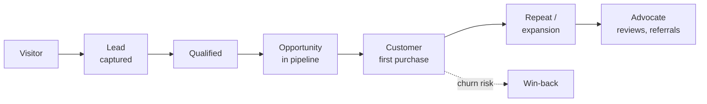
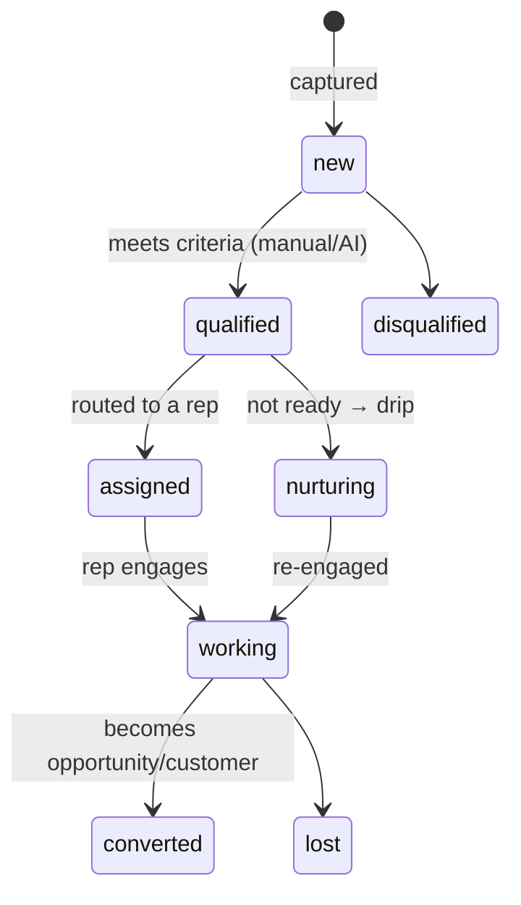
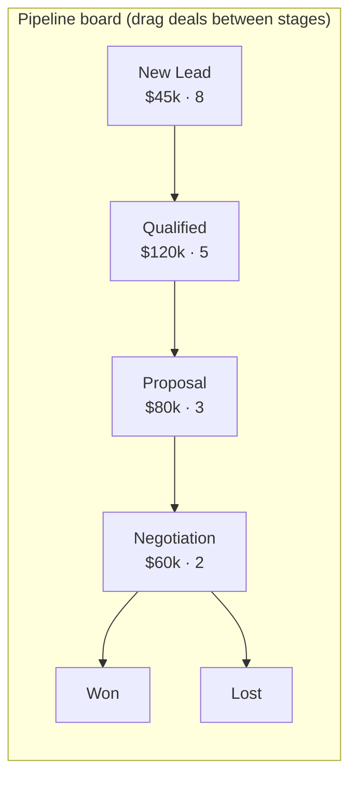

# CRM Module — Multi-Tenant Multi-Vendor SaaS

An enterprise CRM for the marketplace: contacts, leads, sales
pipelines, opportunities, customer accounts, vendor relationships, a
unified communication hub, segmentation, automation, and AI-powered
sales intelligence.

The CRM is the **relationship layer** that sits over the transactional
data the platform already captures. It doesn't re-store customers — it
enriches the existing `users` + `orders` + `reviews` with sales context
(leads, deals, communications, scores) and gives vendors a workspace to
manage the relationship before, during, and after a sale.

It composes data + engines other modules own:

- **Customers** ← `users` + `orders` (marketplace) — a customer account is a 360° view over these.
- **Vendor scoring** ← [`analytics-architecture.md`](analytics-architecture.md) §4 (vendor performance score).
- **Segmentation** ← [`analytics-architecture.md`](analytics-architecture.md) §5 (`analytics_segments`, RFM/lifecycle).
- **LTV / churn** ← [`billing-architecture.md`](billing-architecture.md) §12 (the financial formulae).
- **AI lead scoring / opportunity analysis / churn prediction** ← [`ai-architecture.md`](ai-architecture.md) §8 (CRM features).
- **Lead-assignment / follow-up / onboarding workflows** ← [`workflow-automation-architecture.md`](workflow-automation-architecture.md).
- **Lead capture** ← [`marketplace-architecture.md`](marketplace-architecture.md) (project requests, vendor contact).
- **Account projects** ← [`projects-architecture.md`](projects-architecture.md).

Follows the shipped/planned convention of the other eleven docs.

## Table of contents

1. [Overview](#1-overview)
2. [Contact management](#2-contact-management)
3. [Lead management](#3-lead-management)
4. [Sales pipeline](#4-sales-pipeline)
5. [Opportunities](#5-opportunities)
6. [Customer accounts](#6-customer-accounts)
7. [Vendor CRM](#7-vendor-crm)
8. [Communication hub](#8-communication-hub)
9. [Activity timeline](#9-activity-timeline)
10. [Customer segmentation](#10-customer-segmentation)
11. [CRM automation](#11-crm-automation)
12. [CRM analytics](#12-crm-analytics)
13. [AI CRM features](#13-ai-crm-features)
14. [Customer portal integration](#14-customer-portal-integration)
15. [CRM notifications](#15-crm-notifications)
16. [Database design](#16-database-design)
17. [API design](#17-api-design)
18. [Frontend architecture](#18-frontend-architecture)
19. [Security](#19-security)
20. [Performance](#20-performance)
21. [Multi-tenant CRM](#21-multi-tenant-crm)
22. [Reporting & forecasting](#22-reporting--forecasting)
23. [Future expansion](#23-future-expansion)
24. [Scalability](#24-scalability)

### Status snapshot (today)

| Layer | Shipped (composed from existing modules) | Planned in this doc |
|---|---|---|
| **Customers** | `users` + `orders` + `reviews` (marketplace) | `crm_contacts` + `crm_accounts` enrichment layer over them |
| **Vendor scoring** | analytics §4 vendor performance score | `crm_vendor_scores` snapshot + health view |
| **Segments** | analytics §5 `analytics_segments` (RFM/lifecycle) | `crm_segments` (CRM-facing dynamic segments reusing the same engine) |
| **LTV / churn** | billing §12 formulae | surfaced on the customer 360 |
| **AI** | ai §8 lead scoring / opportunity / churn (speced) | wired into leads/opportunities here |
| **Leads / pipeline / deals / communications** | none | all `crm_*` tables + engines |

> Greenfield on its own tables, but data-rich from day one: the platform already knows who bought what, who reviewed, which vendors perform — the CRM turns that latent data into a managed sales relationship.

---

## 1. Overview

### Business objectives

- **Convert more**: track leads through a pipeline so vendors don't lose deals to follow-up gaps.
- **Retain more**: spot churn-risk customers early (AI + segments) and act.
- **Grow accounts**: a 360° customer view surfaces upsell/cross-sell opportunities.
- **Vendor success**: vendor health scores + relationship management reduce vendor churn.

### Customer lifecycle



The CRM tracks a contact across this whole arc — pre-sale (lead) →
sale (opportunity/deal) → post-sale (account, communications, health).

### Integration map

| Module | CRM touchpoint |
|---|---|
| Marketplace | A project request / vendor-contact creates a lead; an order converts a lead → customer |
| Projects | An account's active projects show on the customer 360 |
| Tasks | CRM follow-ups are tasks (or CRM-specific `crm_tasks`) |
| Billing | LTV, MRR, invoices, churn on the customer 360 |
| Analytics | Segments + vendor scores + conversion metrics |
| AI | Lead scoring, opportunity analysis, churn prediction, next-best-action |
| Notifications | New lead, assignment, follow-up reminder, customer message |
| Automation | Lead assignment, follow-up sequences, onboarding workflows |

---

## 2. Contact management

```php
crm_contacts
  id, tenant_id, owner_id (vendor/team user)
  user_id (nullable → links to a platform user if they're registered)
  first_name, last_name, email, phone
  company, position, industry, country
  social_profiles jsonb            // {linkedin, twitter, github}
  source enum (lead source, §3)
  lifecycle_stage enum('lead','prospect','customer','churned')
  tags jsonb, custom_fields jsonb  // tenant-defined (§21)
  account_id (nullable → crm_accounts)
  created_at, updated_at, softDeletes
  unique (tenant_id, email)
  index (tenant_id, lifecycle_stage), index (account_id)
```

- Tracks name, email, phone, company, position, industry, country, social profiles.
- **Tags** (many-to-many or jsonb), **notes** (`crm_notes`), **segments** (§10), **history** (`crm_activities`, §9).
- **Relationship**: a `crm_contact` may link to a platform `user` (registered) or stand alone (an imported/manual lead). It belongs to a `crm_account` (the company) and is owned by a vendor/team user.

A contact unifies "a person we're selling to" whether or not they've
registered — bridging anonymous leads and platform users.

---

## 3. Lead management



```php
crm_leads
  id, tenant_id, contact_id, owner_id (assigned rep, nullable)
  source_id → crm_lead_sources
  status enum('new','qualified','assigned','working','nurturing','converted','lost','disqualified')
  score smallint (0..100)          // AI + rules (§13)
  estimated_value_cents
  converted_to_opportunity_id (nullable)
  lost_reason (nullable)
  created_at, updated_at, index (tenant_id, status, score)

crm_lead_sources
  id, tenant_id, key, label          // website, marketplace, referral, campaign, api, manual
  is_active
```

- **Capture** — website forms, marketplace (project request / vendor contact), referrals, campaigns, API, manual entry. Each tagged with a `source`.
- **Qualification** — rules + AI scoring (§13); BANT-style criteria configurable per tenant.
- **Assignment** — round-robin / least-loaded / by-territory via the automation engine (workflow doc).
- **Tracking** — every touch logged to `crm_activities`.
- **Conversion** — a qualified lead becomes an opportunity (§5) and, on win, a customer (links the `crm_contact` to the resulting `order`).
- **Scoring** — `crm_leads.score` from AI (ai §8) + rule weights; drives prioritization.

---

## 4. Sales pipeline

Customizable per tenant; multiple pipelines (e.g. "New business",
"Renewals", "Services").

```php
crm_pipelines
  id, tenant_id, name, is_default, position

crm_pipeline_stages
  id, tenant_id, pipeline_id, name, position
  probability smallint (0..100)     // default win-prob for forecasting
  is_won, is_lost
  index (pipeline_id, position)
```

Default stages: New Lead → Qualified → Proposal Sent → Negotiation →
Won / Lost. Tenants add/rename/reorder stages and weight each stage's
win probability (feeds forecasting, §5).

### Kanban interface



Each column shows deal count + total value; dragging a deal advances
its stage (fires `deal.stage_changed` → automation + activity log).
Mobile falls back to a single-column swipe (mobile doc §6).

---

## 5. Opportunities

```php
crm_opportunities
  id, tenant_id, account_id, contact_id, owner_id
  pipeline_id, stage_id
  name, value_cents, currency
  probability smallint              // overrides stage default if set
  expected_close_on date
  status enum('open','won','lost')
  won_at, lost_at, lost_reason
  product_ids jsonb                 // marketplace products in the deal
  created_at, updated_at
  index (tenant_id, status, expected_close_on), index (pipeline_id, stage_id)

crm_deals                            // a closed opportunity → links to the order
  id, tenant_id, opportunity_id, order_id (nullable), amount_cents, closed_at
```

- Tracks value, probability, **expected revenue** (`value × probability`), closing date, assigned team.
- **Forecasting** — sum of `value × probability` by expected-close month → a weighted pipeline forecast; AI revenue forecasting (ai §9, billing §12) refines it.
- A won opportunity creates a `crm_deal` linked to the resulting marketplace `order` — closing the loop between sales and transaction.

---

## 6. Customer accounts

```php
crm_accounts
  id, tenant_id, owner_id
  name (company), domain, industry, size, country
  parent_account_id (nullable)      // account hierarchy (subsidiaries)
  health_score smallint             // 0..100, computed (§13)
  lifecycle_stage, custom_fields jsonb
  created_at, updated_at, softDeletes
  index (tenant_id, lifecycle_stage), index (parent_account_id)
```

The **customer 360** view aggregates (read-only, from the owning
modules):

- **Profile** — account + contacts.
- **Projects** — active/past projects (projects doc).
- **Purchases** — orders (marketplace).
- **Invoices** — billing.
- **Communications** — the comm hub (§8).
- **Team members** — contacts under the account.
- **Health score** + LTV + churn risk.

**Account hierarchy** via `parent_account_id` — an enterprise customer
with subsidiaries rolls up revenue + health.

---

## 7. Vendor CRM

The flip side: the platform (super-admin) + tenant manages its
**vendor** relationships.

```php
crm_vendor_scores
  id, tenant_id, vendor_id
  period_date
  performance_score smallint        // from analytics §4
  revenue_cents, orders_count, refund_rate_bps, avg_rating
  growth_rate_bps, activity_score
  health enum('healthy','at_risk','churning')
  computed_at
  unique (vendor_id, period_date)
```

- Tracks vendor performance, revenue, reviews, growth, activity (all from analytics §4 + marketplace + billing).
- **Vendor health score** — composite; `at_risk`/`churning` vendors flagged for proactive outreach (a CRM task / automation).
- Generates vendor health reports (§22) — who's growing, who's slipping, who needs attention.

---

## 8. Communication hub

A unified timeline of every interaction with a contact/account.

```php
crm_communications
  id, tenant_id, contact_id, account_id (nullable), user_id (the rep)
  type enum('email','chat','note','sms','call','meeting')
  direction enum('inbound','outbound','internal')
  subject, body, metadata jsonb
  occurred_at, created_at
  index (contact_id, occurred_at), index (account_id, occurred_at)

crm_email_logs    // email-specific: message_id, thread_id, opened_at, clicked_at, status
crm_call_logs     // duration_seconds, recording_url, outcome
crm_meetings      // scheduled_at, duration, attendees jsonb, location/link, notes
crm_notes         // internal notes (rich text), pinned flag
```

- **Email** (logged + threaded, open/click tracking), **chat** (project chat from projects doc), **internal notes**, **SMS**, **calls** (logged + outcome), **meeting logs**.
- Outbound email goes through the notifications email channel; inbound via an email-parsing webhook (automation doc inbound webhooks).
- The **unified timeline** merges all comm types + activities (§9) into one chronological feed on the contact/account.

---

## 9. Activity timeline

```php
crm_activities
  id, tenant_id, contact_id (nullable), account_id (nullable), opportunity_id (nullable)
  actor_id, type enum('interaction','purchase','project_update','email','call','meeting','note','stage_change','score_change')
  subject_type, subject_id          // polymorphic link to the source record
  summary, properties jsonb
  occurred_at (indexed)
  // append-only
```

Aggregates customer interactions, purchases, project updates, emails,
calls, meetings, notes into one history. Reuses the platform's
event-driven backbone: a `RecordCrmActivity` listener subscribes to
relevant domain events (order.created, project.milestone_completed,
communication.logged, deal.stage_changed) and writes the timeline row.
This is the same pattern as the analytics event recorder + the
project/task activity logs — the CRM timeline is a permission-scoped,
contact-centric view of it.

---

## 10. Customer segmentation

Reuses the analytics segmentation engine (analytics §5) with a
CRM-facing surface.

```php
crm_segments
  id, tenant_id, name, description
  definition jsonb        // filter rules: {lifecycle: 'customer', ltv_gt: 100000, last_order_lt: '90d'}
  is_dynamic bool         // recomputed nightly vs static list
  member_count, computed_at
```

Examples: Active customers · VIP (high LTV) · high-revenue · new (< 30d)
· churn-risk (declining engagement + AI). Dynamic segments re-evaluate
nightly (`RecomputeSegments` job, shared with analytics §5); static
segments are fixed lists. Segments drive automation (targeted
sequences), campaigns, and reporting.

**Smart filtering** — the segment builder is a declarative filter tree
(like the KPI/condition builders): lifecycle, LTV, last-order recency,
tags, source, score — evaluated against the contact + composed module
data.

---

## 11. CRM automation

Built on the workflow automation engine (workflow doc) — the CRM
provides triggers + actions, the engine runs them.

| Automation | Trigger → action |
|---|---|
| Lead assignment | `lead.created` → assign (round-robin/least-loaded) + notify rep |
| Follow-up reminders | `deal.stage_changed` / no-activity-N-days → create a follow-up task |
| Pipeline automation | stage change → set probability, notify, trigger next step |
| Customer onboarding | `order.created` (first purchase) → onboarding sequence + welcome |
| Sales workflows | qualified lead → proposal task + email template |
| Email sequences | enter a segment / nurturing status → drip campaign |

CRM-specific events (`lead.created`, `lead.qualified`,
`deal.stage_changed`, `opportunity.won`) register in the automation
trigger catalog; CRM actions (create lead, assign, log activity, send
sequence) register as action nodes.

---

## 12. CRM analytics

| Metric | Source |
|---|---|
| Lead conversion rate | converted / total leads |
| Sales revenue | won deals → orders (billing) |
| Customer retention | repeat-purchase / churn (analytics §5, billing §12) |
| Customer LTV | billing §12 |
| Churn rate | billing §12 / segments |
| Sales team performance | deals won + cycle time + activity per rep |

Rolled into `daily_metrics` / `analytics_snapshots` (analytics module)
with `crm.*` metric keys; CRM dashboards render via the shared widget
protocol. Pipeline analytics (conversion by stage, stage velocity,
win/loss reasons) are computed from `crm_opportunities` transitions.

---

## 13. AI CRM features

(Engine owned by [`ai-architecture.md`](ai-architecture.md) §8.)

| Feature | Output |
|---|---|
| AI lead scoring | `crm_leads.score` 0–100 + reasons |
| AI opportunity analysis | win probability + recommended next action |
| AI churn prediction | per-account churn risk → flag + retention play |
| AI customer insights | summarized account health + signals |
| AI sales recommendations | prioritized actions per rep |
| AI follow-up suggestions | "reach out to X — quiet 14 days, high value" |
| AI customer segmentation | auto-built segments from behavior |
| AI revenue forecasting | weighted-pipeline + trend (billing §12) |

All consume the CRM's grounded data (contacts + activities + deals +
orders), call the AI gateway (ai §2), persist to `ai_insights` /
`crm_forecasts`, surface as cards. Human-in-the-loop — AI proposes, the
rep acts. Credit-metered (ai §17).

---

## 14. Customer portal integration

Reuses the client portal (projects doc §10) + storefront account area.
Customers self-serve:

- **View projects** (projects doc portal), **orders** (marketplace), **invoices** (billing), **tickets** (support).
- **Communicate with vendors** — the comm hub (§8) is the vendor side; the customer sees the customer-facing thread.

The portal is the customer's window; the CRM is the vendor's cockpit
over the same relationship — two views of one dataset, permission-scoped.

---

## 15. CRM notifications

(Delivery via notifications doc.) Event types: `crm.lead.new`,
`crm.lead.assigned`, `crm.opportunity.updated`, `crm.followup.due`,
`crm.customer.message`, `crm.customer.activity`,
`crm.vendor.at_risk`. Channels in-app + email; push for assignments +
due follow-ups. Per-tenant branded templates (notifications §19).

---

## 16. Database design

| Table | Purpose |
|---|---|
| `crm_contacts` | People (lead → customer), links to `users` |
| `crm_accounts` | Companies, hierarchy, health |
| `crm_leads` | Lead lifecycle + score |
| `crm_lead_sources` | Source registry |
| `crm_pipelines` / `crm_pipeline_stages` | Customizable pipelines |
| `crm_opportunities` | Deals in pipeline + forecasting |
| `crm_deals` | Closed opportunities → orders |
| `crm_activities` | Append-only interaction timeline |
| `crm_notes` | Internal notes |
| `crm_tasks` | Follow-up tasks (or reuse `tasks`) |
| `crm_segments` | Dynamic/static segments |
| `crm_communications` | Unified comm log |
| `crm_email_logs` / `crm_call_logs` / `crm_meetings` | Channel-specific |
| `crm_customer_scores` / `crm_vendor_scores` | Health snapshots |
| `crm_forecasts` | Sales forecast snapshots |

### Constraints / indexes

- `crm_contacts`: `UNIQUE(tenant_id, email)`; `(tenant_id, lifecycle_stage)`; GIN on `tags`/`custom_fields`.
- `crm_leads`: `(tenant_id, status, score)` — prioritized work queue.
- `crm_opportunities`: `(tenant_id, status, expected_close_on)` — forecast query; `(pipeline_id, stage_id)` — board.
- `crm_activities`: `(contact_id, occurred_at)` + `(account_id, occurred_at)` — timeline; append-only, partitioned by month at scale.
- `crm_communications`: `(contact_id, occurred_at)`.
- Money in cents; every table `tenant_id` + `BelongsToTenant`; `owner_id` for rep-level visibility.

---

## 17. API design

API-first; tenant-scoped; rep-level visibility (`owner_id`);
cross-tenant → 404.

| Verb | URL | Purpose |
|---|---|---|
| `GET/POST` | `/crm/contacts` | List/create contacts (search/filter/segment) |
| `GET/PUT/DELETE` | `/crm/contacts/{id}` | Contact CRUD |
| `GET` | `/crm/contacts/{id}/timeline` | Unified activity + comms |
| `GET/POST` | `/crm/accounts` | Accounts (360 view) |
| `GET` | `/crm/accounts/{id}` | Account 360 (projects/orders/invoices/comms) |
| `GET/POST` | `/crm/leads` | Leads (filter by status/score/source) |
| `POST` | `/crm/leads/{id}/qualify` / `/assign` / `/convert` | Lifecycle transitions |
| `GET` | `/crm/pipelines` | Pipelines + stages |
| `GET/POST` | `/crm/opportunities` | Opportunities (board + list) |
| `PATCH` | `/crm/opportunities/{id}/stage` | Drag-drop stage change |
| `POST` | `/crm/opportunities/{id}/win` / `/lose` | Close |
| `POST` | `/crm/communications` | Log email/call/meeting/note |
| `GET/POST` | `/crm/segments` | Segments + builder |
| `GET` | `/crm/analytics` | CRM metrics |
| `GET` | `/crm/forecasts` | Sales forecast |
| `GET` | `/crm/vendors/scores` | Vendor health (admin) |
| `GET` | `/crm/reports/{type}/export` | PDF/Excel/CSV export (analytics §12) |

Lead/opportunity lists support search, filter (status/source/owner/
value range/date), sort, cursor pagination — the shared list-response
shape.

---

## 18. Frontend architecture

```
resources/js/
├── pages/crm/
│   ├── index.tsx              # CRM dashboard (pipeline summary, tasks, leads)
│   ├── contacts.tsx           # contact list + filters
│   ├── contact-detail.tsx     # contact profile + timeline
│   ├── accounts.tsx
│   ├── account-detail.tsx     # customer 360
│   ├── leads.tsx              # lead queue (sorted by score)
│   ├── pipeline.tsx           # kanban board
│   ├── opportunities.tsx
│   ├── timeline.tsx           # customer timeline
│   └── reports.tsx
├── components/crm/
│   ├── LeadCard.tsx           # score, value, source badge
│   ├── PipelineBoard.tsx      # kanban (react-flow/dnd-kit), value+count per column
│   ├── PipelineColumn.tsx
│   ├── ContactProfile.tsx
│   ├── ActivityTimeline.tsx   # unified comm + activity feed
│   ├── CommunicationComposer.tsx  # email/note/call/meeting logger
│   ├── CrmWidgets.tsx         # dashboard stat widgets
│   ├── ForecastChart.tsx      # weighted pipeline forecast
│   ├── SegmentBuilder.tsx     # declarative filter tree
│   └── HealthScoreBadge.tsx
├── hooks/crm/
│   ├── usePipeline.ts         # board state + optimistic stage moves
│   ├── useLeadQueue.ts
│   ├── useContactTimeline.ts
│   └── useForecast.ts
└── lib/crm/
    ├── stages.ts
    ├── scoring.ts             # client score display
    └── formatters.ts
```

Pipeline board reuses the kanban primitives (tasks/automation docs);
the timeline reuses the activity-feed component pattern; Inertia props +
React Query + optimistic stage moves.

---

## 19. Security

| Concern | Mitigation |
|---|---|
| Tenant isolation | Every `crm_*` table `tenant_id` + global scope; cross-tenant → 404 |
| CRM permissions | Rep sees own + team's records (`owner_id` + role); managers see all; `CrmPolicy` per entity |
| Customer privacy | PII access gated + audited; export respects permission scope; GDPR delete/export hooks |
| Vendor permissions | Vendors manage their own contacts/leads; vendor scores admin-only |
| Cross-tenant | Global scope on every query; portal threads scoped to the customer |
| Audit | All record changes + communications logged to `crm_activities` + `activity_logs` (append-only) |

---

## 20. Performance

| Concern | Approach |
|---|---|
| Large record sets | Cursor pagination; `(tenant_id, status, score)` work-queue index |
| Search | `tsvector` over contact name/email/company; Meilisearch at scale |
| Timeline | `(contact_id, occurred_at)` index; append-only + partitioned |
| 360 view | Composed reads cached per account (60s), busted on related writes; never N+1 |
| Segments | Dynamic segments recomputed nightly (queued), not per-request |
| Scores | Snapshotted (`crm_*_scores`), not live-computed on list views |
| Caching | Redis for dashboards/pipeline summaries; React Query client-side |
| Background jobs | Scoring, segment recompute, forecast, email sequences all queued |

Supports millions of contacts/leads, thousands of vendors.

---

## 21. Multi-tenant CRM

Each tenant customizes (white-label):

- **Pipelines + stages** — fully configurable per tenant.
- **Lead stages / statuses** — tenant-defined lifecycle.
- **Custom fields** — `custom_fields` jsonb on contacts/accounts/opportunities, with a per-tenant field schema (like the marketplace attributes pattern).
- **Branding** — CRM emails + portal use tenant branding (BrandingService).
- **Permissions** — tenant defines team roles + visibility (own/team/all).

A tenant's CRM is fully isolated; reps see only their tenant's
pipeline.

---

## 22. Reporting & forecasting

Reports (via the analytics report builder, analytics §12): lead reports,
sales reports, revenue reports, vendor reports, customer reports,
pipeline reports, forecast reports. Exports PDF/Excel/CSV (queued,
signed-URL).

**Forecasting** — weighted pipeline (`Σ value × probability` by close
month) + AI refinement (ai §9). `crm_forecasts` snapshots the forecast
per period for accuracy tracking (predicted vs actual).

---

## 23. Future expansion

| Feature | Approach |
|---|---|
| Marketing automation | Campaign sequences on the automation engine |
| Campaign management | `crm_campaigns` + attribution to leads/deals |
| WhatsApp integration | A connector (automation §11) + comm-hub channel |
| Social CRM | Social-profile enrichment + social-listening connectors |
| Voice CRM | Call transcription → AI summary → activity (ai + mobile voice) |
| AI sales agents | Autonomous follow-up with human-approval gates (ai §24) |
| Customer success management | Health-driven playbooks, QBR scheduling |

Each reuses the activity timeline, automation engine, and AI gateway —
no core rewrite.

---

## 24. Scalability

100k+ tenants, millions of contacts + leads, global operations:

- **Partitioned** activity + communication tables by month.
- **Read replicas** for CRM reads (dashboards, lists, 360); primary for writes.
- **Search offload** to a dedicated service at scale.
- **Per-tenant fair-share** on scoring + segment + sequence jobs.
- **Snapshotted scores + forecasts** so list/dashboard reads never trigger heavy computation.
- **Event-sourced timeline** option (analytics §24 pattern) for replayable history.

---

## File map for the next phase

| Path | Status |
|---|---|
| `database/migrations/*_create_crm_contacts_table.php` + `_accounts_` | planned |
| `database/migrations/*_create_crm_leads_table.php` + `_lead_sources_` | planned |
| `database/migrations/*_create_crm_pipelines_table.php` + `_pipeline_stages_` | planned |
| `database/migrations/*_create_crm_opportunities_table.php` + `_deals_` | planned |
| `database/migrations/*_create_crm_activities_table.php` (partitioned) + `_notes_` + `_tasks_` | planned |
| `database/migrations/*_create_crm_communications_table.php` + `_email_logs_` + `_call_logs_` + `_meetings_` | planned |
| `database/migrations/*_create_crm_segments_table.php` | planned |
| `database/migrations/*_create_crm_customer_scores_table.php` + `_vendor_scores_` + `_forecasts_` | planned |
| `app/Domain/Crm/{LeadService,PipelineService,OpportunityService,ContactService,SegmentBuilder,ForecastService,CommunicationLogger}.php` | planned |
| `app/Models/{CrmContact,CrmAccount,CrmLead,CrmPipeline,CrmPipelineStage,CrmOpportunity,CrmDeal,CrmActivity,CrmCommunication,CrmSegment,CrmVendorScore,CrmForecast}.php` | planned |
| `app/Listeners/Crm/RecordCrmActivity.php` (subscribes to domain events) | planned |
| `app/Policies/{CrmContactPolicy,CrmLeadPolicy,CrmOpportunityPolicy}.php` | planned |
| `app/Http/Controllers/Crm/*Controller.php` | planned |
| `resources/js/pages/crm/*` + `components/crm/*` + `hooks/crm/*` | planned |
| `tests/Feature/Crm/*` (lead lifecycle, pipeline stage transitions, owner-level visibility, segment evaluation, forecast math, tenant isolation) | planned |

The next pass commits the contact + account + lead + pipeline +
opportunity tables, the `LeadService`/`PipelineService`, the
`RecordCrmActivity` listener (timeline from existing events), and the
kanban board — so a vendor can manage a lead → opportunity → won deal
end-to-end before communications, segments, and the AI layer build on it.

---

## The architecture doc set

This is the twelfth architecture doc. The complete set under `docs/`:

1. `dashboard-architecture.md`
2. `payments-architecture.md`
3. `projects-architecture.md`
4. `tasks-architecture.md`
5. `notifications-architecture.md`
6. `billing-architecture.md`
7. `ai-architecture.md`
8. `analytics-architecture.md`
9. `workflow-automation-architecture.md`
10. `marketplace-architecture.md`
11. `mobile-architecture.md`
12. `crm-architecture.md`

All in the same shipped-vs-planned format, cross-referenced, each
ending with a concrete "File map for the next phase".
