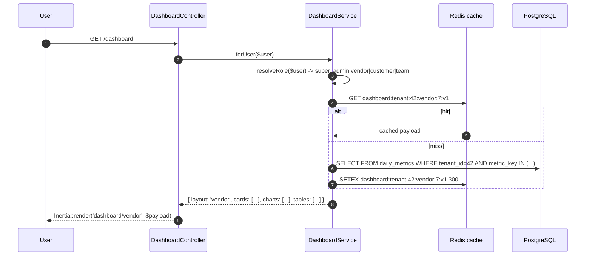
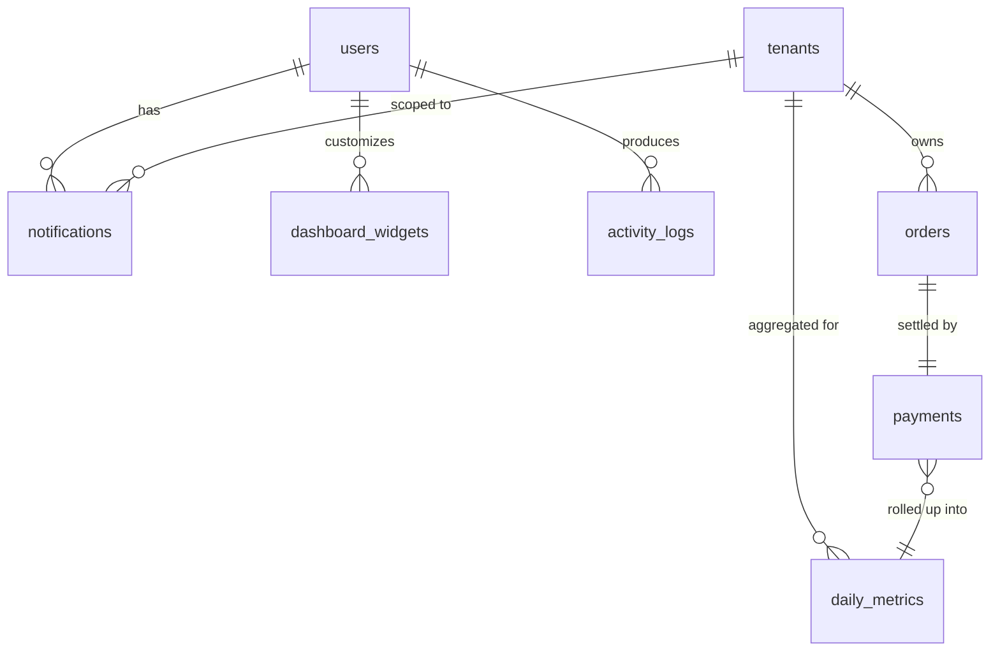
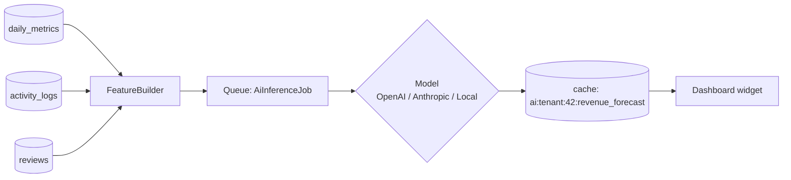

# Dashboard Module — Multi-Vendor SaaS Marketplace

A complete architecture for the dashboard module that serves four
distinct audiences from one codebase, scales to 100k+ users and
millions of orders, and stays fast by reading from pre-aggregated
rollup tables instead of hammering the OLTP store.

This document covers:

1. Dashboard overview & goals
2. Role-specific dashboards (super-admin / vendor / customer / team)
3. Widget catalog
4. Analytics pages
5. Notifications center
6. Activity timeline
7. UI/UX layout
8. Database design
9. API contract
10. Performance & caching strategy
11. Security & tenant isolation
12. Future AI features

---

## 1. Dashboard overview

### Purpose

The dashboard is the **operational cockpit** of the platform. Every
role's first interaction after login is here. Different audiences see
different data, but the architecture (data layer, widget protocol,
caching, charts) is shared.

### Business goals

- **Vendors**: see revenue → know where to invest selling effort → log in daily.
- **Customers**: see their entitlements → access their downloads → reduce support load.
- **Super admins**: spot a vendor stuck in approval → fix it before they churn.
- **Team members**: see their assigned work → reduce coordination overhead.

### UX goals

- **Time-to-first-byte < 200ms** for the dashboard route. Achieved by reading from `daily_metrics`, not joining 5 OLTP tables.
- **Mobile-first**: every widget collapses gracefully to a single-column view.
- **Skeleton-driven**: cards render their shape immediately while data hydrates.
- **Drill-down everywhere**: every stat card is a link into the detailed page.

### Conversion goals

- A vendor hitting their plan limit sees an "Upgrade" prompt embedded in the widget that exceeded it (Pro/Scale plan in [PlanGate](../app/Domain/Plans/PlanGate.php)).
- A super admin landing on the dashboard sees "X vendors awaiting approval" as the **first card** when X > 0.

---

## 2. Role-specific dashboards

The same Inertia route (`/dashboard`) returns a different React page
based on the user's primary role. `DashboardService` does the routing:



### 2.1 Super-Admin dashboard

Platform-wide view. Only visible if `$user->hasRole('super-admin')`.

**Hero stats (4 cards)**
- Total revenue (lifetime + this month, with % delta)
- Active vendors (this month, with churn rate)
- Total customers
- Pending approvals (clickable, drills into `/admin/approvals`)

**Charts**
- Revenue trend (last 90 days, daily)
- New vendor signups (last 30 days, daily)
- Platform GMV by category (donut)

**Tables**
- Top 10 vendors by revenue (last 30 days)
- Recent support tickets
- Recent vendor signups awaiting approval

**Quick actions**
- Approve vendor
- Create coupon
- Run reconciliation
- Issue announcement

### 2.2 Vendor dashboard

Scoped to a single tenant. The `BelongsToTenant` global scope handles isolation automatically.

**Hero stats**
- Revenue this month (with last-month delta)
- Total sales (lifetime)
- Pending withdrawal (links to `/payouts`)
- Conversion rate (visits → purchases, last 30 days)

**Charts**
- Revenue trend (last 30 days)
- Product performance (top 5 SKUs by revenue, bar chart)
- Visitor funnel (views → adds-to-cart → purchases)

**Tables**
- Recent orders (10 latest)
- Top products (by units sold this month)
- Recent reviews (with star rating + sentiment)
- Refund requests pending action

**Quick actions**
- Add product
- Create coupon
- Request payout
- Reply to oldest pending review

### 2.3 Customer dashboard

Buyer-centric. Read-only for the most part.

**Hero stats**
- Total spent (lifetime)
- Active subscriptions count
- Wallet balance (from [Wallet](../app/Models/Wallet.php))
- Pending support requests

**Tiles / lists**
- Purchased products (with "Download" CTA per row)
- Active subscriptions (next billing date, "manage" link)
- Recent orders
- Favorites
- Recently viewed

### 2.4 Team-Member dashboard

For users belonging to a tenant team (workspace).

**Hero stats**
- Assigned tasks (open count)
- Tickets awaiting response (open count)
- Notifications (unread count)
- This week's activity (events count)

**Lists**
- My open tasks
- My recent activity
- Team activity feed (last 24h)

---

## 3. Widget catalog

Every widget is a self-contained React component that receives a
typed `payload` prop. The protocol:

```ts
interface WidgetPayload<T = unknown> {
  type: 'stat' | 'chart' | 'table' | 'list' | 'quick-actions';
  key: string;                         // unique within layout
  title: string;
  data: T;
  meta?: { sparkline?: number[]; delta?: { value: number; period: string }; cta?: { href: string; label: string }; };
}
```

### Statistics cards (`type: 'stat'`)

```ts
data: { value: number | string; format: 'money' | 'integer' | 'percent'; currency?: string; }
```

Renders the big number + sparkline (last 14 days) + delta vs previous
period. Drillable via `meta.cta`.

### Charts (`type: 'chart'`)

```ts
data: { kind: 'line' | 'bar' | 'donut' | 'area'; series: { name: string; points: [string, number][] }[]; }
```

Built on recharts (already a transitive dep of shadcn). Server hands
us pre-bucketed daily series — the client doesn't aggregate.

### Tables (`type: 'table'`)

```ts
data: { columns: { key: string; label: string; align?: 'left'|'right'; format?: string }[]; rows: Record<string, unknown>[]; }
```

Defaults to 10 rows. "View all" link in `meta.cta`.

### Quick actions (`type: 'quick-actions'`)

```ts
data: { actions: { label: string; href: string; icon: string; primary?: boolean }[] }
```

---

## 4. Analytics pages

Deep-dive sections sit at `/analytics/*`. Each is a Container-based
Inertia page that uses the same widget protocol but with date-range
controls and CSV export.

### Revenue analytics (`/analytics/revenue`)

Time bucket toggles: day / week / month / year. Backed by
`daily_metrics` aggregations rolled up at read time.

### Vendor analytics (`/analytics/vendors`)

Best/worst performers (sortable). Vendor growth chart. Churn cohort
heatmap.

### Customer analytics (`/analytics/customers`)

Retention curve. Churn rate by cohort. Lifetime value distribution.
RFM segmentation (recency / frequency / monetary).

---

## 5. Notifications center

### Database row

```
notifications
  id              bigint PK
  tenant_id       bigint FK NULL          -- null for platform-wide
  user_id         bigint FK
  type            varchar(64)             -- e.g. order.created, vendor.approved
  level           enum('info','success','warning','critical')
  title           varchar(255)
  body            text NULL
  action_url      varchar(255) NULL
  metadata        json NULL
  read_at         timestamp NULL
  created_at, updated_at
  INDEX (user_id, read_at, created_at)
  INDEX (tenant_id, type, created_at)
```

### Delivery channels

| Channel | When | Implementation |
|---|---|---|
| Database row | Always | `Notification::create(...)` |
| Real-time toast | If user has an active session | Laravel Reverb (websockets) — broadcast on the `private-user.{id}` channel |
| Email | If user enabled it for this `type` | Queued mailer |
| Mobile push (future) | Opt-in | FCM / APNs adapter |

### Priority levels

- `critical`: red bell + sound + email regardless of preferences. Examples: payment failure, security alert, fraud flag.
- `warning`: amber bell. Examples: plan limit approaching, vendor approval pending action.
- `success`: green. Order delivered, payout sent.
- `info`: default. Default channel: db + real-time only.

---

## 6. Activity timeline

Reuses the existing [activity_logs](../database/migrations/2026_05_23_120000_create_activity_logs_table.php) table from the auth security batch. The dashboard widget paginates that table filtered by `user_id` (for personal feeds) or `tenant_id` (for tenant-wide feeds visible to admins).

### Tracked event taxonomy

| Domain | Event | Source |
|---|---|---|
| auth | `auth.login`, `auth.logout`, `auth.login.failed`, `password.changed`, `2fa.enabled` | Existing |
| orders | `order.created`, `order.paid`, `order.refunded`, `order.cancelled` | New listener on PaymentCompleted / PaymentRefunded |
| products | `product.created`, `product.updated`, `product.deleted` | Model observer |
| vendors | `vendor.registered`, `vendor.approved`, `vendor.suspended` | Admin actions |
| payouts | `payout.requested`, `payout.completed`, `payout.failed` | Service |
| support | `ticket.opened`, `ticket.replied`, `ticket.resolved` | Service |
| reconciler | `reconciler.repaired_order`, `reconciler.ledger_drift` | Already implemented |

A new event type is one line added to a service. No schema change.

---

## 7. UI/UX layout

### App shell

```
┌────────────────────────────────────────────────────────────────┐
│  ☰  ▢ StoreProject  /  Vendor Dashboard          🔍  🌓  🌐  👤 │ ← Top bar
├──────────┬─────────────────────────────────────────────────────┤
│ ⌂ Home   │  Welcome back, Maya                                  │
│ 📦 Prods │  ┌─────────┬─────────┬─────────┬─────────┐           │
│ 🛒 Orders│  │ Revenue │ Sales   │ Pending │ Conv. % │           │ ← Stats row
│ 💰 Payout│  └─────────┴─────────┴─────────┴─────────┘           │
│ 📊 Stats │                                                       │
│ ⚙ Settings │  ┌──────────────────────────────┬────────────────┐  │
│          │  │  Revenue trend chart         │ Quick actions  │  │ ← Main grid
│          │  └──────────────────────────────┴────────────────┘  │
│          │  ┌──────────────────────────────┬────────────────┐  │
│ 🔔 Alerts │  │  Recent orders               │ Top products   │  │
│          │  └──────────────────────────────┴────────────────┘  │
└──────────┴─────────────────────────────────────────────────────┘
```

### Layout primitives

- **Sticky sidebar** — collapsible to icon-only at `< lg`, hidden behind a hamburger at `< md`. shadcn `Sidebar` primitive (already integrated).
- **Top bar** — sticky, scroll-aware backdrop blur. Contains breadcrumb / page title, search, theme toggle, locale switcher, user menu, notifications bell.
- **Content area** — `Container` with the responsive max-width steps already in place (`max-w-6xl xl:max-w-7xl 2xl:max-w-[1400px]`).

### Dark mode

Handled by the existing `useAppearance()` hook + CSS tokens. Every
widget uses semantic tokens (`bg-card`, `text-foreground`,
`border-border`) so no per-widget dark-mode CSS is needed.

### Glassmorphism

Used sparingly on the top bar (`bg-background/80 backdrop-blur-xl`)
and on hero "today's metric" overlays. Not on cards (hurts legibility).

---

## 8. Database design

Three new tables, plus extensions to existing ones.

### 8.1 `notifications`

See §5.

### 8.2 `daily_metrics` — the rollup table

```
daily_metrics
  id              bigint PK
  tenant_id       bigint FK NULL                -- null for platform-wide metrics
  metric_key      varchar(64)                   -- 'revenue_cents', 'orders_count', etc.
  dimension_key   varchar(64) NOT NULL DEFAULT 'total'   -- 'total', 'category:42', 'product:7'
  value           bigint NOT NULL
  currency        char(3) NULL
  recorded_on     date
  created_at, updated_at
  UNIQUE (tenant_id, metric_key, dimension_key, recorded_on)
  INDEX (metric_key, recorded_on)
  INDEX (tenant_id, recorded_on)
```

**Why**: querying `orders` directly for "last 90 days revenue per tenant" is a multi-million-row scan. Reading from `daily_metrics` is `90` rows. Backed by a nightly aggregator (§10).

### 8.3 `dashboard_widgets` — per-user layout (optional, future)

```
dashboard_widgets
  id              bigint PK
  user_id         bigint FK
  layout          varchar(32)              -- 'super-admin', 'vendor', etc.
  widget_key      varchar(64)
  position        smallint                 -- ordering within layout
  size            varchar(16)              -- 'sm'|'md'|'lg'
  hidden          boolean DEFAULT false
  config          json NULL                -- per-widget customization
  UNIQUE (user_id, layout, widget_key)
```

Lets users rearrange / hide widgets. Without a row, the default
layout is used.

### 8.4 Relationships diagram



### 8.5 Indexes & PostgreSQL particulars

- `daily_metrics` partitioned by `recorded_on` (monthly) for very large deployments. Single-table works fine up to ~50M rows.
- `notifications.read_at` is queried often (unread badge) — covered by `(user_id, read_at, created_at)`.
- Use PostgreSQL's `BIGINT` consistently for money (`*_cents`).
- Use `JSONB` (not `JSON`) for `metadata` columns — supports `@>` containment queries for filtering.

---

## 9. API design

REST shape, namespaced under `/api/v1`. Auth via Sanctum tokens.
Tenant resolved from token's `tenant_id` claim or the `X-Tenant`
header (super-admin only).

### Dashboard root

```
GET /api/v1/dashboard
Auth: Bearer <token>

200 OK
{
  "layout": "vendor",
  "user": { "id": 42, "name": "Maya", "role": "vendor" },
  "widgets": [
    {
      "type": "stat",
      "key": "revenue_month",
      "title": "Revenue this month",
      "data": { "value": 48392, "format": "money", "currency": "USD" },
      "meta": {
        "sparkline": [120, 240, 180, ...],
        "delta": { "value": 23.4, "period": "previous_month" },
        "cta": { "href": "/analytics/revenue", "label": "View report" }
      }
    },
    { "type": "chart", "key": "revenue_trend", ... },
    { "type": "table", "key": "recent_orders", ... }
  ]
}
```

### Analytics

```
GET /api/v1/analytics/revenue?from=2026-01-01&to=2026-03-31&bucket=day
GET /api/v1/analytics/vendors?sort=revenue&direction=desc&limit=10
GET /api/v1/analytics/customers?segment=churned&cohort=2025-12
```

All accept:
- `from`, `to` ISO date
- `bucket` = `day | week | month`
- `limit`, `cursor` (cursor-based pagination)
- `format=csv` for export (returns 202 + signed URL when payload is large)

### Notifications

```
GET    /api/v1/notifications?status=unread&limit=25
PATCH  /api/v1/notifications/{id}/read
POST   /api/v1/notifications/read-all
DELETE /api/v1/notifications/{id}
```

Response wraps with cursor pagination:

```
{ "data": [...], "next_cursor": "eyJpZCI6MTIzfQ==", "unread_count": 7 }
```

### Errors

Consistent shape:

```
422 { "error": { "code": "validation_failed", "message": "...", "fields": {...} } }
403 { "error": { "code": "forbidden", "message": "..." } }
402 { "error": { "code": "plan_limit_reached", "message": "...", "limit": "products" } }
```

---

## 10. Performance optimization

### Read path (target: < 200ms)

1. **Layer 1 — Redis cache (5min TTL)**. Key: `dashboard:tenant:{t}:role:{r}:user:{u}:v{n}`. Buster `v{n}` lives in `cache:dashboard:version` so a deploy can invalidate everything by bumping it.
2. **Layer 2 — daily_metrics rollups**. The aggregator (§10.3) runs nightly so 99% of dashboard reads hit this table.
3. **Layer 3 — Live queries for "today"**. Only the current-day slice is computed live; everything else is pre-aggregated.

### Write path

Dashboards never write. They emit events when *other* paths write:
- `OrderPaid` event → `RollupTodaysRevenue` listener bumps the current day's row in `daily_metrics`.
- `VendorRegistered` → invalidates the super-admin cache.

### Aggregator schedule

```php
// routes/console.php
Schedule::command('metrics:rollup --days=2')->dailyAt('02:00');   // catch yesterday
Schedule::command('metrics:rollup --today')->everyFifteenMinutes(); // current-day rolling
```

`--today` is incremental; `--days=N` recomputes the last N days
(idempotent thanks to `UNIQUE(tenant_id, metric_key, dimension_key, recorded_on)`).

### Background jobs

- `RollupDailyMetricsJob` — chunked over tenants, 200 per chunk.
- `SendDigestEmailJob` — weekly summary for vendors.
- `RecomputeCustomerRfmJob` — monthly, segmentation.
- `PurgeOldNotificationsJob` — daily, hard-deletes `read_at < now() - 90d`.

### Lazy loading on the client

- Initial Inertia render: hero stats only (above the fold).
- Charts / tables hydrate via `Inertia::lazy(...)` on visible.
- The notification bell uses `Inertia::optional()` so it never blocks first paint.

### Scale envelope

| Metric | Target | How |
|---|---|---|
| 100k+ users | concurrent | Sanctum token sessions are stateless; Redis backs sessions only when used |
| 10k+ vendors | active | daily_metrics indexed per-tenant; queries hit at most a few hundred rows |
| Millions of orders | total | Never queried directly from dashboard; rolled into daily_metrics |
| < 200ms p50 | dashboard endpoint | Cached payload + rollup reads |
| < 500ms p99 | dashboard endpoint | Cache miss + rollup read still avoids OLTP joins |

---

## 11. Security

### RBAC

- Spatie roles already wired: `super-admin`, `admin`, `vendor`, `customer`, `team-member`.
- `DashboardService::resolveRole($user)` checks `hasRole()` in priority order. Adding a new role is one line.
- Every analytics endpoint has a corresponding Gate (`@can('view-revenue-analytics')`).

### Tenant isolation

- Existing `BelongsToTenant` trait + global scope guards every model. Cross-tenant reads are not possible without an explicit `withoutTenantScope()`.
- `DashboardService` injects the tenant context from `TenantContext::current()`. It never accepts a tenant id from the request body or query string for non-super-admin roles.
- Super-admin endpoints accept `X-Tenant: <slug>` to impersonate a tenant for support purposes. Every such read writes an `activity_logs` row with `event = 'support.impersonated_tenant'`.

### Audit logs

Already covered by `activity_logs`. Dashboard writes one row per
"impersonate" / "export" / "destructive admin action".

### Data protection

- PII (email, IP, user agent) is hashed in metric snapshots when used for non-personal analytics (e.g. RFM segments use hashed customer ids).
- CSV exports go through a signed-URL handler, not a direct stream — links expire after 24h.
- Webhook payloads in `webhook_events.payload` are redacted of card pan / cvc before storage (Stripe never sends these, but a defensive `redactSensitive()` runs on every insert).

### Access control matrix

| Resource | super-admin | admin | vendor | customer | team-member |
|---|---|---|---|---|---|
| Platform metrics | ✅ | ✅ (read) | ❌ | ❌ | ❌ |
| Own tenant metrics | ✅ (any) | ✅ (own) | ✅ (own) | ❌ | ❌ |
| Cross-tenant impersonate | ✅ | ❌ | ❌ | ❌ | ❌ |
| Own orders | ✅ | ✅ | ✅ | ✅ | ❌ |
| Own tasks | ✅ | ✅ | ✅ | ❌ | ✅ |
| Notifications | ✅ (own) | ✅ (own) | ✅ (own) | ✅ (own) | ✅ (own) |

---

## 12. Future AI features

Designed as separate widgets that opt in via feature flag, so the
core dashboard ships without an AI dependency.

### Widget catalog

| Widget | Type | Inputs | Output |
|---|---|---|---|
| `revenue_forecast` | chart | last 90d daily revenue + seasonality features | next 30d revenue projection + confidence interval |
| `sales_prediction` | stat | product SKU + history | predicted units sold next 7d |
| `vendor_score` | stat | 30+ vendor signals (review velocity, refund rate, response time) | 0–100 score + explanation |
| `customer_insights` | list | RFM segments + recent activity | personalized "next best action" per customer |
| `product_recommendations` | list | viewed/cart products + similar buyers | 5 cross-sell suggestions |
| `business_assistant` | chat | natural-language question | answer with data citations from `daily_metrics` |

### Architecture



- Inference is **always queued**. Dashboard never blocks on a model
  call; it shows the last cached prediction with a "last updated"
  timestamp.
- Predictions older than 24h trigger a re-inference on next dashboard
  load.
- A `ModelGateway` interface abstracts the provider so we can swap
  between OpenAI / Anthropic / a self-hosted model without changing
  the widgets.

### Privacy

- Customer PII is never sent to a third-party model. Features are
  bucketed / hashed before leaving the database.
- Tenants opt in per AI widget. A super-admin setting controls the
  default.

---

## 13. File map (this implementation)

| File | Role |
|---|---|
| `database/migrations/2026_06_06_120001_create_notifications_table.php` | Notification rows |
| `database/migrations/2026_06_06_120002_create_daily_metrics_table.php` | Rollup table |
| `app/Models/Notification.php` | Notification Eloquent |
| `app/Models/DailyMetric.php` | Metric row Eloquent |
| `app/Domain/Dashboard/DashboardService.php` | Role-aware payload builder |
| `app/Domain/Dashboard/MetricsAggregator.php` | Nightly + incremental rollup |
| `app/Domain/Dashboard/NotificationService.php` | Create / mark read / paginate |
| `app/Http/Controllers/DashboardController.php` | Inertia entry point |
| `app/Http/Controllers/Api/V1/DashboardController.php` | REST endpoint for SPA / mobile |
| `app/Console/Commands/MetricsRollup.php` | `php artisan metrics:rollup` |
| `resources/js/pages/dashboard/super-admin.tsx` | Layout + widgets |
| `resources/js/pages/dashboard/vendor.tsx` | Layout + widgets |
| `resources/js/pages/dashboard/customer.tsx` | Layout + widgets |
| `resources/js/pages/dashboard/team.tsx` | Layout + widgets |
| `resources/js/components/widgets/*` | Shared widget primitives |
| `tests/Feature/Dashboard/*` | Service + RBAC + rollup tests |
