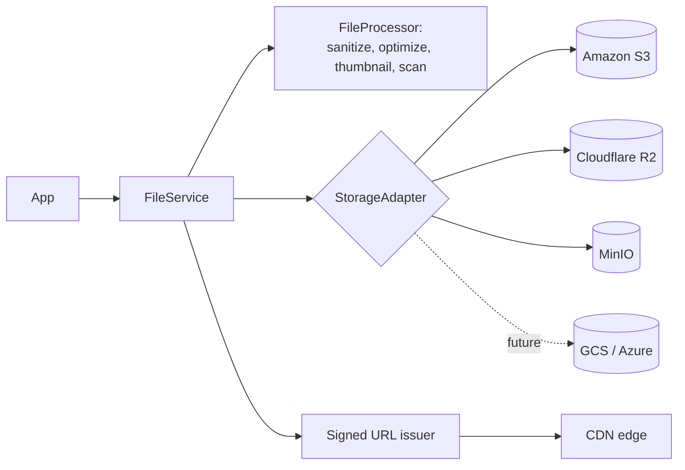
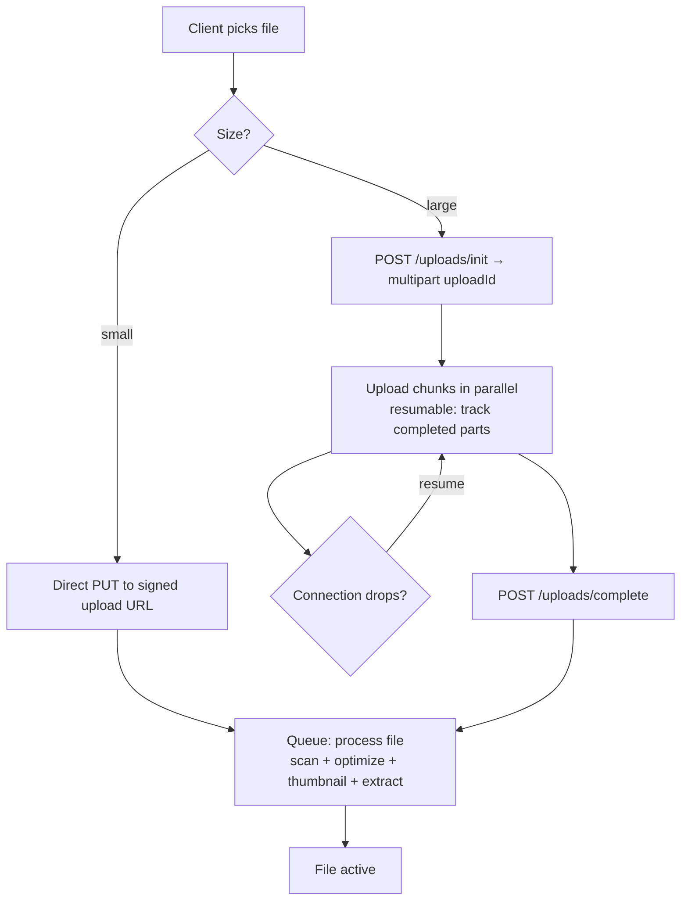
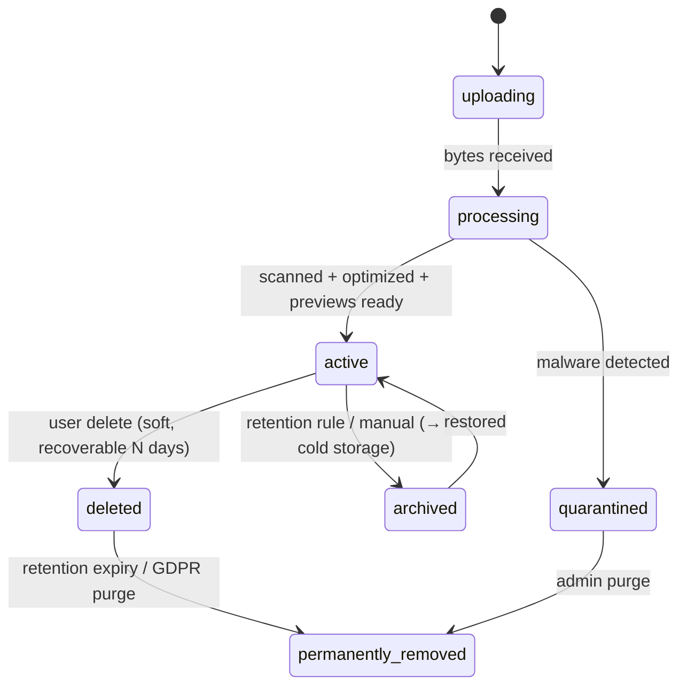

# File Manager Module — Multi-Tenant Multi-Vendor SaaS

A cloud-native file management platform: a storage-provider abstraction
(S3 / R2 / MinIO), chunked + resumable uploads, folders, versioning,
sharing with granular access control, previews, a media library,
search, per-plan quotas, and AI file intelligence.

This is the **unified storage layer** that consolidates the file
handling scattered across modules. Today each module rolls its own
attachment table + signed-URL logic; this doc defines one `files`
engine they all reference, while keeping their domain links.

It builds on real shipped infrastructure:

- **File pipeline** ← the `BrandingService` already ships `sanitizeSvg()`, `optimizeRaster()` (GD resize/re-encode, `MAX_RASTER_DIMENSION`), and signed `temporaryUrl()` — the proven core of upload processing + secure download.
- **Filesystem disks** ← `config/filesystems.php` has `local` / `public` / `s3` configured.
- **Per-module file specs** ← projects §8 (`project_files`), marketplace (`product_downloads` / `product_media`), messaging §7 (`message_attachments`), support §19 (`support_ticket_attachments`).

Composes other modules:

- **Quotas** ← [`billing-architecture.md`](billing-architecture.md) §2 + `PlanGate` (`storage_mb` is already a plan limit).
- **AI OCR / categorization / dedup / summaries** ← [`ai-architecture.md`](ai-architecture.md) §12.
- **Search** ← [`ai-architecture.md`](ai-architecture.md) §11 (semantic) + tsvector.
- **Storage analytics** ← [`analytics-architecture.md`](analytics-architecture.md).

Follows the shipped/planned convention of the other fourteen docs.

## Table of contents

1. [Overview](#1-overview)
2. [Storage architecture](#2-storage-architecture)
3. [File upload system](#3-file-upload-system)
4. [Supported file types](#4-supported-file-types)
5. [Folder management](#5-folder-management)
6. [File organization](#6-file-organization)
7. [File sharing](#7-file-sharing)
8. [Access control](#8-access-control)
9. [File versioning](#9-file-versioning)
10. [File preview system](#10-file-preview-system)
11. [Media library](#11-media-library)
12. [Search system](#12-search-system)
13. [Project file management](#13-project-file-management)
14. [Product asset management](#14-product-asset-management)
15. [Messaging attachments](#15-messaging-attachments)
16. [Support ticket attachments](#16-support-ticket-attachments)
17. [AI-powered file features](#17-ai-powered-file-features)
18. [Storage quotas](#18-storage-quotas)
19. [Security](#19-security)
20. [File lifecycle management](#20-file-lifecycle-management)
21. [Database design](#21-database-design)
22. [API design](#22-api-design)
23. [Frontend architecture](#23-frontend-architecture)
24. [Performance](#24-performance)
25. [Multi-tenant storage](#25-multi-tenant-storage)
26. [Analytics](#26-analytics)
27. [Compliance](#27-compliance)
28. [Scalability](#28-scalability)

### Status snapshot (today)

| Layer | Shipped | Planned in this doc |
|---|---|---|
| **Upload processing** | `BrandingService::optimizeRaster()` (GD resize/re-encode) + `sanitizeSvg()` | generalized `FileProcessor` (any type), chunked + resumable upload |
| **Secure download** | `Storage::temporaryUrl()` signed URLs (branding) | unified signed-URL issuer + download controls |
| **Disks** | `local` / `public` / `s3` (filesystems config) | provider adapter (S3 / R2 / MinIO + future GCS/Azure) |
| **Per-module files** | speced: projects §8, marketplace, messaging §7, support §19 | unified `files` table they reference |
| **Quotas** | `storage_mb` plan limit (billing §2) + `PlanGate` | quota enforcement + monitoring |
| **Tables** | none dedicated | all `files`/`folders`/`file_*`/`storage_*` tables |

> The hard parts of file handling — SVG sanitization, raster optimization, signed URLs — are already shipped and proven in `BrandingService`. This doc lifts them into a general engine and adds the management layer (folders, versions, sharing, quotas, lifecycle) that turns scattered attachments into a real file manager.

---

## 1. Overview

### Business objectives

- **One source of truth** for every byte: product assets, project deliverables, chat attachments, support evidence — managed, versioned, access-controlled, searchable.
- **Secure delivery** of paid digital goods (the marketplace sells downloads) without leaks.
- **Quota-driven monetization**: storage is a plan dimension (billing §2) — a margin lever + upgrade trigger.
- **Compliance**: GDPR export/delete, retention, audit — table-stakes for enterprise customers.

### Storage strategy



- Private buckets only; public access is always via a **signed URL** (short expiry), never a public object.
- Per-tenant key prefix `tenants/{tenant}/...` — isolation in the key space + the DB scope.
- CDN in front for read delivery (§24).

### File lifecycle

Upload → Processing → Active → Archived → Deleted (soft) → Permanently
removed (§20), driven by retention policies.

### Integration map

| Module | File touchpoint |
|---|---|
| Projects | Project deliverables/assets = files in a project folder (§13) |
| Tasks | Task attachments reference files |
| Marketplace | Product images/media + paid downloads (§14) |
| CRM | Attachments on communications |
| Messaging | Chat attachments (§15) |
| Support | Ticket evidence files (§16) |
| AI | OCR, categorization, dedup, summaries (§17) |
| Analytics | Storage usage, upload/download activity (§26) |
| Billing | Storage quota per plan (§18) |

---

## 2. Storage architecture

A provider-abstracted layer (the gateway pattern, like payments §5 +
ai §1):

```php
interface StorageAdapter
{
    public function key(): string;                          // 's3','r2','minio'
    public function put(string $path, $contents, array $opts = []): void;
    public function get(string $path): string;
    public function delete(string $path): void;
    public function temporaryUrl(string $path, \DateTimeInterface $expiry): string;
    public function multipartInit(string $path): string;    // chunked upload
    public function multipartPart(string $uploadId, int $part, string $chunk): string;
    public function multipartComplete(string $uploadId, array $parts): void;
}
```

S3 / R2 / MinIO are all S3-compatible → one `S3CompatibleAdapter` with
different endpoints/credentials covers them; GCS/Azure are future
adapters behind the same interface. The active provider is per-tenant
config (§25), resolved by a `StorageManager`. The shipped Laravel
`s3` disk is the first adapter implementation.

```php
storage_providers
  id, tenant_id (nullable = platform default)
  driver enum('s3','r2','minio','gcs','azure','local')
  config jsonb (encrypted)   // endpoint, region, bucket, keys
  is_active, is_default
```

---

## 3. File upload system



- **Single / multiple / drag-drop** — the React upload widget (§23).
- **Chunked + resumable** — large files split into parts (multipart upload to S3-compatible storage); completed parts tracked in `file_processing_jobs` so an interrupted upload resumes from the last part, not the start. Handles large files + slow/flaky connections.
- **Direct-to-storage** — the client uploads straight to the storage provider via a signed upload URL (the app issues the URL; bytes never proxy through PHP) — critical for scale + large files.
- **Post-upload** — a queued job scans (ClamAV), optimizes (raster via the shipped `optimizeRaster`), sanitizes (SVG), generates previews/thumbnails, and extracts metadata + (for AI) text.

---

## 4. Supported file types

Images, video, audio, PDF, Word, Excel, ZIP, source code, design files,
API specs, project deliverables, custom types.

```php
final class FileTypePolicy
{
    // MIME allowlist + per-tenant extensions; size caps by type + plan.
    public const CATEGORIES = [
        'image'    => ['image/png','image/jpeg','image/webp','image/gif','image/svg+xml','image/avif'],
        'video'    => ['video/mp4','video/webm','video/quicktime'],
        'audio'    => ['audio/mpeg','audio/wav','audio/ogg'],
        'document' => ['application/pdf','application/msword','...docx','...xlsx','text/plain','text/markdown'],
        'archive'  => ['application/zip','application/x-tar','application/gzip'],
        'code'     => ['text/x-python','application/json','text/javascript','...'],
        'design'   => ['image/vnd.adobe.photoshop','application/postscript','...'],
    ];
}
```

Validation: MIME (sniffed, not just extension) + extension allowlist +
size cap (per type + per plan) + content scan. SVGs always sanitized
(shipped `sanitizeSvg`). Unknown/dangerous types (executables, scripts)
rejected.

---

## 5. Folder management

```php
folders
  id, tenant_id, owner_id
  parent_id (nullable → folders, nested)
  name, path                       // materialized path 'a/b/c' for fast subtree queries
  context_type, context_id (nullable)  // polymorphic: Project, Vendor, …
  color, icon
  softDeletes, timestamps
  unique (tenant_id, parent_id, name)   // no dup names in a folder
  index (tenant_id, parent_id), index (context_type, context_id)
```

Create / rename / move / copy / delete, nested hierarchy. A
**materialized path** (`path` column) makes "everything under folder X"
a single `WHERE path LIKE 'a/b/%'` instead of recursive queries; moving
a folder rewrites the subtree's paths (queued for deep trees). Copy
duplicates the folder + file references (copy-on-write: the underlying
storage object is shared until edited, or duplicated per policy).

---

## 6. File organization

| Mechanism | Storage |
|---|---|
| **Tags** | `file_tags` + pivot (many-to-many) |
| **Categories** | `file_categories` (type-based: image/doc/...) |
| **Collections** | `file_collections` — curated sets (cross-folder, like playlists) |
| **Favorites** | per-user star flag |
| **Recent files** | from `file_audit_logs` (last accessed) |

AI auto-tagging + auto-categorization (§17) populates tags/categories on
upload; the user can override. Collections let a user group files
across folders (e.g. "Q3 marketing assets") without moving them.

---

## 7. File sharing

```php
file_shares
  id, tenant_id, file_id (or folder_id), created_by_id
  type enum('private','team','project','public_link')
  token (unique, for public links)
  password_hash (nullable)         // password-protected
  expires_at (nullable)            // expiring links
  max_downloads (nullable), download_count
  permission enum('view','download','edit')
  is_active, created_at
  index (token), index (file_id)
```

| Share type | Behavior |
|---|---|
| Private | Owner only |
| Team sharing | Shared with a team (project members / tenant team) |
| Project sharing | Visible to project members (projects §7 roles) |
| Public link | Tokenized URL, no auth — `/s/{token}` |
| Password-protected | Public link + password gate |
| Expiring | Link auto-expires at `expires_at` |
| Download restrictions | `max_downloads` cap, view-only (no download), watermark option |

A public-link download still goes through a signed-URL redirect (the
token grants a short-lived signed URL after password/expiry checks) —
the storage object is never directly public.

---

## 8. Access control

Layered, like the rest of the platform:

```php
folder_permissions / file_permissions
  id, tenant_id, folder_id|file_id
  subject_type enum('user','team','role'), subject_id
  permission enum('view','download','edit','manage')
  granted_by_id, created_at
```

- **RBAC** — platform role gates the route; resource permission gates the file/folder.
- **Tenant isolation** — `BelongsToTenant` global scope + key prefix.
- **Project-based** — a file in a project folder inherits project-member permissions (projects §7).
- **Folder → file inheritance** — a file inherits its folder's permissions unless overridden (explicit `file_permissions` win).
- **Granular** — view / download / edit / manage, per user/team/role.

Resolution: explicit file permission → folder permission (walk up the
path) → context (project membership) → owner → deny. Cached per
(user, file) for the request.

---

## 9. File versioning

```php
file_versions
  id, tenant_id, file_id
  version int, storage_path        // each version is its own object
  size_bytes, checksum_sha256
  uploaded_by_id, note
  created_at
  unique (file_id, version)
  index (file_id, version)
```

- **Version history** — each upload to an existing file creates a new `file_versions` row + storage object; `files.current_version_id` points at the latest.
- **Restore** — set `current_version_id` to an older version (non-destructive; the "restore" is itself a version pointer change, auditable).
- **Compare** — text/code diff between versions; image side-by-side.
- **Version notes** — "what changed".
- Retention: keep N versions or all (per-plan/policy); old versions move to cheaper cold storage (§20).

---

## 10. File preview system

Previews generated by a queued `GeneratePreview` job, stored alongside
the file:

| Type | Preview |
|---|---|
| Images | Resized thumbnails (multiple sizes) via the shipped `optimizeRaster` |
| PDF | First-page image (imagick) + in-browser PDF.js viewer |
| Video | Poster frame + HLS transcode (future) for streaming |
| Audio | Waveform image + inline player |
| Text / code | Syntax-highlighted inline (Shiki), < 256KB |
| Office docs | Server-side render to PDF → preview (LibreOffice headless) or a viewer embed |

`file_previews` stores generated preview paths per file per size.
Previews are themselves signed-URL + CDN-served. A missing preview
falls back to a type icon.

---

## 11. Media library

A media-focused view over image/video/icon/asset files — for marketing,
product, and brand assets.

- **Galleries** — grid of images/videos with thumbnails, filterable by collection/tag.
- **Brand assets** — logos/colors (ties to `BrandingService`).
- **Marketing + product assets** — reusable across listings, landing pages, campaigns.
- Reuses `files` + `file_collections`; the media library is a specialized frontend (§23) over image/video files, not a separate store.

---

## 12. Search system

Search files, folders, tags, content, metadata.

- **Full-text** — `tsvector` over file name + extracted text content (from §17 OCR/extraction) + tags; GIN-indexed.
- **Semantic / AI** — embeddings (ai §11) over extracted content for "find the contract that mentions auto-renewal".
- **Metadata** — filter by type, size, date, owner, tags, folder.
- **Permission-filtered** — results restricted to files the user can access, after ranking.

`file_metadata` holds extracted attributes (dimensions, duration, page
count, EXIF, extracted text) feeding both search + display.

---

## 13. Project file management

Project files (projects §8 `project_files`) become files in a
project-context folder (`folders.context = Project`). Integration:
projects, tasks, milestones, deliverables. A project gets an
auto-created root folder; deliverables are files tagged + versioned;
task attachments reference files. The projects doc owns the *project*
semantics (client-visible flag, deliverable category); this module owns
the *file* (storage, versions, previews, signed URLs). `project_files`
becomes a thin link table (project_id + file_id + category) over the
unified `files` table.

---

## 14. Product asset management

Marketplace assets (marketplace §14 `product_media` / `product_downloads`):
product images, screenshots, demo videos, source files, paid downloads,
documentation.

- **Public-facing media** (images/videos) — signed-URL + CDN, shown on product pages.
- **Paid downloads** — private files; access granted only against a paid `order_item` (marketplace §8 fulfilment); download via short-lived signed URL with per-purchase `max_downloads`.
- `product_media` / `product_downloads` reference the unified `files` table; the marketplace owns purchase-gating, this module owns secure delivery + versioning (a v2 of source code is a new file version).

---

## 15. Messaging attachments

Chat attachments (messaging §7 `message_attachments`): images,
documents, voice notes, shared in project discussions. The attachment
references a `file`; the messaging module owns the conversation link +
membership-based access, this module owns storage + preview + signed
download. Voice notes are audio files with a waveform preview (§10).

---

## 16. Support ticket attachments

Support evidence (support §19 `support_ticket_attachments`):
screenshots, logs, reports, documents, dispute evidence. Reference the
`files` table; support owns ticket-visibility access control, this
module owns secure storage + scanning (especially important — support
files come from untrusted external reporters, so ClamAV + sanitization
matter most here).

---

## 17. AI-powered file features

(Engine owned by [`ai-architecture.md`](ai-architecture.md) §12, §17.)

| Feature | Description |
|---|---|
| File categorization | Auto-classify into category/folder on upload |
| Tag generation | Suggest tags from content |
| Duplicate detection | Checksum (exact) + perceptual hash (near-dup images) + embedding similarity (semantic dups) → flag/dedupe |
| Content extraction | Pull text from docs (for search + summaries) |
| OCR | Text from images/scanned PDFs → searchable |
| AI search | Semantic search (§12) |
| Document summaries | Summarize a long document on demand |

Extraction + OCR run in the post-upload processing job → `file_metadata`
(text) + the search index. AI features credit-metered (ai §17),
tenant-opt-in. Dedup saves storage (a quota + cost lever).

---

## 18. Storage quotas

```php
storage_quotas
  id, tenant_id, scope enum('tenant','vendor','team','project','plan')
  scope_id (nullable), limit_bytes
  
storage_usage
  id, tenant_id, scope, scope_id
  used_bytes, file_count, updated_at
  unique (tenant_id, scope, scope_id)
```

- Quotas for tenants, vendors, teams, projects, and **subscription plans** (the shipped `plans.limits.storage_mb`, billing §2).
- **Tracking** — `used_bytes` maintained incrementally (a listener on file create/delete adjusts the counter — no `SUM()` on the hot path); periodic reconciliation job corrects drift.
- **Enforcement** — upload checks quota via `PlanGate::withinLimit($tenant, 'storage_mb', $deltaMb)` → 402 over limit (same pattern as the shipped product-limit gate).
- **Warnings** — at 80% / 95%, notify (notifications doc) with an upgrade CTA (conversion).

---

## 19. Security

| Concern | Mitigation |
|---|---|
| **Encrypted storage** | Server-side encryption (SSE-S3/KMS) on the bucket; optional client-side for sensitive tenants |
| **Signed URLs** | All access via short-lived signed URLs (shipped `temporaryUrl`); objects never public |
| **Virus / malware scanning** | ClamAV scan job on every upload; quarantine flagged files (`scan_status`); block download until clean |
| **Secure downloads** | Permission re-checked at download-time; signed URL issued only after the check; `max_downloads` + expiry enforced |
| **Malicious uploads** | MIME sniff + extension allowlist + SVG sanitize (shipped) + reject executables/scripts |
| **Tenant isolation** | `BelongsToTenant` + per-tenant key prefix; a signed URL is scoped to one object |
| **Cross-tenant** | Global scope on every query; share tokens validated within tenant |
| **Audit** | `file_audit_logs` — every upload/download/share/delete/permission-change (append-only) |

```php
file_audit_logs
  id, tenant_id, file_id (nullable), actor_id
  action enum('upload','download','view','share','rename','move','delete','restore','permission_change')
  ip, user_agent, metadata jsonb, created_at  // append-only, partitioned
```

---

## 20. File lifecycle management



- **Soft delete** → recoverable for N days (trash); then a purge job hard-deletes the storage object + DB row.
- **Archival** → infrequently-accessed files move to cheaper cold storage (S3 Glacier / R2 infrequent-access) per a retention rule; transparent restore on access.
- **Retention policies** — per-tenant: auto-archive after N days idle, auto-delete trash after N days, legal-hold exemption.
- Lifecycle transitions are queued jobs + audited.

---

## 21. Database design

| Table | Purpose |
|---|---|
| `storage_providers` | Per-tenant storage config (S3/R2/MinIO) |
| `files` | Core file record (name, path, mime, size, current version, context) |
| `file_versions` | Version history (each its own object) |
| `folders` | Nested folders (materialized path) |
| `folder_permissions` / `file_permissions` | Granular ACL |
| `file_tags` / `file_categories` / `file_collections` | Organization |
| `file_shares` | Share links (public/password/expiring) |
| `file_downloads` | Download log (for analytics + limits) |
| `file_previews` | Generated previews per size |
| `file_metadata` | Extracted attributes + text |
| `storage_quotas` / `storage_usage` | Quota + usage |
| `file_audit_logs` | Append-only audit |
| `file_processing_jobs` | Upload/processing state (resumable parts) |
| `file_ai_insights` | AI categorization/tags/OCR/summary outputs |

### `files` (the core)

```php
Schema::create('files', function (Blueprint $t) {
    $t->id();
    $t->foreignId('tenant_id')->constrained()->cascadeOnDelete();
    $t->foreignId('owner_id')->constrained('users');
    $t->foreignId('folder_id')->nullable()->constrained()->nullOnDelete();
    $t->foreignId('storage_provider_id')->nullable()->constrained()->nullOnDelete();
    $t->string('name');
    $t->string('storage_path');               // private; signed-URL only
    $t->string('mime', 128);
    $t->string('category', 16);               // image|video|audio|document|archive|code|design|other
    $t->unsignedBigInteger('size_bytes');
    $t->string('checksum_sha256', 64)->index();   // dedup
    $t->foreignId('current_version_id')->nullable();
    $t->unsignedInteger('version_count')->default(1);
    $t->string('status', 16)->default('processing'); // processing|active|quarantined|archived
    $t->string('scan_status', 16)->default('pending'); // pending|clean|infected
    $t->morphs('context');                    // polymorphic: Project, Product, Message, Ticket, …
    $t->jsonb('tags')->nullable();
    $t->timestamp('last_accessed_at')->nullable();
    $t->softDeletes();
    $t->timestamps();
    $t->index(['tenant_id', 'folder_id']);
    $t->index(['tenant_id', 'category', 'status']);
    $t->index(['context_type', 'context_id']);
    // GIN: search_vector (name + extracted text + tags), embedding (ai §12)
});
```

### Particulars

- `checksum_sha256` indexed → exact-duplicate detection on upload (return the existing file instead of re-storing — quota + cost saver).
- `context` polymorphic → one `files` table serves projects/products/messages/tickets; the per-module tables become thin link rows.
- `file_audit_logs` + `file_downloads` partitioned by month at scale.
- Every table `tenant_id` + `BelongsToTenant`; storage keys prefixed per tenant.

---

## 22. API design

API-first; tenant-scoped; permission-checked; cross-tenant → 404.

| Verb | URL | Purpose |
|---|---|---|
| `GET` | `/files` | List (filter folder/type/tag, search, paginate) |
| `POST` | `/uploads/init` | Start a (chunked) upload → signed URL / multipart id |
| `PUT` | `/uploads/{id}/parts/{n}` | Upload a chunk |
| `POST` | `/uploads/{id}/complete` | Finalize → queue processing |
| `GET` | `/files/{id}` | File metadata + preview URLs |
| `GET` | `/files/{id}/download` | Signed-URL redirect (permission + scan + limit checked) |
| `PATCH` | `/files/{id}` | Rename / move / tag |
| `DELETE` | `/files/{id}` | Soft delete |
| `POST` | `/files/{id}/restore` | Restore from trash |
| `GET` | `/files/{id}/versions` | Version history |
| `POST` | `/files/{id}/versions` | Upload a new version |
| `POST` | `/files/{id}/versions/{v}/restore` | Restore a version |
| `POST` | `/files/{id}/share` | Create a share link |
| `GET` | `/s/{token}` | Public-link access (password/expiry checked) |
| `POST` | `/folders` / `PATCH` / `DELETE` | Folder CRUD |
| `POST` | `/files/{id}/permissions` | Grant access |
| `GET` | `/files/search` | Full-text + semantic |
| `GET` | `/storage/usage` | Quota + usage |

Uploads are **direct-to-storage** (the init returns a signed URL; bytes
never proxy through the app). Downloads are a **302 redirect** to a
signed URL.

---

## 23. Frontend architecture

```
resources/js/
├── pages/files/
│   ├── index.tsx              # file manager dashboard (browser)
│   ├── browser.tsx            # folder tree + file grid/list
│   ├── uploads.tsx            # upload center (queue, progress, resume)
│   ├── shared.tsx             # shared with me / my shares
│   ├── media.tsx              # media library (gallery)
│   ├── trash.tsx              # soft-deleted
│   └── storage.tsx            # storage analytics + quota
├── components/files/
│   ├── FileGrid.tsx           # thumbnail grid
│   ├── FileList.tsx           # detail table (name/size/modified)
│   ├── FolderTree.tsx         # nested, expand/collapse
│   ├── UploadWidget.tsx       # drag-drop + chunked + resumable + progress
│   ├── PreviewPanel.tsx       # type-aware preview (image/pdf/video/code)
│   ├── VersionViewer.tsx      # history + diff/compare + restore
│   ├── ShareDialog.tsx        # link type, password, expiry, restrictions
│   ├── PermissionEditor.tsx
│   ├── Breadcrumbs.tsx
│   ├── StorageMeter.tsx       # used/quota + upgrade CTA
│   └── FileContextMenu.tsx    # rename/move/copy/delete/share
├── hooks/files/
│   ├── useUpload.ts           # chunked + resumable + retry
│   ├── useFileBrowser.ts      # folder navigation + selection
│   ├── usePreview.ts
│   └── useFileSearch.ts
└── lib/files/
    ├── chunker.ts             # split + part tracking
    ├── icons.ts               # mime → icon
    └── formatters.ts          # bytes → human, dates
```

- **`useUpload`** — chunks large files, uploads parts directly to storage with progress + resume (re-uses completed-part state), retries on failure.
- Drag-drop, multi-select, keyboard nav; the `StorageMeter` warns near quota (conversion CTA).
- Inertia props seed the browser; React Query for navigation + search; uploads stream directly to storage.

---

## 24. Performance

Target: millions of files, petabyte-scale, global users.

| Concern | Approach |
|---|---|
| **CDN** | Read delivery (previews + public media) via CDN edge; signed URLs cacheable for their lifetime |
| **Direct upload** | Bytes go client → storage (signed URL / multipart); the app never proxies file data |
| **Chunked upload** | Parallel parts; resumable; handles large files + flaky networks |
| **Caching** | Redis: folder listings, permission resolutions, quota counters (incremental, not SUM) |
| **Lazy loading** | File grid virtualized; thumbnails lazy-loaded on intersection; folder children paginated |
| **Background processing** | Scan, optimize, thumbnail, OCR, extract — all queued, never in the request |
| **Image optimization** | Multi-size thumbnails (shipped `optimizeRaster`); modern formats (WebP/AVIF) |
| **Materialized path** | Subtree queries are one `LIKE`, not recursion |
| **Partitioning** | `file_audit_logs` + `file_downloads` by month |

---

## 25. Multi-tenant storage

Each tenant configures (white-label):
- **Storage provider** — their own S3/R2/MinIO bucket (BYO-storage) or the platform default; credentials encrypted (`storage_providers`).
- **Storage limits** — per-plan quota (billing §2) + custom overrides.
- **Retention policies** — archive/delete windows.
- **Sharing rules** — allow/disallow public links, force expiry, force password.
- **Branding** — share pages + the file manager use tenant branding.

BYO-storage tenants keep their files in their own cloud account (data
residency + their cost); the platform orchestrates via their adapter
config.

---

## 26. Analytics

(Rollups via analytics doc.) Tracks: storage usage (by tenant/vendor/
project), upload activity, download activity, shared files, storage
growth trend, most-accessed files. Rolled into `daily_metrics`
(`storage.*` keys); a storage dashboard renders via the shared widget
protocol. Cost attribution (per-tenant storage cost) feeds billing
margin analysis.

---

## 27. Compliance

- **GDPR** — "export my data" packages a user's files (zip + signed URL); "delete my data" purges their files (hard-delete objects + tombstone rows + audit).
- **Data retention** — per-tenant policies (§20); legal-hold exempts files from purging.
- **Data export** — a tenant exports their entire file tree (admin) for portability/migration.
- **Deletion requests** — tracked + fulfilled within the regulated window; the audit log proves compliance.
- **Audit trails** — `file_audit_logs` (append-only) records every access + mutation; tamper-evident.
- **Data residency** — BYO-storage + multi-region (§28) keeps data in-jurisdiction.

---

## 28. Scalability

100k+ tenants, billions of files, millions of uploads/day, global
delivery:

- **Direct-to-storage** uploads + **CDN** downloads mean the app servers never touch file bytes — they scale independently of storage volume.
- **Object storage** (S3/R2) is inherently petabyte-scale; the DB stores only metadata.
- **Partitioned** audit + download logs by month; metadata sharded by tenant at extreme scale.
- **Multi-region** — buckets per region (data residency); CDN edges globally; signed URLs region-aware.
- **Tiered storage** — hot (standard) → warm (infrequent) → cold (Glacier) by access pattern (§20) — cost scales sub-linearly with volume.
- **Dedup** (§17) — checksum + perceptual + semantic — cuts redundant storage.
- **Per-tenant fair-share** on processing queues (scan/thumbnail/OCR) so one tenant's bulk import can't starve others.

---

## File map for the next phase

| Path | Status |
|---|---|
| `database/migrations/*_create_storage_providers_table.php` | planned |
| `database/migrations/*_create_files_table.php` + `_file_versions_` | planned |
| `database/migrations/*_create_folders_table.php` + `_folder_permissions_` + `_file_permissions_` | planned |
| `database/migrations/*_create_file_tags_table.php` + `_categories_` + `_collections_` | planned |
| `database/migrations/*_create_file_shares_table.php` + `_downloads_` + `_previews_` + `_metadata_` | planned |
| `database/migrations/*_create_storage_quotas_table.php` + `_usage_` | planned |
| `database/migrations/*_create_file_audit_logs_table.php` (partitioned) + `_processing_jobs_` + `_ai_insights_` | planned |
| `app/Domain/Files/StorageAdapter.php` (interface) + `StorageManager.php` + `S3CompatibleAdapter.php` | planned |
| `app/Domain/Files/{FileService,FileProcessor,UploadService,ShareService,QuotaService,PreviewGenerator}.php` (FileProcessor lifts BrandingService's sanitize/optimize) | planned |
| `app/Models/{File,FileVersion,Folder,FileShare,FilePermission,FileCollection,StorageQuota,StorageProvider}.php` | planned |
| `app/Jobs/Files/{ProcessUpload,ScanFile,GeneratePreview,ExtractContent,ArchiveIdleFiles,PurgeTrash,ReconcileUsage}.php` | planned |
| `app/Http/Controllers/Files/{File,Folder,Upload,Share,Version,Permission,StorageAnalytics}Controller.php` + `PublicShareController.php` | planned |
| `app/Policies/{FilePolicy,FolderPolicy}.php` | planned |
| `resources/js/pages/files/*` + `components/files/*` + `hooks/files/*` + `lib/files/chunker.ts` | planned |
| `tests/Feature/Files/*` (chunked/resumable upload, signed-download permission, quota enforcement, dedup, version restore, share link expiry/password, tenant isolation) | planned |

The next pass commits the `StorageAdapter` + `StorageManager` (S3
adapter first), the `files` + `folders` + `file_versions` tables, the
`FileService` + `FileProcessor` (lifting `BrandingService`'s
sanitize/optimize into a general processor), and direct-to-storage
chunked upload — so a file can be uploaded → scanned → previewed →
securely downloaded with quota enforcement before sharing, versioning
UI, and AI features layer on. The per-module attachment tables
(project_files, product_downloads, message_attachments,
support_ticket_attachments) are then refactored to reference the
unified `files` table.

---

## The architecture doc set

This is the fifteenth architecture doc. The complete set under `docs/`:

1. `dashboard-architecture.md`
2. `payments-architecture.md`
3. `projects-architecture.md`
4. `tasks-architecture.md`
5. `notifications-architecture.md`
6. `billing-architecture.md`
7. `ai-architecture.md`
8. `analytics-architecture.md`
9. `workflow-automation-architecture.md`
10. `marketplace-architecture.md`
11. `mobile-architecture.md`
12. `crm-architecture.md`
13. `messaging-architecture.md`
14. `support-architecture.md`
15. `file-manager-architecture.md`

All in the same shipped-vs-planned format, cross-referenced, each
ending with a concrete "File map for the next phase".
