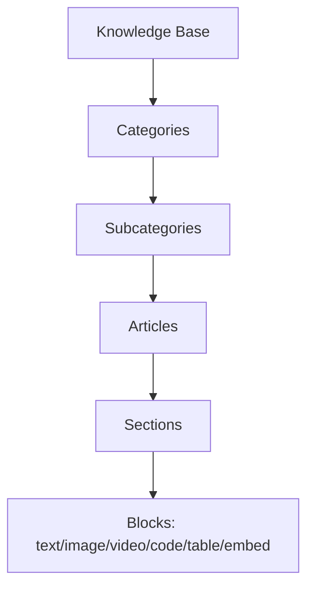
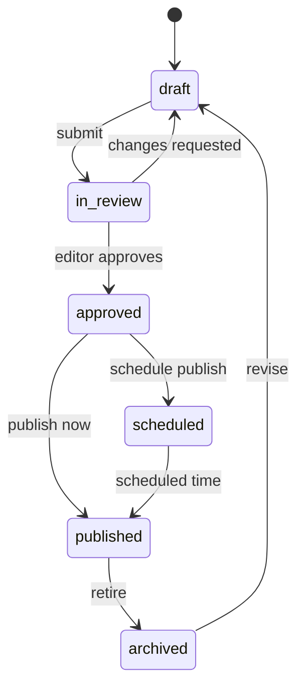
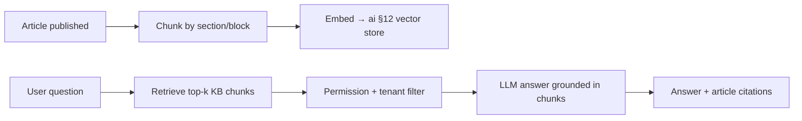
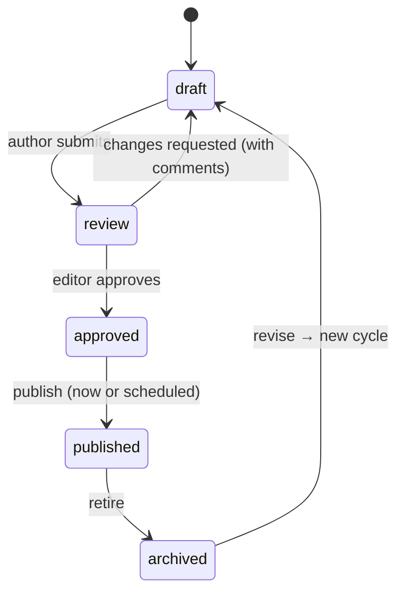

# Knowledge Base Module — Multi-Tenant Multi-Vendor SaaS

An enterprise knowledge management platform: structured documentation,
a rich editor, FAQs, tutorials, full-text + semantic search, an
AI knowledge assistant (RAG), versioning, editorial workflows,
multi-language, and SEO-optimized public help centers.

This is the **content layer** behind self-service support + AI answers.
The support doc §14 already references a `kb_articles` table feeding RAG
ingestion; this doc is that module, fully designed — the authoritative
content source the AI knowledge features read from.

It composes infrastructure other docs own:

- **RAG / embeddings / vector store** ← [`ai-architecture.md`](ai-architecture.md) §12 — the KB *produces* the content; the AI module *ingests + retrieves* it. This doc owns authoring + structure; ai §12 owns the vector search.
- **Support deflection** ← [`support-architecture.md`](support-architecture.md) §14, §16 — suggested articles before/within a ticket.
- **CRM enablement** ← [`crm-architecture.md`](crm-architecture.md) §17 — onboarding/education content per segment.
- **Localization** ← the shipped i18n system (`lang/` already has ar/en/es/fr) — articles translate against the same locale set.
- **SEO** ← [`marketplace-architecture.md`](marketplace-architecture.md) §22 patterns (slugs, meta, JSON-LD, sitemaps).
- **Versioning** ← mirrors [`file-manager-architecture.md`](file-manager-architecture.md) §9.

Follows the shipped/planned convention of the other fifteen docs.

## Table of contents

1. [Overview](#1-overview)
2. [Knowledge structure](#2-knowledge-structure)
3. [Article management](#3-article-management)
4. [Rich content editor](#4-rich-content-editor)
5. [Categories & taxonomy](#5-categories--taxonomy)
6. [FAQ system](#6-faq-system)
7. [Tutorials & guides](#7-tutorials--guides)
8. [Search engine](#8-search-engine)
9. [AI knowledge assistant](#9-ai-knowledge-assistant)
10. [Internal knowledge base](#10-internal-knowledge-base)
11. [Public knowledge base](#11-public-knowledge-base)
12. [Version control](#12-version-control)
13. [Knowledge collaboration](#13-knowledge-collaboration)
14. [Content approval workflow](#14-content-approval-workflow)
15. [Product documentation](#15-product-documentation)
16. [Support integration](#16-support-integration)
17. [CRM integration](#17-crm-integration)
18. [Knowledge analytics](#18-knowledge-analytics)
19. [Localization & multi-language](#19-localization--multi-language)
20. [Notifications](#20-notifications)
21. [Database design](#21-database-design)
22. [API design](#22-api-design)
23. [Frontend architecture](#23-frontend-architecture)
24. [Security](#24-security)
25. [Performance](#25-performance)
26. [Multi-tenant knowledge base](#26-multi-tenant-knowledge-base)
27. [SEO optimization](#27-seo-optimization)
28. [Scalability](#28-scalability)

### Status snapshot (today)

| Layer | Shipped | Planned in this doc |
|---|---|---|
| **RAG infrastructure** | speced in ai §12 (embeddings, vector store, retriever) | the KB content + ingestion *into* it |
| **Localization** | i18n system + `lang/{ar,en,es,fr}` | article translations against the same locales |
| **SEO patterns** | marketplace §22 (slugs/meta/JSON-LD/sitemap) | applied to public articles |
| **`kb_articles`** | referenced as planned (support §14) | fully designed here |
| **Tables** | none dedicated | all `knowledge_*` tables |

> Greenfield on its own tables, but it slots into a ready socket: the AI module's RAG pipeline is designed to ingest exactly this content, support is designed to suggest it, and the i18n + SEO systems are shipped. This doc defines *what gets written + how it's structured*; ai §12 defines *how it's retrieved*.

---

## 1. Overview

### Business objectives

- **Deflect support**: every self-served answer is a ticket that never opens — the highest-ROI support lever (support §13).
- **Power AI answers**: the KB is the grounded source for the AI assistant + support agent (no hallucination — answers cite articles).
- **Onboard + educate**: tutorials/guides accelerate customer + vendor time-to-value (CRM §17).
- **SEO traffic**: a public help center ranks for product + how-to queries, a top-of-funnel acquisition channel.

### Strategies

| Strategy | Approach |
|---|---|
| Self-service | KB-first everywhere — search before submit, suggested articles in-context |
| Documentation | Structured product docs per marketplace product (§15) |
| Knowledge-sharing | Internal KB for teams/vendors (processes, training) (§10) |
| AI knowledge | Every article embedded → RAG → AI answers + suggestions (§9) |

### Integration map

| Module | KB touchpoint |
|---|---|
| Support | Suggested articles, ticket deflection, resolution references (§16) |
| CRM | Onboarding flows, customer education per segment (§17) |
| Marketplace | Product manuals, API docs, release notes per product (§15) |
| AI Assistant | RAG over KB content for grounded answers (§9, ai §12) |
| Analytics | Article views, search success, deflection rate (§18) |
| Messaging | Agents/users link articles into chats |
| Automation | Publish events trigger workflows (notify, re-index) |

---

## 2. Knowledge structure



A flexible **block-based** content model (Notion/modern-CMS style):

```php
knowledge_bases
  id, tenant_id, name, slug, visibility enum('public','internal','mixed')
  default_locale, settings jsonb

knowledge_categories            // nested via parent_id (subcategories)
  id, tenant_id, knowledge_base_id, parent_id (nullable)
  name, slug, description, icon, position
  unique (knowledge_base_id, parent_id, slug)

knowledge_articles
  id, tenant_id, knowledge_base_id, category_id
  title, slug, excerpt, status, visibility
  author_id, current_version_id, published_at, ...

knowledge_article_sections      // ordered sections within an article
  id, article_id, title, position

knowledge_article_blocks        // typed content blocks within a section
  id, section_id, type enum('text','markdown','image','video','code','table','embed','callout'), content jsonb, position
```

Block-based storage makes content **structured + queryable** (extract
code blocks, render a TOC from sections, re-flow on mobile) rather than
an opaque HTML blob — and clean for RAG chunking (chunk by section/block).

---

## 3. Article management



Create / edit / publish / schedule / archive / delete, with a tracked
lifecycle (§14 workflow). Scheduled publication via a queued job at
`published_at`. Archiving keeps the article (URL 301s or shows
"archived") without deleting — preserves links + SEO. Every transition
audited.

---

## 4. Rich content editor

A modern block editor (TipTap/ProseMirror or Editor.js):
- **Rich text + markdown** (toggle), images, videos, tables, code blocks (syntax-highlighted, language-tagged), attachments (file-manager §13), embeds (YouTube/CodeSandbox/Figma).
- Blocks map 1:1 to `knowledge_article_blocks` — the editor's output is the structured model, not HTML.
- Images/attachments upload via the file-manager (chunked, optimized, signed-URL).
- Slash-command insertion, drag-to-reorder blocks, live preview, autosave drafts.

---

## 5. Categories & taxonomy

Categories + subcategories (nested `knowledge_categories`), tags,
labels, topics. `knowledge_tags` (many-to-many) + topic grouping for
cross-category themes. Dynamic organization: an article belongs to one
category (primary nav) + many tags/topics (discovery). AI auto-suggests
category + tags on save (§9).

---

## 6. FAQ system

```php
knowledge_faqs
  id, tenant_id, knowledge_base_id, category_id (nullable)
  question, answer (blocks or markdown)
  position, view_count, helpful_count, not_helpful_count
  is_ai_generated, related_article_ids jsonb
  status, locale
```

FAQ categories, popular questions (by view/helpful), related questions
(by embedding similarity, ai §12), **AI-generated FAQs** (from
recurring support tickets — support §13 detects clusters → drafts an
FAQ for review). FAQs feed support deflection (§16) + the AI assistant.

---

## 7. Tutorials & guides

```php
knowledge_tutorials
  id, tenant_id, knowledge_base_id, title, slug
  type enum('step_by_step','video','interactive','onboarding')
  steps jsonb                    // ordered steps with content + media
  estimated_minutes, difficulty
  
knowledge_guides                 // longer-form product guides (article collections)
  id, tenant_id, title, slug, article_ids jsonb, ...
```

Step-by-step tutorials, product guides (curated article sequences),
video tutorials (file-manager video + player), interactive guides,
onboarding flows (tied to CRM onboarding §17 — completing steps advances
the customer's lifecycle). Progress tracked per user for resumable
learning.

---

## 8. Search engine

- **Full-text** — PostgreSQL `tsvector` over title + excerpt + block content + tags; GIN-indexed; ranked by relevance + popularity + recency.
- **Semantic / AI** — embeddings (ai §12) for intent-based search ("how do I cancel" finds "Subscription management" without keyword match); hybrid rank with keyword.
- **Tag + category search** — faceted.
- **Suggestions** — type-ahead from popular + matching titles.
- **Ranking** — relevance × popularity (views/helpful) × freshness; tenant-tunable.
- **Search analytics** (§18) — failed searches (no click / no result) reveal content gaps → drive what to write next.
- **Permission-filtered** — internal articles only surface to authorized users.

---

## 9. AI knowledge assistant

(RAG engine owned by [`ai-architecture.md`](ai-architecture.md) §12.)

| Feature | Description |
|---|---|
| Question answering | RAG over the KB → grounded answer + cited articles |
| Summaries | Summarize a long article / a category |
| Article suggestions | "Customers also read" via embedding similarity |
| Recommendations | Personalized next-read from history + segment |
| Content generation | Draft an article from a prompt / from resolved tickets (for review) |
| Search assistant | Conversational search ("walk me through setup") |



On publish/update, a queued job chunks + embeds the article into the
ai §12 vector store (tenant-scoped). The AI answers *only* from
retrieved KB content and cites sources — the KB is the ground truth
that makes AI answers trustworthy. Credit-metered (ai §17).

---

## 10. Internal knowledge base

`knowledge_bases.visibility = 'internal'` (or per-article visibility):
private documentation, team docs, vendor docs, internal processes,
training materials. Permission-based access (§24): a doc visible to a
role / team / specific users. Internal content is **excluded from public
search + sitemaps + the public RAG** — it only surfaces to authorized
users + the internal AI assistant. Vendors get their own internal KB
(seller playbooks); the platform team gets ops runbooks.

---

## 11. Public knowledge base

Customer-facing help center: documentation, FAQs, tutorials, product
guides, release notes. SEO-optimized (§27) — public articles are
crawlable, structured-data-rich, in the sitemap. Served at
`/help` (or a tenant custom domain), branded per tenant (§26).
No-auth read access for public articles; the same content powers the
in-app help widget + the AI assistant.

---

## 12. Version control

```php
knowledge_versions
  id, tenant_id, article_id, version
  title, content_snapshot jsonb   // full block snapshot
  author_id, change_note, created_at
  unique (article_id, version)
```

Article versions (full snapshot per save/publish), content-change
tracking, author history, rollback (restore an older version — itself a
new version, non-destructive). Diff view (block-level) between versions.
Mirrors the file-manager §9 versioning model. Retention: keep all
versions (text is cheap) or last N per policy.

---

## 13. Knowledge collaboration

- **Multiple authors** — co-authoring with attribution; an article has a primary author + contributors.
- **Review workflow** — submit → reviewer → approve (§14).
- **Editorial comments** — inline comments on blocks (like Google Docs suggestions), resolved on edit; reuses the comment pattern (tasks/messaging).
- **Suggestions** — a contributor proposes edits without direct publish; an editor accepts/rejects.
- Collaborative editing (real-time co-edit via Reverb, like messaging) is a later phase; the base model supports async review now.

---

## 14. Content approval workflow



Configurable per tenant (some skip review for trusted authors; some
require multi-stage approval). Modeled as an FSM (`ArticleWorkflow`)
like the project/task/support lifecycles. Approvals + transitions
audited; reviewers notified (§20). Integrates with the automation engine
(a publish can trigger a workflow — announce, re-index, notify
followers).

---

## 15. Product documentation

(Integrates with [`marketplace-architecture.md`](marketplace-architecture.md).)
A marketplace product gets a documentation space: product manuals, API
documentation, user guides, setup instructions, release notes. Articles
link to a product (`context = Product`); the product page surfaces its
docs; release notes form a changelog feed (followers notified, §20).
API docs can render from an OpenAPI spec (file-manager) into structured
articles. Vendors author their product's docs in the same editor.

---

## 16. Support integration

(Per [`support-architecture.md`](support-architecture.md) §14, §16.)
- **Suggested articles** — the support portal + ticket form surface relevant articles (semantic match) *before* submission → deflection.
- **Ticket deflection** — measured: a "did this help?" on a suggested article that closes the intent without a ticket.
- **AI recommendations** — the agent sees suggested articles inline; one click links one into the reply.
- **Resolution references** — a resolved ticket can spawn a draft FAQ/article (turn a one-off answer into reusable knowledge).

Deflection rate (§18) is the headline KPI tying KB → support ROI.

---

## 17. CRM integration

(Per [`crm-architecture.md`](crm-architecture.md) §17.)
Knowledge powers customer enablement: onboarding flows (tutorials §7
tied to lifecycle stage), customer education (segment-targeted content),
customer success programs (guided journeys). A new customer's onboarding
checklist links KB tutorials; completion advances their CRM lifecycle +
health score.

---

## 18. Knowledge analytics

(Rollups via [`analytics-architecture.md`](analytics-architecture.md).)
Tracks: article views, search queries, **search success rate** (clicked
a result / found an answer vs no-result), popular articles, user
engagement (time on page, helpful votes), **support deflection rate**
(KB sessions that didn't become tickets). `knowledge_search_logs`
captures every query + outcome → failed searches surface content gaps.
Rolled into `daily_metrics` (`kb.*` keys); a KB dashboard renders via
the shared widget protocol. The deflection rate quantifies the module's
ROI.

---

## 19. Localization & multi-language

Reuses the shipped i18n system (`lang/` already has ar/en/es/fr).

```php
knowledge_translations
  id, tenant_id, article_id, locale
  title, slug, content_snapshot jsonb
  status, translated_by_id, is_ai_translated
  unique (article_id, locale)
```

- **Multiple languages** — an article has a base locale + translations.
- **Translation** — manual or AI-assisted (ai §15 translation); AI drafts, a human reviews.
- **Localization management** — a dashboard showing translation coverage per article/locale; missing translations flagged.
- **Language fallback** — a missing locale falls back to the base (same chain as the notification-template + UI i18n resolution).
- The public help center serves the reader's locale (URL `/help/{locale}/...` or `Accept-Language`), RTL-aware for Arabic (the shipped RTL support).

---

## 20. Notifications

(Delivery via notifications doc.) Events: new article (followers/
subscribers of a category), article update (watchers), content review
request (reviewers), publication request (editors). Channels: in-app +
email; digest option for high-volume. Customers can subscribe to a
category/product's release notes for update notifications.

---

## 21. Database design

| Table | Purpose |
|---|---|
| `knowledge_bases` | Top-level KB (public/internal/mixed) per tenant |
| `knowledge_categories` | Nested categories + subcategories |
| `knowledge_articles` | Articles (title, slug, status, visibility) |
| `knowledge_article_sections` | Ordered sections |
| `knowledge_article_blocks` | Typed content blocks |
| `knowledge_tags` | Tags/labels/topics |
| `knowledge_faqs` | FAQ entries |
| `knowledge_tutorials` / `knowledge_guides` | Learning content |
| `knowledge_versions` | Version snapshots |
| `knowledge_reviews` | Editorial review records |
| `knowledge_comments` | Inline editorial comments |
| `knowledge_permissions` | Granular access (role/team/user) |
| `knowledge_search_logs` | Search queries + outcomes |
| `knowledge_analytics` | Rolled-up metrics (or daily_metrics) |
| `knowledge_embeddings` | Vector store ref (or ai §12 `ai_embeddings`) |
| `knowledge_ai_insights` | AI suggestions/summaries/gaps |
| `knowledge_translations` | Per-locale article content |

### `knowledge_articles` (the core)

```php
Schema::create('knowledge_articles', function (Blueprint $t) {
    $t->id();
    $t->foreignId('tenant_id')->constrained()->cascadeOnDelete();
    $t->foreignId('knowledge_base_id')->constrained()->cascadeOnDelete();
    $t->foreignId('category_id')->nullable()->constrained('knowledge_categories')->nullOnDelete();
    $t->foreignId('author_id')->constrained('users');
    $t->string('title');
    $t->string('slug');
    $t->string('excerpt', 500)->nullable();
    $t->string('status', 16)->default('draft');     // draft|review|approved|scheduled|published|archived
    $t->string('visibility', 16)->default('public'); // public|internal
    $t->string('locale', 8)->default('en');
    $t->foreignId('current_version_id')->nullable();
    $t->morphs('context');                            // nullable polymorphic: Product, …
    $t->jsonb('tags')->nullable();
    $t->unsignedBigInteger('view_count')->default(0);
    $t->unsignedInteger('helpful_count')->default(0);
    $t->unsignedInteger('not_helpful_count')->default(0);
    $t->timestamp('published_at')->nullable();
    $t->softDeletes();
    $t->timestamps();
    $t->unique(['knowledge_base_id', 'slug', 'locale']);
    $t->index(['tenant_id', 'status', 'visibility']);
    $t->index(['category_id', 'status']);
    $t->index(['context_type', 'context_id']);
    // GIN: search_vector (title + excerpt + block text + tags)
});
```

### Particulars

- Block-based content → clean RAG chunking + structured rendering (TOC, mobile re-flow).
- `search_vector` GIN-indexed; embeddings in ai §12's `ai_embeddings` (or a KB-local mirror).
- `knowledge_search_logs` partitioned by month; the source for gap analysis.
- Public articles cacheable (CDN + Redis); internal articles never cached publicly.
- Every table `tenant_id` + `BelongsToTenant`.

---

## 22. API design

API-first; tenant-scoped; visibility + permission checked; public reads
allowed for public articles; cross-tenant → 404.

| Verb | URL | Purpose |
|---|---|---|
| `GET` | `/kb/articles` | List (filter category/tag/status, search, paginate) |
| `GET` | `/kb/articles/{slug}` | Article (blocks + TOC + related) |
| `POST` | `/kb/articles` | Create (draft) |
| `PUT` | `/kb/articles/{id}` | Update blocks |
| `POST` | `/kb/articles/{id}/submit` / `/approve` / `/publish` / `/archive` | Workflow |
| `GET` | `/kb/articles/{id}/versions` | Version history |
| `POST` | `/kb/articles/{id}/versions/{v}/restore` | Rollback |
| `POST` | `/kb/articles/{id}/translations` | Add/update a translation |
| `GET` | `/kb/categories` | Category tree |
| `GET` | `/kb/faqs` | FAQ list |
| `GET` | `/kb/tutorials` | Tutorials |
| `GET` | `/kb/search` | Full-text + semantic (suggestions, ranked) |
| `POST` | `/kb/ask` | AI question answering (RAG, cited) |
| `POST` | `/kb/articles/{id}/helpful` | Helpful vote |
| `GET` | `/kb/analytics` | Views/search-success/deflection |
| `GET` | `/help/{slug}` | Public help-center render (SEO) |

Search returns ranked results + suggestions + facet counts; `/kb/ask`
streams a grounded answer with citations.

---

## 23. Frontend architecture

```
resources/js/
├── pages/kb/
│   ├── dashboard.tsx          # KB management (articles, drafts, gaps)
│   ├── editor.tsx             # block editor
│   ├── docs.tsx               # documentation center (sidebar + article)
│   ├── faqs.tsx               # FAQ center
│   ├── tutorials.tsx          # tutorials center / player
│   ├── search.tsx             # search center + results
│   └── analytics.tsx
├── pages/help/                # public help center (SEO, branded)
│   ├── index.tsx
│   ├── article.tsx
│   └── search.tsx
├── components/kb/
│   ├── ArticleViewer.tsx      # renders blocks + TOC
│   ├── ArticleEditor.tsx      # block editor (TipTap/Editor.js)
│   ├── BlockRenderer.tsx      # text/image/video/code/table/embed
│   ├── SearchBar.tsx          # type-ahead + suggestions
│   ├── FaqCard.tsx + FaqAccordion.tsx
│   ├── DocsSidebar.tsx        # category tree nav
│   ├── TutorialPlayer.tsx     # step progress
│   ├── AiAssistantWidget.tsx  # ask-the-docs (RAG, cited)
│   ├── VersionViewer.tsx      # history + diff + restore
│   ├── HelpfulVote.tsx
│   └── TranslationStatus.tsx
├── hooks/kb/
│   ├── useArticleEditor.ts    # block state + autosave
│   ├── useKbSearch.ts
│   ├── useAskDocs.ts          # RAG streaming answer
│   └── useTutorialProgress.ts
└── lib/kb/{blocks,toc,formatters}.ts
```

The `AiAssistantWidget` is embeddable everywhere (in-app help, support
portal, public help center) — one component, the ai §12 RAG behind it.
Inertia props seed; React Query for search; the editor autosaves drafts.

---

## 24. Security

| Concern | Mitigation |
|---|---|
| Tenant isolation | Every `knowledge_*` table `tenant_id` + global scope; cross-tenant → 404 |
| Knowledge permissions | Visibility (public/internal) + granular `knowledge_permissions` (role/team/user) gate read; internal never in public surfaces |
| Editorial permissions | Author/reviewer/editor roles gate create/approve/publish (`ArticlePolicy`) |
| Secure content access | Internal articles excluded from public search, sitemaps, public RAG; attachments via file-manager signed-URL |
| Cross-tenant | Global scope; the public RAG retrieval filters by tenant + public visibility |
| Audit | All article changes + workflow transitions + permission changes logged (append-only) |

---

## 25. Performance

Target: millions of articles, global traffic, large repositories.

| Concern | Approach |
|---|---|
| Public reads | CDN + Redis cache published articles (busted on update); public help center is largely static-cacheable |
| Search | `tsvector` GIN + semantic (ai §12); Meilisearch/ES at scale; results cached per (query, locale) |
| Vector search | ai §12 HNSW; embeddings updated async on publish |
| Rendering | Block model renders server-side for SEO + hydrates; TOC from sections |
| Background | Embedding, translation, search-reindex, scheduled-publish all queued |
| Caching | Category trees, popular articles, FAQ lists in Redis |
| Partitioning | `knowledge_search_logs` by month |

---

## 26. Multi-tenant knowledge base

Each tenant configures (white-label):
- **Branding** — the help center uses tenant logo/colors/domain (BrandingService).
- **Categories + structure** — their own taxonomy.
- **Permissions** — who authors/reviews/publishes.
- **Public docs** — what's public vs internal.
- **Internal docs** — private team/vendor knowledge.

A tenant's KB is fully isolated; the public help center is branded as
*theirs*, on their domain — a true white-label knowledge portal. The AI
assistant answers only from the tenant's own KB.

---

## 27. SEO optimization

(Reuses [`marketplace-architecture.md`](marketplace-architecture.md) §22 patterns.)
- **SEO-friendly URLs** — `/help/{category}/{article-slug}` (+ locale prefix).
- **Meta tags** — per-article title/description (excerpt).
- **Structured data** — `Article`, `FAQPage`, `HowTo` (tutorials), `BreadcrumbList` JSON-LD for rich results.
- **XML sitemaps** — generated per tenant (public articles + categories), regenerated on publish (queued), submitted to search engines.
- **Open Graph** — article title + image for social shares.
- **hreflang** — for translated articles (localization §19) so search engines serve the right locale.

A public help center is a genuine acquisition channel — ranking for
"how to {product task}" queries brings top-of-funnel traffic.

---

## 28. Scalability

100k+ tenants, millions of articles, millions of searches/day,
AI retrieval at scale:

- **CDN + cache** — public articles are read-heavy + change-rarely → aggressively cached at the edge; near-zero origin load.
- **Read replicas** — search + reads hit replicas; authoring writes the primary.
- **Search offload** — dedicated search service (Meilisearch/ES) + the ai §12 vector store at scale.
- **Async everything** — embedding, translation, indexing, sitemap regen all queued.
- **Partitioned** search logs by month.
- **Multi-region** — public help centers served from regional edges; the vector store replicated per region.
- **Block model** — structured content scales cleaner than HTML blobs (targeted re-index of changed blocks, not whole-article re-embed).

---

## File map for the next phase

| Path | Status |
|---|---|
| `database/migrations/*_create_knowledge_bases_table.php` + `_categories_` | planned |
| `database/migrations/*_create_knowledge_articles_table.php` + `_sections_` + `_blocks_` | planned |
| `database/migrations/*_create_knowledge_tags_table.php` + `_faqs_` + `_tutorials_` + `_guides_` | planned |
| `database/migrations/*_create_knowledge_versions_table.php` + `_reviews_` + `_comments_` + `_permissions_` | planned |
| `database/migrations/*_create_knowledge_search_logs_table.php` (partitioned) + `_translations_` + `_ai_insights_` | planned |
| `database/migrations/*_add_knowledge_search_vector.php` (tsvector + ai §12 embeddings) | planned |
| `app/Domain/Knowledge/{ArticleService,CategoryService,SearchService,ArticleWorkflow,TranslationService,FaqService}.php` | planned |
| `app/Domain/Knowledge/Rag/IngestArticle.php` (chunks + embeds into ai §12 store) | planned |
| `app/Models/{KnowledgeBase,KnowledgeCategory,KnowledgeArticle,KnowledgeArticleSection,KnowledgeArticleBlock,KnowledgeFaq,KnowledgeTutorial,KnowledgeVersion,KnowledgeTranslation}.php` | planned |
| `app/Jobs/Knowledge/{PublishScheduled,IngestToRag,GenerateSitemap,TranslateArticle,ReindexSearch}.php` | planned |
| `app/Listeners/Knowledge/{IngestPublishedArticle,DetectContentGaps}.php` | planned |
| `app/Policies/{KnowledgeArticlePolicy,KnowledgeBasePolicy}.php` | planned |
| `app/Http/Controllers/Knowledge/*Controller.php` + `Public/HelpCenterController.php` | planned |
| `resources/js/pages/kb/*` + `pages/help/*` + `components/kb/*` + `hooks/kb/*` | planned |
| `tests/Feature/Knowledge/*` (article workflow, version restore, RAG ingest on publish, internal-visibility isolation, search relevance, translation fallback, tenant isolation) | planned |

The next pass commits the `knowledge_bases` + `knowledge_categories` +
`knowledge_articles` + block tables, the `ArticleService` +
`ArticleWorkflow`, the block editor + viewer, and the
`IngestPublishedArticle` listener (publish → chunk → embed into the
ai §12 store) — so an article can be authored → reviewed → published →
RAG-answerable → searched before FAQs, tutorials, translations, and the
public SEO help center layer on. The support module's KB suggestions
(support §14) then read from this content.

---

## The architecture doc set

This is the sixteenth architecture doc. The complete set under `docs/`:

1. `dashboard-architecture.md`
2. `payments-architecture.md`
3. `projects-architecture.md`
4. `tasks-architecture.md`
5. `notifications-architecture.md`
6. `billing-architecture.md`
7. `ai-architecture.md`
8. `analytics-architecture.md`
9. `workflow-automation-architecture.md`
10. `marketplace-architecture.md`
11. `mobile-architecture.md`
12. `crm-architecture.md`
13. `messaging-architecture.md`
14. `support-architecture.md`
15. `file-manager-architecture.md`
16. `knowledge-base-architecture.md`

All in the same shipped-vs-planned format, cross-referenced, each
ending with a concrete "File map for the next phase".
