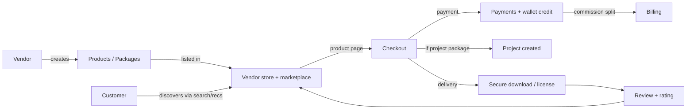
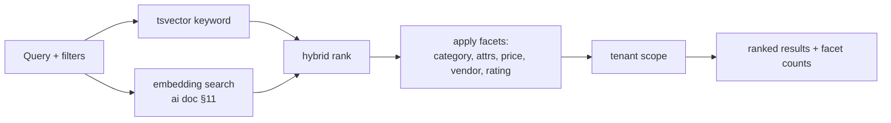
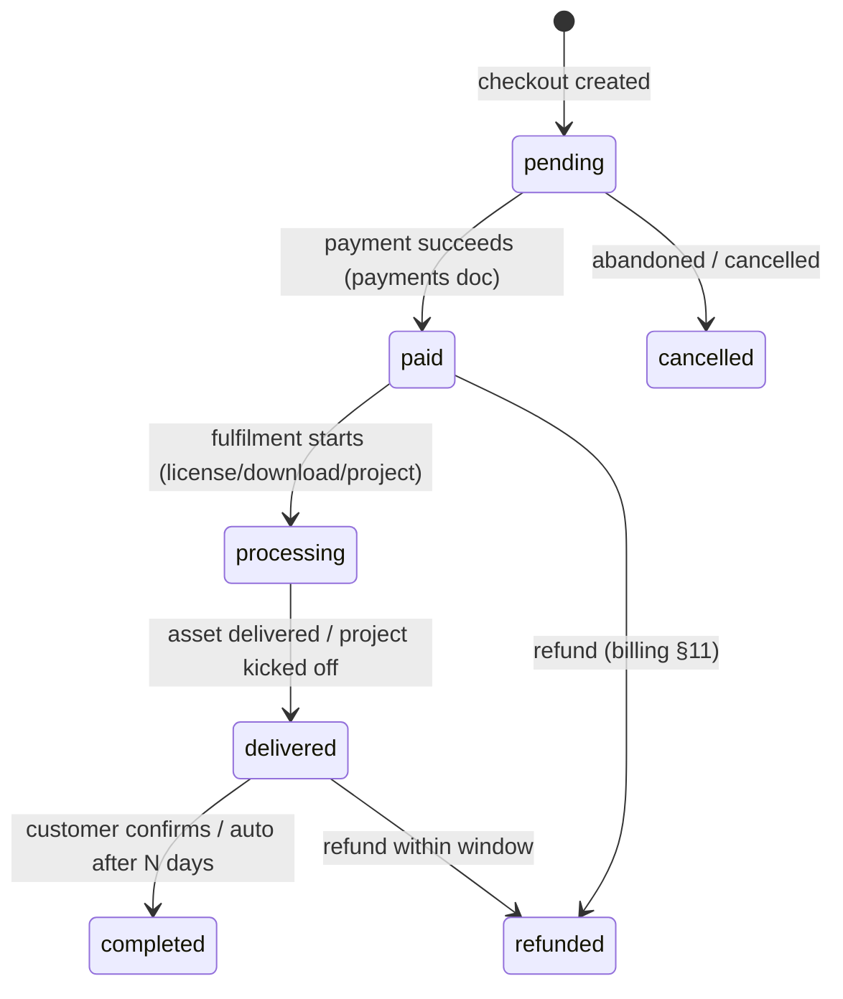
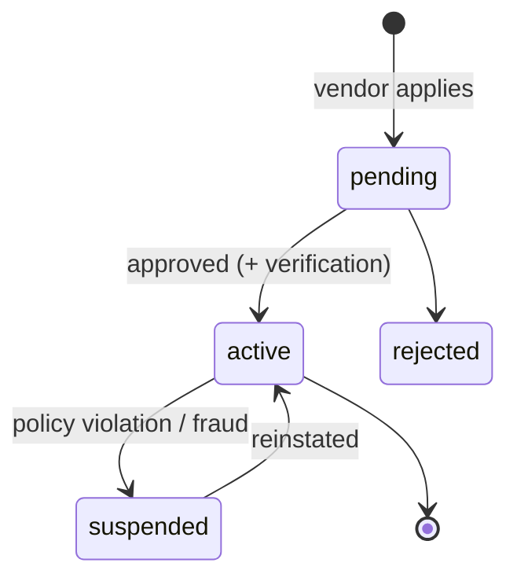

# Marketplace Module — Multi-Tenant Multi-Vendor SaaS

The customer-facing commerce surface: vendor storefronts, product
catalog (SaaS, APIs, source code, templates, services, project
packages), discovery + search, product pages, orders, reviews, wishlists,
vendor management, and AI-powered marketplace intelligence.

This is the platform's **origin module** — the storefront the project was
bootstrapped as — so it has the most shipped code of any module. This
doc maps that reality and specs the multi-vendor expansion on top of it.

It composes infrastructure owned by other docs rather than redefining it:

- **Checkout / payment / wallet** ← [`payments-architecture.md`](payments-architecture.md) (idempotent order payment + vendor wallet credit).
- **Commissions / revenue split** ← [`billing-architecture.md`](billing-architecture.md) §4 (the split math + `commission_rules`).
- **Search + recommendations** ← [`ai-architecture.md`](ai-architecture.md) §11 (semantic/hybrid search) + §14 (recommendations engine).
- **Marketplace analytics** ← [`analytics-architecture.md`](analytics-architecture.md) §3 (sales, conversion, best-sellers).
- **Notifications / automation** ← the notifications + workflow docs (order/review/promo events).
- **Project packages** ← [`projects-architecture.md`](projects-architecture.md) (a "custom development" purchase spawns a project).

Follows the shipped/planned convention of the other nine docs.

## Table of contents

1. [Overview](#1-overview)
2. [Vendor store system](#2-vendor-store-system)
3. [Product management](#3-product-management)
4. [Product variations](#4-product-variations)
5. [Categories & taxonomy](#5-categories--taxonomy)
6. [Product discovery](#6-product-discovery)
7. [Product pages](#7-product-pages)
8. [Order management](#8-order-management)
9. [Review & rating system](#9-review--rating-system)
10. [Wishlist system](#10-wishlist-system)
11. [Vendor management](#11-vendor-management)
12. [Marketplace commissions](#12-marketplace-commissions)
13. [Marketplace analytics](#13-marketplace-analytics)
14. [Marketplace notifications](#14-marketplace-notifications)
15. [AI marketplace features](#15-ai-marketplace-features)
16. [Database design](#16-database-design)
17. [API design](#17-api-design)
18. [Frontend architecture](#18-frontend-architecture)
19. [Security](#19-security)
20. [Performance](#20-performance)
21. [Multi-tenant marketplace](#21-multi-tenant-marketplace)
22. [SEO & marketing](#22-seo--marketing)
23. [Future expansion](#23-future-expansion)
24. [Scalability](#24-scalability)

### Status snapshot (today) — the most-shipped module

| Layer | Shipped | Planned in this doc |
|---|---|---|
| **Catalog** | `products` (type, price, sale_price, status, SEO fields, thumbnail, gallery), `categories` (nested via parent_id) | + `product_variants`, `product_media`, `product_downloads`, `product_attributes`, `product_subcategories`, `product_tags` |
| **Commerce** | `orders` + `order_items` (lifecycle: pending/paid/failed/refunded/cancelled), session `cart`, **checkout** (`CheckoutController` + `CheckoutService` → order + Stripe PaymentIntent + coupon redemption), **Stripe Elements card confirmation** (`checkout/index` two-phase: billing → `PaymentElement` → `confirmPayment`; content-negotiated JSON returns the intent `client_secret`; $0 orders skip the card step), **digital fulfillment** (`FulfillOrder` listener on `PaymentCompleted` → issues `License`/`Download` idempotently) | + checkout→project-package, multi-item split-tender, tax |
| **Social** | `reviews` (rating + approved flag + verified purchase), `wishlists` | + separate `ratings` aggregate, `vendor_followers` |
| **Discounts** | `coupons` | + `marketplace_promotions`, `marketplace_banners` |
| **Storefront** | `products/index` (search/filter/sort), `products/show` (gallery, reviews, related), `cart/index`, `checkout/index` (Stripe Elements) | + vendor store pages, category pages, search results, vendor dashboard |
| **Controllers** | `ProductController`, `CartController`, `Admin\ProductController` (CRUD + PlanGate limit) | + Vendor/Store/Order/Review controllers |
| **Vendors** | "vendor" = the tenant today (one tenant = one seller); products are tenant-scoped | + `vendors`, `vendor_profiles`, `vendor_stores` for multi-vendor *within* a tenant |

> The single-vendor storefront is real and working (seeded products, cart, reviews, admin CRUD). This doc's main expansion is **multi-vendor within a tenant**: today one tenant = one seller; the spec adds vendor entities so a tenant can host many sellers (a true marketplace), each with a store, while keeping the shipped product/order/review tables as the foundation.

---

## 1. Overview

### Business goals

- **Liquidity**: many vendors × many buyers, with the platform taking a commission (billing §4).
- **Breadth**: sell anything digital — SaaS, APIs, source code, templates, services, full custom-dev project packages.
- **Trust**: verified vendors, verified-purchase reviews, secure downloads, moderation.
- **Discovery**: the right product found fast (search + AI recommendations) → conversion.

### Revenue model

Per the billing doc: commission on each sale (%/flat/tiered) + optional
vendor subscription (hybrid). A "custom development project" purchase is
a high-value order that spawns a project (projects doc) — the
marketplace is the front door to the services side.

### Vendor ecosystem & customer journey



### Integration map

| Module | Marketplace touchpoint |
|---|---|
| Payments | Order checkout → idempotent payment → vendor wallet credit |
| Billing | Commission split on each sale; vendor subscriptions |
| Projects | "Custom development" / "project package" purchase → project + milestones |
| Analytics | Sales, conversion, best-sellers, vendor performance (analytics §3) |
| AI | Search, recommendations, descriptions, categorization, fraud (ai §11/§14/§16) |
| Notifications | Order, review, promo, vendor-message events |
| Automation | Order/review triggers → workflows (vendor onboarding, etc.) |

---

## 2. Vendor store system

Today "vendor" is conflated with "tenant". This spec introduces a
**vendor** entity so a tenant (the marketplace operator) can host many
sellers — and each gets a public storefront.

```php
vendors
  id, tenant_id, owner_user_id
  name, slug (unique per tenant), status enum('pending','active','suspended','rejected')
  verified_at, commission_rule_id (nullable → billing default)
  timestamps, softDeletes
  unique (tenant_id, slug)

vendor_profiles
  vendor_id (unique), company_name, bio, logo_path, banner_path
  website, social_links jsonb, contact_email, contact_phone
  certifications jsonb, country, founded_year

vendor_stores
  vendor_id (unique), theme jsonb (colors/layout), featured_product_ids jsonb
  seo_title, seo_description, og_image_path, custom_domain (nullable)
  is_public
```

### Features

Vendor profile · company info · logo · banner · portfolio · reviews ·
ratings · social links · contact · certifications.

- **Public store page** at `/store/{vendor:slug}` (or `custom_domain`) — products grid, profile, aggregate rating, reviews.
- **SEO** — per-store meta tags, OG image, structured data (§22).
- **Verification** — a `vendor.verified_at` badge; verification workflow (§11) gates payouts (billing withdrawal KYC).

Logos/banners use the shipped `BrandingService` image pipeline
(resize + sanitize + signed URLs).

---

## 3. Product management

The shipped `products` table already has: title, slug, short/long
description, type (digital_download/subscription/api_access/license),
price, sale_price, currency, thumbnail, gallery (json), version, SEO
fields, status, is_featured. Extending for the full catalog:

```php
Schema::table('products', function (Blueprint $t) {
    $t->foreignId('vendor_id')->nullable()->after('tenant_id')->constrained()->nullOnDelete();
    $t->text('documentation')->nullable();
    $t->jsonb('features')->nullable();      // bullet list
    $t->jsonb('faqs')->nullable();          // [{q,a}]
    $t->string('demo_url')->nullable();
    $t->index(['vendor_id', 'status']);
});
```

### Product types

SaaS products · APIs · source code · templates · digital downloads ·
services · project packages. The shipped `type` enum covers the core;
"service" + "project_package" are added (a project_package purchase
triggers project creation, projects doc).

### Fields & validation

Builds on the shipped `StoreProductRequest` (title/slug/type/price/
sale_price<price/status/SEO). Adds: `vendor_id` (must belong to tenant),
`features[]`, `faqs[].{q,a}`, `documentation`, media + downloads
(§4/§16). The shipped 402-on-plan-limit (PlanGate) stays — vendor
product count is plan-gated.

---

## 4. Product variations

The shipped product is single-price. Variations add flexibility:

```php
product_variants
  id, tenant_id, product_id
  name, sku (nullable), type enum('tier','version','package','addon','upsell')
  price_cents, sale_price_cents (nullable), currency
  billing_interval enum('one_time','monthly','annual') default one_time
  features jsonb, download_id (nullable), position, is_default, is_active
  index (product_id, type, position)
```

| Variation | Use |
|---|---|
| Pricing tiers | Basic / Pro / Enterprise of a SaaS product |
| Subscription plans | Monthly/annual for a service |
| Service packages | Bronze/Silver/Gold delivery scope |
| Product versions | v1.x vs v2.x of source code |
| Add-ons | Optional extras at checkout |
| Upsells | "Customers also bought" at checkout |

A product with no variants uses its base price (back-compat with the
shipped single-price model). Order items reference the chosen variant.

---

## 5. Categories & taxonomy

The shipped `categories` table is self-nested (parent_id). Full taxonomy:

```php
// categories (shipped) — keep; subcategories are just children via parent_id
product_attributes
  id, tenant_id, category_id (nullable = global)
  key, label, type enum('select','multiselect','boolean','number','text')
  options jsonb, is_filterable, position

product_attribute_values
  product_id, attribute_id, value jsonb
  unique (product_id, attribute_id)

product_tags
  id, tenant_id, name, slug, unique(tenant_id, slug)

product_tag (pivot)
  product_id, tag_id, unique(product_id, tag_id)
```

- **Categories / subcategories** — the shipped nested `categories`.
- **Tags** — free-form, many-to-many.
- **Attributes + custom fields** — per-category schema (e.g. "Framework: Laravel/Django"), drive **faceted filtering** (§6).
- Dynamic filtering: filterable attributes become facets on the listing page.

---

## 6. Product discovery

The shipped `products/index` already does search (title/short_desc LIKE),
category + type filter, and sort (latest/price/bestseller). Expansion:

| Capability | Mechanism |
|---|---|
| Search | shipped LIKE → upgraded to PostgreSQL `tsvector` full-text |
| Advanced filters | faceted by category + attributes + price range + vendor + rating |
| Sorting | shipped (latest/price↑↓/bestseller) + "top rated", "trending" |
| Vendor search | search across vendor stores |
| Popular / trending | from analytics rollups (views + sales velocity) |
| **Semantic / AI search** | ai doc §11 — embedding + hybrid rank ("a Stripe-ready Laravel SaaS boilerplate under $100") |
| Faceted search | attribute facets with live counts |



Search results cached per (tenant, query, filters) in Redis; facet
counts computed from the filtered set.

---

## 7. Product pages

The shipped `products/show` already renders gallery, overview, price
(+ sale), reviews, related products, and the add-to-cart flow (cart doc).
Conversion-optimized layout extends it:

- **Gallery** — images + video (`product_media`) + live demo embed.
- **Overview** — description + features list + attributes table.
- **Pricing** — variant selector (tiers/packages) with the chosen variant driving the CTA.
- **Documentation** tab + **FAQs** accordion.
- **Reviews** — rating distribution + verified-purchase reviews (shipped).
- **Vendor card** — store link, rating, "follow vendor", other products.
- **Related products** — shipped (same category) → upgraded to AI recommendations (ai §14).
- **Trust signals** — verified-vendor badge, secure-checkout, refund policy.

---

## 8. Order management

The shipped `orders` table has the lifecycle
(pending/paid/failed/refunded/cancelled), `order_items`, totals, billing
fields, `paid_at`/`refunded_at`, gapless `order_number`. The full
fulfilment lifecycle:



> The shipped enum has pending/paid/failed/refunded/cancelled; `processing`/`delivered`/`completed` are added for the fulfilment stages — two-column-safe (the shipped values keep working).

### Fulfilment by product type

- **Digital download / source code / template** → secure signed-URL download (payments/branding pipeline), `order_items` grant access.
- **License** → generate + issue a license key.
- **API access** → provision an API key (ai/billing metering).
- **Subscription** → create a `tenant_subscription` (billing).
- **Service / project package** → spawn a project + milestones (projects doc), notify the vendor.

Payment + wallet credit + commission split all happen via the payments
+ billing docs — the marketplace just orchestrates the order state and
fulfilment.

---

## 9. Review & rating system

The shipped `reviews` table has rating (1–5), title, comment,
`is_approved`, `is_verified_purchase`, user + product FKs. Extending:

```php
// reviews (shipped) — add vendor reviews + helpfulness
Schema::table('reviews', function (Blueprint $t) {
    $t->foreignId('vendor_id')->nullable()->after('product_id')->constrained()->nullOnDelete();
    $t->foreignId('order_item_id')->nullable()->constrained()->nullOnDelete(); // verified-purchase link
    $t->unsignedInteger('helpful_count')->default(0);
    $t->jsonb('vendor_response')->nullable();   // {body, responded_at}
});

// ratings — denormalized aggregate (avoid AVG() on every page load)
ratings
  id, tenant_id, subject_type, subject_id   // product or vendor
  avg_rating decimal(3,2), count, distribution jsonb  // {5: 40, 4: 12, …}
  unique (subject_type, subject_id)
```

- **Product + vendor reviews**; **verified purchase** linked to `order_item_id` (you reviewed something you bought).
- **Moderation** — reviews default `is_approved=false` for new vendors / flagged content; AI spam + fake-review detection (ai §16) auto-flags; a human approves.
- **Anti-spam** — one review per purchase, rate-limited, AI burst/similarity detection, no review without a verified order for verified-only products.
- `ratings` aggregate refreshed by a listener on review approve/edit — pages read the aggregate, not a live `AVG()`.

---

## 10. Wishlist system

The shipped `wishlists` table (user + product) covers saved products.
Adding vendor-following:

```php
// wishlists (shipped) — saved products
vendor_followers
  id, tenant_id, vendor_id, user_id
  unique (vendor_id, user_id)
  index (user_id)
```

- **Save products** (shipped), **follow vendors**, **track favorites**.
- Following a vendor → notifications on their new products / promotions.
- **Engagement metrics** — wishlist adds + follows feed analytics (intent signals) + recommendations (ai §14).

---

## 11. Vendor management

Admin (super-admin + tenant-owner) vendor administration.



- **Verification** — identity/KYC (gates payouts, billing withdrawal §7); `verified_at` badge.
- **Approval / rejection** — new vendors reviewed before listing.
- **Suspension** — fraud/policy → hides products, freezes wallet (billing held balance).
- **Performance monitoring + scoring** — the vendor performance score (analytics §4): GMV, refund rate, rating, on-time, retention.
- **Health reports** — per-vendor dashboard; at-risk vendors flagged for outreach.

---

## 12. Marketplace commissions

Owned by [`billing-architecture.md`](billing-architecture.md) §4 — the
`commission_rules` config + `CommissionCalculator` split. The marketplace
**applies** it at order time:

- Fixed / percentage / tiered / custom-per-vendor (a vendor's `commission_rule_id` overrides the tenant default).
- On payment success: the split records a platform-commission ledger entry + a vendor-wallet credit (payments doc) — reconciled so `gross = commission + fee + vendor_net`.

This doc owns *where* the split is invoked (order fulfilment); billing
owns *how* it's calculated + recorded.

---

## 13. Marketplace analytics

Owned by [`analytics-architecture.md`](analytics-architecture.md) §3 —
sales, revenue, vendor/product performance, customer behavior,
conversion. The marketplace **emits the events** (order.created,
product.viewed, etc.) that analytics rolls up; dashboards render via the
analytics widget protocol. Best-sellers + most-viewed + trending come
from those rollups (the shipped `product_views` + `orders_count` metric
keys).

---

## 14. Marketplace notifications

Via the notifications module. Marketplace event types: new order
(vendor + customer), product update (followers), new review (vendor),
promotion (followers/segment), vendor message, refund request. Channels:
in-app + email always; push for high-value. Templates per-tenant
branded (notifications §9/§19).

---

## 15. AI marketplace features

Owned by [`ai-architecture.md`](ai-architecture.md); the marketplace is a
consumer.

| Feature | AI doc reference |
|---|---|
| Product recommendations | §14 (hybrid CF + content + rerank) |
| Vendor matching | §7 (marketplace assistant) |
| AI search | §11 (semantic/hybrid) |
| AI product descriptions | §5 (content generation) |
| AI SEO optimization | §5 |
| AI product categorization | classify a new product into categories/tags |
| AI fraud detection | §16 (fake products/reviews) + billing §19 |
| AI trend analysis | §10 (analytics narrative) |

All credit-metered (ai §17), tenant-opt-in, human-reviewed where it
mutates listings.

---

## 16. Database design

| Table | Status | Purpose |
|---|---|---|
| `products` | shipped (extended) | Catalog items |
| `categories` | shipped | Nested categories (parent_id) |
| `product_subcategories` | shipped (via parent_id) | — |
| `product_tags` / `product_tag` | planned | Free-form tags |
| `product_attributes` / `_values` | planned | Faceted custom fields |
| `product_variants` | planned | Tiers/packages/versions/add-ons |
| `product_media` | planned | Images/videos |
| `product_downloads` | planned | Deliverable files (signed-URL) |
| `orders` / `order_items` | shipped | Commerce |
| `reviews` | shipped (extended) | Product + vendor reviews |
| `ratings` | planned | Denormalized rating aggregate |
| `wishlists` | shipped | Saved products |
| `vendor_followers` | planned | Vendor follows |
| `vendors` / `vendor_profiles` / `vendor_stores` | planned | Multi-vendor entities |
| `commissions` | planned (billing §4) | Split records |
| `marketplace_promotions` / `_banners` | planned | Campaigns + hero banners |
| `marketplace_recommendations` | planned (ai §14) | Cached recs |
| `coupons` | shipped | Discounts |

### `product_media` + `product_downloads`

```php
Schema::create('product_media', function (Blueprint $t) {
    $t->id();
    $t->foreignId('tenant_id')->constrained()->cascadeOnDelete();
    $t->foreignId('product_id')->constrained()->cascadeOnDelete();
    $t->enum('type', ['image', 'video', 'embed']);
    $t->string('path')->nullable();        // S3 (image/video)
    $t->string('url')->nullable();         // embed (YouTube/Vimeo/demo)
    $t->string('alt')->nullable();
    $t->unsignedInteger('position')->default(0);
    $t->timestamps();
    $t->index(['product_id', 'position']);
});

Schema::create('product_downloads', function (Blueprint $t) {
    $t->id();
    $t->foreignId('tenant_id')->constrained()->cascadeOnDelete();
    $t->foreignId('product_id')->constrained()->cascadeOnDelete();
    $t->foreignId('variant_id')->nullable()->constrained('product_variants')->nullOnDelete();
    $t->string('disk', 24)->default('s3');
    $t->string('path');                    // private; signed-URL only
    $t->string('original_name');
    $t->string('version')->nullable();
    $t->unsignedBigInteger('size_bytes');
    $t->string('checksum_sha256', 64)->nullable();
    $t->unsignedInteger('download_limit')->nullable(); // per purchase
    $t->timestamps();
    $t->index('product_id');
});
```

### Indexes & particulars

- `products`: `(tenant_id, status, type)` (shipped), `(vendor_id, status)`, GIN on `tsvector` search column + `tags`.
- `orders`: `(tenant_id, status)`, `(status, created_at)` (shipped pattern).
- `ratings`: `UNIQUE(subject_type, subject_id)` — one aggregate row per product/vendor.
- `product_downloads.path` private, ULID-prefixed, signed-URL only (never public).
- Money in cents on new tables (variants); the shipped `products.price` stays `decimal` (display/archive) consistent with the existing schema.
- Every table `tenant_id` + `BelongsToTenant`.

---

## 17. API design

API-first; tenant-scoped; cross-tenant → 404. Public read endpoints
(catalog) + authed write endpoints.

| Verb | URL | Purpose |
|---|---|---|
| `GET` | `/products` | Listing (search/filter/sort/facets/paginate) — shipped |
| `GET` | `/products/{slug}` | Product detail — shipped |
| `GET` | `/categories` | Category tree |
| `GET` | `/store/{vendor}` | Public vendor store |
| `GET` | `/vendors` | Vendor directory |
| `POST` | `/cart` / `PATCH`/`DELETE` | Cart ops — shipped (cart doc) |
| `POST` | `/checkout` | Create order + payment intent (payments doc) |
| `GET` | `/orders` | Customer order history |
| `GET` | `/orders/{number}` | Order detail + downloads |
| `GET` | `/orders/{number}/items/{id}/download` | Signed-URL download |
| `POST` | `/products/{id}/reviews` | Submit review (verified-purchase checked) |
| `POST` | `/reviews/{id}/helpful` | Mark helpful |
| `POST` | `/wishlist` / `DELETE` | Save/unsave product |
| `POST` | `/vendors/{id}/follow` / `DELETE` | Follow/unfollow |
| `GET` | `/recommendations` | Personalized recs (ai §14) |
| `GET` | `/search` | Semantic/hybrid search (ai §11) |
| **Vendor** | | |
| `GET/POST/PUT/DELETE` | `/vendor/products` | Vendor product CRUD (+ PlanGate limit) |
| `GET` | `/vendor/orders` | Vendor's sales |
| `PUT` | `/vendor/store` | Store settings |
| `GET` | `/vendor/analytics` | Vendor performance (analytics §4) |
| **Admin** | | |
| `POST` | `/admin/vendors/{id}/approve` / `/suspend` | Vendor management |

Listing response carries `data` + `meta` (pagination + applied filters +
facet counts) — the shipped paginated shape, extended with facets.

---

## 18. Frontend architecture

```
resources/js/
├── pages/                          # (shipped: products/, cart/)
│   ├── marketplace/
│   │   ├── home.tsx                # marketplace landing (featured, trending, categories)
│   │   ├── category.tsx            # category browse + facets
│   │   └── search.tsx              # search results + filters
│   ├── products/
│   │   ├── index.tsx               # listing  [shipped]
│   │   └── show.tsx                # product detail  [shipped]
│   ├── store/
│   │   └── show.tsx                # public vendor store
│   ├── cart/index.tsx              # [shipped]
│   ├── orders/
│   │   ├── index.tsx               # order history
│   │   └── show.tsx                # order + downloads
│   ├── wishlist/index.tsx
│   └── vendor/                     # vendor-side
│       ├── dashboard.tsx
│       ├── products.tsx            # product management
│       ├── store-settings.tsx
│       └── analytics.tsx
├── components/marketplace/
│   ├── ProductCard.tsx             # [shipped — extend]
│   ├── ProductGallery.tsx
│   ├── VariantSelector.tsx
│   ├── SearchFilters.tsx           # faceted
│   ├── VendorCard.tsx
│   ├── ReviewList.tsx + ReviewForm.tsx + RatingStars.tsx
│   ├── RatingDistribution.tsx
│   ├── RecommendationWidget.tsx    # ai §14
│   ├── WishlistButton.tsx
│   ├── FollowVendorButton.tsx
│   └── PromoBanner.tsx
├── hooks/marketplace/
│   ├── useProductSearch.ts         # facets + URL-synced filters
│   ├── useCart.ts                  # [shipped pattern]
│   ├── useWishlist.ts
│   └── useRecommendations.ts
└── lib/marketplace/
    ├── filters.ts
    └── formatters.ts
```

Built on the shipped `StorefrontLayout` (header/cart/locale/theme) +
`ProductCard`. Inertia props seed listings; React Query for facet
changes + infinite scroll; the cart pattern is already shipped.

---

## 19. Security

| Concern | Mitigation |
|---|---|
| Tenant isolation | Every table `tenant_id` + global scope (shipped); cross-tenant → 404 |
| Vendor permissions | A vendor manages only their own products/orders/store (`VendorPolicy`); reuses the admin gate pattern |
| Product moderation | New products + reviews can require approval; AI fraud/fake detection (ai §16) auto-flags |
| Secure downloads | `product_downloads` private + signed-URL (15-min), per-purchase download limit, access checked against a paid `order_item` |
| Fraud detection | AI (ai §16) + billing fraud (§19): fake products, fake reviews, payment fraud |
| Review abuse | Verified-purchase requirement, rate limits, one-per-purchase, AI burst detection |
| Cross-tenant leakage | Global scope on every query; signed URLs scoped to the buyer |
| Audit | Vendor + product + order changes logged to `activity_logs` |

---

## 20. Performance

Target: millions of products + customers, thousands of vendors.

| Concern | Approach |
|---|---|
| Catalog reads | `(tenant_id, status, type)` index (shipped); listings cached per (tenant, filters) in Redis |
| Search | `tsvector` GIN; semantic via ai §11; Meilisearch/Algolia swap at extreme scale (same `q` param) |
| Ratings | Denormalized `ratings` aggregate — no `AVG()` on page load |
| Media/CDN | Images optimized (BrandingService pipeline) + served via CDN; lazy-loaded galleries |
| Downloads | Signed-URL redirect to S3 — PHP serves zero bytes |
| Best-sellers/trending | Read from analytics rollups, not live aggregation |
| Queues | Fulfilment, license generation, thumbnail, search-reindex all queued |
| Facet counts | Computed from the filtered set, cached; HyperLogLog for high-cardinality at scale |
| Pagination | Cursor for deep catalogs; offset for shallow |

---

## 21. Multi-tenant marketplace

Each tenant operates its own marketplace (white-label):

- **Branding** — logo/colors/title via the shipped `BrandingService` + branding doc.
- **Categories** — tenant-defined taxonomy.
- **Commission rules** — per-tenant `commission_rules` (billing §4).
- **Store design** — tenant theme + per-vendor store themes.
- **Marketplace settings** — which product types are allowed, review moderation policy, vendor approval mode (auto/manual).
- **Payment rules** — tenant's connected gateway (Stripe Connect, billing §20) so funds flow to the tenant; the tenant pays *their* vendors.

A tenant's marketplace is fully isolated — vendors, products, orders,
and customers never cross tenants (global scope).

---

## 22. SEO & marketing

- **SEO-friendly URLs** — `/products/{slug}`, `/store/{vendor-slug}`, `/category/{slug}` (slug routing shipped on products).
- **Meta tags** — per-product (shipped `seo_title`/`seo_description`), per-store, per-category.
- **Open Graph + Twitter cards** — product image + price.
- **Structured data** — `Product`, `Offer`, `AggregateRating`, `Organization` JSON-LD for rich results.
- **Sitemap** — generated per tenant (products + stores + categories), submitted to search engines; regenerated on catalog change (queued).
- **Marketing** — `marketplace_promotions` (time-boxed discounts, campaigns), `marketplace_banners` (hero placements), landing pages, coupon campaigns (shipped `coupons` + billing §10). AI SEO/content (ai §5).

---

## 23. Future expansion

Extensible by design:

| Feature | Approach |
|---|---|
| Affiliate system | `affiliate_links` + attribution on orders → commission to referrer |
| Auctions / bidding | `auctions` + `bids` tables; a product type `auction` with a close-time job |
| Membership programs | Tied to subscriptions (billing); members get pricing/early access |
| Loyalty programs | Points ledger (reuse the wallet/ledger pattern, payments doc) |
| Vendor subscriptions | Hybrid revenue (billing §4) — vendors pay to sell |
| Mobile apps | The API-first design (§17) already serves a native client |

Each is a new module that subscribes to the same events + reuses the
ledger/commission/notification infrastructure — no core rewrite.

---

## 24. Scalability

100k+ vendors, millions of products + orders, global operations:

- **Read/write split** — catalog reads hit replicas; orders write to the primary.
- **Search offload** — dedicated search service (Meilisearch/Algolia/ES) at scale; PostgreSQL `tsvector` for smaller tenants.
- **CDN** — all product media + static assets edge-cached globally.
- **Partitioning** — `orders` + `order_items` partitioned by month at volume; old partitions archived.
- **Caching tiers** — Redis for listings/facets/ratings; CDN for media; the analytics rollups for best-sellers.
- **Queue isolation** — fulfilment, search-reindex, media-processing, email on separate queues.
- **Per-tenant fair-share** — one tenant's catalog import can't starve another's checkout.
- **Stripe Connect** — marketplace payouts scale via connected accounts (billing §20).

---

## File map for the next phase

| Path | Status |
|---|---|
| `database/migrations/*_create_vendors_table.php` + `_vendor_profiles_` + `_vendor_stores_` | planned |
| `database/migrations/*_add_vendor_and_content_to_products.php` | planned |
| `database/migrations/*_create_product_variants_table.php` + `_media_` + `_downloads_` | planned |
| `database/migrations/*_create_product_attributes_table.php` + `_values_` + `_tags_` | planned |
| `database/migrations/*_create_ratings_table.php` + `_vendor_followers_` | planned |
| `database/migrations/*_create_marketplace_promotions_table.php` + `_banners_` | planned |
| `database/migrations/*_extend_orders_lifecycle.php` + `_extend_reviews.php` | planned |
| `database/migrations/*_add_product_search_tsvector.php` | planned |
| `app/Domain/Marketplace/{ProductService,VendorService,OrderFulfillmentService,ReviewService,DiscoveryService,RatingAggregator}.php` | planned |
| `app/Models/{Vendor,VendorProfile,VendorStore,ProductVariant,ProductMedia,ProductDownload,ProductAttribute,Rating,VendorFollower,MarketplacePromotion,MarketplaceBanner}.php` | planned |
| `app/Http/Controllers/{Marketplace,Store,Order,Review,Wishlist}Controller.php` + `Vendor/*` | planned |
| `app/Policies/{VendorPolicy,ProductPolicy}.php` | planned |
| `app/Jobs/Marketplace/{FulfillOrder,GenerateSitemap,ReindexProduct,RecomputeRating}.php` | planned |
| `resources/js/pages/{marketplace,store,orders,wishlist,vendor}/*` + `components/marketplace/*` | planned (extends shipped products/cart) |
| `tests/Feature/Marketplace/*` (vendor isolation, verified-purchase review gate, signed-download access, order fulfilment by type, facet search) | planned |

The next pass commits the vendor entities (`vendors` + profile + store)
+ `VendorService` + `VendorPolicy`, then product variants/media/
downloads + secure-download fulfilment — building directly on the
shipped product/order/review tables. Multi-vendor stores, faceted
search, and the AI discovery layer follow.

---

## The architecture doc set

This is the tenth module architecture doc. The complete set under
`docs/`:

1. `dashboard-architecture.md`
2. `payments-architecture.md`
3. `projects-architecture.md`
4. `tasks-architecture.md`
5. `notifications-architecture.md`
6. `billing-architecture.md`
7. `ai-architecture.md`
8. `analytics-architecture.md`
9. `workflow-automation-architecture.md`
10. `marketplace-architecture.md`

All in the same shipped-vs-planned format, cross-referenced, each
ending with a concrete "File map for the next phase".
