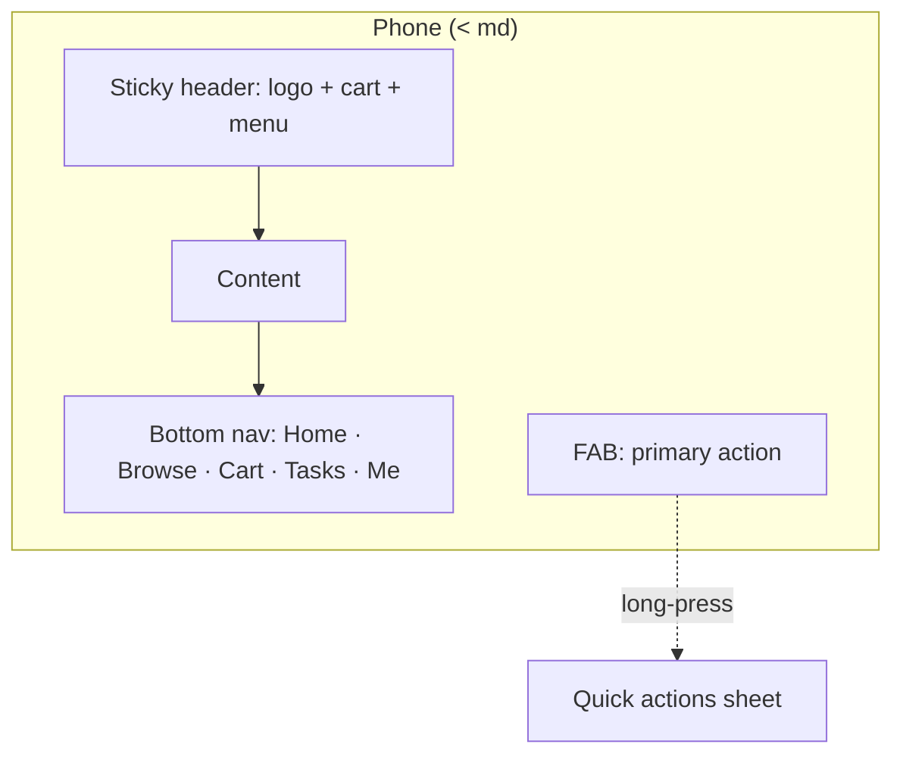
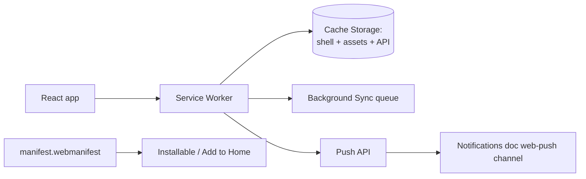

# Mobile Optimization — Multi-Tenant Multi-Vendor SaaS

A world-class mobile experience across Android, iOS, tablets, and every
screen size — fast and usable even on slow networks. This is a
**cross-cutting concern**, not a feature module: it defines the
responsive system, touch interactions, performance budget, PWA, offline,
and accessibility standards that *every* module's UI conforms to.

It builds directly on shipped work — the responsiveness pass
(commit `6cba2d1`) already established the breakpoint system, overflow
guards, mobile navigation, and the table→card collapse pattern. This doc
formalizes those into a standard and specs the forward-looking pieces
(PWA, offline, push, native).

Cross-references:
- Per-module responsive sections already written (each module doc has a mobile/responsive note).
- [`notifications-architecture.md`](notifications-architecture.md) — push notifications + the web-push channel.
- [`ai-architecture.md`](ai-architecture.md) — voice assistant + smart shortcuts (§24).
- [`analytics-architecture.md`](analytics-architecture.md) — mobile session/device analytics.

Follows the shipped/planned convention of the other ten docs.

## Table of contents

1. [Mobile strategy](#1-mobile-strategy)
2. [Responsive design system](#2-responsive-design-system)
3. [Mobile navigation](#3-mobile-navigation)
4. [Dashboard mobile](#4-dashboard-mobile)
5. [Marketplace mobile](#5-marketplace-mobile)
6. [Project management mobile](#6-project-management-mobile)
7. [Forms optimization](#7-forms-optimization)
8. [Touch experience](#8-touch-experience)
9. [Performance optimization](#9-performance-optimization)
10. [Offline support](#10-offline-support)
11. [Progressive Web App](#11-progressive-web-app)
12. [Mobile notifications](#12-mobile-notifications)
13. [Mobile analytics](#13-mobile-analytics)
14. [Accessibility](#14-accessibility)
15. [Mobile security](#15-mobile-security)
16. [Database & API optimization](#16-database--api-optimization)
17. [Frontend architecture](#17-frontend-architecture)
18. [Mobile UI components](#18-mobile-ui-components)
19. [Multi-tenant mobile](#19-multi-tenant-mobile)
20. [AI-powered mobile](#20-ai-powered-mobile)
21. [Testing strategy](#21-testing-strategy)
22. [Performance targets](#22-performance-targets)
23. [Future roadmap](#23-future-roadmap)

### Status snapshot (today)

| Layer | Shipped (responsiveness pass `6cba2d1` + design tokens) | Planned in this doc |
|---|---|---|
| **Breakpoints** | Tailwind defaults + `Container` responsive scale (`max-w-6xl → xl:7xl → 2xl:[1400px]`) | formalized 6-tier token table |
| **Overflow guards** | `html { overflow-x: hidden }` + `body { overflow-x: clip; min-height: 100dvh }` | — |
| **Navigation** | Scroll-aware sticky header + animated `max-h` mobile drawer (storefront-layout) | bottom nav, FAB, thumb-zone optimization |
| **Table→card** | Admin product list collapses to stacked cards `< md` | generalized `<ResponsiveTable>` |
| **Typography** | Inter + JetBrains Mono, fluid heading scale | fluid `clamp()` type scale |
| **Forms** | shadcn inputs, mobile-friendly | auto-save drafts, keyboard hints |
| **PWA** | none | manifest + service worker + installable |
| **Offline** | none | cached shell + background sync |
| **Push** | none (notifications doc specs web-push channel) | wired to service worker |
| **Touch** | tap targets ≥ h-9; click-to-confirm deletes | swipe actions, long-press, pull-to-refresh |

> The responsive *foundation* is shipped and verified (the responsiveness pass tested 375/768/1280/1920 with no horizontal scroll). The gap is the *app-like* layer — PWA, offline, push, native touch gestures — which this doc specs.

---

## 1. Mobile strategy

### Principles

- **Mobile-first**: design the smallest screen first, enhance upward. Tailwind's mobile-first breakpoints (`sm:`/`md:`/`lg:`) are unprefixed-is-mobile — the shipped code already follows this.
- **Responsive, not adaptive**: one fluid codebase, not separate mobile/desktop sites. Inertia + React renders the same components, reflowed by CSS.
- **Progressive enhancement**: core content + navigation work without JS; rich interactions (drag-drop, real-time) layer on. Offline + PWA degrade gracefully.
- **Accessibility-first**: WCAG 2.1 AA is the floor, not an afterthought (§14).

### Experience goals

- **Usable one-handed** on a phone — primary actions in the thumb zone.
- **Fast on 3G** — interactive in < 3s on a mid-tier Android over slow networks (§22).
- **Feels native** — installable, offline-capable, push-enabled (PWA, §11).
- **Consistent** — the same design tokens + components everywhere, so mobile isn't a second-class afterthought.

---

## 2. Responsive design system

### Breakpoints (formalized from the shipped Tailwind scale)

| Token | Min width | Target | Tailwind |
|---|---|---|---|
| Mobile S | 0 | small phones (iPhone SE, 360px Android) | (unprefixed) |
| Mobile L | 480px | large phones | `xs:` (custom) |
| Tablet | 768px | tablets, landscape phones | `md:` |
| Laptop | 1024px | laptops | `lg:` |
| Desktop | 1280px | desktops | `xl:` |
| Ultra-wide | 1536px | 4K / ultra-wide | `2xl:` |

The shipped `Container` already steps `max-w-6xl → xl:max-w-7xl →
2xl:max-w-[1400px]` — this table just names the tiers. A custom `xs`
(480px) breakpoint is added to `tailwind.config` for the large-phone tier.

### Layout rules

- **Flexible grids** — `grid-cols-1 sm:grid-cols-2 lg:grid-cols-3 2xl:grid-cols-4` (the shipped product grid pattern).
- **Fluid typography** — `clamp()`-based heading scale so type scales smoothly between breakpoints instead of jumping:
  ```css
  --text-display: clamp(1.75rem, 1.2rem + 2.5vw, 3rem);
  ```
- **Responsive spacing** — section padding scales (`py-12 sm:py-16 lg:py-24`); the shipped `Section`/`Container` primitives encapsulate this.
- **Adaptive containers** — `Container` (shipped) handles gutters + max-width per tier; content never touches screen edges on mobile, never sprawls on ultra-wide.

### Overflow discipline (shipped)

`html { overflow-x: hidden }` + `body { overflow-x: clip }` + `min-height: 100dvh`
(dynamic viewport unit, correct under mobile browser chrome) — a stray
element can never trigger horizontal scroll. This is the single most
important mobile-correctness guard and it's already in place.

---

## 3. Mobile navigation

### Shipped

- **Scroll-aware sticky header** — transparent at top, backdrop-blur on scroll (storefront-layout).
- **Animated drawer** — hamburger toggles an `max-h` transition drawer with nav links + auth CTAs, `md:hidden`.

### Planned

- **Bottom navigation** — for authenticated app views (dashboard/marketplace), a fixed bottom bar with 4–5 primary destinations in the thumb zone. Hidden on desktop (`md:hidden`), respects `env(safe-area-inset-bottom)` for notched devices.
- **FAB (floating action button)** — context primary action (new task, new product) bottom-right, above the bottom nav.
- **Quick actions** — long-press the FAB or a nav item for a radial/sheet of secondary actions.



### Thumb-zone + one-handed

- Primary actions in the bottom 1/3 of the screen (reachable thumb arc).
- Destructive actions guarded (confirm dialog — shipped pattern on delete).
- Back/close always top-left or via swipe.

---

## 4. Dashboard mobile

The dashboard module's role dashboards already render mobile-friendly
(stat cards stack to one column). Mobile-specific optimization:

- **Stat cards** — 1-col on mobile S, 2-col on mobile L, grid on tablet+.
- **Charts** — simplified on mobile (fewer ticks, no legend overflow); horizontal scroll for wide time-series with a snap-scroll container; tap a point for a tooltip (no hover on touch).
- **Notifications** — the bell opens a full-height bottom sheet on mobile instead of a dropdown.
- **Activity feed** — infinite scroll, condensed rows, relative timestamps.
- Widgets reorder so the most important (revenue/tasks) is first on a phone.

---

## 5. Marketplace mobile

Builds on the shipped storefront (products index/show, cart — all
responsive):

- **Product listings** — 1–2 col cards on mobile (shipped grid); filters move into a bottom-sheet "Filters" trigger instead of a sidebar.
- **Vendor stores** — banner scales, tabbed sections.
- **Product pages** — gallery is a swipeable carousel; sticky bottom "Add to cart" bar with price (thumb-zone CTA); tabs (overview/docs/reviews) instead of long scroll.
- **Search** — full-screen search overlay with recent + suggestions; faceted filters in a bottom sheet.
- **Reviews** — collapsed by default, "show more".
- **Checkout** — single-column, minimal steps, autofill-friendly, sticky "Pay" bar, Apple Pay / Google Pay buttons (PWA payment request API).

Reducing friction: fewer fields, autofill, wallet payment buttons, a
sticky CTA so the action is always reachable.

---

## 6. Project management mobile

The projects/tasks docs spec Kanban/Calendar/Timeline. Mobile
adaptations:

- **Projects** — card list, swipe for quick actions (archive/pin).
- **Tasks** — list view is the mobile default (Kanban is hard on a phone); a task opens in a full-screen sheet, not a modal.
- **Kanban** — on mobile, columns become horizontally swipeable (one column at a time, snap-scroll) instead of a cramped multi-column board; drag-drop falls back to a "move to column" action sheet (touch drag-drop across columns is error-prone).
- **Milestones** — vertical timeline (the horizontal strip is desktop-only).
- **Activity timeline** — infinite-scroll vertical feed.

The principle: replace precision-pointer interactions (multi-column
drag) with touch-friendly equivalents (action sheets, single-column
swipe).

---

## 7. Forms optimization

- **Smart validation** — inline, on blur, with clear error text below the field (shipped `InputError` pattern); never validate-on-every-keystroke (jarring on mobile).
- **Auto-save drafts** — long forms (product creation) auto-save to `localStorage` keyed by form + user, restored on return; a "draft restored" toast. Prevents loss on a backgrounded tab / dropped connection.
- **Mobile keyboard optimization** — correct `inputmode`/`type` per field: `inputmode="numeric"` for prices, `type="email"`, `type="tel"`, `autocomplete` tokens (`cc-number`, `email`, `one-time-code` for OTP), `enterkeyhint="next"/"done"`.
- **Big touch targets** — inputs ≥ 44px tall; labels tappable; spacing prevents fat-finger mis-taps.
- **Reduce typing** — selects over free text, sane defaults, remembered values.

---

## 8. Touch experience

| Interaction | Implementation |
|---|---|
| **Touch targets** | Min 44×44px (WCAG 2.5.5); shipped buttons are `h-9`+ with padding |
| **Swipe actions** | Swipe a list row to reveal actions (delete/archive); `useSwipe` hook over pointer events |
| **Drag-drop alternative** | Touch DnD is unreliable → "move to…" action sheets on mobile (§6) |
| **Long-press menus** | Context actions via long-press (500ms) → bottom sheet |
| **Pull-to-refresh** | On feed/list pages, `usePullToRefresh` triggers a refetch |
| **Momentum/snap scroll** | Carousels + Kanban columns use CSS scroll-snap |

All touch handlers use passive listeners where possible (no scroll
jank) and respect `prefers-reduced-motion`.

---

## 9. Performance optimization

| Technique | Approach |
|---|---|
| **Code splitting** | Vite + Inertia already lazy-loads page components per route; extend with `React.lazy` for heavy widgets (charts, editor) |
| **Lazy loading** | Images `loading="lazy"`; below-the-fold widgets mount on intersection; route-level data deferred via Inertia partial reloads |
| **Asset optimization** | Vite production build (minify, tree-shake, hashed assets); the shipped `npm run build` already does this |
| **Image compression** | Responsive `srcset` + modern formats (WebP/AVIF); product/branding images optimized via the GD pipeline (branding doc); CDN-served |
| **Font optimization** | `display=swap` (shipped on Bunny Fonts); preconnect (shipped); subset to used weights; `font-display` prevents invisible-text |
| **Bundle optimization** | Manual chunks split vendor (React) from app; analyze with `rollup-plugin-visualizer`; keep the main bundle lean (the welcome page already dropped 48→26KB in the redesign) |

Targets: fast First Paint (critical CSS inline), fast TTI (defer
non-critical JS), low memory (virtualized long lists — §16).

---

## 10. Offline support

Layered on the PWA service worker (§11):

- **Offline page** — a branded fallback when a navigation fails with no cache.
- **Cached content** — the app shell (HTML/CSS/JS) + last-viewed data cached (stale-while-revalidate); a customer can browse recently-seen products offline.
- **Background sync** — queued mutations (add to cart, submit review) when offline are replayed on reconnect via the Background Sync API; the UI shows "will sync when online".
- **Offline indicator** — a banner when the connection drops; actions that need the network are disabled with a clear message.

Strategy per resource:
- App shell → cache-first.
- API reads → stale-while-revalidate.
- API writes → network-first, queued on failure.

---

## 11. Progressive Web App



### Implementation plan

1. **Manifest** (`public/manifest.webmanifest`) — name, icons (192/512/maskable), `theme_color`/`background_color` (from tenant branding, §19), `display: standalone`, `start_url`, `shortcuts` (deep links to dashboard/cart/new-task).
2. **Service worker** — via `vite-plugin-pwa` (Workbox under the hood): precache the app shell, runtime-cache strategies (§10), and the push handler.
3. **Installable** — `beforeinstallprompt` captured → a custom "Install app" CTA (not the browser's default); tracked in analytics.
4. **Offline mode** — §10 caching.
5. **Push notifications** — the service worker's `push` event renders a notification; wired to the notifications doc's web-push channel (§12).
6. **App shortcuts** — manifest `shortcuts` for quick actions from the home-screen icon long-press.
7. **Background updates** — SW `skipWaiting` + a "new version available, refresh" toast.

PWA is the pragmatic path to an app-like experience without a native
build — installable, offline, push — shipping far faster than React
Native (§23).

---

## 12. Mobile notifications

(Delivery owned by [`notifications-architecture.md`](notifications-architecture.md).)

- **Push** — web push via the service worker (VAPID), wired to the notifications web-push channel. Native push (FCM/APNs) when the native app ships (§23).
- **In-app** — the bell + a bottom-sheet feed on mobile (§4).
- **Badge counters** — the app icon badge via the Badging API (`navigator.setAppBadge(unreadCount)`); the in-app bell badge is shipped.
- **Deep linking** — a notification's `action_url` (notifications doc) opens the right screen; PWA + native handle the deep link, restoring context.

Notification UX respects quiet hours + per-channel preferences
(notifications doc §6) — mobile push obeys the same rules.

---

## 13. Mobile analytics

(Pipeline owned by [`analytics-architecture.md`](analytics-architecture.md).)

Mobile-specific dimensions on `analytics_events`: device type
(phone/tablet/desktop), OS, screen size bucket, connection type,
PWA-installed flag, viewport. Tracked: mobile sessions, device mix,
screen sizes, user flows, drop-off points (esp. checkout funnel on
mobile vs desktop).

Generates optimization insights: "checkout drop-off is 2× higher on
mobile S — the payment form needs work". Feeds the AI analytics
narrative (analytics §23).

---

## 14. Accessibility

WCAG 2.1 AA baseline:

| Requirement | Implementation |
|---|---|
| **Screen reader** | Semantic HTML, ARIA labels (shipped on cart/menu/theme toggle), `aria-live` for dynamic content (notifications, toasts) |
| **Keyboard nav** | All interactive elements focusable + operable; visible focus ring (shipped `focus-visible:ring`); skip-to-content link |
| **High contrast** | Tokens meet 4.5:1 (body) / 3:1 (large); dark + light both audited; respects `prefers-contrast` |
| **Scalable text** | `rem` units; layout holds at 200% zoom (no clipping); no `user-scalable=no` in the viewport meta |
| **Touch targets** | ≥ 44px (WCAG 2.5.5) |
| **Motion** | `prefers-reduced-motion` disables non-essential animation (the mobile menu transition, etc.) |
| **Forms** | Labels associated, errors announced, `autocomplete` set |

Inclusive design is a floor across every component (§18), not a
mobile-only concern — but mobile is where it's most often tested
(screen readers, zoom, one-handed).

---

## 15. Mobile security

- **Secure authentication** — the shipped auth (Sanctum + 2FA + session management); biometric unlock when native (§23) or via WebAuthn/passkeys on supported mobile browsers.
- **Session protection** — short-lived tokens, idle timeout, the shipped session-management page (revoke other devices); device trust list.
- **Secure local storage** — no secrets in `localStorage` (XSS-readable); auth via httpOnly cookies (shipped Sanctum SPA mode); only non-sensitive draft data + cache in storage.
- **Device trust management** — the session-management module tracks devices; a new device triggers a verification email (auth module).
- **PWA/SW safety** — service worker served over HTTPS only; cache excludes authenticated API responses with sensitive data unless scoped per-user + cleared on logout.

---

## 16. Database & API optimization

Bandwidth is the mobile bottleneck. (API-first design — marketplace doc.)

| Technique | Approach |
|---|---|
| **Payload size** | API returns only needed fields (sparse fieldsets via `?fields=`); no over-fetching; Inertia partial reloads fetch only changed props |
| **Pagination** | Cursor pagination on feeds/lists (shipped pattern across docs) — cheap + stable |
| **Infinite scroll** | Intersection-observer triggered next-page fetch; React Query caches pages |
| **Data caching** | Redis on the server (shipped across modules); React Query + SWR on the client; service-worker cache for offline |
| **Query optimization** | Eager-load to avoid N+1 (shipped `with()` usage); covering indexes (shipped); denormalized aggregates (ratings, daily_metrics) |
| **Compression** | gzip/brotli on API responses; images as WebP/AVIF |
| **Conditional requests** | ETags / `If-None-Match` → 304 for unchanged data, zero bytes on the wire |

---

## 17. Frontend architecture

Mobile-first React, extending the shipped structure:

```
resources/js/
├── hooks/mobile/
│   ├── useBreakpoint.ts        # current tier (matchMedia)
│   ├── useSwipe.ts             # swipe gesture over pointer events
│   ├── useLongPress.ts
│   ├── usePullToRefresh.ts
│   ├── useMediaQuery.ts
│   ├── useInstallPrompt.ts     # PWA beforeinstallprompt
│   └── useOnline.ts            # connection status
├── components/mobile/
│   ├── BottomNav.tsx
│   ├── BottomSheet.tsx         # radix/vaul drawer
│   ├── FloatingActionButton.tsx
│   ├── ResponsiveTable.tsx     # table on md+, cards below (generalizes the shipped admin pattern)
│   ├── MobileFilters.tsx       # filters in a bottom sheet
│   ├── MobileSearch.tsx        # full-screen search overlay
│   ├── SwipeableRow.tsx
│   ├── Carousel.tsx            # scroll-snap gallery
│   ├── OfflineBanner.tsx
│   └── InstallPrompt.tsx
├── lib/mobile/
│   ├── breakpoints.ts          # tier constants (mirror Tailwind)
│   ├── safe-area.ts            # env(safe-area-inset-*) helpers
│   └── viewport.ts
├── service-worker/
│   ├── sw.ts                   # Workbox config (precache + runtime)
│   └── push.ts                 # push event handler
└── (shipped) components/ui/*, layouts/*, components/ui/container.tsx
```

- **`useBreakpoint`** is the single source for "are we on mobile?" — components branch on it for layout, not duplicated media queries.
- Shared mobile components are **composable primitives** (BottomSheet, ResponsiveTable) reused across modules — no per-module mobile fork.

---

## 18. Mobile UI components

Reusable, with design standards:

| Component | Standard |
|---|---|
| **Mobile cards** | Full-width, rounded, tappable, ≥ 44px actions (the shipped admin card pattern, generalized) |
| **Bottom sheets** | Drag-handle, snap points, backdrop dismiss, `safe-area-inset-bottom` padding; replaces modals on mobile |
| **Mobile tables** | `<ResponsiveTable>` — table on md+, card list below (shipped on admin products) |
| **Mobile filters** | Trigger button → bottom sheet with apply/reset; badge shows active count |
| **Mobile search** | Full-screen overlay, recent + suggestions, debounced |
| **Mobile navigation** | Bottom nav + drawer (§3) |

All built on the shipped design tokens (Inter, indigo primary, radius
scale) + shadcn primitives, dark-mode aware, accessible (§14).

---

## 19. Multi-tenant mobile

Each tenant customizes the mobile experience (white-label, via the
shipped `BrandingService` + branding doc):

- **Branding** — logo/colors flow into the PWA manifest (`theme_color`, icons) + the app shell.
- **Mobile menus** — tenant configures bottom-nav destinations.
- **Notification preferences** — per-tenant push defaults (notifications doc §19).
- **Install experience** — the installed PWA shows the tenant's name + icon (white-label home-screen presence).

A tenant's customers install *their* branded PWA, not a generic
platform app.

---

## 20. AI-powered mobile

(Engine owned by [`ai-architecture.md`](ai-architecture.md).)

- **Smart shortcuts** — the AI suggests the next action based on context + history (ai §13 automation + manifest shortcuts).
- **AI recommendations** — personalized product/vendor recs (marketplace + ai §14), surfaced in a mobile carousel.
- **Context-aware suggestions** — "you have 3 tasks due today" on app open (ai productivity nudge).
- **Voice assistant** — speech-to-text → the AI assistant (ai §2) for hands-free queries; Web Speech API on supported browsers, native on the app (§23).

All credit-metered + opt-in (ai §17).

---

## 21. Testing strategy

| Test | Approach |
|---|---|
| **Responsiveness** | The shipped preview-resize verification (375/768/1280/1920) — extend to a CI visual-regression suite (Playwright screenshots per breakpoint) |
| **Device compatibility** | BrowserStack / real-device matrix: iPhone (Safari), Android (Chrome), iPad |
| **Touch interactions** | Playwright touch emulation for swipe/long-press/pull-to-refresh |
| **Performance** | Lighthouse CI in the pipeline, budgets enforced (§22); WebPageTest on throttled 3G |
| **Accessibility** | axe-core in CI + manual screen-reader passes (VoiceOver, TalkBack) |
| **PWA** | Lighthouse PWA audit; install + offline + push smoke tests |

Targets: Android phones, iPhones, tablets. The responsiveness pass
already proved the no-horizontal-scroll + table-collapse behavior across
four viewports — this formalizes it into automated regression.

---

## 22. Performance targets

| Metric | Target | Technique |
|---|---|---|
| **Lighthouse (mobile)** | > 90 | the full stack below |
| **First Contentful Paint** | < 1.5s | critical CSS, preconnect (shipped), small initial bundle |
| **Largest Contentful Paint** | < 2.5s | image optimization + `srcset`, lazy below-fold, CDN |
| **Time To Interactive** | < 3s | code splitting, defer non-critical JS, minimal hydration |
| **CLS** | < 0.1 | reserved image/space dimensions, no layout-shifting fonts (`display=swap` + size-adjust) |
| **Total bundle (initial)** | < 200KB gzip | manual chunks, tree-shake, route splitting |

Enforced by **Lighthouse CI budgets** in the pipeline — a regression
that blows the budget fails the build.

---

## 23. Future roadmap

| Feature | Approach |
|---|---|
| **React Native app** | Reuse the API-first backend (marketplace doc §17); share types + design tokens; the PWA validates the UX first |
| **Flutter app** | Same API; alternative if the team prefers Dart |
| **Biometric auth** | WebAuthn/passkeys on mobile web now; native biometric (Face ID / fingerprint) in the app |
| **Mobile wallet** | Apple Pay / Google Pay via Payment Request API (PWA) now; native wallet in the app |
| **Offline project management** | Extend the offline layer (§10) — local-first task edits synced on reconnect (CRDT/queue) |
| **Voice commands** | Web Speech API (PWA) → native speech in the app, wired to the AI assistant |

The PWA (§11) is the bridge: it delivers installable + offline + push +
wallet *today*, and de-risks the native build by proving the mobile UX
before committing to React Native.

---

## File map for the next phase

| Path | Status |
|---|---|
| `vite.config.js` — add `vite-plugin-pwa` (Workbox) | planned |
| `public/manifest.webmanifest` (generated from tenant branding) | planned |
| `resources/js/service-worker/{sw,push}.ts` | planned |
| `tailwind.config` — add `xs` (480px) breakpoint + `clamp()` type scale | planned |
| `resources/js/hooks/mobile/{useBreakpoint,useSwipe,useLongPress,usePullToRefresh,useMediaQuery,useInstallPrompt,useOnline}.ts` | planned |
| `resources/js/components/mobile/{BottomNav,BottomSheet,FloatingActionButton,ResponsiveTable,MobileFilters,MobileSearch,SwipeableRow,Carousel,OfflineBanner,InstallPrompt}.tsx` | planned |
| `resources/js/lib/mobile/{breakpoints,safe-area,viewport}.ts` | planned |
| `resources/css/app.css` — fluid type scale, safe-area utilities (extends shipped overflow guards) | planned |
| `.github/workflows/lighthouse.yml` (Lighthouse CI budgets) | planned |
| `tests/e2e/mobile/*` (Playwright responsive + touch + PWA) | planned |

The next pass wires the PWA (manifest + service worker + install
prompt) and the core mobile primitives (`BottomNav`, `BottomSheet`,
`ResponsiveTable` generalized from the shipped admin pattern) — making
the app installable + offline-capable before the per-module mobile
refinements (Kanban swipe, checkout sticky bar) layer on.

---

## The architecture doc set

This is the eleventh architecture doc — and the first cross-cutting one
(mobile is a concern across all modules, not a feature module). The
complete set under `docs/`:

1. `dashboard-architecture.md`
2. `payments-architecture.md`
3. `projects-architecture.md`
4. `tasks-architecture.md`
5. `notifications-architecture.md`
6. `billing-architecture.md`
7. `ai-architecture.md`
8. `analytics-architecture.md`
9. `workflow-automation-architecture.md`
10. `marketplace-architecture.md`
11. `mobile-architecture.md`

All in the same shipped-vs-planned format, cross-referenced, each
ending with a concrete "File map for the next phase".
