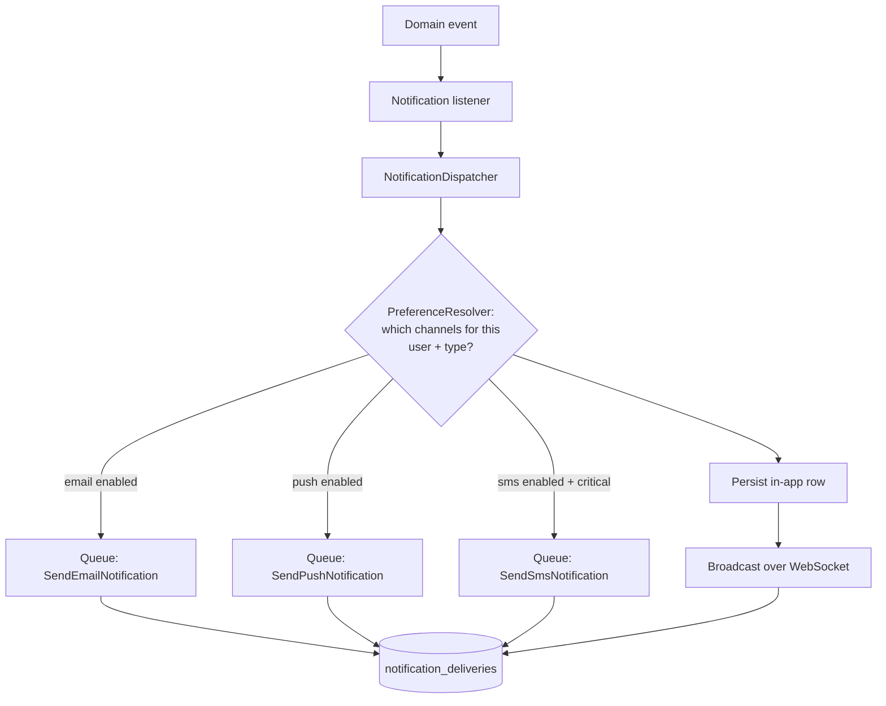
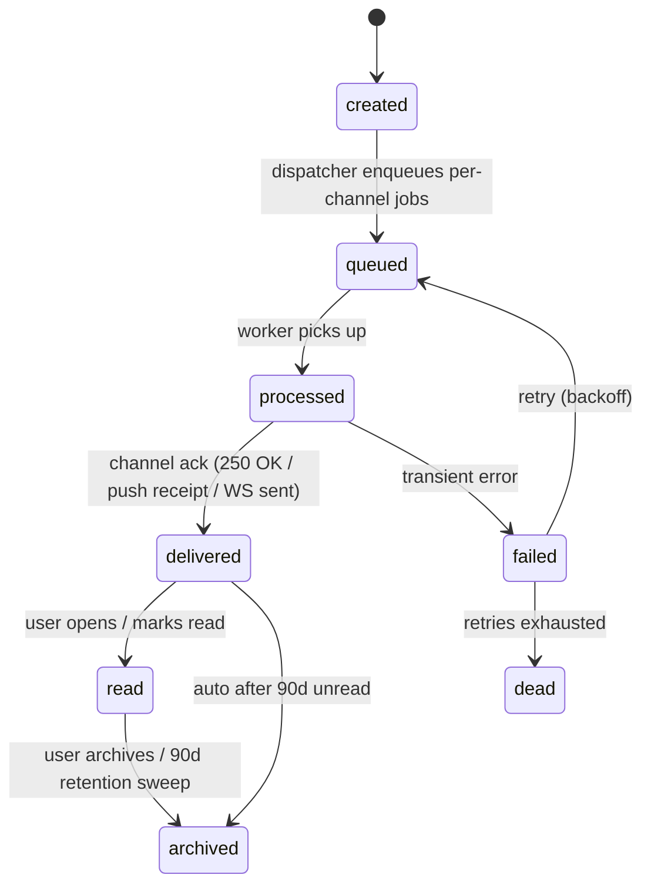
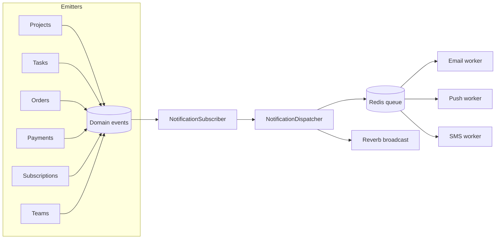

# Notifications Module — Multi-Vendor SaaS Marketplace

An enterprise-grade notification system: multi-channel delivery
(in-app, email, push, SMS, WebSocket), an event-driven fan-out engine,
per-user preferences, tenant-customizable templates, a notification
center, activity feed, analytics, and AI prioritization.

This is the **platform-wide companion** to the per-module notification
sections already written. Where the dashboard/projects/tasks docs list
*which* events fire, this doc owns *how* a notification is fanned out,
delivered across channels, deduped, batched, and tracked. Those docs
defer here for delivery mechanics.

Follows the shipped/planned status convention of
[`dashboard-architecture.md`](dashboard-architecture.md),
[`payments-architecture.md`](payments-architecture.md),
[`projects-architecture.md`](projects-architecture.md), and
[`tasks-architecture.md`](tasks-architecture.md).

## Table of contents

1. [Overview](#1-overview)
2. [Notification types](#2-notification-types)
3. [Channels](#3-channels)
4. [Lifecycle](#4-lifecycle)
5. [Priority levels](#5-priority-levels)
6. [User preferences](#6-user-preferences)
7. [Real-time system](#7-real-time-system)
8. [Event-driven architecture](#8-event-driven-architecture)
9. [Templates](#9-templates)
10. [Notification center](#10-notification-center)
11. [Activity feed](#11-activity-feed)
12. [Database design](#12-database-design)
13. [API design](#13-api-design)
14. [Frontend architecture](#14-frontend-architecture)
15. [Security](#15-security)
16. [Performance](#16-performance)
17. [Analytics & reporting](#17-analytics--reporting)
18. [AI-powered notifications](#18-ai-powered-notifications)
19. [Multi-tenant customization](#19-multi-tenant-customization)
20. [Future scalability](#20-future-scalability)

### Status snapshot (today)

| Layer | Shipped (`2026_06_06`, dashboard module) | Planned in this doc |
|---|---|---|
| **Schema** | `notifications` (tenant_id, user_id, type, level, title, body, action_url, metadata, read_at) + covering indexes; `activity_logs` | + `notification_templates`, `notification_preferences`, `notification_channels`, `notification_deliveries`, `notification_logs`, `notification_events` |
| **Model** | `Notification`, `ActivityLog` | + `NotificationTemplate`, `NotificationPreference`, `NotificationDelivery` |
| **Service** | `NotificationService`: notify / feedFor / unreadCount / markRead / markAllRead / delete | + `NotificationDispatcher` (multi-channel fan-out), `ChannelRouter`, `PreferenceResolver`, `TemplateRenderer` |
| **Channels** | in-app (DB row) only | + email, push (web/native), SMS, WebSocket (Reverb) |
| **Real-time** | none | Reverb private + presence channels, live counters |
| **Frontend** | bell unread count (dashboard) | notification center page, drawer, settings panel, activity timeline |

> The shipped `NotificationService::notify()` writes the in-app row. This doc extends it into a **dispatcher** that, after persisting the row, fans the notification out to every channel the user has enabled for that notification type — without changing the existing call sites.

---

## 1. Overview

### Business goals

- **Engagement**: bring users back to the platform when something needs them (a sale, an assignment, an approval).
- **Trust & transparency**: customers always know the state of their order/project; vendors never miss a request.
- **Workflow automation**: notifications are the connective tissue of the event-driven platform — a milestone approval notifies the vendor *and* releases payment.
- **Reduced support load**: proactive alerts ("trial ending", "invoice issued") cut inbound tickets.

### UX goals

- **Non-intrusive but reliable** — the bell badge is always accurate; nothing important is missed.
- **Respectful** — per-user, per-channel, per-type preferences; quiet hours; digest options.
- **Fast** — in-app notifications appear in < 1s via WebSocket; the bell count is a single cached query.
- **Actionable** — every notification has an `action_url` deep-linking to the relevant screen.

### Real-time goals

- Instant in-app delivery via WebSocket; the bell increments live without a poll.
- Live counters (unread badge) and presence (who's online) shared across the platform.

### Productivity benefits

- Team members see assignments the moment they happen.
- Digest emails (AI-summarized, §18) replace notification fatigue for low-priority events.
- Smart prioritization surfaces the 3 things that matter, not 40 that don't.

### Role across the platform

Every module emits domain events; the notifications module is the
**single subscriber** that decides who to tell, on which channel, and
how urgently. This keeps each feature module ignorant of delivery
mechanics — it just `event()`s.

---

## 2. Notification types

Types are namespaced strings (`<domain>.<event>`), matching the
`notifications.type` column already in use. Categories:

### System

`account.created`, `subscription.updated`, `subscription.trial_ending`,
`plan.upgraded`, `plan.downgraded`, `security.new_login`,
`security.password_changed`, `security.2fa_enabled`.

### Project

`project.created`, `project.approved`, `project.completed`,
`project.milestone_completed`, `project.revision_requested`,
`project.delivered`. (Taxonomy owned by
[`projects-architecture.md`](projects-architecture.md) §12.)

### Task

`task.assigned`, `task.updated`, `task.due_soon`, `task.completed`,
`task.overdue`, `task.blocked`. (Owned by
[`tasks-architecture.md`](tasks-architecture.md) §13.)

### Team

`team.invitation`, `team.comment`, `team.mention`, `team.assignment`.

### Customer

`order.created`, `order.delivered`, `invoice.issued`,
`payment.confirmed`, `refund.requested`.

### Vendor

`vendor.customer_request`, `vendor.new_sale`, `vendor.withdrawal_approved`,
`vendor.review_received`.

### Registry

Each type is registered in a `config/notifications.php` catalogue that
declares its default level, default channels, and which preference
group it belongs to — so a new type is one config entry plus a template.

```php
// config/notifications.php
'types' => [
    'order.created' => [
        'level' => 'high',
        'group' => 'customer',
        'channels' => ['in_app', 'email'],
        'template' => 'order.created',
    ],
    'task.assigned' => [
        'level' => 'medium',
        'group' => 'team',
        'channels' => ['in_app', 'push'],
        'template' => 'task.assigned',
    ],
    // …
],
```

---

## 3. Channels

A **channel** is a delivery transport. Each implements a common
interface so the dispatcher treats them uniformly:

```php
interface NotificationChannel
{
    public function key(): string;                       // 'email', 'push', …
    public function send(Notification $n, User $u, RenderedTemplate $t): DeliveryResult;
    public function isAvailableFor(User $u): bool;        // has email? has push token?
}
```

| Channel | Transport | Notes |
|---|---|---|
| **In-app** | `notifications` table row + WebSocket broadcast | Source of truth; always written |
| **Email** | Laravel Mailable → queued → SMTP/SES | Branded per-tenant (§19); deduped & digestable |
| **Push (web)** | Web Push API + service worker (VAPID) | Subscription stored in `notification_channels` |
| **Push (native)** | FCM / APNs via a push provider | Same subscription table, different `provider` |
| **SMS** | Twilio / Vonage via queued job | Critical-only by default; opt-in; rate-limited & cost-capped |
| **WebSocket** | Laravel Reverb | Real-time in-app delivery + live counters (§7) |

### Dispatch flow



The in-app row is written synchronously (so the bell is instantly
correct); every other channel is a **queued job** writing a
`notification_deliveries` row tracking its own state.

---

## 4. Lifecycle



### State tracking

- **In-app row** carries `read_at` (null = unread) and `archived_at`.
- **Per-channel `notification_deliveries`** carries `status`
  (`queued → processing → delivered → failed → dead`), `attempts`,
  `delivered_at`, `error`. Every transition is timestamped.
- A `notification_logs` append-only table records each transition for
  audit + analytics (delivery rates, latency percentiles).

This separation matters: a single logical notification can be
`delivered` in-app but `failed` over email — the per-channel row tells
the true story, and the analytics in §17 read from it.

---

## 5. Priority levels

| Level | Use | Delivery rule |
|---|---|---|
| **critical** | Security breach, payment failure, account suspension | All channels incl. SMS; bypass quiet hours; never batched; WebSocket + push immediately |
| **high** | New sale, order delivered, milestone approval, task overdue | In-app + email + push immediately; respects quiet hours (queued to morning) |
| **medium** | Task assigned, new comment, invoice issued | In-app + push; email batched into hourly digest if enabled |
| **low** | Task updated, minor status changes | In-app only by default; email only in daily digest |
| **informational** | Tips, announcements, marketing | In-app banner; email only if marketing opt-in; never push/SMS |

The level comes from the type registry (§2) but can be overridden per
emission. The shipped `notifications.level` enum
(`info|success|warning|critical`) maps onto these — the doc's richer
5-level scale is added as a `priority` column; `level` stays for the
visual badge color.

### Quiet hours

Per-user `quiet_hours_start`/`quiet_hours_end` (in their timezone).
Non-critical notifications arriving in the window are held and released
at the window's end (batched). Critical always punches through.

---

## 6. User preferences

### `notification_preferences`

A per-user matrix of **(group × channel) → enabled**, plus globals.

```php
Schema::create('notification_preferences', function (Blueprint $t) {
    $t->id();
    $t->foreignId('tenant_id')->nullable()->constrained()->nullOnDelete();
    $t->foreignId('user_id')->constrained()->cascadeOnDelete();
    $t->string('group', 32);              // system|project|task|team|customer|vendor|marketing
    $t->boolean('in_app')->default(true);
    $t->boolean('email')->default(true);
    $t->boolean('push')->default(false);
    $t->boolean('sms')->default(false);
    $t->timestamps();
    $t->unique(['user_id', 'group']);
});
```

Plus global toggles on the user (timezone, quiet hours, master
email/push switches, digest cadence) in `user_notification_settings`:

```php
Schema::create('user_notification_settings', function (Blueprint $t) {
    $t->id();
    $t->foreignId('user_id')->constrained()->cascadeOnDelete()->unique();
    $t->string('timezone', 48)->default('UTC');
    $t->time('quiet_hours_start')->nullable();
    $t->time('quiet_hours_end')->nullable();
    $t->enum('email_digest', ['off', 'hourly', 'daily', 'weekly'])->default('off');
    $t->boolean('marketing_opt_in')->default(false);
    $t->timestamps();
});
```

### Resolution

`PreferenceResolver::channelsFor(User $u, string $type): array` resolves:

1. Look up the type's `group` from the registry.
2. Start from the type's default channels.
3. Intersect with the user's `notification_preferences` for that group.
4. Drop channels the user has no address for (no push token → no push).
5. Apply global master switches + quiet hours.
6. Critical level bypasses 3–5.

Resolution result is cached per (user, type) for 5 min, busted on
preference write.

---

## 7. Real-time system

### Stack

**Laravel Reverb** (self-hosted WebSocket server, Pusher protocol).

### Channels

| Channel | Type | Purpose |
|---|---|---|
| `user.{id}.notifications` | private | Per-user notification stream + bell counter |
| `tenant.{id}.presence` | presence | Who's online in the workspace |
| `project.{id}.chat.{kind}` | private | Project chat (see projects doc §9) |
| `task.{id}` | private | Live task updates (see tasks doc §7) |

### Channel authorization

`routes/channels.php` — every private/presence channel checks tenant +
membership before granting:

```php
Broadcast::channel('user.{userId}.notifications', function (User $u, int $userId) {
    return $u->id === $userId;   // you only get your own stream
});

Broadcast::channel('tenant.{tenantId}.presence', function (User $u, int $tenantId) {
    return $u->belongsToTenant($tenantId)
        ? ['id' => $u->id, 'name' => $u->name, 'avatar' => $u->avatar_url]
        : null;
});
```

### Broadcast events

- `NotificationCreated($notification)` → `user.{id}.notifications`; the React bell listens and increments the counter + prepends the row.
- `UnreadCountChanged($userId, $count)` → keeps the badge exact across tabs/devices.
- Presence join/leave → online-status dots.

### Live counters

The bell badge subscribes to its own channel; on `NotificationCreated`
it increments locally (optimistic) and reconciles against
`UnreadCountChanged`. No polling.

---

## 8. Event-driven architecture

### Principle

Feature modules emit **domain events**; the notifications module
**subscribes**. A module never calls the dispatcher directly — it just
fires an event. This is the SOLID seam: adding a notification for an
existing event is a new listener, zero changes to the emitter.



### Events → listeners → jobs → queues

| Layer | Responsibility |
|---|---|
| **Event** | A plain data object: `OrderDelivered($order)`. Emitted by the feature module. |
| **Listener** | `SendOrderDeliveredNotification` — maps the event to recipients + type, calls the dispatcher. Queued (`ShouldQueue`). |
| **Dispatcher** | `NotificationDispatcher::dispatch($type, $recipients, $context)` — persists in-app rows, resolves channels, enqueues per-channel jobs, broadcasts. |
| **Job** | `SendEmailNotification`, `SendPushNotification`, `SendSmsNotification` — one per channel per recipient; idempotent, retryable. |
| **Queue** | Redis-backed. Separate queues per channel (`notifications-email`, `notifications-push`, `notifications-sms`) so a slow SMS provider can't back up email. |

### Implementation strategy

```php
// app/Listeners/Notifications/SendOrderDeliveredNotification.php
class SendOrderDeliveredNotification implements ShouldQueue
{
    public function __construct(private NotificationDispatcher $dispatcher) {}

    public function handle(OrderDelivered $event): void
    {
        $this->dispatcher->dispatch(
            type: 'order.delivered',
            recipients: [$event->order->customer],
            context: ['order' => $event->order],
        );
    }
}
```

```php
// app/Domain/Notifications/NotificationDispatcher.php
public function dispatch(string $type, iterable $recipients, array $context): void
{
    $meta = config("notifications.types.$type");
    foreach ($recipients as $user) {
        // 1. Persist in-app row (synchronous — bell is instantly correct).
        $notification = $this->service->notify($user, $type, $this->render($type, 'in_app', $context, $user), $meta['level']);

        // 2. Broadcast over WebSocket.
        broadcast(new NotificationCreated($notification))->toOthers();

        // 3. Resolve channels & enqueue.
        foreach ($this->preferences->channelsFor($user, $type) as $channel) {
            if ($channel === 'in_app') continue;            // already done
            $this->enqueueChannel($channel, $notification, $user, $context);
        }
    }
}
```

Jobs are **idempotent**: each `notification_deliveries` row has a
unique `(notification_id, channel)` key, so a retried job updates the
existing delivery row rather than double-sending.

---

## 9. Templates

### `notification_templates`

```php
Schema::create('notification_templates', function (Blueprint $t) {
    $t->id();
    $t->foreignId('tenant_id')->nullable()->constrained()->nullOnDelete(); // null = platform default
    $t->string('type', 64);                  // order.created, …
    $t->string('channel', 16);               // in_app|email|push|sms
    $t->string('locale', 8)->default('en');
    $t->string('subject')->nullable();       // email subject / push title
    $t->text('body');                        // blade-ish template with {{ variables }}
    $t->json('sample_context')->nullable();  // for preview in the admin
    $t->boolean('is_active')->default(true);
    $t->timestamps();
    $t->unique(['tenant_id', 'type', 'channel', 'locale']);
});
```

### Resolution order (most specific wins)

`(tenant, type, channel, user-locale)` →
`(tenant, type, channel, 'en')` →
`(null, type, channel, user-locale)` →
`(null, type, channel, 'en')`.

So a tenant overrides only what they want; everything else falls back
to the platform default.

### Dynamic variables

Templates use a safe subset of Blade (`{{ $order->number }}`,
`{{ $user->name }}`). Rendering goes through `TemplateRenderer` which
binds only the whitelisted `context` keys — no arbitrary code, no
access to the container.

### Localization

`locale` column + the existing i18n system
([from the multi-language work](../lang)). The renderer picks the
recipient's locale, falling back to `en`.

### Branding & tenant customization

Email templates wrap the body in the tenant's branded layout (logo +
colors from `BrandingService`, see [the branding work](../app/Services/BrandingService.php)).
Sender name/address is per-tenant (§19).

---

## 10. Notification center

### Page: `/notifications`

- **Feed** — cursor-paginated, newest first; groups by day.
- **Read/unread** — unread rows have a dot + tinted background; "mark read" on click or hover-action.
- **Categories** — filter chips by group (System / Project / Task / Team / Customer / Vendor).
- **Search** — full-text over title + body.
- **Filters** — level, date range, read state, channel.
- **Bulk actions** — select multiple; mark read; archive; delete.
- **Mark all as read** — single action, optimistic, one `markAllRead` call.

### Drawer (global)

The bell opens a slide-over drawer (not a full navigation) showing the
last ~15 notifications with an infinite-scroll, a "View all" link to
the center, and "Mark all read". Available on every authenticated page.

### UI/UX recommendations

- **Optimistic everything** — mark-read updates instantly, reconciles with the server.
- **Skeleton rows** while the first page loads.
- **Empty state** — friendly "You're all caught up" with the brand mark.
- **Deep links** — clicking a notification marks it read *and* navigates to its `action_url`.
- **Density toggle** — comfortable vs compact.
- **Accessible** — `aria-live="polite"` region announces new notifications for screen readers; the bell has an accurate `aria-label` with the unread count.

---

## 11. Activity feed

Distinct from notifications: the **activity feed** is an objective,
append-only history ("what happened"); notifications are the
*subjective* "what should this user be told". They share event sources
but serve different purposes.

Backed by `activity_logs` (auth/security events, shipped) +
`project_activities` / `task_activity_logs` (domain events, from the
projects/tasks docs). A unified `/activity` view merges them with a
polymorphic subject, filtered by tenant + the viewer's permissions.

Tracks: user actions (login, settings change), project actions
(created, approved), task actions (assigned, completed), vendor actions
(sale, withdrawal), customer actions (order, payment). Append-only;
indexed by `(actor_id, created_at)` and `(subject_type, subject_id)`
for fast audit lookups.

---

## 12. Database design

| Table | Purpose | Key columns | Indexes |
|---|---|---|---|
| `notifications` *(shipped)* | in-app rows | tenant_id, user_id, type, level, title, body, action_url, metadata, read_at | `(user_id, read_at, created_at)`, `(tenant_id, type, created_at)` |
| `notification_preferences` | per-user (group × channel) | user_id, group, in_app, email, push, sms | `UNIQUE(user_id, group)` |
| `user_notification_settings` | per-user globals | user_id, timezone, quiet hours, email_digest, marketing_opt_in | `UNIQUE(user_id)` |
| `notification_templates` | per-channel renderable templates | tenant_id, type, channel, locale, subject, body | `UNIQUE(tenant_id, type, channel, locale)` |
| `notification_channels` | user's push/SMS endpoints | user_id, provider, token, endpoint, is_active | `(user_id, provider, is_active)` |
| `notification_deliveries` | per-channel delivery tracking | notification_id, channel, status, attempts, delivered_at, error | `UNIQUE(notification_id, channel)`, `(status, created_at)` |
| `notification_logs` | append-only transition audit | notification_id, delivery_id, from_state, to_state, meta | `(notification_id, created_at)` |
| `notification_events` | raw emitted events (replay/debug) | type, payload, dispatched_at | `(type, dispatched_at)` |
| `activity_logs` *(shipped)* | security/audit feed | user_id, event, properties, ip, user_agent | `(user_id, event)`, `(created_at)` |

### `notification_deliveries` (the workhorse)

```php
Schema::create('notification_deliveries', function (Blueprint $t) {
    $t->id();
    $t->foreignId('tenant_id')->nullable()->constrained()->nullOnDelete();
    $t->foreignId('notification_id')->constrained()->cascadeOnDelete();
    $t->string('channel', 16);                  // email|push|sms|websocket
    $t->enum('status', ['queued', 'processing', 'delivered', 'failed', 'dead'])->default('queued');
    $t->unsignedSmallInteger('attempts')->default(0);
    $t->timestamp('delivered_at')->nullable();
    $t->text('error')->nullable();
    $t->string('provider_message_id')->nullable();  // SES/Twilio/FCM id for webhooks
    $t->timestamps();
    $t->unique(['notification_id', 'channel']);  // idempotency
    $t->index(['status', 'created_at']);
    $t->index('provider_message_id');             // delivery-webhook lookups
});
```

Provider delivery webhooks (SES bounce, Twilio status, FCM receipt)
look up by `provider_message_id` and advance the row to
`delivered`/`failed` — closing the loop on true deliverability.

---

## 13. API design

Tenant-scoped via `ResolveTenant` + global scope; cross-tenant → 404.

| Verb | URL | Purpose |
|---|---|---|
| `GET` | `/notifications` | Feed (cursor, filter by `group`, `level`, `read`, `q`) |
| `GET` | `/notifications/unread-count` | Badge count (cached) |
| `POST` | `/notifications/{id}/read` | Mark one read |
| `POST` | `/notifications/read-all` | Mark all read |
| `POST` | `/notifications/{id}/archive` | Archive |
| `DELETE` | `/notifications/{id}` | Delete |
| `POST` | `/notifications/bulk` | Bulk `{action, ids[]}` |
| `GET` | `/notification-preferences` | Read the (group × channel) matrix + globals |
| `PATCH` | `/notification-preferences` | Update preferences |
| `POST` | `/notification-channels/push` | Register a web/native push token |
| `DELETE` | `/notification-channels/{id}` | Remove a channel endpoint |
| `GET` | `/activity` | Activity feed (filter by subject, actor, date) |
| `GET` | `/admin/notifications/templates` | List/edit templates (tenant admin) |
| `PUT` | `/admin/notifications/templates/{id}` | Update a template |
| `POST` | `/admin/notifications/templates/{id}/preview` | Render with sample context |
| `GET` | `/admin/notifications/stats` | Analytics (§17) |
| `POST` | `/webhooks/notifications/{provider}` | Delivery receipts (SES/Twilio/FCM) |

### Feed response

```json
{
  "data": [{
    "id": 8123,
    "type": "order.delivered",
    "level": "high",
    "title": "Your order #ORD-2841 was delivered",
    "body": "Stripe Toolkit Pro is ready to download.",
    "action_url": "/portal/orders/ORD-2841",
    "group": "customer",
    "read_at": null,
    "created_at": "2026-06-10T14:03:00Z"
  }],
  "meta": { "unread_count": 4, "next_cursor": "eyJpZCI6ODEwMH0" }
}
```

Cursor pagination (id-based) — never offset; the feed is append-heavy
and a user may have millions of historical rows.

---

## 14. Frontend architecture

```
resources/js/
├── pages/
│   ├── notifications/
│   │   ├── index.tsx           # notification center (feed + filters + bulk)
│   │   └── settings.tsx        # preference matrix + quiet hours + digest
│   └── activity/
│       └── index.tsx           # activity timeline
├── components/notifications/
│   ├── NotificationBell.tsx       # header bell + live badge
│   ├── NotificationDrawer.tsx     # slide-over recent list
│   ├── NotificationCard.tsx       # one row (icon by level, relative time, action)
│   ├── NotificationFilters.tsx    # group chips + level/date filters
│   ├── BulkActionBar.tsx
│   ├── ActivityTimeline.tsx
│   ├── ActivityItem.tsx
│   ├── PreferenceMatrix.tsx       # group × channel toggles
│   └── QuietHoursPicker.tsx
├── hooks/notifications/
│   ├── useNotificationStream.ts   # Echo subscription → prepend + badge
│   ├── useUnreadCount.ts          # cached count + live reconcile
│   ├── useNotificationFeed.ts     # React Query infinite scroll
│   └── useNotificationPreferences.ts
└── lib/notifications/
    ├── icons.ts                   # type → lucide icon + color
    ├── grouping.ts                # group-by-day
    └── formatters.ts
```

### State

- **Inertia props** seed the first page + initial unread count.
- **`useNotificationStream`** subscribes to `user.{id}.notifications` via Echo/Reverb; prepends new rows and bumps the badge.
- **React Query** for the infinite feed + optimistic mark-read.
- **Zustand** holds the drawer open/closed + the live unread count shared across the bell and the center.

---

## 15. Security

| Concern | Mitigation |
|---|---|
| **Tenant isolation** | `notifications.tenant_id` + `BelongsToTenant` global scope; a user only ever queries their own `user_id` rows |
| **Channel authorization** | Reverb `routes/channels.php` checks `user.id === userId` for the private notification channel; presence checks tenant membership |
| **Notification spoofing** | Notifications are only ever created server-side via the dispatcher; there is no client endpoint that injects a notification for another user |
| **Cross-tenant leak** | The dispatcher resolves recipients from the event's tenant context; templates render only whitelisted `context` keys (no arbitrary model traversal) |
| **Secure broadcasting** | Private channels only; broadcast payloads contain no secrets — just the notification row the user can already see |
| **Permission checks** | Template-admin endpoints gated by `EnsureUserIsAdmin`; preference endpoints scoped to `$request->user()` |
| **PII in transit** | Email/SMS bodies rendered from templates; sensitive values (full card numbers, tokens) never templated |
| **Audit** | `notification_logs` (append-only) records every state transition; `activity_logs` records preference changes |
| **Rate limiting** | SMS + email per-user hourly caps; a runaway event loop can't spam a user or rack up provider costs |

---

## 16. Performance

### Scale target

Millions of notifications/day, thousands of concurrent users,
sub-second in-app delivery.

| Concern | Approach |
|---|---|
| **Fan-out** | Dispatcher persists the in-app row sync, enqueues all other channels to Redis — the request returns in ms |
| **Per-channel queues** | `notifications-email`, `notifications-push`, `notifications-sms` isolated so a slow provider can't block others |
| **Batching** | Digest mode coalesces low/medium notifications into one hourly/daily email (`email_digest` setting); one query, one send |
| **Unread count** | Cached in Redis per user (`user:{id}:unread`), incremented on create, reset on read-all — never a live `COUNT(*)` on the hot path |
| **Feed reads** | Covering index `(user_id, read_at, created_at)`; cursor pagination |
| **Bulk dispatch** | Platform announcements to 100k users chunk recipients into queued batches (`Bus::batch`) — never one giant transaction |
| **Retention** | A nightly sweep archives read notifications > 90 days to a cold partition; the hot table stays small |
| **WebSocket scale** | Reverb horizontally scaled behind a load balancer; presence/private channels sharded by tenant |
| **Worker autoscaling** | Queue depth metric drives worker count; SMS/push workers scale independently |
| **DB partitioning** | `notifications` + `notification_deliveries` partitioned by month (PostgreSQL declarative partitioning) at very high volume |

---

## 17. Analytics & reporting

Read from `notification_deliveries` + `notification_logs`.

| Report | Computation |
|---|---|
| Notifications sent | count of `notification_deliveries` by channel + period |
| Delivery rate | `delivered / (delivered + failed + dead)` per channel |
| Read rate | `notifications.read_at IS NOT NULL / total` per type |
| Click-through rate | `action_url` clicks (tracked via a redirect endpoint) / delivered |
| Engagement | unique users who opened ≥1 notification / active users |
| Channel performance | delivery latency p50/p95, bounce/failure rate per channel |

Surfaced as dashboard widgets (same `type: 'chart'` protocol),
Redis-cached 5 min. Admins see platform-wide; tenants see their own
(tenant-scoped query).

---

## 18. AI-powered notifications

Opt-in, queued, results persisted with `model_version` + `prompt_hash`.

| Feature | Description |
|---|---|
| **Smart prioritization** | A model scores each notification's urgency for *this* user given their role, recent activity, and what they usually act on — reorders the feed, decides push-worthiness |
| **Summarization** | "12 task updates on Project X" collapses into one summary card instead of 12 rows |
| **AI-generated alerts** | Detects anomalies (revenue drop, churn spike, overdue cluster) and emits a proactive notification |
| **Productivity recommendations** | "You have 3 tasks due today and 2 unread approvals" — a daily focus nudge |
| **AI digest emails** | The hourly/daily digest is summarized into a readable narrative instead of a bullet dump |
| **Engagement optimization** | Learns the best send-time per user (when they actually open) and schedules non-urgent notifications accordingly |

### Architecture

Each AI feature is a queued job that builds a context bundle (recent
notifications + user activity), calls the LLM with structured output,
and either reorders/collapses the feed or emits a new notification.
Guardrails: per-tenant budget cap, opt-in, full audit log, never
auto-sends a *critical* notification it generated without a rule
backing it.

---

## 19. Multi-tenant customization (white-label)

Each tenant customizes, via `/admin/notifications/templates` + branding
settings:

- **Templates** — override any `(type, channel, locale)` while inheriting the rest from platform defaults (§9 resolution order).
- **Branding** — logo + colors injected into the email layout from `BrandingService`.
- **Sender identity** — per-tenant `from_name` + `from_email` (with SPF/DKIM domain verification before a custom domain is allowed; until verified, send via the platform domain with the tenant's display name).
- **Email layouts** — choose from layout presets or supply a custom header/footer.
- **Notification rules** — enable/disable types, change default levels, set tenant-wide quiet hours, configure which events notify customers vs stay internal.

This makes the notification system fully white-label: a tenant's
customers receive emails that look like they come from the tenant's
brand, not the platform.

---

## 20. Future scalability

Designed to support 100k+ tenants and millions of notifications/day:

- **Multi-region** — notification workers + Reverb deployed per region; users connect to the nearest edge. The `notifications` table is the canonical store (single primary + read replicas); deliveries can be regional.
- **Global delivery infra** — email via regional SES endpoints; push via FCM/APNs (already global); SMS via a provider with local routing for deliverability + cost.
- **Partitioning** — `notifications` and `notification_deliveries` partitioned by month; old partitions detached to cold storage.
- **Backpressure** — per-tenant fair-share queuing so one tenant's bulk announcement can't starve everyone else's real-time notifications.
- **Event sourcing option** — `notification_events` already stores raw emitted events; at scale this becomes a replayable log (Kafka/Redis Streams) decoupling emission from fan-out entirely.
- **Provider failover** — multiple email/SMS providers with health-based routing; a provider outage reroutes without dropping notifications.

---

## File map for the next phase

| Path | Status |
|---|---|
| `database/migrations/*_create_notification_preferences_table.php` | planned |
| `database/migrations/*_create_user_notification_settings_table.php` | planned |
| `database/migrations/*_create_notification_templates_table.php` | planned |
| `database/migrations/*_create_notification_channels_table.php` | planned |
| `database/migrations/*_create_notification_deliveries_table.php` | planned |
| `database/migrations/*_create_notification_logs_table.php` | planned |
| `database/migrations/*_create_notification_events_table.php` | planned |
| `database/migrations/*_add_priority_to_notifications.php` | planned |
| `config/notifications.php` (type registry) | planned |
| `app/Domain/Notifications/{NotificationDispatcher,ChannelRouter,PreferenceResolver,TemplateRenderer}.php` | planned |
| `app/Domain/Notifications/Channels/{Email,Push,Sms,WebSocket}Channel.php` | planned |
| `app/Models/{NotificationTemplate,NotificationPreference,NotificationDelivery,NotificationChannel}.php` | planned |
| `app/Events/Notifications/NotificationCreated.php` + `UnreadCountChanged.php` | planned |
| `app/Listeners/Notifications/*` (one per domain event) | planned |
| `app/Jobs/Notifications/{SendEmail,SendPush,SendSms}Notification.php` | planned |
| `app/Http/Controllers/{NotificationController,NotificationPreferenceController,ActivityController}.php` | (Notification/Activity partial — extend) |
| `app/Http/Controllers/Admin/NotificationTemplateController.php` | planned |
| `resources/js/pages/notifications/{index,settings}.tsx` + `activity/index.tsx` | planned |
| `resources/js/components/notifications/*` | partial (bell exists) |
| `resources/js/hooks/notifications/*` | planned |
| `tests/Feature/Notifications/*` | planned |

The next pass commits the preferences + deliveries + templates schema,
the dispatcher + channel interfaces, and the type registry — then wires
one real channel (email) end-to-end before adding push/SMS. Reverb
real-time and AI prioritization ship in later phases.
