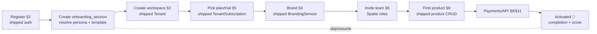
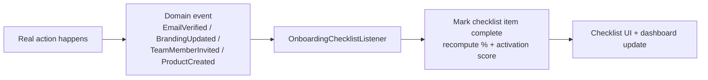

# SaaS Onboarding & Setup Wizard — Multi-Tenant Multi-Vendor SaaS

A guided, personalized, AI-assisted setup experience that takes a brand-new
tenant from "just signed up" to "productive and selling" as fast as
possible — configuring their workspace, branding, plan, team,
integrations, and first product, while measuring activation every step of
the way.

The defining architectural fact about this module: **onboarding owns
almost no new domain logic.** Registering a user, creating a tenant,
choosing a plan, uploading a logo, inviting a teammate, publishing a
product — every one of those actions is *already implemented* by an owning
module (several already ship). Onboarding is an **orchestration + state
layer**: a resumable wizard state machine that sequences those existing
flows, deep-links into them, and tracks completion. Building it as a
re-implementation would duplicate (and drift from) the real flows; building
it as orchestration keeps one source of truth per capability.

### What ships today (verified)

The first steps of the journey already work:

- **Registration** — `RegisteredUserController@store`: validates name/email/password, `User::create`, fires the `Registered` event, `Auth::login`, and **audits** it (`ActivityLog::record('auth.registered', …)`), then redirects to the dashboard. (See [`audit-logs-architecture.md`](audit-logs-architecture.md) for the audit core.)
- **Social login** — `SocialiteController` (OAuth providers).
- **Email verification** — `VerifyEmailController`, `EmailVerificationPromptController`, `EmailVerificationNotificationController`; `User` casts `email_verified_at`; the `MustVerifyEmail` machinery is present (currently opt-in).
- **2FA** — `TwoFactorChallengeController` + the settings 2FA flow.
- **Tenant model** — `Tenant` with `owner()`, `users()` (BelongsToMany pivot), `roleOf(User)`, `subscriptions()`, `currentSubscription()` (TRIALING/ACTIVE/PAST_DUE), `plan()`.
- **Subscriptions / trial** — `TenantSubscription::STATUS_TRIALING` / `STATUS_ACTIVE` / `STATUS_PAST_DUE` — **a free trial is a real, shipped subscription status**, not a concept to invent.
- **Plan gating** — `PlanGate` (feature flags + usage limits, 402-on-limit) + `Plan`.
- **Workspace branding** — `BrandingService` (title + logo, sanitize/optimize) + the `/admin/branding` page (see [`white-label-architecture.md`](white-label-architecture.md)).
- **Team / RBAC** — Spatie `HasRoles` on `User` + `Tenant::roleOf()`.
- **Product publishing** — the admin `ProductController` CRUD (`StoreProductRequest` validation + `PlanGate` 402-on-limit) + the product create/edit pages.
- **API keys** — `Settings\ApiTokenController` (Sanctum tokens, scopes, shown-once) (see [`api-developer-portal-architecture.md`](api-developer-portal-architecture.md)).

> The leap this doc specs: a **wizard state machine** (`onboarding_sessions` + `onboarding_steps` + `onboarding_progress`) where **each step renders a focused UI, invokes the owning module's *existing* endpoint, then marks itself complete** — plus an **event-driven checklist** that auto-ticks from real domain events (a logo upload fires `BrandingUpdated` → the "Upload logo" item checks itself), an **activation score + Time-to-First-Value** metric, contextual **tours/tooltips**, **sample-data** seeding, and an **AI setup assistant**. The checklist reflects *real platform state*, never a parallel flag a step could lie about.

### Integration

Onboarding is the **front door** that touches every module:

| Step | Owning module |
|---|---|
| Register / verify / social / 2FA | [`audit-logs`](audit-logs-architecture.md) auth (shipped) |
| Create workspace | `Tenant` (shipped) |
| Pick plan / trial | [`billing`](billing-architecture.md) + `PlanGate` (shipped) |
| Brand workspace | [`white-label`](white-label-architecture.md) / `BrandingService` (shipped) |
| Invite team | RBAC / Spatie (shipped) |
| Vendor store + first product | [`marketplace`](marketplace-architecture.md) + admin product CRUD (shipped) |
| Connect payments | [`payments`](payments-architecture.md) |
| Connect API / webhooks | [`api-developer-portal`](api-developer-portal-architecture.md) (shipped tokens) |
| File storage | [`file-manager`](file-manager-architecture.md) |
| Education | [`knowledge-base`](knowledge-base-architecture.md) |
| Reminders | [`notifications`](notifications-architecture.md) |
| Assistant / recommendations | [`ai`](ai-architecture.md) |
| Funnel + drop-off | [`analytics`](analytics-architecture.md) |
| Operator funnel view | [`admin-control-center`](admin-control-center-architecture.md) |

Follows the shipped/planned convention of the prior twenty-one docs.

## Table of contents

1. [Onboarding overview](#1-onboarding-overview)
2. [Registration flow](#2-registration-flow)
3. [Tenant creation wizard](#3-tenant-creation-wizard)
4. [Workspace configuration](#4-workspace-configuration)
5. [Subscription selection](#5-subscription-selection)
6. [Team setup](#6-team-setup)
7. [Marketplace setup](#7-marketplace-setup)
8. [Product publishing wizard](#8-product-publishing-wizard)
9. [Payment setup](#9-payment-setup)
10. [File storage setup](#10-file-storage-setup)
11. [API & integrations setup](#11-api--integrations-setup)
12. [AI setup assistant](#12-ai-setup-assistant)
13. [Interactive product tour](#13-interactive-product-tour)
14. [Checklist system](#14-checklist-system)
15. [Sample data](#15-sample-data)
16. [Customer education](#16-customer-education)
17. [Notifications](#17-notifications)
18. [Progress tracking](#18-progress-tracking)
19. [AI recommendations](#19-ai-recommendations)
20. [Customer success dashboard](#20-customer-success-dashboard)
21. [Database design](#21-database-design)
22. [API design](#22-api-design)
23. [Frontend architecture](#23-frontend-architecture)
24. [Security](#24-security)
25. [Performance](#25-performance)
26. [Multi-tenant support](#26-multi-tenant-support)
27. [Analytics](#27-analytics)
28. [Scalability](#28-scalability)
29. [Future expansion](#29-future-expansion)

### Status snapshot (today)

| Layer | Shipped | Planned in this doc |
|---|---|---|
| **Register / verify / social / 2FA** | full auth flow, audited | wire into the wizard (§2) |
| **Tenant creation** | `Tenant` + owner/users + `roleOf` | the creation wizard step (§3) |
| **Plan / free trial** | `TenantSubscription` TRIALING/ACTIVE | plan-picker step (§5) |
| **Branding** | `BrandingService` + admin page | branded step + deep-link (§4) |
| **Product publish** | admin CRUD + validation + gating | guided product wizard (§8) |
| **API keys** | Sanctum tokens UI | integrations step (§11) |
| **Wizard state** | — | sessions/steps/progress FSM (§21) |
| **Checklist** | — | event-driven auto-tick (§14) |
| **Activation / TTFV** | — | scoring + metrics (§18, §27) |
| **Tables** | `users`, `tenants`, `tenant_subscriptions` | 15 `onboarding_*` tables (§21) |

---

## 1. Onboarding overview

### Strategy

| Goal | Approach |
|---|---|
| Business objective | Convert signups → activated, paying, retained tenants — faster activation = higher conversion + lower churn |
| Activation | Drive each tenant to their **first value** (first product published / first sale) ASAP — measured as TTFV (§18) |
| First-time UX | A focused, skippable, **resumable** wizard — never a wall; progress saved server-side |
| Customer success | An activation score + a success dashboard surface at-risk tenants for proactive help |
| Retention | Trial-expiry nudges, feature discovery, and education keep momentum after day one |

### The wizard as an orchestrating state machine



Each box is a **step that calls the owning module's existing endpoint** —
onboarding sequences and tracks; the modules do the work.

### Why orchestration, not reimplementation

The "Upload logo" step doesn't have its own logo code — it deep-links to
the shipped branding flow. The "Publish product" step doesn't validate
products — it uses the shipped `StoreProductRequest`. This means:
**one source of truth per capability**, the wizard can't drift from real
behavior, and onboarding is mostly *state + UI + measurement*.

---

## 2. Registration flow

Built directly on the **shipped auth**:

| Method | Status |
|---|---|
| Email registration | **shipped** (`RegisteredUserController` — validates, creates, `Registered` event, login, audited) |
| Social login | **shipped** (`SocialiteController`) |
| SSO | planned (OIDC, per the API/auth docs) |
| Invitation registration | planned (token invite → pre-filled register, §6) |

| Validation | Status |
|---|---|
| Email verification | **shipped machinery** (`VerifyEmailController` + `email_verified_at`) — enforced as an onboarding step |
| Phone verification | planned (SMS OTP via the notifications SMS channel) |
| CAPTCHA | planned (on the public register form) |
| Fraud detection | planned (reuses the audit security-detection engine — signup velocity, disposable email) |

On register (the shipped flow), an `onboarding_session` is created and the
user is dropped into the wizard instead of a cold dashboard. Email
verification becomes checklist item #1 (the machinery already exists; the
wizard makes it a guided step).

---

## 3. Tenant creation wizard

Guides the owner through workspace name, company info, industry, business
size, preferred language, time zone, currency — then **creates the
isolated tenant** via the shipped `Tenant` model (which already wires
`owner()`, the `users()` pivot with `roleOf()`, and the `BelongsToTenant`
global scope every other module relies on).

```php
workspace_setup_configs
  id, tenant_id (unique), industry, business_size, locale, timezone, currency
  goals jsonb, persona enum('vendor','agency','enterprise','solo'), created_at
```

The collected answers (industry/size/persona) **drive personalization**:
they select the onboarding template (§21 `onboarding_templates`) — a vendor
sees store+product steps; an enterprise sees team+SSO steps. Tenant
resource creation (default settings, owner role assignment) runs in a
transaction so a half-created workspace never exists.

---

## 4. Workspace configuration

Deep-links into the **shipped branding** + regional settings:
branding, logo, theme, domain/subdomain, notifications, regional settings.
The step embeds (or links to) the shipped `/admin/branding` flow
(`BrandingService` — title + logo with sanitize/optimize). Theme + domain
+ regional come from the white-label module (§4/§7 there). The locale +
timezone + currency captured in §3 pre-fill regional settings. This step
is **white-label-aware**: a reseller tenant brands the workspace their
customers will see (white-label §).

---

## 5. Subscription selection

Built on the **shipped `TenantSubscription` + `PlanGate` + `Plan`**:

| Option | Mechanism |
|---|---|
| Free trial | `TenantSubscription::STATUS_TRIALING` — **already shipped** |
| Free plan | a `Plan` with no charge |
| Paid plans | the billing checkout (Stripe) |
| Enterprise | "contact us" → sales (CRM lead) |

The step shows a **feature comparison + limits + billing cycle** sourced
from `Plan` (the same plan data `PlanGate` enforces — so what the picker
shows and what the platform enforces never diverge). Choosing a trial
creates a `TenantSubscription` in `STATUS_TRIALING` (shipped status);
trial-expiry nudges (§17) and trial-to-paid conversion (§27) flow from
there. Full billing in [`billing-architecture.md`](billing-architecture.md).

---

## 6. Team setup

Built on **Spatie roles + `Tenant::roleOf()`**: the owner invites team
members, assigns roles (the shipped role set: admin/support/vendor/
team-member/…), configures permissions, and creates departments.

```php
// invitation (secure token, §24)
tenant_invitations   // (shared with the team/RBAC area)
  id, tenant_id, email, role, token (hashed), invited_by_id
  expires_at, accepted_at
```

An invite emails a signed, expiring token (notifications); accepting it
runs the invitation-registration path (§2) and attaches the user to the
tenant `users()` pivot with the assigned role (`roleOf`). Departments are a
grouping over team members. The wizard makes inviting one teammate a
checklist item — team presence correlates with activation.

---

## 7. Marketplace setup

(Via [`marketplace-architecture.md`](marketplace-architecture.md).) For
vendor-persona tenants: vendor profile, store info, store branding,
categories, payment configuration — preparing the store for its first
sale. Store branding reuses the white-label branding (§4); categories come
from the marketplace catalog; payment config is §9. This step only appears
for the vendor/agency persona (driven by §3) — a pure-buyer tenant skips
it (relevance keeps the wizard short).

---

## 8. Product publishing wizard

Built on the **shipped admin product CRUD** (`ProductController` +
`StoreProductRequest` + `PlanGate` limit): guides the vendor to create the
first product, upload images + files (file-manager), set pricing, configure
licensing, and publish — with **validation before publishing** (the shipped
`StoreProductRequest` rules + a readiness check: has image? has price? has
file?). Publishing the first product is the **canonical first-value event**
(§18 TTFV stops here). The wizard wraps the existing create form in a
friendlier, explained, step-by-step shell — same endpoint, same validation,
same `PlanGate` 402-on-limit behavior.

---

## 9. Payment setup

(Via [`payments-architecture.md`](payments-architecture.md).) Configure
Stripe, PayPal, bank transfer, wallet — and **validate** the configuration
(test connection / verify keys). For vendors, this is "how you get paid"
(payout method, ties to the affiliate/marketplace payout rails — the
shipped wallet/ledger); for buyers, "how you pay". Validation prevents the
classic "published but can't transact" dead-end.

---

## 10. File storage setup

(Via [`file-manager-architecture.md`](file-manager-architecture.md).)
Configure storage provider, quotas, backup policies. Most tenants accept
defaults (the platform's managed storage) — this step is mostly
confirmation + showing the quota for their plan (`PlanGate` storage limit).
Enterprise tenants may connect their own bucket. Product/asset uploads
(§8) already use the file-manager, so storage is implicitly exercised.

---

## 11. API & integrations setup

Built on **shipped Sanctum tokens** (`ApiTokenController`): connect API
keys, webhooks, third-party integrations. The step embeds the shipped
api-tokens flow (create a scoped token, shown-once) + a webhook
registration (the developer-portal outbound webhooks) + a curated
integrations gallery. Optional/advanced — surfaced for developer-persona
tenants or deferred to "later" for others.

---

## 12. AI setup assistant

(Via [`ai-architecture.md`](ai-architecture.md), credit-gated.) A
conversational assistant guiding workspace configuration, product setup,
branding suggestions, security recommendations, and best practices.
Grounded (RAG) in the knowledge base (§16) + the tenant's current
onboarding state, it answers "what should I do next?" and can **act**
(propose a brand palette, draft a product description) via the same module
endpoints the wizard uses. It reads the `onboarding_progress` to give
context-aware help ("you've added a product but no payment method — let's
fix that"). Lives in the `AIAssistantPanel` (§23).

---

## 13. Interactive product tour

```php
onboarding_tours          // tour definitions (per template/persona)
  id, key, persona, steps jsonb, version, is_active
onboarding_tooltips       // contextual tips bound to UI anchors
  id, tour_id, anchor, title, body, placement, order
```

Guided walkthroughs, tooltips, feature highlights, contextual tips, and
progress tracking — overlaid on the real UI (a `TourOverlay`, §23). Users
can **skip or resume** (state in `onboarding_progress`). Tours are
data-driven (definitions in the DB, not hard-coded) so they're editable +
versionable + per-persona. A tour highlights real, working features — it's
a guide layer, not a mock.

---

## 14. Checklist system

The checklist is **derived from real platform state via domain events** —
it never trusts a separate "done" flag a step could set prematurely:



```php
onboarding_checklists     // the items for a session (from a template)
  id, onboarding_session_id, key, label, required, weight, deep_link
  status enum('todo','in_progress','done','skipped'), completed_at, source_event
```

Example items: verify email · complete profile · upload logo · configure
branding · invite team · create first product · configure payments ·
publish product. Each item declares the **event that completes it** —
`product.published` ticks "Publish product". Completion % = weighted done /
total. Because items react to events the modules *already* emit (the
shipped registration already fires events; branding/product changes emit
theirs), the checklist is always **truthful** — it mirrors what actually
exists in the tenant.

---

## 15. Sample data

```php
onboarding_sample_data
  id, tenant_id, set enum('products','projects','crm','tasks','reports')
  status, seeded_ids jsonb, seeded_at, removable bool
```

Import demo products, projects, CRM data, tasks, reports — so the tenant
**learns by example** with a populated workspace instead of empty states.
Seeding is a **queued job** that creates clearly-labeled demo records
(tagged `is_sample`) the tenant can one-click remove. Sample data respects
the tenant scope + plan limits (won't seed 100 demo products on a 10-product
plan). Great for evaluation; cleanly reversible before going live.

---

## 16. Customer education

(Via [`knowledge-base-architecture.md`](knowledge-base-architecture.md).)
Integrate the knowledge base, video tutorials, interactive guides, FAQs,
and live documentation — and **suggest relevant content** based on the
current step (stuck on payments → surface the payments setup article). The
KB's semantic search + the onboarding state drive contextual suggestions;
the AI assistant (§12) is grounded in this content. Education is embedded,
not a separate destination.

---

## 17. Notifications

(Via [`notifications-architecture.md`](notifications-architecture.md).)
Notify about: setup completion, missing steps (nudges), trial expiration
(the shipped `TenantSubscription` trial status drives the schedule),
feature recommendations — over email / push / in-app. A drip sequence
re-engages stalled onboarders ("you're one step from publishing!"); trial
nudges fire at T-7/T-3/T-1 days before `STATUS_TRIALING` ends. Templates
are tenant-branded (white-label).

---

## 18. Progress tracking

```php
onboarding_progress
  id, onboarding_session_id, tenant_id
  current_step, completed_steps jsonb, percent, status
  started_at, completed_at, last_activity_at

customer_activation_scores
  id, tenant_id, score numeric, ttfv_seconds (nullable)
  signals jsonb, computed_at, band enum('at_risk','progressing','activated')
```

Tracks: wizard progress, setup completion %, **activation score**, and
**Time-to-First-Value** (TTFV = registration → first value event, e.g.
first product published §8). The activation score weights meaningful
signals (verified, branded, team invited, product live, payment configured)
— a single number for "how real is this tenant". TTFV is the headline
growth metric. Both are recomputed by the §14 event listener — always
current, never a stale snapshot.

---

## 19. AI recommendations

(Via [`ai-architecture.md`](ai-architecture.md).)

```php
onboarding_recommendations / onboarding_ai_insights
  id, tenant_id, type enum('next_step','workspace_opt','product_rec','feature_discovery','success_prediction')
  payload jsonb, score, shown_at, acted_at, created_at
```

- **Next-step suggestions** — what to do now, ranked by activation impact.
- **Workspace optimization** — config gaps (no logo, weak product copy).
- **Product recommendations** — what to sell, based on persona + category trends.
- **Feature discovery** — surface unused high-value features.
- **Success predictions** — likelihood-to-activate / churn-risk from the signal set.

Generated by queued jobs over the onboarding + usage signals; advisory
(the dashboard + assistant present them). Drives proactive customer
success (§20).

---

## 20. Customer success dashboard

Two audiences:
- **Tenant-facing** — setup progress, remaining tasks, product readiness, marketplace readiness, **security score** (2FA on? strong settings?), growth suggestions.
- **Operator-facing** ([`admin-control-center`](admin-control-center-architecture.md)) — the **activation funnel** across all tenants: who's stuck, who's at-risk, who converted — so success teams intervene.

Both read the same activation/progress data (§18) + AI insights (§19).
Actionable: every "remaining task" deep-links to the step that completes
it. The security score reuses the audit/admin security signals.

---

## 21. Database design

| Table | Purpose |
|---|---|
| `onboarding_sessions` | One per tenant onboarding run (persona, template, status) |
| `onboarding_steps` | Step definitions (from a template) |
| `onboarding_progress` | Live progress per session (§18) |
| `onboarding_checklists` | Event-derived checklist items (§14) |
| `onboarding_templates` | Persona/industry flow definitions |
| `onboarding_tours` | Tour definitions (§13) |
| `onboarding_tooltips` | Contextual tips (§13) |
| `onboarding_sample_data` | Seeded demo data tracking (§15) |
| `onboarding_recommendations` | AI next-steps (§19) |
| `onboarding_events` | Event log (analytics/funnel, §27) |
| `onboarding_completion` | Completion records + timestamps |
| `onboarding_feedback` | Post-onboarding feedback (NPS/CSAT) |
| `onboarding_ai_insights` | AI outputs (§19) |
| `customer_activation_scores` | Activation score + TTFV (§18) |
| `workspace_setup_configs` | Captured workspace answers (§3) |

### `onboarding_sessions` (the wizard root)

```php
Schema::create('onboarding_sessions', function (Blueprint $t) {
    $t->id();
    $t->foreignId('tenant_id')->constrained()->cascadeOnDelete();
    $t->foreignId('user_id')->constrained();           // the owner driving it
    $t->foreignId('onboarding_template_id')->nullable();
    $t->string('persona', 24)->nullable();             // from §3
    $t->string('status', 16)->default('in_progress');  // in_progress|completed|abandoned
    $t->string('current_step')->nullable();
    $t->jsonb('context')->nullable();                  // answers, skips
    $t->timestamp('completed_at')->nullable();
    $t->timestamps();
    $t->unique('tenant_id');                            // one onboarding per tenant
    $t->index(['status', 'created_at']);
});
```

### `onboarding_events` (the funnel source)

```php
onboarding_events
  id, tenant_id, onboarding_session_id, type, step_key
  metadata jsonb, created_at      // PARTITIONED by created_at
  index (type, created_at), index (onboarding_session_id)
```

### Particulars

- **`onboarding_checklists.source_event`** ties an item to the domain event that completes it (§14) — completion is event-derived, not self-asserted.
- **`unique(tenant_id)`** on sessions — a tenant onboards once (re-onboarding = a new template run, e.g. a new feature tour).
- `onboarding_events` partitioned + rolled to the analytics funnel (§27, the `daily_metrics` pattern).
- Every table `tenant_id` + `BelongsToTenant` (the shipped trait).
- Templates/tours/tooltips are **data**, not code — editable per tenant (§26) without a deploy.

---

## 22. API design

REST under `/api/v1` (the shipped versioned, Sanctum API); the owner/admin
drives onboarding; cross-tenant → 404; the `{data,…}` envelope (shipped
convention).

| Verb | URL | Purpose |
|---|---|---|
| `POST` | `/register` | Register (shipped auth) → creates session |
| `GET` | `/api/v1/onboarding/session` | Current session + progress + checklist |
| `POST` | `/api/v1/onboarding/workspace` | Save §3 answers → create/configure tenant |
| `POST` | `/api/v1/onboarding/steps/{key}/complete` | Mark a manual step done (events auto-complete others) |
| `POST` | `/api/v1/onboarding/steps/{key}/skip` | Skip a step |
| `GET` | `/api/v1/onboarding/checklist` | Checklist + completion % |
| `GET` | `/api/v1/onboarding/tour/{key}` | Tour definition |
| `POST` | `/api/v1/onboarding/sample-data` | Seed (queued) / remove demo data |
| `GET` | `/api/v1/onboarding/recommendations` | AI next-steps |
| `GET` | `/api/v1/onboarding/activation` | Activation score + TTFV |
| `POST` | `/api/v1/onboarding/feedback` | Submit feedback |
| `GET` | `/api/v1/admin/onboarding/funnel` | Operator funnel (admin) |

Most "do the work" actions call the **owning module's** endpoint (create
product → the shipped product endpoint), not an onboarding-specific one —
the onboarding API manages *state*, not duplicated business logic.

---

## 23. Frontend architecture

```
resources/js/
├── pages/onboarding/
│   ├── welcome.tsx            # welcome screen (post-register)
│   ├── wizard.tsx             # the stepper shell (orchestrates steps)
│   ├── workspace.tsx          # §3/§4 workspace + branding config
│   ├── team.tsx               # §6 team invitation
│   ├── marketplace.tsx        # §7 vendor/store setup
│   ├── product.tsx            # §8 product wizard (wraps shipped create form)
│   └── dashboard.tsx          # §20 onboarding / success dashboard
├── components/onboarding/
│   ├── StepperWizard.tsx      # multi-step nav + state
│   ├── ProgressBar.tsx        # completion %
│   ├── Checklist.tsx          # event-driven items (§14)
│   ├── TourOverlay.tsx        # guided walkthrough (§13)
│   ├── AIAssistantPanel.tsx   # conversational helper (§12)
│   ├── CompletionCard.tsx     # celebratory milestone cards
│   ├── PlanPicker.tsx         # §5 (reads Plan data)
│   └── ActivationScore.tsx
├── hooks/onboarding/
│   ├── useOnboarding.ts       # session + progress + checklist
│   ├── useChecklist.ts        # live (event-pushed) checklist state
│   └── useTour.ts
└── lib/onboarding/
    ├── steps.ts               # step registry → owning-module routes
    └── persona.ts
```

The wizard steps **deep-link or embed** the existing module pages
(branding, product create, api-tokens) — `steps.ts` maps each step to the
owning route. `StepperWizard` owns navigation + skip/resume; the actual
forms are the modules' own. Built on Inertia + the shipped UI primitives.

---

## 24. Security

| Concern | Mitigation |
|---|---|
| Tenant isolation | `BelongsToTenant` on every onboarding table; the wizard only ever touches the owner's tenant |
| Secure invitations | Signed, **hashed**, **expiring** invite tokens (§6); single-use; bound to the invited email |
| Token expiration | Invite + verification tokens expire; expired → re-request |
| Session protection | Onboarding session bound to the authenticated owner; steps re-check authorization on the owning endpoint |
| Audit logs | Registration already audited (shipped); each step completion + invitation audited (the audit core) |
| Unauthorized workspace access | Standard auth + tenant scope; no step bypasses the owning module's own authorization |
| Invalid invitations | Token validation + email binding + expiry; accepting attaches only the intended role |
| Cross-tenant onboarding | Impossible — session `unique(tenant_id)` + global scope; a step's write goes through the module's tenant-scoped endpoint |

Crucially, because each step calls the **owning module's existing
endpoint**, it inherits that module's authorization + validation — the
wizard can't become a privilege-escalation backdoor.

---

## 25. Performance

| Concern | Approach |
|---|---|
| Lazy loading | Wizard steps + tours code-split; load on demand |
| Redis caching | Session/progress/checklist state cached; template definitions cached |
| Background jobs | Sample-data seeding, AI recommendations, drip notifications, activation scoring all queued (the shipped worker) |
| Queue processing | Event-driven checklist ticks processed off the queue |
| Optimized API | One `GET /onboarding/session` returns session + progress + checklist in a single payload |

Designed for **thousands of simultaneous onboarders**: lightweight state
reads (cached), heavy work (seeding, AI, email) async, and event-driven
updates instead of polling.

---

## 26. Multi-tenant support

Each tenant can customize the onboarding **flow** (which steps/order),
branding, **required steps**, tutorials, and welcome messages — because
templates/tours/checklists are **data** (§21), a tenant (or the platform)
edits them without code. White-label tenants present onboarding under
their own brand (white-label §) — a reseller's customers get a branded
setup wizard. All onboarding state is `tenant_id`-scoped; the platform
operator sees the cross-tenant funnel (§20). Persona-driven templates
(§3) mean a vendor, an agency, and an enterprise each get a relevant flow.

---

## 27. Analytics

(Via [`analytics-architecture.md`](analytics-architecture.md), the
`daily_metrics` rollup pattern.) Track: **activation rate**, completion
rate, **drop-off points** (which step loses people — from
`onboarding_events`), average setup time, feature adoption, and
**trial-to-paid conversion** (the shipped `TenantSubscription` trial →
active transition). The `onboarding_events` stream rolls up nightly into a
funnel dashboard; drop-off analysis pinpoints the steps to simplify. These
are the executive metrics that tell whether onboarding is *working* —
TTFV (§18) and trial-to-paid are the north stars.

---

## 28. Scalability

100k+ tenants, millions of sessions, global:
- **Cached, lightweight state** — session/progress reads are Redis hits, not heavy queries.
- **Event-driven, queued** — checklist ticks + scoring + seeding + emails all async; spikes absorbed by the queue.
- **Partitioned events** — `onboarding_events` partitioned + rolled up; raw events archived.
- **Data-driven flows** — templates/tours edited without deploys; no per-tenant code.
- **Stateless wizard** — server holds the truth; any app node can serve any step.
- **Multi-region** — onboarding state region-local; analytics centralized.

---

## 29. Future expansion

| Feature | Approach |
|---|---|
| AI copilot onboarding | The assistant (§12) drives the whole flow conversationally ("set up my store") — orchestrating the same step endpoints |
| Voice-guided setup | Speech I/O over the assistant (ai module) |
| Industry-specific templates | More `onboarding_templates` per vertical (data, not code) |
| Marketplace setup templates | Pre-built store configs per product category |
| Team onboarding journeys | Per-role onboarding for invited members (not just the owner) |
| Customer success playbooks | Operator-defined intervention sequences triggered by activation score/band |

All extend the template + event + scoring model — the orchestration core
never changes.

---

## File map for the next phase

| Path | Status |
|---|---|
| `app/Http/Controllers/Auth/{RegisteredUser,Socialite,VerifyEmail,…}Controller.php` | **shipped — the wizard's first steps** |
| `app/Models/{Tenant,TenantSubscription,Plan}.php` + `app/Domain/Plans/PlanGate.php` | **shipped — workspace + plan steps** |
| `app/Services/BrandingService.php` + `app/Http/Controllers/Admin/{Branding,Product}Controller.php` | **shipped — branding + product steps** |
| `app/Http/Controllers/Settings/ApiTokenController.php` | **shipped — integrations step** |
| `database/migrations/*_create_onboarding_sessions_steps_progress_tables.php` | planned |
| `database/migrations/*_create_onboarding_checklists_templates_tables.php` | planned |
| `database/migrations/*_create_onboarding_tours_tooltips_sample_data_tables.php` | planned |
| `database/migrations/*_create_onboarding_events_completion_feedback_tables.php` (events partitioned) | planned |
| `database/migrations/*_create_onboarding_recommendations_ai_insights_tables.php` | planned |
| `database/migrations/*_create_customer_activation_scores_workspace_setup_configs_tables.php` | planned |
| `database/migrations/*_create_tenant_invitations_table.php` | planned |
| `app/Domain/Onboarding/{OnboardingService,WizardStateMachine,ActivationScorer,SampleDataSeeder}.php` | planned |
| `app/Listeners/OnboardingChecklistListener.php` (subscribes to EmailVerified/BrandingUpdated/ProductCreated/TeamMemberInvited …) | planned |
| `app/Jobs/{SeedSampleData,ComputeActivationScore,GenerateOnboardingRecommendations}.php` | planned |
| `app/Models/{OnboardingSession,OnboardingChecklist,OnboardingTemplate,CustomerActivationScore}.php` | planned |
| `app/Http/Controllers/Api/V1/Onboarding/*Controller.php` (state only — deep-links to module endpoints) | planned |
| `resources/js/pages/onboarding/*` + `components/onboarding/*` + `hooks/onboarding/*` | planned |
| `tests/Feature/Onboarding/*` (event-driven checklist truthfulness, resume/skip, activation scoring, TTFV, secure expiring invitations, tenant isolation, persona templating) | planned |

The next pass builds a **thin orchestration layer over shipped flows**: the
`WizardStateMachine` (sessions/steps/progress, resumable), the
event-driven `OnboardingChecklistListener` (ticks items from real domain
events the modules already emit — so the checklist can't lie), the
`ActivationScorer` + TTFV, sample-data seeding, and the stepper UI that
deep-links into the **already-built** registration, tenant, branding,
plan, product, and api-token flows. The AI assistant, tours, and the
success dashboard layer on after the state machine + checklist are solid.

---

## The architecture doc set

This is the twenty-second architecture doc. The complete set under `docs/`:

1. `dashboard-architecture.md`
2. `payments-architecture.md`
3. `projects-architecture.md`
4. `tasks-architecture.md`
5. `notifications-architecture.md`
6. `billing-architecture.md`
7. `ai-architecture.md`
8. `analytics-architecture.md`
9. `workflow-automation-architecture.md`
10. `marketplace-architecture.md`
11. `mobile-architecture.md`
12. `crm-architecture.md`
13. `messaging-architecture.md`
14. `support-architecture.md`
15. `file-manager-architecture.md`
16. `knowledge-base-architecture.md`
17. `admin-control-center-architecture.md`
18. `white-label-architecture.md`
19. `audit-logs-architecture.md`
20. `api-developer-portal-architecture.md`
21. `affiliate-referral-architecture.md`
22. `onboarding-architecture.md`

All in the same shipped-vs-planned format, cross-referenced, each ending
with a concrete "File map for the next phase". Onboarding is the **front
door** — and the purest expression of the doc set's thesis: it ships value
not by building new domain logic but by *orchestrating* the registration,
tenant, branding, plan, and product flows that already exist, wrapping them
in a guided, measured, resumable experience.
