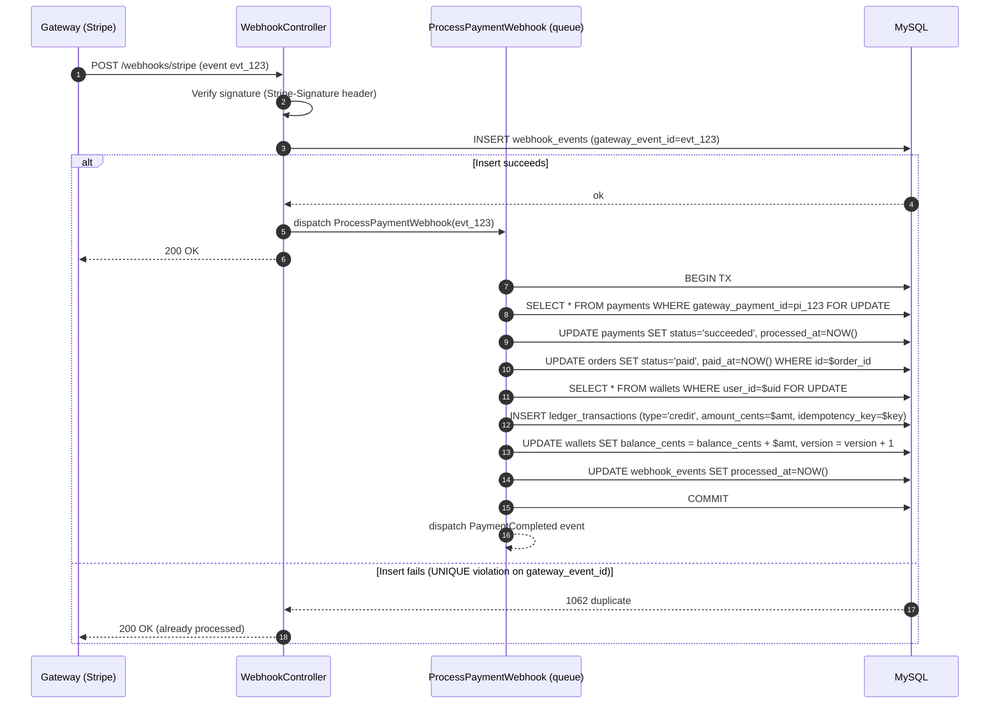
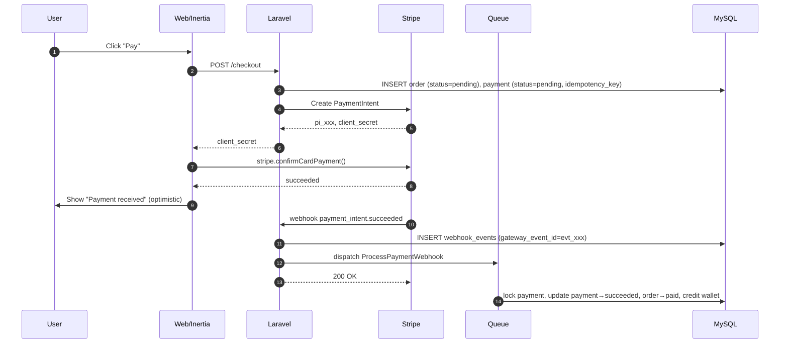
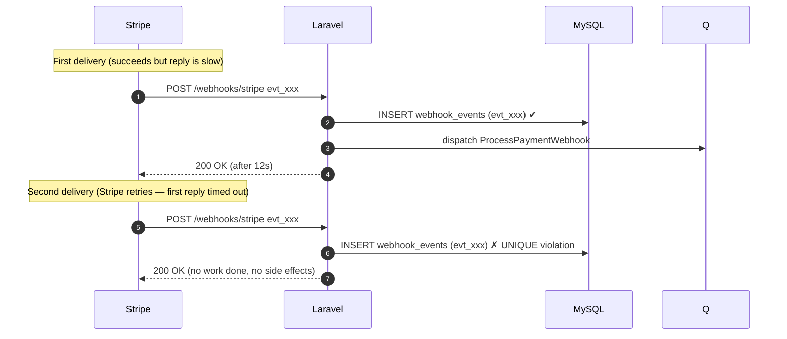
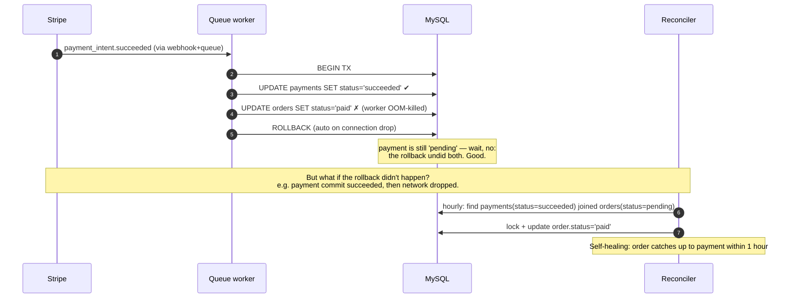

# Payment Processing Architecture

A production-grade design for handling asynchronous gateway webhooks
with **eventual consistency** guarantees:

- No double-charging.
- No duplicate wallet credits or order updates, even when webhooks are
  delivered multiple times.
- Recovery from partial failures (gateway charged the card; we never
  finished updating the order).
- A **Payment** record is the single source of truth — the **Order**
  follows it.

The same principles apply to Stripe, Paddle, PayPal, or any
event-emitting gateway.

---

## 1. Core invariants

| # | Invariant | Enforced by |
|---|---|---|
| 1 | Each gateway event is processed **at most once** | `webhook_events.gateway_event_id` `UNIQUE` |
| 2 | A `Payment` transitions `pending → succeeded` exactly once | `payments.gateway_payment_id` `UNIQUE` + `SELECT FOR UPDATE` |
| 3 | A successful `Payment` always implies its `Order` is `paid` | Reconciliation job + transactional update |
| 4 | `wallet.balance_cents == SUM(ledger.amount_cents)` at all times | Append-only ledger + `SELECT FOR UPDATE` on wallet during writes |
| 5 | Each wallet credit corresponds to **exactly one** ledger row | `ledger_transactions.idempotency_key` `UNIQUE` |
| 6 | A wallet credit and the wallet balance update are **atomic** | Single DB transaction |

If any of these break in production, the reconciliation job (§6)
detects it and either auto-repairs or alerts.

---

## 2. Database schema

### 2.1 `orders`

User-facing aggregate. The status follows the payment.

```
orders
  id                   bigint PK
  tenant_id            bigint FK
  user_id              bigint FK
  order_number         varchar UNIQUE
  total                decimal(15,2)
  currency             char(3)
  status               enum('pending','paid','failed','refunded','cancelled')
  paid_at              timestamp NULL
  ...
  INDEX (tenant_id, status)
  INDEX (status, created_at)            -- reconciliation: pending orders
```

### 2.2 `payments` — **source of truth**

```
payments
  id                   bigint PK
  tenant_id            bigint FK
  order_id             bigint FK
  user_id              bigint FK
  gateway              varchar(24)             -- stripe | paddle
  gateway_payment_id   varchar(255) UNIQUE     -- pi_xxx, dedupe & lookup
  idempotency_key      varchar(64) UNIQUE NULL -- client-supplied
  amount               decimal(15,2)
  currency             char(3)
  status               enum('pending','succeeded','failed','refunded')
  processed_at         timestamp NULL
  raw_response         json
  failure_reason       text NULL
  ...
  INDEX (status, created_at)            -- reconciliation: stale pendings
```

Two uniqueness constraints carry the load:

- **`gateway_payment_id` UNIQUE** — even if two workers race to insert
  a `Payment` row for the same `pi_xxx`, only one wins. The loser
  catches the integrity error and re-reads the winner's row.
- **`idempotency_key` UNIQUE** — when the *client* (e.g. the checkout
  React page) submits a payment intent twice (double-click, retry),
  the second insert is rejected with the same dedup pattern.

### 2.3 `webhook_events` — idempotency log

```
webhook_events
  id                   bigint PK
  gateway              varchar(24)
  gateway_event_id     varchar UNIQUE          -- evt_xxx — the dedup gate
  event_type           varchar(80)
  tenant_id            bigint FK NULL
  payload              json
  received_at          timestamp
  processed_at         timestamp NULL
  processing_error     text NULL
  INDEX (gateway, event_type)
```

This table is the **first** thing a webhook handler touches. The very
first action is `INSERT` — if it fails with a unique violation, we
know this exact event was already (or is being) processed and we
return `200` to the gateway. **The unique constraint is the
idempotency mechanism, not a flag column.** A flag column can race
between `SELECT` and `UPDATE`; a `UNIQUE INSERT` cannot.

### 2.4 `wallets`

```
wallets
  id                   bigint PK
  tenant_id            bigint FK
  user_id              bigint FK
  currency             char(3)
  balance_cents        bigint NOT NULL DEFAULT 0
  version              int NOT NULL DEFAULT 0    -- optimistic lock counter
  created_at, updated_at
  UNIQUE (tenant_id, user_id, currency)
```

**Why `_cents`?** Floating-point money is a footgun (0.1 + 0.2 ≠ 0.3).
Money goes into the database as `BIGINT cents` (or microcents for
high-precision currencies). UI conversion happens at the boundary.

**`version`** lets us add optimistic concurrency control as a
secondary check on top of pessimistic locking — handy if we ever
distribute writes across replicas.

### 2.5 `ledger_transactions` — **append-only**

```
ledger_transactions
  id                   bigint PK
  wallet_id            bigint FK
  payment_id           bigint FK NULL
  order_id             bigint FK NULL
  type                 enum('credit','debit','refund','adjustment','reversal')
  amount_cents         bigint NOT NULL          -- always > 0
  balance_after_cents  bigint NOT NULL          -- snapshot for fast reads & audits
  currency             char(3)
  idempotency_key      varchar(64) UNIQUE       -- per-write dedup
  reference            varchar(255) NULL        -- 'order:42', 'refund:pi_xxx'
  metadata             json NULL
  created_at
  INDEX (wallet_id, created_at)
  INDEX (payment_id)
```

Three rules, enforced in the service layer:

1. **Append-only.** No `UPDATE`. No `DELETE`. A mistake is corrected
   by inserting a `reversal` row, never by mutating history.
2. **`amount_cents` is always positive.** The `type` carries the sign.
3. **`balance_after_cents` is computed under the wallet row lock**, so
   it can never disagree with `SUM(amount * sign)` from earlier rows.

True double-entry (debit account A, credit account B for every
transaction) is the next evolution. For an MVP single-customer wallet,
the `type` column collapsing one side to "external" is sufficient and
auditable.

---

## 3. Idempotent webhook handling



Three things to notice:

1. **The controller's only job** is to verify the signature, insert
   the webhook event, and dispatch a queued job. It returns `200`
   immediately so the gateway doesn't retry. Heavy work is async.
2. **The unique constraint on `gateway_event_id`** is the
   idempotency gate. If two webhooks for the same event arrive in
   parallel, exactly one `INSERT` succeeds.
3. **All state mutations are inside one transaction** with row
   locks. A concurrent webhook for the same payment serializes on
   `SELECT FOR UPDATE`.

---

## 4. Row-locking strategy

| Resource | Lock | Why |
|---|---|---|
| `webhook_events` row | implicit via `UNIQUE INSERT` | Dedup gate; the inserting worker wins |
| `payments` row | `SELECT … FOR UPDATE` (`->lockForUpdate()`) | Serialize state transitions on the same payment |
| `orders` row | implicit (joined via the locked payment) | Updated after payment lock is held |
| `wallets` row | `SELECT … FOR UPDATE` | Prevents concurrent credits from racing on `balance_cents` |
| Reconciliation cursor | `SELECT … FOR UPDATE SKIP LOCKED` | Multiple reconciliation workers can shard the table safely |

**Lock order is fixed**: webhook_events → payments → orders → wallets.
A consistent order across all writers prevents deadlocks.

---

## 5. Money helpers (production code)

```php
namespace App\Support;

final class Money
{
    /** UI string '49.00' → 4900 cents. */
    public static function toCents(string|float $amount): int
    {
        return (int) round(((float) $amount) * 100);
    }

    /** 4900 cents → '49.00' for display. */
    public static function fromCents(int $cents, int $minorUnits = 2): string
    {
        return number_format($cents / (10 ** $minorUnits), $minorUnits, '.', '');
    }
}
```

All ledger / wallet code talks in cents. Conversion happens at the
HTTP boundary.

---

## 6. Reconciliation job

```mermaid
sequenceDiagram
    autonumber
    participant S as Scheduler (hourly)
    participant R as ReconcilePayments command
    participant G as Gateway API
    participant DB as MySQL

    S->>R: php artisan reconcile:payments
    R->>DB: SELECT pending payments older than 10 min
    loop For each
        R->>G: GET /v1/payment_intents/pi_xxx
        G-->>R: status='succeeded'
        R->>DB: Re-run OrderPaymentProcessor with synthetic event id
    end
    R->>DB: SELECT payments WHERE status='succeeded' AND order.status='pending'
    loop For each
        R->>DB: BEGIN TX; lock both; UPDATE order.status='paid'; COMMIT
    end
    R->>DB: SELECT wallet, SUM(ledger.amount*sign) AS computed_balance
    loop For each row where balance != computed
        R->>DB: log audit_alert (wallet_id, expected, actual)
    end
```

Three jobs in one command:

1. **Recover stuck pending payments** — pending for >10 min: call
   the gateway, if it says succeeded, replay the success event using
   a deterministic synthetic event id so the idempotency log keeps
   working.
2. **Repair `paid` payments with `pending` orders** — apply the
   missing `Order` transition (the most common partial-failure
   recovery).
3. **Detect ledger drift** — `SUM(ledger) ≠ wallet.balance_cents`.
   This should *never* happen if the service layer is correct; if it
   ever does, write to `activity_logs` and page an engineer.

Schedule it in `routes/console.php`:

```php
use Illuminate\Support\Facades\Schedule;
Schedule::command('reconcile:payments')
    ->hourly()
    ->withoutOverlapping(60)
    ->runInBackground();
```

---

## 7. Failure & retry strategy

| Failure | Where it hits | Recovery |
|---|---|---|
| Signature verification fails | `StripeWebhookController` | Return 400, log, **do not** insert webhook_event |
| Duplicate event id | webhook_events INSERT | Return 200, drop |
| Job throws inside transaction | `ProcessPaymentWebhook` | Tx rolls back; Laravel queue retries up to `$tries = 5` with exponential backoff |
| Job exhausted retries | failed_jobs | `payment_failures` channel alerts; manual replay via `queue:retry` |
| Gateway API down | reconciliation | Skip this pass; next hourly run retries |
| Wallet credit duplicate | `idempotency_key` UNIQUE | INSERT throws; service catches → ledger has the existing row → no double-credit |

Queue retry config (`config/queue.php` + job):

```php
public int $tries = 5;
public int $backoff = [60, 120, 300, 900, 1800];   // 1m, 2m, 5m, 15m, 30m
public int $timeout = 60;
```

---

## 8. Sequence diagrams (canonical paths)

### 8.1 Successful payment



### 8.2 Duplicate webhook (the gateway retries because we were slow)



### 8.3 Failed order update after successful payment



### 8.4 Reconciliation recovery flow

```mermaid
sequenceDiagram
    autonumber
    participant Sch as Scheduler
    participant R as ReconcilePayments
    participant G as Stripe API
    participant DB as MySQL
    participant L as activity_logs

    Sch->>R: hourly tick
    R->>DB: SELECT payments WHERE status='pending' AND created_at < NOW() - 10min
    loop For each stale payment
        R->>G: GET /v1/payment_intents/pi_xxx
        G-->>R: status='succeeded', latest_charge=ch_yyy
        R->>R: Build synthetic event id: 'reconcile:pi_xxx:succeeded'
        R->>DB: replay OrderPaymentProcessor (idempotent: synthetic id is UNIQUE)
    end
    R->>DB: SELECT payments(succeeded) JOIN orders(pending)
    loop For each
        R->>DB: lock payment + order; UPDATE order.status='paid'
        R->>L: INSERT activity_log ('reconciler.repaired_order', ...)
    end
    R->>DB: SELECT wallet_id, SUM(ledger.amount*sign) FROM ledger GROUP BY wallet_id
    R->>DB: JOIN wallets; WHERE balance_cents != computed
    loop For each mismatch
        R->>L: INSERT activity_log ('reconciler.ledger_drift', wallet_id, delta)
        Note over R: Drift never auto-heals — paged for human review
    end
```

---

## 9. Event-driven architecture

Domain events emit from the **processor**, never from the controller.
The processor is the only place where "payment succeeded" is true and
durable.

```
PaymentCompleted (payment, order)
  → SendReceiptEmail listener (queued)
  → CreditWalletListener listener (queued, idempotent)
  → GenerateLicenseKeys listener (queued)
  → RecordPaymentMetric listener (sync, fast)

PaymentRefunded (payment, refund)
  → ReverseWalletCredit listener
  → SendRefundEmail listener

OrderPaid (order)
  → DeliverDownloads listener
```

Each listener does **exactly one** thing and is independently retryable.
They share the same idempotency rules (e.g. SendReceiptEmail keys off
the order id + listener-name in `notifications` table).

---

## 10. Audit logging & monitoring

Three layers:

1. **`webhook_events`** — every inbound event, with `processed_at` and
   `processing_error`. Direct SQL gives you "show me everything Stripe
   has sent us in the last hour".
2. **`activity_logs`** — domain-level events for ops. Reconciler
   writes `reconciler.repaired_order` / `reconciler.ledger_drift` here.
3. **Metrics** — `payment_completed_total`, `webhook_duplicate_total`,
   `reconciliation_repairs_total`, `ledger_drift_count` exposed via
   `/metrics` for Prometheus.

Suggested alerts (anything that should *never* happen):

- `ledger_drift_count > 0` over 1h → page
- `payments_succeeded_orders_pending_count > 0` over 1h after the
  reconciler ran → page (it should have healed it)
- `webhook_events.processing_error IS NOT NULL` rate spike → page

---

## 11. Files in this implementation

| File | Role |
|---|---|
| `database/migrations/2026_06_05_120001_create_wallets_table.php` | Per-user wallet rows |
| `database/migrations/2026_06_05_120002_create_ledger_transactions_table.php` | Append-only ledger |
| `database/migrations/2026_06_05_120003_add_idempotency_to_payments.php` | `idempotency_key` UNIQUE on payments |
| `app/Models/Wallet.php` | Eloquent + balance_cents accessor |
| `app/Models/LedgerTransaction.php` | Eloquent, immutable (guarded) |
| `app/Support/Money.php` | Cents ⇄ string helpers |
| `app/Domain/Payments/WalletService.php` | Atomic credit/debit with row locks |
| `app/Domain/Payments/OrderPaymentProcessor.php` | Idempotent one-time-payment webhook handler |
| `app/Domain/Payments/ReconciliationService.php` | Repair + drift detection |
| `app/Jobs/ProcessPaymentWebhook.php` | Queued wrapper around the processor |
| `app/Console/Commands/ReconcilePayments.php` | `php artisan reconcile:payments` |
| `app/Events/PaymentCompleted.php` | Domain event |
| `app/Events/PaymentRefunded.php` | Domain event |
| `tests/Feature/Payments/*` | Idempotency, concurrency, reconciliation |
