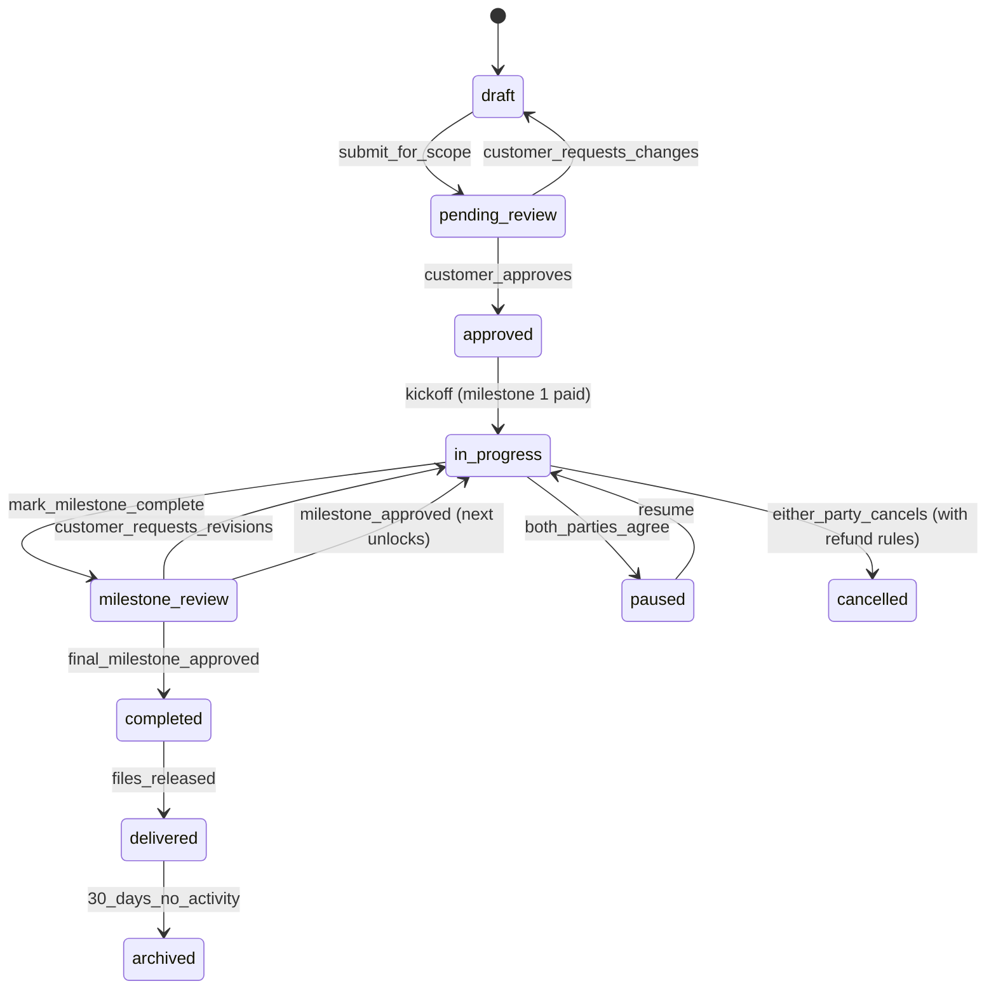
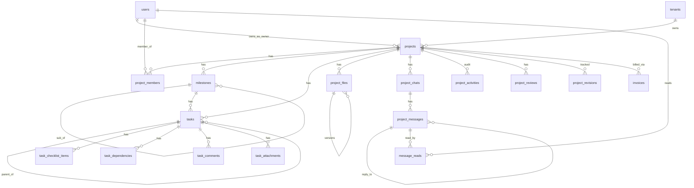

# Projects Module — Multi-Vendor SaaS Marketplace

A complete production architecture for the Projects module: project
lifecycle, milestones, tasks, file management, real-time chat, client
portal, analytics, and AI. Built for a multi-tenant, multi-vendor
marketplace where vendors deliver software projects, digital
solutions, APIs, templates, and services to customers.

This doc follows the same shipped/planned status convention as
[`dashboard-architecture.md`](dashboard-architecture.md) and
[`payments-architecture.md`](payments-architecture.md).

## Table of contents

1. [Overview](#1-overview) — business objectives + workflows
2. [Project lifecycle](#2-project-lifecycle)
3. [Project creation](#3-project-creation)
4. [Project management](#4-project-management)
5. [Milestones](#5-milestones)
6. [Task management](#6-task-management)
7. [Team collaboration](#7-team-collaboration)
8. [File management](#8-file-management)
9. [Real-time communication](#9-real-time-communication)
10. [Client portal](#10-client-portal)
11. [Project analytics](#11-project-analytics)
12. [Notifications](#12-notifications)
13. [Database design](#13-database-design)
14. [API architecture](#14-api-architecture)
15. [Frontend architecture](#15-frontend-architecture)
16. [Security](#16-security)
17. [Performance & scale](#17-performance--scale)
18. [Future AI features](#18-future-ai-features)

### Status snapshot (today)

| Layer | Shipped (commit `ba55ac8`) | Planned in this doc |
|---|---|---|
| **Schema** | `projects`, `tasks`, `invoices` | + `milestones`, `project_members`, `project_files`, `project_chats`, `project_messages`, `project_activities`, `project_reviews`, `project_revisions`, `task_comments`, `task_attachments`, `task_checklist_items`, `task_dependencies` |
| **Models** | `Project`, `Task`, `Invoice` | + `Milestone`, `ProjectMember`, `ProjectFile`, `Chat`, `Message`, `Comment`, etc. |
| **HTTP layer** | `Workspace\ProjectController`, `Workspace\TaskController` (CRUD) | + `MilestoneController`, `ChatController`, `FileController`, client-portal controllers, analytics endpoints |
| **React pages** | `workspace/{projects,tasks,billing,invoices,team}` | + Kanban / Calendar / Timeline views, Files page, Chat panel, Client portal pages, Analytics |
| **Real-time** | none | Reverb + private channels |
| **AI** | none | Speced — §18 |

---

## 1. Overview

### Business objectives

- **Vendors** deliver work to **customers** with structure, accountability, and a paper trail. The same vendor can run dozens of projects across many customers without leakage.
- **Customers** know what they're paying for and when it ships, without weekly status calls.
- **The platform** earns fees on milestone payouts and reduces dispute load by making the deliverable record unambiguous.

### Users & their primary workflows

| Role | Primary workflow |
|---|---|
| Super admin | Audit projects across all tenants, intervene in disputes, run platform-level analytics |
| Vendor (owner) | Create project from a customer request, scope milestones, assign their team, deliver, mark milestones complete, issue invoices |
| Vendor team member | Pick up assigned tasks, log progress, attach files, ping the customer when blocked |
| Customer | Submit a request → approve scope → review milestones → release payment → request revisions → accept final delivery |
| Customer team member | Comment + approve on behalf of the customer org |

### Vendor workflow (happy path)

1. Customer submits request → lands as **draft** project owned by the customer's tenant.
2. Vendor picks it up, scopes it (milestones, budget, ETA) → moves to **pending review**.
3. Customer reviews scope → **approves** (creates an escrow / payment intent for milestone 1).
4. Vendor team works → status flips to **in progress**.
5. Vendor marks milestone complete → status **milestone review**.
6. Customer approves milestone → payment releases; next milestone unlocks.
7. Final milestone approved → **completed** → final deliverables packaged → **delivered**.
8. After 30 days with no revisions → auto **archived**.

### Customer workflow

1. Open the storefront, find a vendor's service listing, click "Request project".
2. Fill out the brief (requirements, budget range, timeline, attachments).
3. Wait for vendor response — receive in-app + email notification.
4. Review proposed scope, sign-off (or counter).
5. Pay milestone 1 via Stripe → escrow.
6. Watch progress via the **Client portal** (read-only, no internal-team visibility).
7. Approve milestones one by one or request revisions.
8. Download final deliverables; leave a review.

### Team collaboration workflow

- Project owner adds team members from their tenant (vendor team) and optionally invites the customer org's collaborators.
- Each member gets a role on the project: `owner`, `manager`, `member`, `viewer`, `client`, `client-viewer`.
- Internal notes are visible only to the vendor side. Customer-facing comments are visible to both.
- @mentions notify in-app and via email if the recipient is offline.

---

## 2. Project lifecycle



### Allowed transitions (server-enforced)

Modelled as a finite-state machine in `App\Domain\Projects\LifecycleStateMachine`. Every transition runs through:

```php
$machine->transition($project, ProjectState::PENDING_REVIEW, by: $actor);
//   → checks current state is in {DRAFT}
//   → checks $actor can perform 'submit_for_scope'
//   → records project_activity row
//   → emits ProjectStateChanged event
//   → updates project.status
```

The legacy `Project::STATUS_ACTIVE/PAUSED/ARCHIVED` constants shipped in `ba55ac8` are the **internal hosting state**; the lifecycle states above are a separate `lifecycle` column added in the next migration. Two-column model keeps backwards compatibility while introducing the marketplace flow.

---

## 3. Project creation

Three entry points, one underlying service.

### 3.1 Vendor creates a project

`POST /workspace/projects`
- Required: `name`, `description`, `customer_id` (or invite later)
- Optional: `requirements`, `budget_cents`, `currency`, `starts_on`, `due_on`, `priority`, `category_id`, `tags[]`
- Initial state: `draft`

### 3.2 Customer requests a project

`POST /requests` (storefront)
- Customer fills out a brief; system creates the Project with `requested_by_customer_id` set and state `draft`. Vendor receives a notification.

### 3.3 Admin creates a project

`POST /admin/projects` — same payload, super-admin only. Used for migration / dispute resolution. Records `created_by_admin_id`.

### Validation rules

```php
// app/Http/Requests/Workspace/StoreProjectRequest.php
return [
    'name'           => ['required', 'string', 'min:3', 'max:120'],
    'slug'           => ['nullable', 'alpha_dash', 'max:64'],   // auto-derive if missing
    'description'    => ['required', 'string', 'max:5000'],
    'requirements'   => ['nullable', 'string', 'max:20000'],
    'customer_id'    => ['nullable', 'integer', 'exists:users,id'],
    'category_id'    => ['nullable', 'integer', 'exists:categories,id'],
    'budget_cents'   => ['nullable', 'integer', 'min:0', 'max:1_000_000_00'],
    'currency'       => ['nullable', 'string', 'size:3'],
    'starts_on'      => ['nullable', 'date', 'after_or_equal:today'],
    'due_on'         => ['nullable', 'date', 'after_or_equal:starts_on'],
    'priority'       => ['nullable', Rule::in(Project::PRIORITIES)],
    'tags'           => ['nullable', 'array', 'max:10'],
    'tags.*'         => ['string', 'max:24'],
];
```

Slug uniqueness is scoped per tenant: `UNIQUE(tenant_id, slug)`.

---

## 4. Project management

### Project dashboard (per project)

The `/workspace/projects/{slug}` route renders an overview tab with:

- **Progress** — weighted-by-budget milestone completion %.
- **Status pill** + lifecycle state + last activity timestamp.
- **Timeline strip** — milestones on a horizontal bar with today's marker.
- **Team avatars** — clickable to the team tab.
- **Next deadline** — soonest upcoming task or milestone.
- **Activity feed** — paginated `project_activities`, most-recent first.

### Status updates

A "Daily standup" widget that lets any member post a short markdown update; appears in the activity feed and notifies subscribed members.

### Resource allocation

Each milestone has `budget_cents` (escrow target) and `estimated_hours`. The project rolls these up: `sum(milestone.budget) ≤ project.budget` enforced by service.

---

## 5. Milestones

```
projects ──< milestones ──< tasks
                  └── reviews (customer feedback)
                  └── deliverables (file pointers)
```

### `milestones` schema

```php
Schema::create('milestones', function (Blueprint $t) {
    $t->id();
    $t->foreignId('tenant_id')->constrained()->cascadeOnDelete();
    $t->foreignId('project_id')->constrained()->cascadeOnDelete();
    $t->foreignId('parent_id')->nullable()->constrained('milestones')->nullOnDelete(); // sub-milestones
    $t->string('name');
    $t->text('description')->nullable();
    $t->unsignedInteger('position')->default(0);
    $t->unsignedSmallInteger('completion_percent')->default(0); // 0..100
    $t->bigInteger('budget_cents')->default(0);
    $t->char('currency', 3)->default('USD');
    $t->date('due_on')->nullable();
    $t->enum('status', ['pending', 'in_progress', 'in_review', 'approved', 'rejected', 'paid'])
      ->default('pending');
    $t->timestamp('completed_at')->nullable();
    $t->timestamp('approved_at')->nullable();
    $t->foreignId('approved_by_id')->nullable()->constrained('users')->nullOnDelete();
    $t->json('metadata')->nullable();
    $t->softDeletes();
    $t->timestamps();

    $t->unique(['project_id', 'position']);
    $t->index(['project_id', 'status']);
    $t->index(['tenant_id', 'due_on']);
});
```

### Approval workflow

```mermaid
sequenceDiagram
    autonumber
    participant V as Vendor
    participant API as Laravel
    participant DB as PostgreSQL
    participant P as Payments
    participant C as Customer
    V->>API: PATCH /milestones/{id} status=in_review
    API->>DB: lock milestone; update status
    API->>C: notification + email
    C->>API: POST /milestones/{id}/approve
    API->>DB: BEGIN TX
    API->>DB: lock milestone; set status=approved, approved_at, approved_by_id
    API->>P: release escrow → schedule payout
    API->>DB: COMMIT
    API->>V: notification (milestone approved, payout queued)
    Note over API: Next milestone auto-unlocks if all prereqs approved
```

### Completion percentage

```php
class Milestone extends Model
{
    public function completionFromTasks(): int
    {
        $tasks = $this->tasks; // hasMany via task.milestone_id
        if ($tasks->isEmpty()) return $this->completion_percent;
        $done = $tasks->where('status', Task::STATUS_DONE)->count();
        return (int) round(($done / $tasks->count()) * 100);
    }
}
```

A nightly job (`UpdateMilestoneProgressJob`) refreshes the cached column so the dashboard reads are cheap.

---

## 6. Task management

The `tasks` table from `ba55ac8` already has: `tenant_id`, `project_id`, `assignee_id`, `status`, `priority`, `position`, `due_on`. Extending in this phase:

```php
Schema::table('tasks', function (Blueprint $t) {
    $t->foreignId('milestone_id')->nullable()->after('project_id')->constrained()->nullOnDelete();
    $t->foreignId('parent_task_id')->nullable()->after('milestone_id')->constrained('tasks')->nullOnDelete(); // subtasks
    $t->string('title')->nullable()->change();
    $t->text('description')->nullable();
    $t->unsignedTinyInteger('progress_percent')->default(0);
    $t->json('labels')->nullable();
    $t->index(['milestone_id', 'status']);
    $t->index(['assignee_id', 'status', 'due_on']);
});
```

### Supporting tables

```php
Schema::create('task_checklist_items', function (Blueprint $t) {
    $t->id();
    $t->foreignId('tenant_id')->constrained()->cascadeOnDelete();
    $t->foreignId('task_id')->constrained()->cascadeOnDelete();
    $t->string('label', 255);
    $t->boolean('checked')->default(false);
    $t->unsignedInteger('position')->default(0);
    $t->timestamps();
    $t->index(['task_id', 'position']);
});

Schema::create('task_dependencies', function (Blueprint $t) {
    $t->id();
    $t->foreignId('task_id')->constrained()->cascadeOnDelete();
    $t->foreignId('depends_on_task_id')->constrained('tasks')->cascadeOnDelete();
    $t->enum('relation', ['blocks', 'related'])->default('blocks');
    $t->timestamps();
    $t->unique(['task_id', 'depends_on_task_id']);
});

Schema::create('task_comments', function (Blueprint $t) {
    $t->id();
    $t->foreignId('tenant_id')->constrained()->cascadeOnDelete();
    $t->foreignId('task_id')->constrained()->cascadeOnDelete();
    $t->foreignId('author_id')->constrained('users');
    $t->text('body');               // markdown
    $t->boolean('internal')->default(false); // vendor-only when true
    $t->json('mentions')->nullable(); // [{user_id, offset, length}, …]
    $t->softDeletes();
    $t->timestamps();
    $t->index(['task_id', 'created_at']);
});

Schema::create('task_attachments', function (Blueprint $t) {
    $t->id();
    $t->foreignId('tenant_id')->constrained()->cascadeOnDelete();
    $t->foreignId('task_id')->constrained()->cascadeOnDelete();
    $t->foreignId('uploader_id')->constrained('users');
    $t->string('disk', 24)->default('s3');
    $t->string('path');
    $t->string('original_name');
    $t->string('mime', 64);
    $t->unsignedBigInteger('size_bytes');
    $t->timestamps();
    $t->index(['task_id', 'created_at']);
});
```

### Views

| View | Route | Backing query |
|---|---|---|
| **Kanban** | `/workspace/projects/{slug}/board` | Tasks grouped by `status`, ordered by `position` (drag-drop updates position) |
| **List** | `/workspace/projects/{slug}/list` | Paginated table sortable by due/priority |
| **Calendar** | `/workspace/projects/{slug}/calendar` | Tasks with `due_on` between start/end of viewed month |
| **Timeline** | `/workspace/projects/{slug}/timeline` | Gantt-like; milestone bars + task swimlanes |

### Drag-drop ordering

Standard "fractional positions" pattern: when a task moves between row N and N+1, its new position = midpoint. Periodic compaction job re-normalizes.

---

## 7. Team collaboration

### `project_members`

```php
Schema::create('project_members', function (Blueprint $t) {
    $t->id();
    $t->foreignId('tenant_id')->constrained()->cascadeOnDelete();
    $t->foreignId('project_id')->constrained()->cascadeOnDelete();
    $t->foreignId('user_id')->constrained()->cascadeOnDelete();
    $t->enum('role', ['owner', 'manager', 'member', 'viewer', 'client', 'client-viewer'])
      ->default('member');
    $t->json('permissions')->nullable(); // overrides
    $t->timestamp('joined_at')->useCurrent();
    $t->timestamps();
    $t->unique(['project_id', 'user_id']);
    $t->index(['user_id', 'project_id']);
});
```

### Permission matrix

| Capability | owner | manager | member | viewer | client | client-viewer |
|---|:-:|:-:|:-:|:-:|:-:|:-:|
| Read project | ✓ | ✓ | ✓ | ✓ | ✓ | ✓ |
| Edit project meta | ✓ | ✓ | – | – | – | – |
| Add/remove members | ✓ | ✓ | – | – | – | – |
| Create/assign tasks | ✓ | ✓ | ✓ | – | – | – |
| Comment (public) | ✓ | ✓ | ✓ | – | ✓ | ✓ |
| Comment (internal) | ✓ | ✓ | ✓ | – | – | – |
| Upload files | ✓ | ✓ | ✓ | – | ✓ | – |
| Mark milestone complete | ✓ | ✓ | – | – | – | – |
| Approve milestone | – | – | – | – | ✓ | – |
| Request revisions | – | – | – | – | ✓ | – |
| Archive | ✓ | – | – | – | – | – |

Enforced by `App\Policies\ProjectPolicy` + a `Gate::check` shorthand:

```php
$user->can('project.task.create', $project)
```

### @mentions

Stored in `task_comments.mentions` / `project_messages.mentions` as
JSON. A `MentionParser` extracts `@username` patterns at write time
and records the user_id offsets so the renderer can highlight + link
without re-parsing.

---

## 8. File management

### `project_files`

```php
Schema::create('project_files', function (Blueprint $t) {
    $t->id();
    $t->foreignId('tenant_id')->constrained()->cascadeOnDelete();
    $t->foreignId('project_id')->constrained()->cascadeOnDelete();
    $t->foreignId('milestone_id')->nullable()->constrained()->nullOnDelete();
    $t->foreignId('uploader_id')->constrained('users');
    $t->foreignId('parent_file_id')->nullable()->constrained('project_files')->nullOnDelete(); // versions
    $t->unsignedInteger('version')->default(1);
    $t->enum('category', ['asset', 'deliverable', 'spec', 'source', 'other'])->default('other');
    $t->string('disk', 24)->default('s3');
    $t->string('path');               // signed URLs only
    $t->string('original_name');
    $t->string('mime', 64);
    $t->unsignedBigInteger('size_bytes');
    $t->string('checksum_sha256', 64)->nullable();
    $t->json('metadata')->nullable(); // dimensions / duration / etc.
    $t->boolean('client_visible')->default(true);
    $t->softDeletes();
    $t->timestamps();
    $t->index(['project_id', 'category', 'client_visible']);
    $t->index(['parent_file_id', 'version']);
});
```

### Allowed mime types

```php
final class FileUploadPolicy
{
    public const ALLOWED = [
        // images
        'image/png', 'image/jpeg', 'image/webp', 'image/gif', 'image/svg+xml',
        // docs
        'application/pdf', 'application/msword',
        'application/vnd.openxmlformats-officedocument.wordprocessingml.document',
        'text/plain', 'text/markdown',
        // archives
        'application/zip', 'application/x-tar', 'application/gzip',
        // source code (text/* allowlist)
        'text/x-python', 'application/json', 'text/javascript',
        // video (optional, behind feature flag)
        'video/mp4',
    ];

    public const MAX_BYTES_PER_FILE = 100 * 1024 * 1024;  // 100 MB
    public const MAX_BYTES_PER_PROJECT = 5 * 1024 * 1024 * 1024;  // 5 GB
}
```

### Secure storage

- All uploads go to S3-compatible storage (private bucket).
- Downloads issue **signed URLs** (15-min expiry) via the controller — never stream through PHP.
- SVG uploads pass through the same sanitizer as the branding logo (`BrandingService::sanitizeSvg`).
- Per-tenant prefix: `tenants/{tenant_id}/projects/{project_id}/files/{ulid}`.
- ClamAV scan job (`ScanUploadedFileJob`) flags suspicious uploads and quarantines them.

### Version history

A new version of file X creates a new `project_files` row with `parent_file_id = X.id`. Clients always download the latest version (the row with the matching `parent_file_id` and the max `version`). The full history is one query: `WHERE parent_file_id = X.id OR id = X.id`.

---

## 9. Real-time communication

### Tables

```php
Schema::create('project_chats', function (Blueprint $t) {
    $t->id();
    $t->foreignId('tenant_id')->constrained()->cascadeOnDelete();
    $t->foreignId('project_id')->constrained()->cascadeOnDelete();
    $t->enum('kind', ['team', 'customer'])->default('team');
    $t->string('topic')->nullable();
    $t->timestamps();
    $t->unique(['project_id', 'kind']); // one team chat, one customer chat
});

Schema::create('project_messages', function (Blueprint $t) {
    $t->id();
    $t->foreignId('tenant_id')->constrained()->cascadeOnDelete();
    $t->foreignId('chat_id')->constrained('project_chats')->cascadeOnDelete();
    $t->foreignId('parent_message_id')->nullable()->constrained('project_messages')->nullOnDelete(); // threads
    $t->foreignId('author_id')->constrained('users');
    $t->text('body');
    $t->json('attachments')->nullable();      // [{path, mime, size_bytes, …}]
    $t->json('mentions')->nullable();
    $t->json('reactions')->nullable();        // {emoji → [user_ids]}
    $t->softDeletes();
    $t->timestamps();
    $t->index(['chat_id', 'created_at']);
});

Schema::create('message_reads', function (Blueprint $t) {
    $t->id();
    $t->foreignId('user_id')->constrained()->cascadeOnDelete();
    $t->foreignId('message_id')->constrained('project_messages')->cascadeOnDelete();
    $t->timestamp('read_at')->useCurrent();
    $t->unique(['user_id', 'message_id']);
});
```

### Real-time stack

- **Laravel Reverb** for WebSockets (drop-in replacement for Pusher; self-hosted).
- **Private channels** named `project.{projectId}.chat.{kind}` — auth via `routes/channels.php`:
  ```php
  Broadcast::channel('project.{project}.chat.{kind}', function (User $u, Project $p, string $kind) {
      return $u->can('project.chat.read', $p) && in_array($kind, ['team', 'customer']);
  });
  ```
- Events:
  - `MessageSent($message)` → broadcasts on private channel
  - `UserTyping($projectId, $kind, $userId)` → presence channel
  - `MessageRead($message, $reader)` → updates the read receipt
- **React side**: `useEcho().private('project.X.chat.team').listen('MessageSent', …)` hook.

### Typing indicators

Throttled to one broadcast per 3s per user per chat. Stored as ephemeral presence-channel state, never persisted.

### Read receipts

Each message has a "seen by N of M" indicator computed from `message_reads`. Client posts `POST /messages/{id}/read` when the message enters the viewport.

---

## 10. Client portal

Customers experience a **stripped-down read-mostly** view at
`/portal/projects/{slug}` (not under `/workspace`, which is vendor-side):

- **Status banner** (lifecycle state, last update, next milestone).
- **Milestones list** with progress bars + approve/revise buttons.
- **Deliverables tab** — only files with `client_visible = true`.
- **Conversation** — `project_chats.kind='customer'` only; the team chat is invisible.
- **Activity** — filtered events (no internal notes, no team-only).
- **Invoices** — `Invoice` rows linked to the project, with Stripe payment links.

### Approval / revision flow

```php
// app/Http/Controllers/Portal/MilestoneController.php
public function approve(Milestone $milestone, ApproveMilestoneRequest $request)
{
    $this->authorize('milestone.approve', $milestone);
    app(MilestoneService::class)->approve($milestone, $request->user(), $request->validated('note'));
    return back()->with('success', 'Milestone approved. Payment released.');
}

public function requestRevisions(Milestone $milestone, RequestRevisionsRequest $request)
{
    $this->authorize('milestone.request_revisions', $milestone);
    app(MilestoneService::class)->requestRevisions(
        $milestone,
        $request->user(),
        $request->validated('feedback'),
        $request->file('attachments', []),
    );
    return back()->with('success', 'Revisions requested.');
}
```

### Customer cannot see

- Internal comments (`task_comments.internal = true`)
- Team-only chat
- Vendor team profiles beyond first name + role
- Other customers' projects (tenant isolation enforced by `BelongsToTenant`)

---

## 11. Project analytics

### Metrics

Stored as roll-ups in `daily_metrics` (the same table used by the dashboard module). Project-scoped metrics use `metric_key = 'project.<name>'` and `dimension_key = 'project:<id>'`.

| Metric | Computation |
|---|---|
| Completion rate | `completed / total` projects in last 90 days |
| Avg delivery time | Mean of `delivered_at - created_at` for projects closed in window |
| Revenue per project | `SUM(invoices.total_cents WHERE project_id=X AND status='paid')` |
| Team productivity | Tasks `done` per assignee per week |
| Vendor performance | Composite of: on-time rate, revision rate, customer rating |
| CSAT | Mean of `project_reviews.rating` (1–5) for delivered projects |

### Dashboards

A new vendor-dashboard tab `/workspace/analytics` adds three widgets:

```ts
type ChartWidget = {
  type: 'chart';
  id: 'avg_delivery_time' | 'csat_trend' | 'on_time_rate';
  series: { name: string; points: [date: string, value: number][] }[];
};
```

Reads use the same Redis caching strategy as the dashboard module (5-min TTL keyed by tenant + window).

---

## 12. Notifications

Reuses the `notifications` table from the dashboard module — extended with project-specific event types:

| `event` | Triggered by | Recipients |
|---|---|---|
| `project.created` | New project, any source | Owner + customer + assigned team |
| `project.assigned` | Member added | The added user |
| `project.task.assigned` | Task assignee changes | New assignee |
| `project.milestone.completed` | Vendor marks complete | Customer org |
| `project.milestone.approved` | Customer approves | Project owner + team |
| `project.milestone.revisions_requested` | Customer requests revisions | Project owner + team |
| `project.file.uploaded` | New file (client_visible) | Both sides |
| `project.comment.mentioned` | @mention | Mentioned user |
| `project.deadline.approaching` | Cron: 48h before due | Assignee + owner |
| `project.delivered` | Final milestone approved | Customer + owner |

### Channels

- **In-app** — `notifications` row + Reverb broadcast → bell updates live
- **Email** — Laravel mailable, deduped (max 1 email per recipient per hour per type)
- **Push** — web push via the service worker; native via Capacitor when the mobile app ships
- **Webhook** — tenant-configurable; for Slack / Discord / custom integrations

### Priority levels

```php
NotificationLevel::INFO       // typical: file uploaded, comment posted
NotificationLevel::IMPORTANT  // assignment, milestone complete
NotificationLevel::URGENT     // deadline today, revisions requested, dispute opened
```

The bell badge shows URGENT count in red. IMPORTANT in primary. INFO is shown but not counted.

---

## 13. Database design

### Full ER diagram



### `project_activities` — audit trail

```php
Schema::create('project_activities', function (Blueprint $t) {
    $t->id();
    $t->foreignId('tenant_id')->constrained()->cascadeOnDelete();
    $t->foreignId('project_id')->constrained()->cascadeOnDelete();
    $t->foreignId('actor_id')->nullable()->constrained('users')->nullOnDelete();
    $t->string('event', 64);              // project.created, milestone.approved, …
    $t->morphs('subject');                // polymorphic: Task, Milestone, ProjectFile, …
    $t->json('properties')->nullable();
    $t->timestamp('created_at')->useCurrent();
    $t->index(['project_id', 'created_at']);
    $t->index(['actor_id', 'created_at']);
});
```

Every state change goes through `ProjectActivityRecorder`. The
activity feed on the dashboard reads from this table directly.

### `project_reviews`

```php
Schema::create('project_reviews', function (Blueprint $t) {
    $t->id();
    $t->foreignId('tenant_id')->constrained()->cascadeOnDelete();
    $t->foreignId('project_id')->constrained()->cascadeOnDelete();
    $t->foreignId('reviewer_id')->constrained('users')->cascadeOnDelete();
    $t->unsignedTinyInteger('rating');  // 1..5
    $t->text('feedback')->nullable();
    $t->boolean('is_public')->default(true);  // shows on vendor profile
    $t->timestamps();
    $t->unique(['project_id', 'reviewer_id']);
});
```

### `project_revisions`

```php
Schema::create('project_revisions', function (Blueprint $t) {
    $t->id();
    $t->foreignId('tenant_id')->constrained()->cascadeOnDelete();
    $t->foreignId('project_id')->constrained()->cascadeOnDelete();
    $t->foreignId('milestone_id')->nullable()->constrained()->nullOnDelete();
    $t->foreignId('requested_by_id')->constrained('users');
    $t->text('reason');
    $t->enum('status', ['open', 'addressed', 'rejected'])->default('open');
    $t->timestamps();
    $t->index(['project_id', 'status']);
});
```

### Indexes — PostgreSQL particulars

- `tasks(assignee_id, status, due_on)` — "my upcoming tasks" query.
- `tasks(project_id, status, position)` — kanban board.
- `project_files(project_id, category, client_visible)` — portal deliverables view.
- `project_messages(chat_id, created_at DESC)` — chat infinite scroll; descending index avoids a sort.
- Partial index: `CREATE INDEX projects_active_idx ON projects(tenant_id) WHERE deleted_at IS NULL AND status='active';`
- GIN index on `tasks.labels` (JSONB) for label filters: `CREATE INDEX tasks_labels_gin ON tasks USING gin (labels jsonb_path_ops);`

---

## 14. API architecture

All endpoints are tenant-scoped via `ResolveTenant` middleware and the
`BelongsToTenant` global scope. Cross-tenant access returns 404, never 403,
to avoid existence-leak.

### Convention

- `GET    /workspace/projects` — list (paginated, filterable)
- `POST   /workspace/projects` — create
- `GET    /workspace/projects/{slug}` — read one (with `?include=members,milestones,recent_tasks`)
- `PATCH  /workspace/projects/{slug}` — update
- `DELETE /workspace/projects/{slug}` — soft delete

### Filter / pagination / search

```
GET /workspace/projects?
    status=active&priority=high&category_id=4&
    q=stripe%20integration&
    sort=-due_on&
    page=2&per_page=25&
    include=owner,latest_milestone
```

- `q` — full-text search on `name`, `description`, `requirements` (PostgreSQL `tsvector` column maintained by trigger).
- `sort` — comma-separated; prefix `-` for DESC. Whitelisted columns only.
- `include` — comma-separated; mapped to eager loads. Each include doc'd in the JSON Schema.

### Standard list response

```json
{
  "data": [ { "id": 1, "name": "…", "slug": "stripe-integration", … } ],
  "meta": {
    "current_page": 1,
    "per_page": 25,
    "total": 142,
    "last_page": 6,
    "filters_applied": { "status": "active" }
  },
  "links": {
    "next": "/workspace/projects?page=2&per_page=25",
    "prev": null
  }
}
```

### Endpoints

| Verb | URL | Purpose |
|---|---|---|
| `GET` | `/workspace/projects` | List |
| `POST` | `/workspace/projects` | Create |
| `GET` | `/workspace/projects/{slug}` | Detail + tabs payload |
| `PATCH` | `/workspace/projects/{slug}` | Update meta |
| `POST` | `/workspace/projects/{slug}/members` | Add member |
| `DELETE` | `/workspace/projects/{slug}/members/{user}` | Remove member |
| `GET` | `/workspace/projects/{slug}/milestones` | List milestones |
| `POST` | `/workspace/projects/{slug}/milestones` | Add milestone |
| `PATCH` | `/milestones/{id}` | Update milestone |
| `POST` | `/milestones/{id}/approve` | Customer approves |
| `POST` | `/milestones/{id}/revisions` | Customer requests revisions |
| `GET` | `/workspace/projects/{slug}/tasks` | List tasks |
| `POST` | `/workspace/projects/{slug}/tasks` | Create task |
| `PATCH` | `/tasks/{id}` | Update task |
| `PATCH` | `/tasks/{id}/position` | Drag-drop reorder |
| `POST` | `/tasks/{id}/comments` | Comment |
| `POST` | `/tasks/{id}/attachments` | Upload attachment |
| `GET` | `/workspace/projects/{slug}/files` | List files |
| `POST` | `/workspace/projects/{slug}/files` | Upload file |
| `GET` | `/files/{id}/download` | Issues signed URL, 302s to S3 |
| `GET` | `/workspace/projects/{slug}/chat/{kind}` | Chat history (paginated) |
| `POST` | `/workspace/projects/{slug}/chat/{kind}/messages` | Send message |
| `GET` | `/workspace/projects/{slug}/activity` | Activity feed |
| `GET` | `/workspace/analytics/projects` | Aggregated metrics |
| `GET` | `/portal/projects/{slug}` | Client portal payload |

### Validation strategy

Every write endpoint backs a `FormRequest`. Custom rule classes in
`app/Rules` for things like `WithinPlanLimit`, `IsProjectMember`,
`MimeAllowed`.

---

## 15. Frontend architecture

### Folder structure

```
resources/js/
├── pages/
│   └── workspace/
│       └── projects/
│           ├── index.tsx                 # list view
│           ├── show.tsx                  # detail (with tabs)
│           ├── new.tsx                   # create form
│           ├── board.tsx                 # kanban
│           ├── calendar.tsx              # calendar view
│           ├── timeline.tsx              # gantt
│           ├── files.tsx                 # file browser
│           ├── chat.tsx                  # chat panel route
│           └── analytics.tsx
│   └── portal/
│       └── projects/
│           ├── show.tsx                  # customer-facing project view
│           ├── milestones.tsx
│           └── invoices.tsx
├── components/
│   └── projects/
│       ├── ProjectCard.tsx
│       ├── ProjectStatusPill.tsx
│       ├── MilestoneCard.tsx
│       ├── MilestoneTimelineStrip.tsx
│       ├── TaskCard.tsx
│       ├── TaskCheckList.tsx
│       ├── KanbanBoard.tsx
│       ├── KanbanColumn.tsx
│       ├── ActivityFeed.tsx
│       ├── ChatPanel.tsx
│       ├── MessageBubble.tsx
│       ├── TypingIndicator.tsx
│       ├── FileDropzone.tsx
│       ├── FileBrowser.tsx
│       ├── FileVersionList.tsx
│       └── MentionInput.tsx
├── hooks/
│   ├── useProjectChat.ts         # Echo subscription + typing throttle
│   ├── useTaskDragDrop.ts        # dnd-kit wrapper
│   ├── useMilestoneApproval.ts
│   └── useFileUpload.ts          # chunked + resumable
└── lib/
    └── projects/
        ├── lifecycle.ts          # client mirror of LifecycleStateMachine
        ├── permissions.ts        # capability check from member.role
        └── formatters.ts
```

### Reusable component contracts

- **ProjectCard** — `{project: ProjectSummary, density: 'compact' | 'comfortable'}` — used in dashboards + list view + portal.
- **TaskCard** — drag-handle wrapping; emits `(id, fromPosition, toPosition)`.
- **MilestoneCard** — embeds approval CTA when actor is client + status `in_review`.
- **ChatPanel** — `{chatId: number, kind: 'team' | 'customer'}` — auto-subscribes via `useProjectChat`.

### State management

- **Inertia props** as the canonical server state on each page navigation.
- **`@tanstack/react-query`** for in-page subdata (task list inside the show page; refetch after mutations).
- **Zustand store** for ephemeral UI state (which task is being dragged, which message thread is open).
- **No Redux** — overkill at this stage.

---

## 16. Security

### Tenant isolation

Every model in this module already uses `BelongsToTenant` (the trait
from `52950e1`) — a global scope automatically filters by
`TenantContext::current()->id`. A cross-tenant probe returns an empty
result set (or 404 on `findOrFail`), never reveals "row exists but not
yours".

### RBAC

Two layers:

1. **Platform-level** Spatie roles (super-admin, vendor, customer, …) — gate the *route*.
2. **Project-level** `project_members.role` + `permissions` — gate the *action* on a specific project. Implemented in `ProjectPolicy` + `MilestonePolicy` + `TaskPolicy`.

```php
class ProjectPolicy
{
    use HandlesAuthorization;

    public function view(User $user, Project $project): bool
    {
        return $project->members()->where('user_id', $user->id)->exists()
            || $user->hasRole('super-admin');
    }

    public function update(User $user, Project $project): bool
    {
        return $project->memberRole($user) === 'owner'
            || $project->memberRole($user) === 'manager';
    }

    // … one method per capability in the matrix in §7
}
```

### Secure file access

- All file storage URLs are **signed** with a 15-min expiry.
- Direct controller route `/files/{id}/download` checks `view` on the project, then issues `Storage::disk('s3')->temporaryUrl($path, now()->addMinutes(15))`.
- Original filenames are *display-only*; the stored path uses a ULID — so leaking the URL doesn't leak the upload pattern.

### Activity tracking & audit logs

- `project_activities` — domain-level events (who did what to which subject).
- `activity_logs` (from the auth module) — security-level events (login, role change).
- Both append-only. Both indexed for fast lookup by actor + date.

### Threats blocked

| Threat | Mitigation |
|---|---|
| Cross-tenant read | `BelongsToTenant` global scope + 404 (not 403) on miss |
| Privilege escalation via PATCH | `FormRequest::authorize` checks Spatie role; `Policy::update` checks project role |
| Direct-link file leak | Signed URLs with short expiry; `ProjectFile::client_visible` flag re-checked at download time |
| Malicious upload | MIME allowlist + extension allowlist + size cap + ClamAV scan job + SVG sanitization |
| Mass-assignment | Every model has explicit `$fillable`; we never `$model->fill($request->all())` |
| CSRF | All non-API routes go through `web` middleware (csrf token); API uses Sanctum bearer |

---

## 17. Performance & scale

### Scale envelope (target)

- 100,000+ projects across all tenants
- 10,000+ active tenants
- 10M+ tasks
- 100M+ messages
- 50M+ files (≤ 5 TB primary, cold tier for older versions)

### Caching strategy (Redis)

| Cache key | TTL | Invalidation |
|---|---|---|
| `project:{id}:summary` | 60 s | `Project::saved` event |
| `project:{id}:members` | 5 min | `ProjectMember` create/update/delete |
| `project:{id}:milestones` | 60 s | `Milestone::saved` event |
| `tenant:{id}:projects:list:v{version}` | 30 s | Per-tenant version key bumped on any project write |
| `dashboard:project_analytics:{tenant}:{window}` | 5 min | TTL only (analytics are eventually consistent) |

### Background jobs

- `UpdateMilestoneProgressJob` — every 15 min, recalculates `milestone.completion_percent` from tasks.
- `RollUpProjectMetricsJob` — nightly, populates `daily_metrics` for analytics.
- `ScanUploadedFileJob` — fires on every upload; calls ClamAV, sets `metadata.scan_status`.
- `SendDeadlineRemindersJob` — every hour; finds tasks/milestones due in 48h and queues notifications.
- `AutoArchiveProjectsJob` — daily; flips `delivered → archived` after 30d idle.

### Query optimization

- All "infinite scroll" endpoints use **cursor pagination** (id + created_at), not offset.
- Chat history uses **descending index** on `(chat_id, created_at DESC)` so the first page is a single index seek.
- Activity feed is denormalized: hot `subject_type` + `subject_id` columns are indexed; we never JOIN to fetch.
- File downloads are **redirect to S3 signed URL**, not stream — PHP serves zero bytes.

### Lazy loading on the client

- Project show page renders the **overview tab first**. Tabs (tasks / files / chat / activity) load on click via React Query.
- File browser renders the **folder tree** server-side, then fetches file rows in chunks of 50 as user scrolls.
- Chat panel renders the **last 30 messages**, then paginates upward.

### Search indexing

- `projects.search_vector` is a `tsvector` column maintained by a PostgreSQL trigger over `name + description + requirements`.
- Searched via `WHERE search_vector @@ websearch_to_tsquery('english', :q)`.
- For very large tenants (> 100k projects), Algolia / Meilisearch is the next step; the same `q` parameter still works in the API.

---

## 18. Future AI features

All AI features are **opt-in per tenant** and run via the existing
`OpenAI` integration interface. Each feature:

1. Builds a context bundle from the project (description, tasks, recent activity).
2. Calls the LLM via a queued job with strict timeout + retry.
3. Persists the result alongside a `model_version` + `prompt_hash` so we can regenerate when prompts improve.
4. Surfaces in the UI behind a "Powered by AI" badge.

### Widget catalog

| Feature | Inputs | Output | Where it appears |
|---|---|---|---|
| **AI Project Planner** | Description, budget, due date | Suggested milestones + task breakdown | Project create wizard |
| **AI Task Generator** | Milestone description | List of tasks with estimates | Milestone detail page |
| **AI Timeline Estimation** | Tasks, team velocity, historical data | Probable delivery date + risk band | Project overview |
| **AI Risk Detection** | Activity feed + chat sentiment + deadline slippage | Risk score + reasons + recommended actions | Vendor dashboard |
| **AI Requirement Analysis** | Customer's free-text brief | Structured: scope, ambiguities, missing info | Customer request review |
| **AI Progress Reports** | Last 7 days of activity + completion | Weekly status email draft | Vendor weekly reports |
| **AI Client Assistant** | Project context + customer question | Drafted reply for vendor review | Chat panel sidebar |
| **AI Documentation Generator** | Code uploads + task descriptions | README / API docs scaffolding | Files tab |

### Architecture

```
User clicks "Suggest milestones"
  ↓
POST /workspace/projects/{slug}/ai/plan
  ↓
queue: GenerateProjectPlan job
  ↓
build_context()   ← project, customer brief, similar projects
  ↓
LLM call (gpt-4o-mini, structured output via JSON Schema)
  ↓
persist to ai_suggestions table (status=ready)
  ↓
broadcast AISuggestionReady event
  ↓
React listens → renders preview → user accepts → creates milestones
```

### Privacy

- Customer data is never sent to the LLM **without explicit tenant opt-in** at the workspace settings level.
- An "Exclude this project from AI" toggle stops it being used either as context for that project's own AI features or as training data (we don't fine-tune, but the toggle is plumbed for future cases).
- All AI requests are logged with the prompt hash, response, and tokens used — auditable via `/admin/ai/audit`.

### Cost guardrails

- Per-tenant monthly budget cap; configurable in plan limits.
- Rate-limit per user (10 AI actions / hour by default; lifted on Pro+).
- Streaming responses for chat-style features so a long answer can be cancelled.

---

## File map for the next phase

| Path | Status |
|---|---|
| `database/migrations/*_create_milestones_table.php` | planned |
| `database/migrations/*_create_project_members_table.php` | planned |
| `database/migrations/*_create_project_files_table.php` | planned |
| `database/migrations/*_create_project_chats_table.php` | planned |
| `database/migrations/*_create_project_messages_table.php` | planned |
| `database/migrations/*_create_project_activities_table.php` | planned |
| `database/migrations/*_create_project_reviews_table.php` | planned |
| `database/migrations/*_create_project_revisions_table.php` | planned |
| `database/migrations/*_create_task_comments_table.php` | planned |
| `database/migrations/*_create_task_attachments_table.php` | planned |
| `database/migrations/*_extend_tasks_table.php` | planned |
| `app/Models/{Milestone,ProjectMember,ProjectFile,Chat,Message,Comment,Attachment,ProjectActivity}.php` | planned |
| `app/Domain/Projects/LifecycleStateMachine.php` | planned |
| `app/Domain/Projects/MilestoneService.php` | planned |
| `app/Domain/Projects/FileService.php` (signed URL issuer + sanitizer hook) | planned |
| `app/Domain/Projects/ChatService.php` (broadcast + persist) | planned |
| `app/Policies/{Project,Milestone,Task}Policy.php` | planned |
| `app/Http/Controllers/Workspace/{Milestone,File,Chat,Analytics}Controller.php` | planned |
| `app/Http/Controllers/Portal/{Project,Milestone,Invoice}Controller.php` | planned |
| `resources/js/pages/workspace/projects/{board,calendar,timeline,files,chat,analytics}.tsx` | planned |
| `resources/js/pages/portal/projects/*.tsx` | planned |
| `resources/js/components/projects/*` | planned |
| `resources/js/hooks/{useProjectChat,useTaskDragDrop,useMilestoneApproval,useFileUpload}.ts` | planned |
| `tests/Feature/Workspace/Projects/*` | planned |

The next pass commits the schema + models + policies. The pass after that wires the React surfaces. AI features ship behind a feature flag in a later phase.
