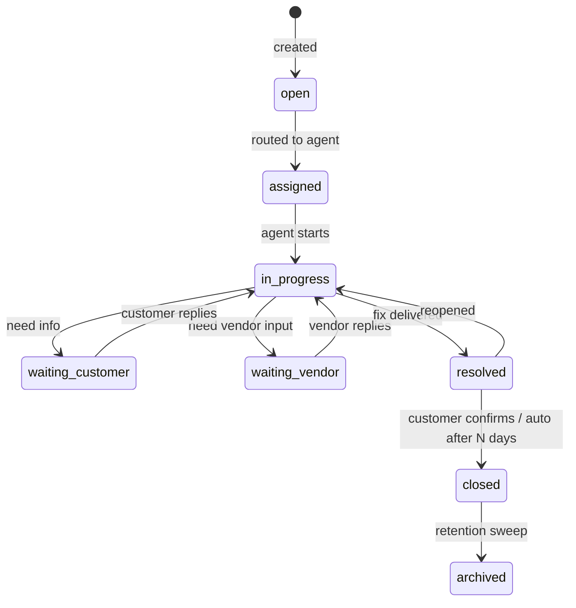
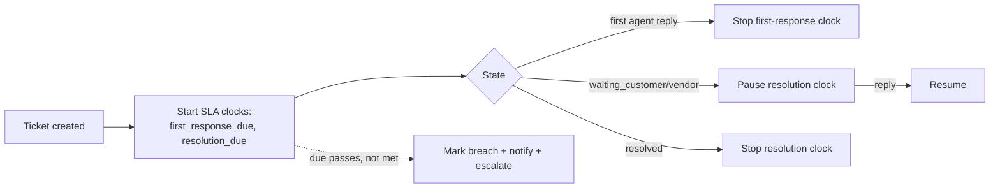
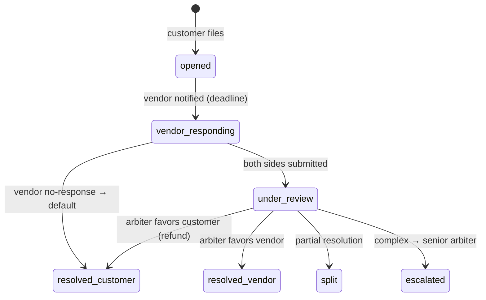

# Support Ticket Module — Multi-Tenant Multi-Vendor SaaS

An enterprise support + ITSM system: ticketing, SLA management,
skill-based routing, internal collaboration, dispute resolution,
vendor + customer portals, AI-assisted support, knowledge base, and
omnichannel intake.

This is the **support module** that three already-written docs reference
as planned:

- [`messaging-architecture.md`](messaging-architecture.md) §15 — a support conversation is a `conversation` of `type='support'` linked to a ticket; this doc owns the ticket, that doc owns the chat transport.
- [`crm-architecture.md`](crm-architecture.md) §15 — tickets feed the CRM customer timeline.
- [`ai-architecture.md`](ai-architecture.md) §6 — the AI support agent (triage, suggested responses, KB answers).

It composes infrastructure other modules own:

- **Ticket conversations** ← messaging §15 (`type='support'`).
- **Knowledge base** ← [`ai-architecture.md`](ai-architecture.md) §12 (RAG over docs/FAQs).
- **Routing / auto-escalation / auto-close** ← [`workflow-automation-architecture.md`](workflow-automation-architecture.md).
- **Sentiment / triage / suggested replies** ← [`ai-architecture.md`](ai-architecture.md) §6, §16.
- **SLA / volume / CSAT analytics** ← [`analytics-architecture.md`](analytics-architecture.md).
- **Disputes** ← refund/chargeback context from [`billing-architecture.md`](billing-architecture.md) §11.

Follows the shipped/planned convention of the other thirteen docs.

## Table of contents

1. [Overview](#1-overview)
2. [Ticket types](#2-ticket-types)
3. [Ticket lifecycle](#3-ticket-lifecycle)
4. [Ticket creation](#4-ticket-creation)
5. [Priority management](#5-priority-management)
6. [SLA management](#6-sla-management)
7. [Ticket assignment](#7-ticket-assignment)
8. [Internal collaboration](#8-internal-collaboration)
9. [Ticket conversations](#9-ticket-conversations)
10. [Dispute resolution](#10-dispute-resolution)
11. [Vendor support center](#11-vendor-support-center)
12. [Customer support portal](#12-customer-support-portal)
13. [AI-powered support](#13-ai-powered-support)
14. [Knowledge base integration](#14-knowledge-base-integration)
15. [Ticket automation](#15-ticket-automation)
16. [Notifications](#16-notifications)
17. [Ticket analytics](#17-ticket-analytics)
18. [Customer satisfaction](#18-customer-satisfaction)
19. [Database design](#19-database-design)
20. [API design](#20-api-design)
21. [Frontend architecture](#21-frontend-architecture)
22. [Security](#22-security)
23. [Performance](#23-performance)
24. [Multi-tenant support](#24-multi-tenant-support)
25. [Omnichannel support](#25-omnichannel-support)
26. [Scalability](#26-scalability)

### Status snapshot (today)

| Layer | Shipped | Planned in this doc |
|---|---|---|
| **Tickets** | none — greenfield | all `support_*` tables + the ticket engine |
| **Conversation transport** | none (messaging §15 specs `type='support'`) | tickets link to a support conversation |
| **Knowledge base** | none (ai §12 specs RAG) | KB suggestion on tickets |
| **Reused** | `BelongsToTenant`, notifications, AI gateway, automation engine, analytics rollups, event backbone, the `support` Spatie role (shipped in the role seeder) | — |

> Greenfield, but the seams are ready: the messaging engine provides the conversation, the AI gateway provides triage/KB, the automation engine provides routing, and the `support` role already exists in the role catalogue. This doc is the ticket lifecycle + SLA engine that ties them together.

---

## 1. Overview

### Business objectives

- **Resolve fast**: SLA-driven workflows + AI triage cut first-response + resolution time.
- **Scale support**: AI deflection (KB self-service + suggested replies) handles volume without linear headcount.
- **Resolve disputes fairly**: structured customer↔vendor mediation protects both sides + the platform's reputation.
- **Measure + improve**: SLA compliance, CSAT, agent productivity drive continuous improvement.

### Strategy

| Audience | Support strategy |
|---|---|
| **Customers** | Self-service portal + KB first; ticket → AI triage → agent if needed; CSAT after resolution |
| **Vendors** | Vendor support center; technical + billing + dispute help; KB for sellers |
| **Disputes** | Neutral mediation workflow between customer + vendor with platform arbitration |
| **Internal** | Agents collaborate (internal notes, escalation); managers monitor SLA + workload |

### Ticket lifecycle strategy

A ticket is a **stateful work item** with an SLA clock, an owner, a
priority, a conversation, and an audit trail — moving through a
configurable workflow from open to archived.

### Integration map

| Module | Support touchpoint |
|---|---|
| Messaging | The ticket thread is a `type='support'` conversation (messaging §15) |
| CRM | Tickets appear on the customer 360 timeline (crm §15) |
| Projects | A "project support" ticket links to a project |
| Tasks | An agent can spin a follow-up task from a ticket |
| Billing | "Billing support" / dispute tickets link to invoices/refunds (billing §11) |
| Analytics | SLA, volume, CSAT, agent productivity (analytics) |
| AI | Classification, routing, suggested replies, KB answers, sentiment (ai §6) |
| Notifications | Ticket created/assigned/replied/escalated/SLA-breach |
| Automation | Routing, escalation, follow-up, auto-close (automation engine) |

---

## 2. Ticket types

```php
support_ticket_types
  id, tenant_id (nullable = platform default)
  key, label, default_priority, default_sla_policy_id
  default_team_id, form_schema jsonb     // custom intake fields per type
  is_active, position
```

Technical · Billing · Project · Account · Vendor · Marketplace Disputes
· Feature Requests · Bug Reports · Security Reports · General Inquiries —
plus **custom types** (tenants add their own with a custom intake form
schema). Type drives default priority, SLA policy, and routing team.

---

## 3. Ticket lifecycle



- **Waiting** states **pause the SLA clock** (the agent isn't blocked by their own queue when waiting on a third party).
- **Resolved → closed** auto-transitions after N days of no reply (configurable), or on customer confirmation.
- **Reopen** within a window returns to `in_progress` (same ticket, SLA resumes).
- Workflows are **configurable per tenant** (custom statuses/transitions) — modeled as an FSM (`SupportLifecycle`) like the project/task/subscription lifecycles.

---

## 4. Ticket creation

Intake channels: support portal, email (parsed via inbound webhook,
automation doc), chat (messaging escalation), API, automation workflows.

```php
// app/Http/Requests/Support/StoreTicketRequest.php
return [
    'type_id'      => ['required', 'exists:support_ticket_types,id'],
    'subject'      => ['required', 'string', 'min:3', 'max:200'],
    'description'  => ['required', 'string', 'max:20000'],
    'category_id'  => ['nullable', 'exists:support_ticket_categories,id'],
    'priority'     => ['nullable', Rule::in(['critical','high','medium','low','informational'])],
    'attachments'  => ['nullable', 'array', 'max:10'],
    'attachments.*'=> ['file', 'max:25600', new MimeAllowed],  // reuse file pipeline
    'related_project_id' => ['nullable', 'exists:projects,id'],
    'related_order_id'   => ['nullable', 'exists:orders,id'],
    'related_invoice_id' => ['nullable', 'exists:invoices,id'],
    'custom_fields' => ['nullable', 'array'],   // validated against the type's form_schema
];
```

Captures subject, description, category, priority, attachments, and
**related entities** (project / order / invoice) — so the agent has
full context. A ticket number `TKT-{year}-{seq}` is gapless per tenant.
On create: AI classification + routing fire (§13/§7), an SLA clock
starts (§6), and a support conversation is opened (§9).

---

## 5. Priority management

Critical · High · Medium · Low · Informational. Each maps to an SLA
target (§6) and a notification level. **Escalation rules**:
- AI can raise priority on detected urgency/sentiment (§13).
- An aging ticket auto-escalates priority as it approaches SLA breach.
- Critical (e.g. security report, payment-down) bypasses normal routing → on-call team + immediate notification (bypasses quiet hours).

---

## 6. SLA management

```php
support_ticket_slas               // SLA policies
  id, tenant_id (nullable = default), vendor_id (nullable = vendor-specific)
  name, priority
  first_response_minutes, resolution_minutes, escalation_minutes
  business_hours jsonb            // {tz, schedule} — clock only ticks in business hours (optional)
  is_active

// per-ticket SLA tracking (denormalized onto the ticket)
support_tickets.{first_response_due_at, resolution_due_at, first_responded_at,
                 resolved_at, sla_paused_at, sla_breached enum('none','response','resolution','both')}
```



- Tracks **first response time**, **resolution time**, **escalation time**, **breach status**.
- **Clock pauses** in `waiting_*` states (and outside business hours, if the policy uses them) — fair to agents.
- A scheduled `CheckSlaBreaches` job (every minute, `SKIP LOCKED`) flags approaching + breached SLAs → escalation + notification.
- **Policies**: platform default, tenant-specific, vendor-specific (a premium vendor gets tighter SLAs); resolved most-specific-first.

---

## 7. Ticket assignment

```php
support_ticket_assignments        // history (append-only)
  id, tenant_id, ticket_id, agent_id (nullable), team_id (nullable)
  assigned_by_id, method enum('manual','auto','round_robin','skill','escalation')
  assigned_at, unassigned_at (null = current)
  index (ticket_id, unassigned_at), index (agent_id, unassigned_at)
```

- **Manual** — a manager assigns.
- **Auto** — on create, by type → default team.
- **Team** — assign to a queue; any team member can pick up.
- **Round-robin** — even distribution across an available team.
- **Skill-based routing** — match ticket type/tags/language to agent skills (`agent_skills`), pick the least-loaded qualified agent (the workload-balancer pattern from tasks §5).

Assignment runs through the automation engine (rules configurable);
every change is an append-only `support_ticket_assignments` row — full
reassignment history.

---

## 8. Internal collaboration

`support_ticket_notes` — **internal-only** (never customer-visible),
markdown, @mentions (notify the mentioned agent), attachments. Agents
discuss, loop in specialists, and document the resolution privately.
Escalation adds a senior agent + a system note. The hard line between
`notes` (internal) and `messages` (customer-facing, §9) is enforced
server-side — an internal note can never leak into the customer thread.

---

## 9. Ticket conversations

The customer-facing thread **is a messaging conversation** of
`type='support'` (messaging §15), with the ticket as its `subject`.
Reuses everything from the messaging doc: comments, replies, attachments,
mentions, rich text, real-time delivery, read receipts. The support
module owns the *ticket* (state, SLA, assignment); the messaging module
owns the *thread* (transport, presence). Agent transfers swap the agent
participant while preserving history; escalation adds participants.

---

## 10. Dispute resolution

A specialized ticket type (`marketplace_dispute`) with a mediation
workflow between customer + vendor + a platform arbiter.

```php
support_ticket_disputes
  id, tenant_id, ticket_id
  customer_id, vendor_id
  type enum('refund','delivery','payment','review','other')
  related_order_id, related_payment_id (nullable)
  amount_cents (nullable)
  status enum('opened','vendor_responding','under_review','resolved_customer','resolved_vendor','split','escalated')
  resolution jsonb                // {decision, refund_cents, note}
  arbiter_id (nullable), opened_at, resolved_at
```



- Covers **customer↔vendor**, refund, delivery, payment, review disputes.
- Both sides submit evidence (messages + attachments); a neutral arbiter (support manager / super-admin) decides.
- A refund decision triggers the billing refund workflow (billing §11) — ledger reversal + commission reversal, all idempotent.
- Deadlines: a non-responding vendor defaults to the customer's favor (configurable). Every step audited.

---

## 11. Vendor support center

Vendors get their own support surface (`/vendor/support`):
- **Create + track tickets** (technical, billing, dispute, account).
- **Communicate** with platform support.
- **Knowledge resources** — seller-facing KB (onboarding, payouts, policies).
- **Dashboard** — their open tickets, dispute status, SLA on their requests.

Vendor tickets route to the platform's support team (the vendor is the
*customer* of the platform here) — distinct from customer tickets about
a vendor's product (which may route to the vendor).

---

## 12. Customer support portal

Customer self-service (`/support`, reuses the client-portal shell from
projects §10):
- **Submit tickets** (typed intake form), **view history**, **upload files**, **chat with support** (the §9 conversation), **rate resolutions** (CSAT, §18).
- **KB-first** — before submitting, the portal surfaces relevant articles (AI KB search, §14) to deflect.
- **Status tracking** — live ticket status + SLA countdown.

---

## 13. AI-powered support

(Engine owned by [`ai-architecture.md`](ai-architecture.md) §6.)

| Feature | Description |
|---|---|
| Classification | Auto-categorize + type a new ticket |
| Routing | Suggest/auto the right team/agent (with the workload balancer) |
| Suggested responses | Draft a reply from the KB + ticket context for agent review |
| Knowledge search | RAG over the KB (ai §12) for both agent + customer self-service |
| Sentiment analysis | Flag frustrated customers → priority bump + escalation |
| Ticket summaries | Summarize a long thread for a transferring agent |
| Escalation detection | Detect signals (anger, churn risk, legal mention) → escalate |
| Resolution suggestions | Propose a fix from similar resolved tickets |

All credit-metered (ai §17), opt-in, human-in-the-loop — AI drafts +
suggests; the agent decides. Deflection (KB self-service) is the highest-ROI
AI feature: it resolves before a ticket is even created.

---

## 14. Knowledge base integration

KB content (FAQs, articles, guides, tutorials, documentation) is
ingested into the RAG store (ai §12). On a ticket:
- The customer portal suggests relevant articles **before** submission (deflection).
- The agent sees suggested articles inline; one click inserts/links one into the reply.
- AI answers (§13) cite KB sources.

A `kb_articles` table (tenant-scoped, versioned, categorized) feeds the
RAG ingestion job; published articles are also a public help center
(SEO, marketplace doc §22 patterns).

---

## 15. Ticket automation

(Engine owned by [`workflow-automation-architecture.md`](workflow-automation-architecture.md).) Support registers triggers + actions:

| Automation | Rule |
|---|---|
| Auto assignment | `ticket.created` → route by type/skill (§7) |
| Auto escalation | SLA approaching/breached → escalate + notify manager |
| Auto follow-up | `waiting_customer` N days → reminder |
| Auto reminders | Agent: ticket idle → nudge |
| Auto closure | `resolved` + N days no reply → close + CSAT survey |
| Workflow integration | Any ticket event → tenant-defined workflow |

Support events (`ticket.created`, `ticket.assigned`, `ticket.replied`,
`ticket.escalated`, `sla.breached`, `ticket.resolved`) register in the
automation trigger catalog.

---

## 16. Notifications

(Delivery via notifications doc.) Events: ticket created, assigned, new
reply, escalation, resolution, **SLA breach** (critical level → bypass
quiet hours, page on-call). Channels: in-app + email always; push for
assignments + breaches. Customers notified of replies + resolution;
agents of assignments + SLA risk.

---

## 17. Ticket analytics

(Rollups via analytics doc.) Tracks: ticket volume (by type/category/
channel), resolution time, **SLA compliance %**, CSAT, agent
productivity (tickets resolved, avg handle time), escalation rate,
first-contact-resolution rate, reopen rate. Rolled into `daily_metrics`
(`support.*` keys); a support dashboard renders via the shared widget
protocol. Managers see team SLA + workload heatmaps.

---

## 18. Customer satisfaction

```php
support_ticket_surveys
  id, tenant_id, ticket_id, customer_id
  type enum('csat','ces','nps'), sent_at, responded_at

support_ticket_ratings
  id, ticket_id, survey_id, agent_id
  score smallint           // CSAT 1-5, NPS 0-10, CES 1-7
  feedback text, created_at
```

- **CSAT survey** auto-sent on close (a one-click rating in the email/portal).
- **Resolution + agent ratings**; **feedback** collected.
- Satisfaction reports per agent/team/type (§17); low scores flag tickets for review + coaching.

---

## 19. Database design

| Table | Purpose |
|---|---|
| `support_tickets` | Core ticket (subject, status, priority, SLA fields, related entities) |
| `support_ticket_types` | Type registry + intake schema |
| `support_ticket_categories` | Nested categories |
| `support_ticket_priorities` | Priority registry (or enum) |
| `support_ticket_statuses` | Custom statuses per tenant workflow |
| `support_ticket_assignments` | Append-only assignment history |
| `support_ticket_messages` | Customer-facing thread (or link to messaging conversation) |
| `support_ticket_attachments` | Files (signed-URL) |
| `support_ticket_notes` | Internal-only notes |
| `support_ticket_escalations` | Escalation events |
| `support_ticket_slas` | SLA policies |
| `support_ticket_surveys` / `_ratings` | CSAT |
| `support_ticket_activities` | Append-only audit timeline |
| `support_ticket_disputes` | Dispute mediation |
| `support_ticket_automations` | Support-specific automation rules (or reuse automation) |
| `support_ticket_ai_insights` | AI classification/sentiment/summary outputs |

### `support_tickets` (the core)

```php
Schema::create('support_tickets', function (Blueprint $t) {
    $t->id();
    $t->foreignId('tenant_id')->constrained()->cascadeOnDelete();
    $t->string('number')->unique();           // TKT-2026-#### gapless per tenant
    $t->foreignId('type_id')->constrained('support_ticket_types');
    $t->foreignId('category_id')->nullable()->constrained('support_ticket_categories')->nullOnDelete();
    $t->foreignId('requester_id')->constrained('users');     // customer/vendor
    $t->foreignId('assigned_agent_id')->nullable()->constrained('users')->nullOnDelete();
    $t->foreignId('assigned_team_id')->nullable()->constrained('support_teams')->nullOnDelete();
    $t->foreignId('conversation_id')->nullable()->constrained('conversations')->nullOnDelete(); // messaging §15
    $t->string('subject', 200);
    $t->text('description');
    $t->string('status', 32)->default('open');
    $t->string('priority', 16)->default('medium');
    $t->foreignId('sla_policy_id')->nullable()->constrained('support_ticket_slas')->nullOnDelete();
    $t->timestamp('first_response_due_at')->nullable();
    $t->timestamp('resolution_due_at')->nullable();
    $t->timestamp('first_responded_at')->nullable();
    $t->timestamp('resolved_at')->nullable();
    $t->timestamp('closed_at')->nullable();
    $t->timestamp('sla_paused_at')->nullable();
    $t->string('sla_breached', 12)->default('none');  // none|response|resolution|both
    $t->string('channel', 16)->default('portal');     // portal|email|chat|api
    $t->foreignId('related_project_id')->nullable()->constrained('projects')->nullOnDelete();
    $t->foreignId('related_order_id')->nullable()->constrained('orders')->nullOnDelete();
    $t->jsonb('custom_fields')->nullable();
    $t->jsonb('tags')->nullable();
    $t->softDeletes();
    $t->timestamps();
    $t->index(['tenant_id', 'status', 'priority']);
    $t->index(['assigned_agent_id', 'status']);
    $t->index(['resolution_due_at']);                 // SLA breach sweep
    $t->index(['requester_id', 'created_at']);
});
```

### Particulars

- SLA fields denormalized onto the ticket → the breach-sweep query is one indexed scan (`resolution_due_at < now() AND resolved_at IS NULL AND sla_paused_at IS NULL`).
- `support_ticket_activities` append-only, partitioned by month at scale.
- Customer-facing messages reuse the messaging `conversation` (FK), so the ticket doesn't duplicate the chat schema; `support_ticket_messages` is optional (only if a tenant disables real-time chat and wants a simpler comment model).
- Every table `tenant_id` + `BelongsToTenant`.

---

## 20. API design

API-first; tenant-scoped; role + ownership checked; cross-tenant → 404.

| Verb | URL | Purpose |
|---|---|---|
| `GET` | `/support/tickets` | List (filter status/priority/type/agent/SLA, search, paginate) |
| `POST` | `/support/tickets` | Create (portal/api) |
| `GET` | `/support/tickets/{number}` | Detail + conversation + activity |
| `PATCH` | `/support/tickets/{id}` | Update (status/priority/category) |
| `POST` | `/support/tickets/{id}/assign` | Assign agent/team |
| `POST` | `/support/tickets/{id}/escalate` | Escalate |
| `POST` | `/support/tickets/{id}/messages` | Customer-facing reply (→ conversation) |
| `POST` | `/support/tickets/{id}/notes` | Internal note |
| `POST` | `/support/tickets/{id}/resolve` / `/close` / `/reopen` | Lifecycle |
| `POST` | `/support/tickets/{id}/attachments` | Upload |
| `GET` | `/support/tickets/{id}/kb-suggestions` | AI KB suggestions |
| `POST` | `/support/disputes` | Open a dispute |
| `POST` | `/support/disputes/{id}/resolve` | Arbiter decision |
| `GET` | `/support/sla/policies` | SLA policies |
| `GET` | `/support/analytics` | Volume/SLA/CSAT metrics |
| `POST` | `/support/tickets/{id}/survey` | Submit CSAT |
| `POST` | `/webhooks/support/email` | Inbound email → ticket (HMAC) |

Lists support filter/search/sort + cursor pagination (the shared shape).

---

## 21. Frontend architecture

```
resources/js/
├── pages/support/
│   ├── dashboard.tsx          # agent dashboard (my queue, SLA at-risk)
│   ├── tickets.tsx            # ticket center (filterable list)
│   ├── ticket-detail.tsx      # ticket + conversation + sidebar (SLA, related, AI)
│   ├── sla.tsx                # SLA dashboard (compliance, breaches)
│   ├── analytics.tsx
│   └── disputes.tsx
├── pages/vendor/support/      # vendor support center
├── pages/portal/support/      # customer support portal (KB-first)
├── components/support/
│   ├── TicketCard.tsx         # status/priority/SLA badge
│   ├── TicketTimeline.tsx     # activity + messages merged
│   ├── TicketChat.tsx         # reuses messaging ChatWindow
│   ├── SlaWidget.tsx          # countdown + breach indicator
│   ├── SlaBadge.tsx
│   ├── PriorityBadge.tsx
│   ├── AssignmentPanel.tsx
│   ├── InternalNotes.tsx      # internal-only, visually distinct
│   ├── KbSuggestions.tsx      # AI article suggestions
│   ├── SupportMetrics.tsx
│   ├── SatisfactionChart.tsx
│   └── DisputePanel.tsx
├── hooks/support/
│   ├── useTicketQueue.ts
│   ├── useSlaCountdown.ts     # live SLA timer
│   ├── useTicketChat.ts       # reuses messaging useConversation
│   └── useKbSuggestions.ts
└── lib/support/{statuses,sla,formatters}.ts
```

The ticket chat reuses the messaging `ChatWindow`; the timeline merges
activity + messages; Inertia props + React Query + live SLA countdown.

---

## 22. Security

| Concern | Mitigation |
|---|---|
| Tenant isolation | Every `support_*` table `tenant_id` + global scope; cross-tenant → 404 |
| Ticket permissions | Requester sees own; agents see assigned + team queue; managers see all (`TicketPolicy`); the `support` Spatie role gates agent surfaces |
| Role-based access | Customer / vendor / agent / manager / admin each see the appropriate surface + fields |
| Internal vs customer | Internal notes server-filtered — never serialized into customer responses |
| Secure attachments | Signed-URL, MIME allowlist, ClamAV (file pipeline); access checked against ticket visibility |
| Cross-tenant | Global scope on every query; related-entity links validated within tenant |
| Audit | All ticket changes + assignments + dispute decisions logged (append-only) |
| PII | Customer PII in tickets gated + audited; GDPR export/delete hooks |

---

## 23. Performance

Target: millions of tickets, thousands of agents.

| Concern | Approach |
|---|---|
| Queue views | `(tenant_id, status, priority)` + `(assigned_agent_id, status)` indexes; cached per-agent queue (30s) |
| SLA sweep | Single indexed scan on `resolution_due_at`; `SKIP LOCKED` so multiple workers shard |
| Search | `tsvector` over subject/description + semantic (ai §12); Meilisearch at scale |
| Analytics | Rollups in `daily_metrics`; dashboards read rollups, not live aggregation |
| Conversations | Handled by the messaging engine (read cursors, partitioned messages) |
| Background jobs | Routing, SLA checks, auto-close, CSAT sends, AI classification, KB ingest all queued |
| Caching | Redis for queues, SLA policies, KB suggestions |
| Partitioning | `support_ticket_activities` by month |

---

## 24. Multi-tenant support

Each tenant customizes (white-label):
- **Ticket categories + types** + custom intake form schemas.
- **SLA policies** (+ vendor-specific tiers).
- **Support workflows** — custom statuses/transitions.
- **Branding** — portal + emails (BrandingService).
- **Support forms** — per-type custom fields.

A tenant's support desk is fully isolated; agents see only their
tenant's tickets.

---

## 25. Omnichannel support

Extensible intake (connector pattern, automation §11):

| Channel | Mechanism |
|---|---|
| Email | Inbound email webhook → ticket; replies threaded |
| Live chat | Messaging escalation → support conversation |
| WhatsApp / Telegram / Messenger | Connector → creates/updates a ticket; replies routed back |
| Voice | Call → transcription (ai) → ticket with recording |
| Video | Scheduled support call (messaging §8 voice/video-ready) |

All channels converge on **one ticket model** — an agent works every
channel from the same queue, with the channel recorded on the ticket.

---

## 26. Scalability

100k+ tenants, millions of tickets, global operations:

- **Partitioned** activities + (messaging) messages by month.
- **Read replicas** for queues/search/analytics; primary for writes.
- **SLA sweep** sharded via `SKIP LOCKED`; runs every minute regardless of volume.
- **Search offload** to a dedicated service at scale.
- **Per-tenant fair-share** on routing + notification + AI queues.
- **Multi-region** — support workers per region; tickets in the regional primary.
- **AI deflection** scales support sub-linearly — KB self-service + suggested replies absorb volume growth without proportional headcount.

---

## File map for the next phase

| Path | Status |
|---|---|
| `database/migrations/*_create_support_tickets_table.php` + `_types_` + `_categories_` + `_statuses_` | planned |
| `database/migrations/*_create_support_ticket_assignments_table.php` + `_notes_` + `_attachments_` + `_escalations_` | planned |
| `database/migrations/*_create_support_ticket_slas_table.php` + `_surveys_` + `_ratings_` | planned |
| `database/migrations/*_create_support_ticket_activities_table.php` (partitioned) + `_disputes_` + `_ai_insights_` | planned |
| `database/migrations/*_create_support_teams_table.php` + `_agent_skills_` + `_kb_articles_` | planned |
| `app/Domain/Support/{TicketService,SlaEngine,RoutingService,DisputeService,SupportLifecycle,CsatService}.php` | planned |
| `app/Models/{SupportTicket,SupportTicketType,SupportTicketAssignment,SupportTicketNote,SupportTicketSla,SupportTicketDispute,SupportTicketSurvey,SupportTeam,KbArticle}.php` | planned |
| `app/Jobs/Support/{CheckSlaBreaches,AutoCloseResolved,SendCsatSurvey,ClassifyTicket,IngestKbArticle}.php` | planned |
| `app/Listeners/Support/{RecordTicketActivity,LogCrmCommunication,OpenSupportConversation}.php` | planned |
| `app/Policies/{SupportTicketPolicy,DisputePolicy}.php` | planned |
| `app/Http/Controllers/Support/*Controller.php` + `Webhooks/SupportEmailController.php` | planned |
| `resources/js/pages/support/*` + `pages/{vendor,portal}/support/*` + `components/support/*` + `hooks/support/*` | planned |
| `tests/Feature/Support/*` (SLA clock pause/breach, routing, internal-note isolation, dispute resolution → refund, CSAT, tenant isolation) | planned |

The next pass commits the ticket + type + SLA + assignment tables, the
`TicketService` + `SlaEngine` (with the breach-sweep job), and the
`RecordTicketActivity` listener — so a ticket can be created → routed →
worked → resolved with SLA tracking before disputes, AI, and
omnichannel intake layer on. The customer thread reuses the messaging
`type='support'` conversation (messaging §15) rather than a separate
chat build.

---

## The architecture doc set

This is the fourteenth architecture doc. The complete set under `docs/`:

1. `dashboard-architecture.md`
2. `payments-architecture.md`
3. `projects-architecture.md`
4. `tasks-architecture.md`
5. `notifications-architecture.md`
6. `billing-architecture.md`
7. `ai-architecture.md`
8. `analytics-architecture.md`
9. `workflow-automation-architecture.md`
10. `marketplace-architecture.md`
11. `mobile-architecture.md`
12. `crm-architecture.md`
13. `messaging-architecture.md`
14. `support-architecture.md`

All in the same shipped-vs-planned format, cross-referenced, each
ending with a concrete "File map for the next phase".
