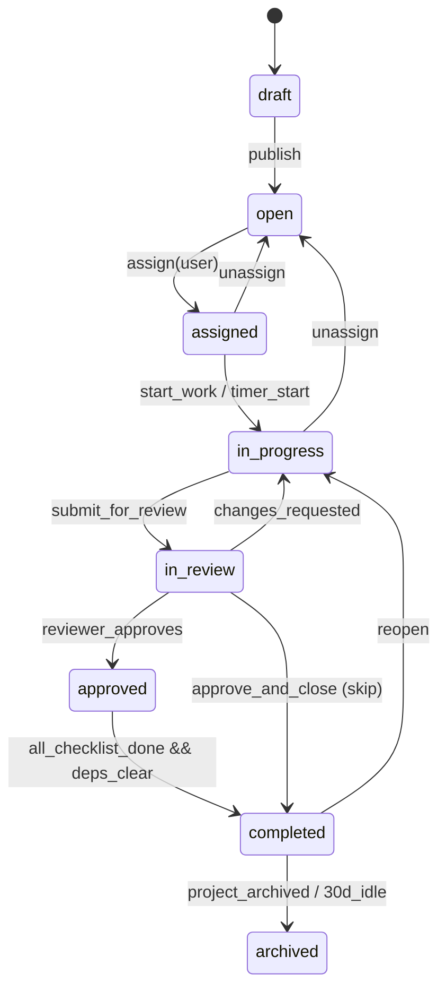
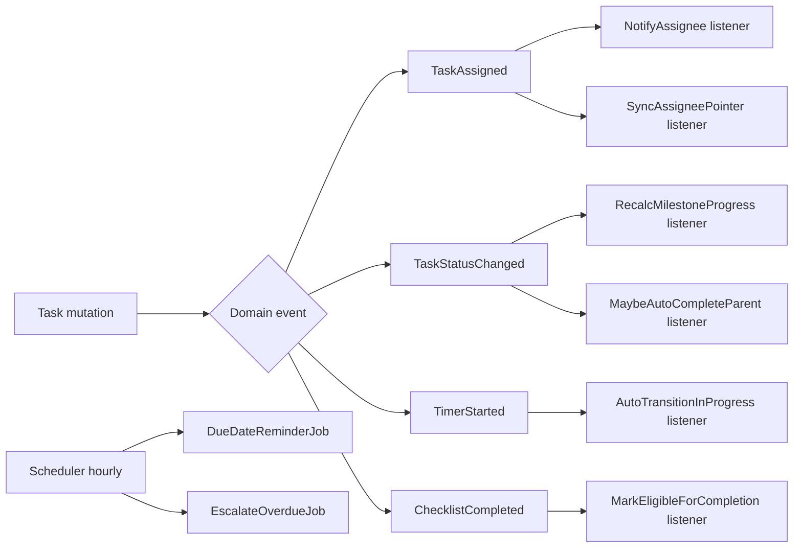

# Tasks Module — Multi-Vendor SaaS Marketplace

An enterprise-grade task management system: lifecycle, subtasks,
assignment + workload balancing, six views, real-time collaboration,
checklists, dependencies, time tracking, event-driven automation,
customer visibility, analytics, and AI.

This is the **deep-dive companion** to the Projects module. Where the
two overlap (the `tasks` table shape, kanban ordering, the permission
model), this doc is the source of truth and
[`projects-architecture.md`](projects-architecture.md) §6 defers to it.
For project lifecycle / milestones / client portal, see that doc.

Follows the shipped/planned status convention of
[`dashboard-architecture.md`](dashboard-architecture.md) and
[`payments-architecture.md`](payments-architecture.md).

## Table of contents

1. [Overview](#1-overview)
2. [Task lifecycle](#2-task-lifecycle)
3. [Task creation](#3-task-creation)
4. [Subtasks](#4-subtasks)
5. [Assignment & workload](#5-assignment--workload)
6. [Task views](#6-task-views)
7. [Collaboration](#7-collaboration)
8. [Checklists](#8-checklists)
9. [Dependencies](#9-dependencies)
10. [Time tracking](#10-time-tracking)
11. [Automation (event-driven)](#11-automation-event-driven)
12. [File attachments](#12-file-attachments)
13. [Notifications](#13-notifications)
14. [Customer visibility](#14-customer-visibility)
15. [Analytics & reporting](#15-analytics--reporting)
16. [Database design](#16-database-design)
17. [API design](#17-api-design)
18. [Frontend architecture](#18-frontend-architecture)
19. [Security](#19-security)
20. [Performance](#20-performance)
21. [AI features](#21-ai-features)

### Status snapshot (today)

| Layer | Shipped (`ba55ac8`) | Planned in this doc |
|---|---|---|
| **Schema** | `tasks` (tenant_id, project_id, assignee_id, status, priority, due_on, completed_at, position, soft-deletes) | + `task_assignments`, `subtasks` (via `parent_task_id`), `task_checklists`, `task_checklist_items`, `task_dependencies`, `task_comments`, `task_attachments`, `task_labels`, `task_tags`, `task_timers`, `task_time_entries`, `task_activity_logs` |
| **Model** | `Task` with status/priority constants, `project()`, `assignee()`, `isDone()` | + `TaskAssignment`, `Checklist`, `TaskDependency`, `TaskComment`, `TaskTimer`, `TimeEntry` |
| **HTTP** | `Workspace\TaskController` (basic CRUD) | + assignment / checklist / comment / timer / dependency endpoints; `Domain\Tasks\*` services |
| **React** | `workspace/tasks/index.tsx` (list) | + Kanban / Calendar / Timeline / Gantt / Workload views, task modal, time tracker, checklist component |
| **Events** | none | full event-driven automation engine (§11) |

> The existing `tasks.status` enum is `todo | in_progress | review | done` (4 states). This doc introduces the **richer lifecycle** (`draft → open → assigned → in_progress → in_review → approved → completed → archived`) as the marketplace-facing model. The migration path: keep the 4-value column working, add a `lifecycle` column, and map old→new. Same two-column strategy used for the project lifecycle.

---

## 1. Overview

### Business goals

- **Execution**: turn a project's scope into concrete, assignable, trackable units of work.
- **Accountability**: every task has an owner, a due date, and an audit trail.
- **Throughput**: workload balancing keeps no one person the bottleneck.
- **Billing**: billable time entries roll straight into invoices.
- **Trust**: customers see exactly the tasks the vendor chooses to expose, and approve deliverables in-band.

### Workflows

| Actor | Workflow |
|---|---|
| **Vendor (owner/manager)** | Break a milestone into tasks → assign → monitor the board → review submitted work → mark approved |
| **Vendor team member** | See "my tasks" sorted by due date → start a timer → log progress + checklist items → move to `in_review` |
| **Customer** | See the subset of tasks marked `client_visible` → watch progress → approve / request revisions on deliverable tasks |
| **Customer team member** | Comment + approve on behalf of the customer org |
| **Super admin** | Cross-tenant audit, dispute resolution, platform productivity analytics |

### Integration with projects & milestones

```
project ──< milestone ──< task ──< subtask
                              ├── checklist_items
                              ├── time_entries  → invoice line items
                              ├── dependencies
                              └── comments / attachments
```

A task **must** belong to a project (`project_id` non-null) and **may**
belong to a milestone (`milestone_id` nullable). Milestone completion %
is derived from its tasks (see projects doc §5).

---

## 2. Task lifecycle



### Transition rules

Implemented in `App\Domain\Tasks\TaskLifecycle` (a small FSM):

```php
final class TaskLifecycle
{
    /** @var array<string, string[]>  from => [allowed to] */
    private const TRANSITIONS = [
        'draft'       => ['open'],
        'open'        => ['assigned', 'archived'],
        'assigned'    => ['in_progress', 'open'],
        'in_progress' => ['in_review', 'open', 'completed'],
        'in_review'   => ['in_progress', 'approved', 'completed'],
        'approved'    => ['completed', 'in_progress'],
        'completed'   => ['archived', 'in_progress'],
        'archived'    => [],
    ];

    public function assertCan(Task $task, string $to, User $actor): void
    {
        $allowed = self::TRANSITIONS[$task->lifecycle] ?? [];
        if (! in_array($to, $allowed, true)) {
            throw new InvalidTransition($task->lifecycle, $to);
        }
        if (! $actor->can("task.transition.{$to}", $task)) {
            throw new AuthorizationException();
        }
    }
}
```

### Permissions per transition

| Transition | Who |
|---|---|
| `→ open` (publish) | owner, manager, member |
| `→ assigned` | owner, manager (or self-assign for member) |
| `→ in_progress` | the assignee |
| `→ in_review` | the assignee |
| `→ approved` | owner, manager (reviewer); **client** for deliverable tasks |
| `→ completed` | owner, manager |
| `→ archived` | owner (or automation) |

### Automation rules (see §11 for the engine)

- All subtasks `completed` → parent auto-moves to `in_review`.
- All checklist items checked + no open blocking deps → eligible for `completed`.
- Timer started on an `assigned` task → auto-transition to `in_progress`.
- Due date passes while `in_progress` → escalation event fires.

---

## 3. Task creation

`POST /workspace/projects/{slug}/tasks` (or `/tasks` with `project_id` in body).

### Fields

| Field | Type | Notes |
|---|---|---|
| `title` | string(3–160) | required |
| `description` | text(≤20000) | markdown |
| `project_id` | fk | required |
| `milestone_id` | fk | nullable |
| `parent_task_id` | fk | nullable (subtask) |
| `priority` | enum | low / normal / high / urgent |
| `status` / `lifecycle` | enum | defaults draft |
| `due_on` | date | nullable, `after_or_equal:today` |
| `estimated_hours` | decimal(6,2) | nullable |
| `tags` | string[] | ≤ 10, max 24 chars each |
| `labels` | int[] | fk to `task_labels` |
| `category` | enum | feature / bug / chore / research |

### Validation rules

```php
// app/Http/Requests/Workspace/StoreTaskRequest.php
return [
    'title'           => ['required', 'string', 'min:3', 'max:160'],
    'description'     => ['nullable', 'string', 'max:20000'],
    'project_id'      => ['required', 'integer', Rule::exists('projects', 'id')],
    'milestone_id'    => ['nullable', 'integer', Rule::exists('milestones', 'id')],
    'parent_task_id'  => ['nullable', 'integer', Rule::exists('tasks', 'id')],
    'priority'        => ['nullable', Rule::in(['low', 'normal', 'high', 'urgent'])],
    'due_on'          => ['nullable', 'date', 'after_or_equal:today'],
    'estimated_hours' => ['nullable', 'numeric', 'min:0', 'max:9999.99'],
    'assignee_ids'    => ['nullable', 'array', 'max:10'],
    'assignee_ids.*'  => ['integer', new IsProjectMember($this->route('project'))],
    'tags'            => ['nullable', 'array', 'max:10'],
    'tags.*'          => ['string', 'max:24'],
    'label_ids'       => ['nullable', 'array'],
    'label_ids.*'     => ['integer', Rule::exists('task_labels', 'id')],
];
```

Cross-field rules enforced in `withValidator`: `parent_task_id` must
belong to the same project; `milestone_id` must belong to the same
project; an assignee must be a project member.

---

## 4. Subtasks

### Implementation strategy

Self-referential FK on `tasks`: `parent_task_id`. Unlimited depth, but
the UI nudges toward 2 levels (task → subtask) for sanity.

```php
// Task model
public function parent(): BelongsTo
{
    return $this->belongsTo(Task::class, 'parent_task_id');
}

public function subtasks(): HasMany
{
    return $this->hasMany(Task::class, 'parent_task_id');
}
```

### Progress calculation

A parent's progress = weighted by subtask `estimated_hours` (falling
back to equal weight when hours are absent):

```php
public function progressPercent(): int
{
    $subs = $this->subtasks()->get(['status', 'estimated_hours', 'progress_percent']);
    if ($subs->isEmpty()) {
        return $this->status === Task::STATUS_DONE ? 100 : $this->progress_percent;
    }
    $totalWeight = $subs->sum(fn ($s) => max((float) $s->estimated_hours, 0.5));
    $doneWeight = $subs->sum(function ($s) {
        $w = max((float) $s->estimated_hours, 0.5);
        return $s->status === Task::STATUS_DONE ? $w : $w * ($s->progress_percent / 100);
    });
    return (int) round(($doneWeight / $totalWeight) * 100);
}
```

The cached `progress_percent` column is refreshed by a listener on
`SubtaskStatusChanged` so reads stay O(1). Deep trees recompute
bottom-up via a queued `RecalculateTaskProgress` job to avoid N+1
recursion in the request cycle.

### Guards

- A task can't be its own ancestor (cycle check on assignment).
- Deleting a parent soft-deletes its subtree (cascade via model event).
- Completing a parent requires all subtasks `completed` unless an
  owner overrides with `force=true`.

---

## 5. Assignment & workload

### `task_assignments` (many-to-many, with history)

```php
Schema::create('task_assignments', function (Blueprint $t) {
    $t->id();
    $t->foreignId('tenant_id')->constrained()->cascadeOnDelete();
    $t->foreignId('task_id')->constrained()->cascadeOnDelete();
    $t->foreignId('user_id')->constrained()->cascadeOnDelete();
    $t->foreignId('assigned_by_id')->nullable()->constrained('users')->nullOnDelete();
    $t->enum('role', ['responsible', 'reviewer', 'collaborator'])->default('responsible');
    $t->timestamp('assigned_at')->useCurrent();
    $t->timestamp('unassigned_at')->nullable();   // null = currently active
    $t->timestamps();
    $t->index(['task_id', 'unassigned_at']);
    $t->index(['user_id', 'unassigned_at']);       // "my active tasks"
});
```

The legacy `tasks.assignee_id` stays as the **primary responsible**
denormalized pointer (fast board queries); `task_assignments` is the
full picture (multiple assignees, reviewers, history). A model event
keeps `assignee_id` synced to the `responsible` assignment.

### Single vs multiple assignees

- `assignee_id` — the one person on the hook (shown on the card).
- `task_assignments` rows with `role=collaborator` — additional hands.
- `role=reviewer` — who can approve.

### Automatic assignment & workload balancing

```php
// app/Domain/Tasks/WorkloadBalancer.php
final class WorkloadBalancer
{
    /**
     * Pick the least-loaded eligible member, weighting by open
     * estimated hours rather than raw task count.
     */
    public function suggestAssignee(Task $task, Collection $candidates): ?User
    {
        return $candidates
            ->map(fn (User $u) => [
                'user' => $u,
                'load' => $this->openHours($u),     // SUM(estimated_hours) of their open tasks
            ])
            ->sortBy('load')
            ->first()['user'] ?? null;
    }
}
```

Auto-assignment rules are configurable per project: round-robin,
least-loaded, or by skill tag. Rule evaluation runs in a listener on
`TaskPublished`.

### Assignment logs

Every assignment / reassignment / unassignment is an immutable
`task_assignments` row (active rows have `unassigned_at IS NULL`) plus
a `task_activity_logs` entry. Full reassignment history is one query.

---

## 6. Task views

| View | Route | Query shape | UX |
|---|---|---|---|
| **Kanban** | `…/board` | `WHERE project_id=? ORDER BY status, position` | Columns by status; drag updates `(status, position)` via fractional indexing |
| **List** | `…/list` | paginated, sortable, filterable | Dense table; bulk actions; inline edit |
| **Calendar** | `…/calendar` | `WHERE due_on BETWEEN ? AND ?` | Month grid; drag to reschedule (`due_on`) |
| **Timeline** | `…/timeline` | tasks + milestones over date range | Swimlanes per assignee/milestone |
| **Gantt** | `…/gantt` | tasks + `task_dependencies` | Bars + dependency arrows; critical path highlight |
| **Workload** | `…/workload` | `SUM(estimated_hours) GROUP BY assignee, week` | Heatmap of who's over/under capacity |

### API requirements

All views share `GET …/tasks` with view-specific params:
- Kanban: `?group_by=status` → response keyed by status.
- Calendar: `?from=&to=` → flat list with `due_on`.
- Workload: `?aggregate=hours_by_assignee_week` → pre-grouped.

### Database considerations

- Kanban: composite index `(project_id, status, position)`.
- Calendar/upcoming: `(tenant_id, due_on)` (already shipped).
- Workload: rollup into `daily_metrics` nightly for big tenants; live query for small.
- Gantt: dependencies fetched in one `WHERE task_id IN (...)`.

---

## 7. Collaboration

### Comments

`task_comments` (defined in §16) — markdown body, `internal` flag
(vendor-only when true), JSON `mentions`, soft-deletes, reactions.

### Mentions

`@username` parsed at write time by `MentionParser`; stored as
`[{user_id, offset, length}]` so the renderer highlights + links
without re-parsing. A mention fires `UserMentioned` → notification.

### Internal vs customer-visible notes

- `task_comments.internal = true` → never sent to client channels, never in the portal.
- `internal = false` → visible to client collaborators on `client_visible` tasks.

### Reactions

Stored as JSON on the comment: `{ "👍": [3, 7], "🎉": [3] }`. Toggling
is a single optimistic UI update + `PATCH …/comments/{id}/react`.

### Real-time

Reverb private channel `task.{taskId}` broadcasts `CommentPosted`,
`TaskUpdated`, `ReactionToggled`. The React task modal subscribes while
open. Typing indicators on presence channel `task.{taskId}.presence`.

---

## 8. Checklists

```php
Schema::create('task_checklists', function (Blueprint $t) {
    $t->id();
    $t->foreignId('tenant_id')->constrained()->cascadeOnDelete();
    $t->foreignId('task_id')->constrained()->cascadeOnDelete();
    $t->string('title')->default('Checklist');
    $t->unsignedInteger('position')->default(0);
    $t->timestamps();
    $t->index(['task_id', 'position']);
});

Schema::create('task_checklist_items', function (Blueprint $t) {
    $t->id();
    $t->foreignId('tenant_id')->constrained()->cascadeOnDelete();
    $t->foreignId('checklist_id')->constrained('task_checklists')->cascadeOnDelete();
    $t->string('label', 500);
    $t->boolean('checked')->default(false);
    $t->foreignId('checked_by_id')->nullable()->constrained('users')->nullOnDelete();
    $t->timestamp('checked_at')->nullable();
    $t->unsignedInteger('position')->default(0);
    $t->timestamps();
    $t->index(['checklist_id', 'position']);
});
```

### Progress

`checked_count / total_count` per checklist; task-level rolls up across
its checklists. Drives the §2 automation: all-items-checked makes the
task eligible for `completed`.

### Reusable templates

A `checklist_templates` table (tenant-scoped) holds named item lists
(e.g. "PR review", "Pre-launch QA"). "Apply template" clones items into
a new `task_checklist`. Nested checklists supported via a `parent_id`
on items for sub-grouping.

---

## 9. Dependencies

```php
Schema::create('task_dependencies', function (Blueprint $t) {
    $t->id();
    $t->foreignId('tenant_id')->constrained()->cascadeOnDelete();
    $t->foreignId('task_id')->constrained()->cascadeOnDelete();             // the dependent
    $t->foreignId('depends_on_task_id')->constrained('tasks')->cascadeOnDelete(); // the blocker
    $t->enum('type', ['blocks', 'blocked_by', 'related'])->default('blocked_by');
    $t->timestamps();
    $t->unique(['task_id', 'depends_on_task_id', 'type']);
    $t->index('depends_on_task_id');
});
```

### Relationship types

- **blocked_by / blocks** — directional; a task can't move to `completed` while a blocker isn't `completed`.
- **related** — soft link, no enforcement.
- **parent/child** — via `parent_task_id` (§4), not this table.

### Preventing invalid workflows

- **Cycle detection** on insert: a DFS from `depends_on_task_id` must not reach `task_id`. Rejected with 422 if it would form a loop.
- **Completion guard**: the lifecycle FSM checks `openBlockers()->count() === 0` before allowing `→ completed`.
- **Cross-project guard**: dependencies must stay within the same project (configurable).

---

## 10. Time tracking

### `task_timers` (live, one active per user) + `task_time_entries` (immutable log)

```php
Schema::create('task_timers', function (Blueprint $t) {
    $t->id();
    $t->foreignId('tenant_id')->constrained()->cascadeOnDelete();
    $t->foreignId('task_id')->constrained()->cascadeOnDelete();
    $t->foreignId('user_id')->constrained()->cascadeOnDelete();
    $t->timestamp('started_at');
    $t->timestamps();
    $t->unique('user_id'); // a user has at most one running timer
});

Schema::create('task_time_entries', function (Blueprint $t) {
    $t->id();
    $t->foreignId('tenant_id')->constrained()->cascadeOnDelete();
    $t->foreignId('task_id')->constrained()->cascadeOnDelete();
    $t->foreignId('user_id')->constrained()->cascadeOnDelete();
    $t->unsignedInteger('seconds');
    $t->text('note')->nullable();
    $t->boolean('billable')->default(true);
    $t->integer('rate_cents')->nullable();   // snapshot of hourly rate × billable
    $t->timestamp('started_at');
    $t->timestamp('ended_at');
    $t->timestamps();
    $t->index(['task_id', 'started_at']);
    $t->index(['user_id', 'started_at']);
    $t->index(['tenant_id', 'billable', 'started_at']); // billing rollups
});
```

### Flows

- **Start/stop timer**: `POST …/timer/start` creates a `task_timers` row (and auto-transitions the task to `in_progress`); `POST …/timer/stop` deletes the timer and writes a `task_time_entries` row with the elapsed seconds. Starting a timer while another runs auto-stops the previous.
- **Manual entry**: `POST …/time-entries` with `seconds`, `note`, `billable`.
- **Timesheets**: `GET /workspace/timesheets?user=&from=&to=` aggregates entries per user per day.

### Billable → invoices

Billable entries feed invoice line items: `SUM(seconds)/3600 × rate_cents`.
The `rate_cents` is snapshotted at entry time so later rate changes don't
rewrite history. Non-billable time is tracked for productivity analytics
but excluded from invoices.

### Reports

Productivity = `done tasks` + `logged hours` + `estimate accuracy`
(`actual / estimated`). Surfaced in §15.

---

## 11. Automation (event-driven)

### Architecture

Domain events → queued listeners. Every meaningful task mutation emits
an event; automation subscribes. This keeps controllers thin and makes
rules independently testable + retryable.



### Event catalogue

| Event | Emitted when | Listeners |
|---|---|---|
| `TaskPublished` | draft → open | AutoAssign (rule engine), Notify project |
| `TaskAssigned` | assignment created | NotifyAssignee, SyncAssigneePointer, ActivityLog |
| `TaskStatusChanged` | lifecycle transition | RecalcMilestoneProgress, MaybeAutoCompleteParent, NotifySubscribers |
| `TimerStarted` | timer start | AutoTransitionInProgress |
| `ChecklistItemToggled` | item check | MarkEligibleForCompletion |
| `TaskCommentPosted` | comment | NotifyMentioned, NotifyWatchers, Broadcast |
| `TaskDue Soon` (cron) | 48h/24h before due | DueDateReminder |
| `TaskOverdue` (cron) | past due, not done | Escalate (notify manager), bump priority |

### Workflow triggers (tenant-configurable, future)

A `task_automations` table (rule JSON) lets a tenant define
"when X then Y" without code: e.g. "when a task tagged `bug` becomes
`urgent`, assign to the on-call member and post to the team chat." The
engine evaluates rules in the relevant event listeners.

### Escalation rules

Overdue `urgent` tasks notify the manager immediately; overdue
`normal` tasks escalate after 24h. Repeated escalations bump a
`escalation_level` counter and eventually flag the project as at-risk
(feeds the dashboard risk widget).

---

## 12. File attachments

`task_attachments` (defined in §16). Reuses the project file-handling
rules from [`projects-architecture.md`](projects-architecture.md) §8:

- MIME allowlist (images, PDF, ZIP/tar, docs, video behind flag, source-code text types).
- 100 MB per file cap.
- S3 private bucket, ULID-prefixed path `tenants/{t}/tasks/{task}/att/{ulid}`.
- **Signed URLs** (15-min expiry) for download — never streamed through PHP.
- SVG sanitization + ClamAV scan job.

### Version history

A re-upload of the same logical attachment creates a new row with
`parent_attachment_id` + incremented `version`; the latest version is
shown, history is one query.

### Previews

- Images: thumbnail generated by a queued `GenerateThumbnailJob` (GD, like the branding logo optimizer).
- PDFs: first-page thumbnail via the same job when `imagick` is present, else a generic icon.
- Video: poster frame, lazy-loaded `<video>` with the signed URL.
- Source code: syntax-highlighted inline preview (client-side, Shiki) for files < 256 KB.

---

## 13. Notifications

Reuses the platform `notifications` table (dashboard module). Task event types:

| `event` | Recipients | Default level |
|---|---|---|
| `task.assigned` | new assignee | important |
| `task.updated` | watchers | info |
| `task.comment` | watchers + mentioned | info / important (mention) |
| `task.due_soon` | assignee | important |
| `task.status_changed` | watchers | info |
| `task.completed` | owner + watchers | info |
| `task.overdue` | assignee + manager | urgent |
| `task.blocked` | assignee (a blocker reopened) | important |

### Channels

- **Real-time**: Reverb broadcast → bell + open task modal update live.
- **Email**: deduped (≤ 1/recipient/hour/type), digest option for low-priority.
- **Push**: web push now; native later.

### Watchers

A user becomes a watcher by: being assigned, commenting, being
@mentioned, or clicking "watch". Watcher set is the notification
audience for `task.updated` / `task.status_changed`.

---

## 14. Customer visibility

### Permission model

A task is customer-visible when `client_visible = true` **and** the
viewing user is a `client` / `client-viewer` member of the project.
Internal comments and internal subtasks never cross the boundary.

| Action | client | client-viewer |
|---|:-:|:-:|
| View `client_visible` tasks | ✓ | ✓ |
| View progress / checklists (non-internal) | ✓ | ✓ |
| Comment (public) | ✓ | – |
| Approve deliverable task | ✓ | – |
| Request revisions | ✓ | – |
| See internal notes / team chat / time entries | – | – |

### Portal surface

Customers see tasks inside the client portal
([`projects-architecture.md`](projects-architecture.md) §10), filtered
to `client_visible`. Approve / request-revisions on a task drives the
lifecycle (`in_review → approved` or `in_review → in_progress`) and
fires the corresponding notifications.

---

## 15. Analytics & reporting

| Report | Computation | Surface |
|---|---|---|
| Task completion rate | `completed / total` in window | Vendor dashboard |
| Team productivity | done tasks + logged hours per member per week | Workload view + reports |
| Workload distribution | open estimated-hours per assignee | Workload heatmap |
| Delayed tasks | `due_on < today AND status != completed` | Reports + risk widget |
| Estimate accuracy | `actual_hours / estimated_hours` distribution | Reports |
| Team performance | composite: throughput, on-time %, reopen rate | Manager dashboard |
| Vendor performance | aggregated team performance across projects | Super-admin analytics |

Big-tenant rollups land in `daily_metrics` (nightly job). Small tenants
query live. Charts use the same widget protocol as the dashboard module
(`type: 'chart'`), Redis-cached 5 min.

---

## 16. Database design

### `tasks` (extends the shipped table)

```php
Schema::table('tasks', function (Blueprint $t) {
    $t->foreignId('milestone_id')->nullable()->after('project_id')->constrained()->nullOnDelete();
    $t->foreignId('parent_task_id')->nullable()->after('milestone_id')->constrained('tasks')->nullOnDelete();
    $t->string('lifecycle', 16)->default('draft')->after('status'); // richer marketplace FSM
    $t->string('category', 16)->nullable();                          // feature|bug|chore|research
    $t->decimal('estimated_hours', 6, 2)->nullable();
    $t->decimal('actual_hours', 6, 2)->default(0);
    $t->unsignedTinyInteger('progress_percent')->default(0);
    $t->unsignedSmallInteger('escalation_level')->default(0);
    $t->jsonb('labels')->nullable();
    $t->boolean('client_visible')->default(false);
    // GIN index for label filters
    // CREATE INDEX tasks_labels_gin ON tasks USING gin (labels jsonb_path_ops);
    $t->index(['milestone_id', 'status']);
    $t->index(['assignee_id', 'lifecycle', 'due_on']);
    $t->index(['project_id', 'client_visible']);
});
```

### Table catalogue

| Table | Purpose | Key relationships / constraints | Indexes |
|---|---|---|---|
| `tasks` | core unit | project_id, milestone_id, parent_task_id, assignee_id | `(project_id,status,position)`, `(assignee_id,lifecycle,due_on)`, GIN(labels) |
| `task_assignments` | multi-assignee + history | task_id, user_id, role, unassigned_at | `(task_id,unassigned_at)`, `(user_id,unassigned_at)` |
| `task_checklists` | checklist groups | task_id | `(task_id,position)` |
| `task_checklist_items` | items | checklist_id, checked_by_id | `(checklist_id,position)` |
| `task_dependencies` | blockers/related | task_id, depends_on_task_id, UNIQUE(task,dep,type) | `depends_on_task_id` |
| `task_comments` | discussion | task_id, author_id, internal, mentions(json) | `(task_id,created_at)` |
| `task_attachments` | files | task_id, uploader_id, parent_attachment_id, version | `(task_id,created_at)`, `(parent_attachment_id,version)` |
| `task_labels` | tenant label catalogue | tenant_id, name, color, UNIQUE(tenant,name) | `(tenant_id)` |
| `task_tags` | free-text tag pivot | task_id, tag (or denormalized JSON on tasks) | `(task_id)` |
| `task_timers` | live timers | UNIQUE(user_id) | – |
| `task_time_entries` | immutable time log | task_id, user_id, billable, rate_cents | `(task_id,started_at)`, `(tenant_id,billable,started_at)` |
| `task_activity_logs` | append-only audit | task_id, actor_id, event, properties(json) | `(task_id,created_at)`, `(actor_id,created_at)` |

### `task_activity_logs`

```php
Schema::create('task_activity_logs', function (Blueprint $t) {
    $t->id();
    $t->foreignId('tenant_id')->constrained()->cascadeOnDelete();
    $t->foreignId('task_id')->constrained()->cascadeOnDelete();
    $t->foreignId('actor_id')->nullable()->constrained('users')->nullOnDelete();
    $t->string('event', 48);  // assigned, status_changed, comment, timer_stopped, …
    $t->jsonb('properties')->nullable();  // { from, to, … }
    $t->timestamp('created_at')->useCurrent();
    $t->index(['task_id', 'created_at']);
    $t->index(['actor_id', 'created_at']);
});
```

---

## 17. API design

Tenant-scoped via `ResolveTenant` + `BelongsToTenant` global scope.
Cross-tenant → 404 (never 403).

### Endpoints

| Verb | URL | Purpose |
|---|---|---|
| `GET` | `/workspace/tasks` | List (filter/sort/search/paginate) |
| `POST` | `/workspace/projects/{slug}/tasks` | Create |
| `GET` | `/tasks/{id}` | Detail (`?include=subtasks,checklists,comments,assignees,dependencies`) |
| `PATCH` | `/tasks/{id}` | Update fields |
| `PATCH` | `/tasks/{id}/transition` | Lifecycle move `{to}` |
| `PATCH` | `/tasks/{id}/position` | Kanban reorder `{status, position}` |
| `DELETE` | `/tasks/{id}` | Soft delete |
| `POST` | `/tasks/{id}/assignees` | Add assignee `{user_id, role}` |
| `DELETE` | `/tasks/{id}/assignees/{user}` | Unassign |
| `POST` | `/tasks/{id}/checklists` | Add checklist |
| `POST` | `/checklists/{id}/items` | Add item |
| `PATCH` | `/checklist-items/{id}` | Check/uncheck/rename |
| `POST` | `/tasks/{id}/dependencies` | Add dependency (cycle-checked) |
| `POST` | `/tasks/{id}/comments` | Comment |
| `POST` | `/comments/{id}/react` | Toggle reaction |
| `POST` | `/tasks/{id}/attachments` | Upload |
| `GET` | `/attachments/{id}/download` | Signed-URL redirect |
| `POST` | `/tasks/{id}/timer/start` | Start timer |
| `POST` | `/tasks/{id}/timer/stop` | Stop → time entry |
| `POST` | `/tasks/{id}/time-entries` | Manual time entry |
| `GET` | `/workspace/timesheets` | Aggregated timesheet |
| `GET` | `/workspace/reports/tasks` | Analytics |

### List request example

```
GET /workspace/tasks?
    project_id=12&status=in_progress&priority=high&
    assignee_id=44&label=backend&
    q=stripe%20webhook&
    due_before=2026-07-01&
    sort=-priority,due_on&
    include=assignees,checklists_summary&
    page=1&per_page=50
```

### List response

```json
{
  "data": [{
    "id": 901,
    "title": "Wire Stripe webhook idempotency",
    "lifecycle": "in_progress",
    "priority": "high",
    "due_on": "2026-06-28",
    "progress_percent": 60,
    "estimated_hours": "8.00",
    "actual_hours": "5.25",
    "assignees": [{ "id": 44, "name": "Sam", "role": "responsible" }],
    "checklists_summary": { "checked": 3, "total": 5 },
    "dependencies": { "blocked_by_open": 0 }
  }],
  "meta": { "current_page": 1, "per_page": 50, "total": 217, "last_page": 5 },
  "links": { "next": "/workspace/tasks?page=2&...", "prev": null }
}
```

- `q` → PostgreSQL `tsvector` over title + description.
- `sort` → whitelisted columns, `-` prefix DESC.
- Cursor pagination available via `?cursor=` for very large lists.

---

## 18. Frontend architecture

```
resources/js/
├── pages/workspace/tasks/
│   ├── index.tsx            # task dashboard (cross-project "my tasks")  [shipped]
│   ├── show.tsx             # task detail (full page fallback for modal)
│   ├── board.tsx            # kanban
│   ├── calendar.tsx
│   ├── timeline.tsx
│   ├── gantt.tsx
│   ├── workload.tsx
│   └── reports.tsx
├── components/tasks/
│   ├── TaskCard.tsx                 # kanban / list cell
│   ├── TaskModal.tsx                # detail overlay (deep-linkable)
│   ├── TaskTable.tsx                # list view, virtualized rows
│   ├── TaskTimeline.tsx
│   ├── GanttChart.tsx
│   ├── ChecklistComponent.tsx       # nested, progress bar
│   ├── CommentComponent.tsx         # markdown + mentions + reactions
│   ├── CommentThread.tsx
│   ├── TimeTracker.tsx              # start/stop, live elapsed
│   ├── AssigneePicker.tsx
│   ├── DependencyEditor.tsx
│   ├── PriorityBadge.tsx
│   ├── LifecyclePill.tsx
│   └── WorkloadHeatmap.tsx
├── hooks/tasks/
│   ├── useTaskBoard.ts       # dnd-kit + optimistic position writes
│   ├── useTaskRealtime.ts    # Echo subscription for the open task
│   ├── useTimer.ts           # live elapsed seconds, persists across reloads
│   ├── useTaskFilters.ts     # URL-synced filter state
│   └── useChecklist.ts
└── lib/tasks/
    ├── lifecycle.ts          # client mirror of TaskLifecycle FSM
    ├── permissions.ts        # capability check from member role
    └── formatters.ts         # hours, relative due dates
```

### State management

- **Inertia props** = server state per navigation.
- **React Query** for in-page task lists + optimistic mutations (drag-drop, check items).
- **Zustand** for ephemeral UI (which task modal is open, dragging state, running timer).
- The **TaskModal is deep-linkable** (`/workspace/tasks?task=901`) so a notification link opens it in context.

---

## 19. Security

- **Tenant isolation**: `BelongsToTenant` global scope on every task table; cross-tenant → empty/404.
- **RBAC**: platform Spatie role gates the route; project-member role + `TaskPolicy` gates the action. Lifecycle transitions are individually gated (`task.transition.{to}`).
- **Audit**: `task_activity_logs` (append-only) for every mutation; ties to the platform `activity_logs` for security events.
- **Secure files**: signed URLs, MIME allowlist, ClamAV, SVG sanitize (§12).
- **Mass-assignment**: explicit `$fillable`; never `fill($request->all())`.

| Threat | Mitigation |
|---|---|
| Cross-tenant task read | global scope + 404 |
| Assignee escalation (assign to non-member) | `IsProjectMember` rule on `assignee_ids` |
| Client sees internal note | `internal` flag filtered server-side before serialization |
| Dependency cycle DoS | DFS cycle check on insert, depth cap |
| Timer abuse (fake billable hours) | entries immutable + audited; manager can void with a reversal entry |
| Attachment leak | signed short-lived URLs, `client_visible` re-checked at download |

---

## 20. Performance

### Scale envelope

- Millions of tasks, thousands of vendors, thousands of concurrent users.

### Strategy

| Concern | Approach |
|---|---|
| Board reads | composite index `(project_id, status, position)`; never N+1 (eager-load assignees + checklist counts) |
| "My tasks" | index `(assignee_id, lifecycle, due_on)`; cached per-user 30 s, busted on assignment change |
| List pagination | cursor pagination for > 10k-row projects; offset for small |
| Search | `tsvector` GIN column maintained by trigger; Meilisearch for very large tenants (same `q` param) |
| Label filters | `jsonb_path_ops` GIN index |
| Counts (checklist, deps, comments) | denormalized counter columns refreshed by listeners — no COUNT(*) on read |
| Realtime fan-out | Reverb private channels scoped per task; only subscribers of the open task receive |
| Heavy rollups | nightly `daily_metrics` jobs; dashboards read the rollup, not the OLTP |
| Caching | Redis: `task:{id}` (60s), `project:{id}:board:v{n}` (30s, versioned bust), `user:{id}:my_tasks` (30s) |
| Background jobs | progress recalculation, thumbnail generation, due reminders, escalations, search reindex |
| Client | virtualized task tables (react-virtual), lazy modal data, infinite scroll on comments |

---

## 21. AI features

Opt-in per tenant, queued jobs, results persisted with `model_version`
+ `prompt_hash`, behind a "Powered by AI" badge.

| Feature | Input | Output | Surface |
|---|---|---|---|
| **AI Task Generator** | Milestone / brief text | Task list with titles, descriptions, estimates | "Generate tasks" in milestone view |
| **AI Task Breakdown** | A large task | Suggested subtasks + checklist | Task modal action |
| **AI Time Estimation** | Task text + historical actuals | Estimated hours + confidence band | Inline on create |
| **AI Risk Detection** | Activity, slippage, dependency depth, comment sentiment | Risk score + reasons | Vendor dashboard + task badge |
| **AI Workload Analysis** | Open hours per member, due dates | Rebalance suggestions | Workload view |
| **AI Productivity Insights** | Time entries + completion patterns | Trends, bottlenecks, recommendations | Reports |
| **AI Deadline Prediction** | Velocity + remaining work + deps | Probable completion date | Timeline / Gantt |
| **AI Progress Summaries** | Last 7d of activity per project | Status-update draft | Weekly report email |

### Architecture

```
User clicks "AI breakdown"
  → POST /tasks/{id}/ai/breakdown
  → queue GenerateTaskBreakdown job
  → build_context(task, project, similar_tasks)
  → LLM (structured output via JSON Schema)
  → persist ai_suggestions (status=ready)
  → broadcast AISuggestionReady
  → React renders preview → user accepts → creates subtasks/checklist
```

### Guardrails

- Per-tenant monthly AI budget (plan limit); per-user rate limit.
- "Exclude from AI" toggle per project; no customer data sent without opt-in.
- All AI calls logged (prompt hash, tokens, response) for audit.
- Estimates and predictions are **suggestions** — never auto-applied without a human accept.

---

## File map for the next phase

| Path | Status |
|---|---|
| `database/migrations/*_extend_tasks_table.php` | planned |
| `database/migrations/*_create_task_assignments_table.php` | planned |
| `database/migrations/*_create_task_checklists_table.php` | planned |
| `database/migrations/*_create_task_checklist_items_table.php` | planned |
| `database/migrations/*_create_task_dependencies_table.php` | planned |
| `database/migrations/*_create_task_comments_table.php` | planned |
| `database/migrations/*_create_task_attachments_table.php` | planned |
| `database/migrations/*_create_task_labels_table.php` | planned |
| `database/migrations/*_create_task_timers_table.php` | planned |
| `database/migrations/*_create_task_time_entries_table.php` | planned |
| `database/migrations/*_create_task_activity_logs_table.php` | planned |
| `app/Domain/Tasks/{TaskLifecycle,WorkloadBalancer,TaskService,TimeTrackingService,DependencyGraph}.php` | planned |
| `app/Models/{TaskAssignment,Checklist,ChecklistItem,TaskDependency,TaskComment,TaskAttachment,TaskTimer,TaskTimeEntry}.php` | planned |
| `app/Events/Tasks/*` + `app/Listeners/Tasks/*` (automation engine) | planned |
| `app/Policies/TaskPolicy.php` | planned |
| `app/Http/Controllers/Workspace/{TaskAssignment,Checklist,TaskComment,Timer,Dependency,TaskReport}Controller.php` | planned |
| `resources/js/pages/workspace/tasks/{board,calendar,timeline,gantt,workload,reports}.tsx` | planned |
| `resources/js/components/tasks/*` | planned |
| `resources/js/hooks/tasks/*` | planned |
| `tests/Feature/Workspace/Tasks/*` | planned |

The next pass commits the schema extension + supporting tables +
models + the lifecycle FSM + policy. The pass after wires the
event-driven automation listeners. Views and AI ship in later phases.
