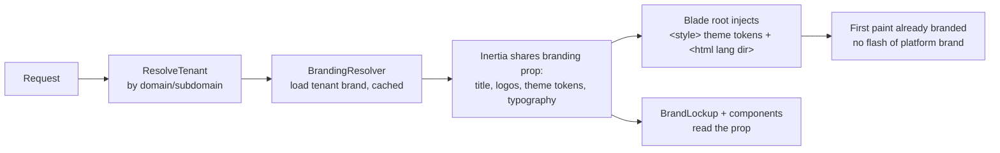
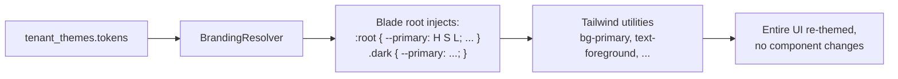
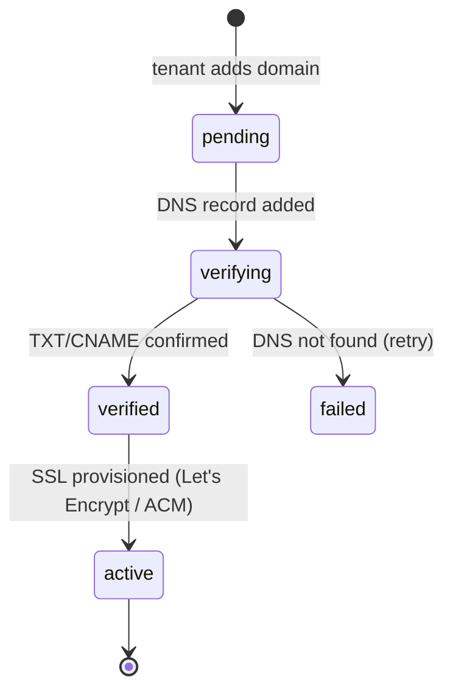

# White-Label & Branding Module — Multi-Tenant Multi-Vendor SaaS

Let each tenant fully rebrand the platform as their own product —
name, logo, colors, typography, custom domain, branded emails, login
pages, PDFs, even the AI assistant's persona — with complete isolation
from other tenants.

This module has the **most directly-shipped foundation** of any
advanced feature: branding already works end-to-end, just *single-tenant*.
This doc's central job is **generalizing the shipped single-store
branding into per-tenant white-label**, then extending it across every
surface.

### What ships today (verified)

- `BrandingService` — `updateTitle()`, `replaceLogo()` (with `sanitizeSvg()` + `optimizeRaster()` GD pipeline), `deleteLogo()`, `summary()` → `{ title, logo_url, has_custom_logo }`.
- The `Setting` store backs it (keys `site.title` / `site.logo_path`) — **today this is platform-wide, one brand**.
- `BrandLockup` (React) reads the Inertia-shared `branding` prop and renders the logo-or-default mark + title everywhere (header, footer, sidebar, auth).
- `Admin\BrandingController` + the `/admin/branding` page (title input + drag-drop logo + live preview + remove).
- Theme tokens are already CSS custom properties (`--primary`, `--background`, `--foreground`, …) in `app.css` — the hook point for per-tenant theming.
- `Tenant.custom_domain` column + `ResolveTenant` middleware exist.
- i18n (`lang/` ar/en/es/fr) + RTL — the localization base (§14).

> The leap this doc specs: **scope branding by `tenant_id`** (the `Setting` store + a `tenant_brandings` table per tenant) and inject the tenant's theme tokens at render — turning the working one-brand system into a thousand-brand white-label platform. The hard pipeline parts (SVG sanitize, raster optimize, signed URLs, the `BrandLockup` resolution) are already built and just get a tenant dimension.

It composes other modules:

- **Asset storage** ← [`file-manager-architecture.md`](file-manager-architecture.md) (logos/fonts/banners).
- **Feature tiers** ← [`billing-architecture.md`](billing-architecture.md) §2 + `PlanGate` (Basic/Pro/Enterprise branding, §21).
- **Governance** ← [`admin-control-center-architecture.md`](admin-control-center-architecture.md) §3, §30 (domain approval, branding limits).
- **Localization** ← the shipped i18n system (§14).
- **Email/notification branding** ← [`notifications-architecture.md`](notifications-architecture.md) §9, §19.
- Per-module white-label sections (marketplace §21, dashboard, support, kb, ai, mobile) all **defer here** for the branding mechanics.

Follows the shipped/planned convention of the other seventeen docs.

## Table of contents

1. [Overview](#1-overview)
2. [Tenant branding center](#2-tenant-branding-center)
3. [Logo management](#3-logo-management)
4. [Theme management](#4-theme-management)
5. [Typography management](#5-typography-management)
6. [Layout customization](#6-layout-customization)
7. [Custom domains](#7-custom-domains)
8. [Email branding](#8-email-branding)
9. [Login & authentication branding](#9-login--authentication-branding)
10. [Marketplace branding](#10-marketplace-branding)
11. [Dashboard branding](#11-dashboard-branding)
12. [White-label mobile experience](#12-white-label-mobile-experience)
13. [CMS integration](#13-cms-integration)
14. [Localization](#14-localization)
15. [Notification branding](#15-notification-branding)
16. [PDF & document branding](#16-pdf--document-branding)
17. [White-label API](#17-white-label-api)
18. [White-label knowledge base](#18-white-label-knowledge-base)
19. [White-label analytics](#19-white-label-analytics)
20. [White-label AI experience](#20-white-label-ai-experience)
21. [Subscription-based branding features](#21-subscription-based-branding-features)
22. [Branding asset management](#22-branding-asset-management)
23. [Database design](#23-database-design)
24. [API design](#24-api-design)
25. [Frontend architecture](#25-frontend-architecture)
26. [Security](#26-security)
27. [Performance](#27-performance)
28. [Multi-tenant governance](#28-multi-tenant-governance)
29. [Scalability](#29-scalability)
30. [Future expansion](#30-future-expansion)

### Status snapshot (today)

| Layer | Shipped | Planned in this doc |
|---|---|---|
| **Title + logo** | `BrandingService` (single-tenant via `Setting`) | scope by `tenant_id` → `tenant_brandings` |
| **Logo pipeline** | `sanitizeSvg` + `optimizeRaster` + signed URLs | per-logo-variant (dark/light/mobile/email/PDF/favicon) |
| **Brand resolution** | `BrandLockup` + shared `branding` prop | full theme/typography/layout in the prop |
| **Theme tokens** | CSS custom properties in `app.css` | per-tenant token injection at render |
| **Custom domain** | `Tenant.custom_domain` column + `ResolveTenant` | verification + SSL + DNS flow (§7) |
| **Localization** | i18n (ar/en/es/fr) + RTL | per-tenant custom translations (§14) |
| **Tables** | `settings` | `tenant_brandings` + 13 branding tables |

---

## 1. Overview

### White-label business model

White-label is a **revenue multiplier**: a tenant resells the platform
as *their* product to *their* customers. Higher plans unlock deeper
branding (custom domain, branded email, full white-label) — branding
depth is a pricing lever (§21). The customer of a white-label tenant
should never see "StoreProject" — only the tenant's brand.

### Strategies

| Strategy | Approach |
|---|---|
| Branding | Every surface resolves the *active tenant's* brand (theme/logo/copy) at render |
| Brand isolation | Branding is `tenant_id`-scoped; one tenant's brand never bleeds into another (the core multi-tenant guarantee) |
| Customization | Layered: tenant defaults → per-surface overrides → live preview before publish |

### How branding resolves (the core mechanism)



The shipped `branding` shared prop + `BrandLockup` already do the React
half for title+logo; this generalizes the prop to carry the full brand
(theme tokens, typography, layout) and injects theme tokens into the
Blade root `<style>` so the **first paint** is the tenant's brand (no
flash). Tenant resolution is by domain (§7).

### Integration

Branding touches every module — each module's "multi-tenant white-label"
section (marketplace §21, dashboard, support, kb §26, ai §23, mobile §19,
notifications §19) defers here. This module owns the **brand model +
resolution + injection**; each module consumes the resolved brand.

---

## 2. Tenant branding center

The control panel (`/branding`, tenant-owner/admin scoped) — extends the
shipped `/admin/branding` page.

```php
tenant_brandings
  id, tenant_id (unique)
  platform_name, company_name, company_description, slogan
  support_email, support_phone, website_url
  default_locale, default_theme_id, default_typography_id
  settings jsonb, updated_by_id, timestamps
```

Customize: platform name, company name + description, slogan, support
email/phone, website URL. The shipped `BrandingService::summary()`
(title) generalizes into this richer brand record — `summary()` returns
the full brand bundle the Inertia prop shares. Centralized: one place,
live-previewed, versioned (§23 `tenant_brand_versions`).

---

## 3. Logo management

The shipped `replaceLogo()` (one logo) generalizes to **logo variants**:

```php
tenant_logos
  id, tenant_id, variant enum('main','dark','light','mobile','favicon','email','pdf')
  file_id → files (file-manager)             // or storage_path
  width, height, format
  unique (tenant_id, variant)
```

Main · dark-mode · light-mode · mobile · favicon · email · PDF logos.
Each runs through the **shipped pipeline** (`sanitizeSvg` for SVG,
`optimizeRaster` for raster, signed URLs) — already proven; it just
keys by `(tenant_id, variant)` now. `BrandLockup` picks the variant by
context (dark/light theme, mobile viewport). The favicon + email/PDF
logos feed §16/§8. Stored via the file-manager (§22).

---

## 4. Theme management

The platform **already uses CSS custom properties** for all colors
(`--primary`, `--secondary`, `--accent`, `--background`, `--foreground`,
`--destructive`, etc. in `app.css`, both light + dark). Per-tenant
theming injects these tokens.

```php
tenant_themes
  id, tenant_id, name
  mode enum('light','dark','both')
  tokens jsonb   // { primary, secondary, accent, success, warning, error, background, foreground, ... } in HSL
  is_active, timestamps
```



Because every component already styles via these tokens (the shipped
design system), injecting a tenant's token values at the root
**re-themes the whole app with zero component changes** — the cleanest
possible white-label theming. Customizable: primary/secondary/accent/
success/warning/error/background colors, light + dark. Validated for
contrast (WCAG, mobile §14) on save. Live preview applies tokens to a
sandboxed iframe before publish.

---

## 5. Typography management

```php
tenant_fonts
  id, tenant_id
  heading_family, body_family, mono_family
  font_source enum('system','google','bunny','custom_upload')
  custom_font_file_ids jsonb     // uploaded font files (file-manager)
  scale jsonb                    // size/weight overrides
```

The shipped `--font-sans` / `--font-display` / `--font-mono` tokens
(Inter + JetBrains Mono via Bunny Fonts) generalize to per-tenant fonts.
A tenant picks heading/body/mono families (system / Google / Bunny /
custom-uploaded), injected as font-face + the font tokens (same
mechanism as colors §4). Self-hosted custom fonts stored via the
file-manager, served from CDN. Fluid type scale (mobile §2) respected.

---

## 6. Layout customization

```php
// tenant_brandings.settings.layout
{ sidebar: 'inset'|'floating'|'classic', nav: 'sidebar'|'topbar',
  header: 'minimal'|'full', footer: 'compact'|'full', dashboard: 'grid'|'list' }
```

Sidebar style, navigation layout (the shipped `AppLayout` already
supports sidebar variants — `app-sidebar-layout` / `app-header-layout`),
header/footer/dashboard layout. Multiple presets; the resolved layout
config drives which shipped layout components render. Layout is a
higher tier (§21) — most tenants theme, fewer re-layout.

---

## 7. Custom domains

(Builds on the shipped `Tenant.custom_domain` + `ResolveTenant`.)

```php
tenant_domains
  id, tenant_id
  domain (unique), type enum('subdomain','custom')
  status enum('pending','verifying','verified','active','failed')
  verification_token, verification_method enum('dns_txt','dns_cname','file')
  ssl_status enum('none','provisioning','active','failed'), ssl_expires_at
  verified_at, timestamps
  index (domain), index (tenant_id, status)
```



- **Subdomains** — `tenant.platform.com` (auto, instant — wildcard DNS + cert).
- **Custom domains** — `client-company.com` / `app.client-company.com`: tenant adds a DNS record (TXT/CNAME), a verification job polls DNS, then SSL is provisioned (Let's Encrypt via the proxy / ACM).
- **`ResolveTenant`** (shipped) resolves the tenant by incoming `Host` header (domain → tenant lookup, cached).
- Domain add requires platform-operator approval (admin §3, §28) to prevent abuse. Custom domains are an Enterprise-tier feature (§21).

---

## 8. Email branding

(Per [`notifications-architecture.md`](notifications-architecture.md) §9, §19.)

```php
tenant_email_branding
  id, tenant_id
  from_name, from_email, reply_to
  header_html, footer_html, accent_color
  logo_variant 'email', domain_verified bool   // SPF/DKIM
```

Customize email templates, header/footer, colors, sender name, reply-to.
Branded emails wrap the body in the tenant's layout (logo + accent from
the brand). Custom sender domain requires SPF/DKIM verification (until
verified, send via the platform domain with the tenant's display name).
The notification templates (notifications §9) resolve the tenant's
branding.

---

## 9. Login & authentication branding

The shipped auth pages (`login`/`register`/`reset-password`) use the
`auth-simple-layout` which already renders `BrandLockup`. Generalizing:
custom login page, registration page, password-reset page, welcome
screens — each resolves the tenant's brand (logo, colors, background
image, copy). A tenant on a custom domain sees a fully-branded
auth experience — no platform branding. Background image + welcome copy
stored in `tenant_brandings.settings`.

---

## 10. Marketplace branding

(Per [`marketplace-architecture.md`](marketplace-architecture.md) §21.)
Marketplace home page, vendor store layouts, product pages, category
pages — all resolve the tenant theme + layout. The shipped storefront
(`StorefrontLayout` + `welcome` + `products`) already reads `BrandLockup`
+ the theme tokens; per-tenant theming re-skins it automatically. Custom
storefront hero/sections via the CMS (§13).

---

## 11. Dashboard branding

(Per [`dashboard-architecture.md`](dashboard-architecture.md).) Dashboard
widgets, welcome messages, layouts, branding components — themed by the
tenant brand. The shipped role dashboards read the theme tokens; welcome
messages + widget selection come from `tenant_dashboard_branding`. A
tenant personalizes what their users see on login.

---

## 12. White-label mobile experience

(Per [`mobile-architecture.md`](mobile-architecture.md) §11, §19.) Mobile
branding, app icons, splash screens, mobile themes, **PWA branding**:
the PWA manifest (`theme_color`, icons, name) is generated from the
tenant brand — so an installed PWA shows the tenant's name + icon on the
home screen. The mobile theme reuses the §4 tokens (responsive). Custom
native builds are future (§30, mobile §23).

---

## 13. CMS integration

```php
tenant_pages          // managed content pages
  id, tenant_id, slug, title, blocks jsonb, status, locale, seo jsonb
```

Tenants manage landing pages, about, contact, terms, privacy — via a
**block-based page builder** (reusing the knowledge-base block editor,
kb §4). Pages are themed, localized (§14), SEO-optimized (marketplace
§22 patterns), and served on the tenant's domain. A visual builder
(drag blocks) is the editing surface.

---

## 14. Localization

(Reuses the shipped i18n: `lang/` ar/en/es/fr + RTL.) Multiple languages,
**custom translations** (a tenant overrides specific strings —
`tenant_localizations` holds per-tenant string overrides layered over
the platform `lang/` files), RTL languages (shipped), regional
formatting (dates/numbers/currency). Resolution order: tenant override →
platform translation → fallback (the same chain as notification
templates + UI i18n). A tenant can rename "Products" to "Solutions"
platform-wide for their brand.

```php
tenant_localizations
  id, tenant_id, locale, key, value
  unique (tenant_id, locale, key)
```

---

## 15. Notification branding

(Per [`notifications-architecture.md`](notifications-architecture.md) §19.)
Notification templates, push notifications, SMS templates, in-app
messages — all resolve the tenant brand (logo, colors, sender, copy).
`tenant_notification_branding` holds per-channel template overrides; the
notification dispatcher (notifications §8) renders the tenant's branded
template. Consistent brand across every channel.

---

## 16. PDF & document branding

```php
tenant_pdf_branding
  id, tenant_id, logo_variant 'pdf'
  header_html, footer_html, accent_color, font_family
  page_size, margins jsonb
```

Branded invoices, quotes, contracts, reports, certificates. The PDF
generation jobs (billing §8 invoices, analytics §12 reports) render with
the tenant's PDF logo + colors + fonts. A white-label tenant's invoices
carry *their* brand to *their* customers — critical for the resale model.

---

## 17. White-label API

(Per [`ai-architecture.md`](ai-architecture.md) + the API-first design.)
Tenants customize API branding (the API docs portal uses their brand),
configure API keys (Sanctum tokens, shipped in the auth batch), and
brand the API documentation (a help-center §18 doc space themed for
them). A tenant reselling an API product presents *their* developer
portal.

---

## 18. White-label knowledge base

(Per [`knowledge-base-architecture.md`](knowledge-base-architecture.md) §26.)
The documentation portal + help center + KB are branded per tenant —
served on their domain (§7), themed (§4), localized (§14), SEO'd as
theirs. The KB doc already specs this; the branding mechanics resolve
here.

---

## 19. White-label analytics

(Per [`analytics-architecture.md`](analytics-architecture.md) §21.)
Dashboard themes, reports, analytics widgets — themed by the tenant
brand. Exported reports + dashboards carry the tenant logo + colors
(via the §16 PDF branding for exports). The analytics widget protocol
reads the theme tokens.

---

## 20. White-label AI experience

(Per [`ai-architecture.md`](ai-architecture.md) §23.)

```php
// tenant_brandings.settings.ai
{ assistant_name, avatar_file_id, greeting, personality: { tone, formality, emoji } }
```

Customize the AI assistant's name, avatar, greeting messages, and
personality (a tenant system-prompt fragment, ai §23). A white-label
tenant's "Aria" assistant feels like *their* product, not a generic
platform bot. Enterprise tier (§21).

---

## 21. Subscription-based branding features

(Gated by [`billing-architecture.md`](billing-architecture.md) §2 + `PlanGate`.)

| Tier | Branding |
|---|---|
| **Basic** | Logo, colors (theme), favicon |
| **Professional** | + Custom domain, email branding, dashboard branding, typography |
| **Enterprise** | + Full white-label, layout customization, AI branding, API branding, custom mobile/PWA, CMS |

Each branding feature checks `PlanGate::allows($tenant, 'branding.custom_domain')`
etc. (the shipped feature-gating pattern — same 402-on-limit as products).
Branding depth is a clear upsell ladder: a tenant wanting their own
domain + branded emails upgrades to Pro; full white-label is Enterprise.

---

## 22. Branding asset management

(Integrates with [`file-manager-architecture.md`](file-manager-architecture.md).)

```php
tenant_brand_assets
  id, tenant_id, type enum('logo','icon','banner','font','theme_file','marketing')
  file_id → files, variant, metadata jsonb
```

Logos, icons, banners, fonts, marketing assets, theme files — all stored
via the file-manager (signed URLs, CDN, versioning, the shipped
sanitize/optimize pipeline). The brand assets are a curated view over
the tenant's files (file-manager §11 media library), scoped to branding.

---

## 23. Database design

| Table | Purpose |
|---|---|
| `tenant_brandings` | Core brand record (name, copy, support, defaults) |
| `tenant_logos` | Logo variants (main/dark/light/mobile/favicon/email/pdf) |
| `tenant_themes` | Color token sets (light/dark) |
| `tenant_fonts` | Typography config |
| `tenant_domains` | Custom domains + verification + SSL |
| `tenant_email_branding` | Email sender/template branding |
| `tenant_login_branding` | Auth-page branding |
| `tenant_marketplace_branding` | Storefront branding |
| `tenant_dashboard_branding` | Dashboard branding |
| `tenant_notification_branding` | Per-channel notification templates |
| `tenant_pdf_branding` | Document branding |
| `tenant_localizations` | Per-tenant string overrides |
| `tenant_brand_assets` | Branding asset registry (→ files) |
| `tenant_brand_versions` | Brand config version history (rollback) |

### `tenant_brandings` (the core)

```php
Schema::create('tenant_brandings', function (Blueprint $t) {
    $t->id();
    $t->foreignId('tenant_id')->unique()->constrained()->cascadeOnDelete();
    $t->string('platform_name')->nullable();      // overrides DEFAULT_TITLE
    $t->string('company_name')->nullable();
    $t->text('company_description')->nullable();
    $t->string('slogan')->nullable();
    $t->string('support_email')->nullable();
    $t->string('support_phone')->nullable();
    $t->string('website_url')->nullable();
    $t->string('default_locale', 8)->default('en');
    $t->foreignId('active_theme_id')->nullable();
    $t->foreignId('active_font_id')->nullable();
    $t->jsonb('settings')->nullable();             // layout, login bg, ai persona, ...
    $t->foreignId('updated_by_id')->nullable()->constrained('users')->nullOnDelete();
    $t->timestamps();
});
```

### Particulars

- **`unique(tenant_id)`** — one brand record per tenant; the shipped `Setting`-based single brand becomes the `tenant_id IS NULL` platform default that tenants inherit + override.
- `tenant_themes.tokens` is HSL jsonb matching the shipped `app.css` token names exactly → direct injection.
- `tenant_brand_versions` snapshots the full brand for rollback (mirrors kb §12 / file-manager §9 versioning).
- `tenant_domains.domain` globally unique + indexed (the `ResolveTenant` lookup key).
- Every table `tenant_id` + `BelongsToTenant`; brand assets via file-manager (signed-URL, CDN).

---

## 24. API design

Tenant-owner/admin scoped (branding-manage permission); cross-tenant → 404;
domain ops require operator approval (§28).

| Verb | URL | Purpose |
|---|---|---|
| `GET` | `/branding` | Full brand bundle (the shared-prop shape) |
| `PATCH` | `/branding` | Update brand record (name/copy/support) |
| `POST` | `/branding/logos` | Upload a logo variant (sanitize+optimize) |
| `DELETE` | `/branding/logos/{variant}` | Remove a variant |
| `GET/PUT` | `/branding/theme` | Color tokens (light/dark) |
| `GET/PUT` | `/branding/typography` | Fonts |
| `PUT` | `/branding/layout` | Layout preset |
| `POST` | `/branding/preview` | Generate a live-preview token (sandboxed) |
| `POST` | `/branding/publish` | Publish staged brand (new version) |
| `POST` | `/branding/rollback/{version}` | Restore a version |
| `GET/POST` | `/branding/domains` | List/add custom domain |
| `POST` | `/branding/domains/{id}/verify` | Trigger DNS verification |
| `GET/PUT` | `/branding/email` | Email branding |
| `GET/PUT` | `/branding/localization` | Custom translations |
| `GET` | `/admin/branding/domains/pending` | Operator: domain approval queue |
| `POST` | `/admin/branding/domains/{id}/approve` | Operator: approve domain |

The `GET /branding` response is exactly the `branding` Inertia-shared
prop shape (generalized from the shipped `BrandingService::summary()`).

---

## 25. Frontend architecture

```
resources/js/
├── pages/branding/             # (shipped: admin/branding/edit.tsx → generalizes here)
│   ├── index.tsx               # branding dashboard
│   ├── theme-builder.tsx       # color token editor + live preview
│   ├── domains.tsx             # domain manager + verification status
│   ├── logos.tsx               # logo variant uploader
│   ├── email.tsx               # email branding center
│   ├── localization.tsx        # custom translations
│   └── settings.tsx            # white-label settings (name/copy/support)
├── components/branding/
│   ├── ThemeEditor.tsx         # token controls per color
│   ├── ColorPicker.tsx         # HSL picker + contrast check
│   ├── LogoUploader.tsx        # reuses shipped logo dropzone, per-variant
│   ├── DomainValidator.tsx     # DNS instructions + status poll
│   ├── BrandingPreview.tsx     # sandboxed iframe with applied tokens
│   ├── LiveThemePreview.tsx    # real-time token apply
│   ├── TypographyPicker.tsx
│   └── BrandLockup.tsx         # SHIPPED — the resolution component
├── hooks/branding/
│   ├── useBrand.ts             # the shared branding prop (shipped) + helpers
│   ├── useThemeBuilder.ts      # staged token state + preview
│   └── useDomainStatus.ts
└── lib/branding/
    ├── tokens.ts               # token names (mirror app.css)
    ├── apply-theme.ts          # inject tokens into :root / iframe
    └── contrast.ts             # WCAG contrast validation
```

- **`LiveThemePreview`** applies staged tokens to a sandboxed iframe so the tenant sees their brand before publishing — the headline UX.
- Built on the shipped `BrandLockup` + the admin branding page; the theme builder edits the same tokens the whole UI already consumes.

---

## 26. Security

| Concern | Mitigation |
|---|---|
| Tenant isolation | Every branding table `tenant_id` + global scope; brand resolves only for the active tenant |
| Cross-tenant branding access | A tenant can only read/write their own brand; 404 on cross-tenant |
| Secure asset storage | Logos/fonts via file-manager (signed-URL, sanitized — SVG via the shipped `sanitizeSvg`, scanned) |
| Domain verification | DNS-record proof before a custom domain activates; operator approval (§28) blocks domain hijacking |
| SSL validation | Certs provisioned + monitored per domain; expiry alerts |
| Branding permissions | `branding.manage` permission (RBAC); tenant-owner/admin only |
| Injection via theme | Token values validated (HSL format, not arbitrary CSS); custom HTML (email/CMS) sanitized; no raw `<style>`/`<script>` injection |
| XSS via custom copy | All tenant-supplied copy escaped on render; CMS/email HTML sanitized (the SVG-sanitizer pattern extended to HTML) |

The theme-injection is **token-values-only** (HSL into known CSS
variables) — never arbitrary CSS — so a tenant can't inject malicious
styles. Custom HTML surfaces (email, CMS) are sanitized.

---

## 27. Performance

| Concern | Approach |
|---|---|
| Theme caching | Resolved brand bundle cached in Redis per tenant (busted on publish) — one lookup per request, not a query |
| Asset CDN | Logos/fonts CDN-served (file-manager) |
| Dynamic theme loading | Tokens injected inline in the Blade root `<style>` (no extra request); first paint already branded |
| Branding config cache | The full brand (theme/typography/layout/copy) cached as one object, shared into every page's Inertia prop |
| Font loading | `display=swap` + preload the tenant's fonts; subset custom fonts |
| Real-time switch | Publishing a brand busts the cache; next request re-resolves — near-instant |

The brand bundle is resolved **once per request** (cached) and injected
both server-side (Blade `<style>` + `<html>`) and into the Inertia prop
— no flash of unbranded content, no per-component lookups.

---

## 28. Multi-tenant white-label governance

(Per [`admin-control-center-architecture.md`](admin-control-center-architecture.md) §3, §22, §30.)
The platform operator can:
- **Approve custom domains** — a domain-approval queue (prevents abuse/phishing); the verification + SSL flow gates activation.
- **Control branding limits** — which branding features each plan/tenant gets (feature flags + `PlanGate`, §21).
- **Enable/disable white-label features** — per-tenant overrides (admin `tenant_controls`).
- **Monitor branding usage** — which tenants are white-labeled, domain health, SSL expiry.

Governance lives in the admin control center; this module exposes the
brand model + the operator levers.

---

## 29. Scalability

100k+ tenants, millions of users, thousands of custom domains, global:
- **Cached brand bundles** — Redis per tenant; the hot-path resolution is a cache hit, not a query.
- **Edge resolution** — domain → tenant mapping at the edge/proxy; the app gets the resolved tenant.
- **Wildcard + per-domain certs** — wildcard for subdomains; automated per-domain certs (Let's Encrypt/ACM) for custom domains, renewed by a job.
- **CDN assets** — logos/fonts/theme files edge-cached globally.
- **Token injection** — inline (no extra request); brand bundles are small JSON.
- **Multi-region** — brand bundles replicated; domains resolve regionally.

---

## 30. Future expansion

| Feature | Approach |
|---|---|
| Mobile app white-labeling | Per-tenant PWA today (§12); native config-driven builds later (mobile §23) |
| Custom mobile builds | Generated native apps per tenant brand (CI pipeline) |
| Branded client portals | The customer portal (projects §10) themed per tenant — extends current resolution |
| Custom marketplace themes | Tenant-selectable storefront themes beyond tokens |
| **Theme marketplace** | Tenants buy/share theme presets — a marketplace product type (marketplace doc) |
| AI-generated branding | AI proposes a full brand (palette + logo + copy) from a prompt/brief (ai §5 content + image gen) |

All extend the token-based resolution + the asset pipeline — no rewrite.

---

## File map for the next phase

| Path | Status |
|---|---|
| `database/migrations/*_create_tenant_brandings_table.php` + `_logos_` + `_themes_` + `_fonts_` | planned |
| `database/migrations/*_create_tenant_domains_table.php` + `_email_branding_` + `_login_branding_` | planned |
| `database/migrations/*_create_tenant_*_branding_table.php` (marketplace/dashboard/notification/pdf) | planned |
| `database/migrations/*_create_tenant_localizations_table.php` + `_brand_assets_` + `_brand_versions_` | planned |
| `database/migrations/*_scope_settings_by_tenant.php` (add tenant_id to settings; platform default = null) | planned |
| `app/Services/BrandingService.php` — generalize to per-tenant (TITLE_KEY/LOGO_KEY scoped by tenant) | **refactor shipped** |
| `app/Domain/Branding/{BrandingResolver,ThemeService,DomainService,TypographyService,LocalizationService}.php` | planned |
| `app/Domain/Branding/DomainVerification.php` + `ProvisionSsl` job | planned |
| `app/Models/{TenantBranding,TenantLogo,TenantTheme,TenantFont,TenantDomain,TenantBrandVersion}.php` | planned |
| `app/Http/Middleware/ResolveTenant.php` — extend to resolve brand + share prop | **refactor shipped** |
| `app/Http/Middleware/HandleInertiaRequests.php` — share full brand bundle (extends shipped `branding` prop) | **refactor shipped** |
| `resources/views/app.blade.php` — inject theme tokens `<style>` + lang/dir (extends shipped) | **refactor shipped** |
| `app/Http/Controllers/Branding/*Controller.php` (generalizes Admin\BrandingController) | planned |
| `resources/js/pages/branding/*` + `components/branding/*` (theme builder, domain manager) + `hooks/branding/*` | planned |
| `tests/Feature/Branding/*` (per-tenant isolation, theme token injection, domain verification, SSL, feature-tier gating, brand version rollback) | planned |

The next pass is largely a **generalization of shipped code**: scope the
`Setting`-backed branding by `tenant_id` (add `tenant_brandings` +
`tenant_themes` + `tenant_logos`), extend `ResolveTenant` +
`HandleInertiaRequests` to resolve + share the full brand bundle, inject
theme tokens into the Blade root, and build the theme builder + domain
manager UI on top of the shipped `BrandLockup` + admin branding page.
Custom domains + SSL + the higher branding tiers layer on after the
per-tenant theming core works.

---

## The architecture doc set

This is the eighteenth architecture doc. The complete set under `docs/`:

1. `dashboard-architecture.md`
2. `payments-architecture.md`
3. `projects-architecture.md`
4. `tasks-architecture.md`
5. `notifications-architecture.md`
6. `billing-architecture.md`
7. `ai-architecture.md`
8. `analytics-architecture.md`
9. `workflow-automation-architecture.md`
10. `marketplace-architecture.md`
11. `mobile-architecture.md`
12. `crm-architecture.md`
13. `messaging-architecture.md`
14. `support-architecture.md`
15. `file-manager-architecture.md`
16. `knowledge-base-architecture.md`
17. `admin-control-center-architecture.md`
18. `white-label-architecture.md`

All in the same shipped-vs-planned format, cross-referenced, each ending
with a concrete "File map for the next phase". White-label is the
natural closing module — it's the one that turns the whole platform into
a product a tenant can resell as their own, and it's the one with the
most working code to build on (the shipped branding system).
