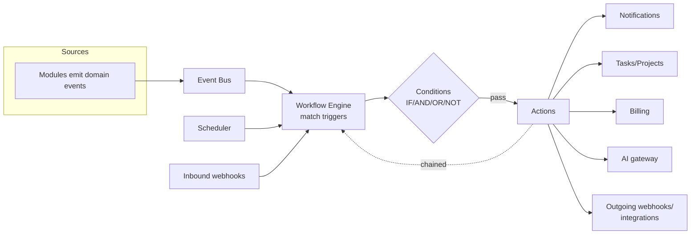
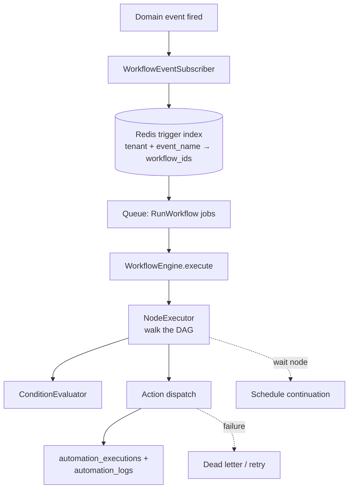
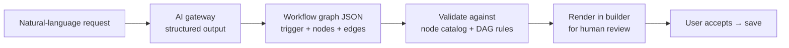

# Workflow Automation Module — Multi-Tenant Multi-Vendor SaaS

A no-code, event-driven workflow engine: tenants visually compose
"when {trigger} and {condition} then {action}" automations across every
module — projects, tasks, billing, CRM, notifications, AI — without
writing code.

This module is the **orchestration layer** that consumes the
event-driven backbone every other module already emits on, and fires
actions back into them. It generalizes two things already speced:

- [`tasks-architecture.md`](tasks-architecture.md) §11 — the task automation engine (event → listener → action) is the prototype this generalizes.
- [`ai-architecture.md`](ai-architecture.md) §13 — `ai_automation_rules` ("when {event} and {AI condition} then {action}") is the AI-condition subset of this engine.

It composes existing infrastructure rather than reinventing it:

- **Triggers** ← every module's domain events (the same events analytics + notifications subscribe to).
- **Actions** → notifications ([`notifications-architecture.md`](notifications-architecture.md)), AI ([`ai-architecture.md`](ai-architecture.md) §2), tasks/projects/billing services.
- **Webhook idempotency** ← the `webhook_events` UNIQUE-gate pattern ([`payments-architecture.md`](payments-architecture.md) §3).

Follows the shipped/planned convention of the other eight docs.

## Table of contents

1. [Overview](#1-overview)
2. [Workflow builder](#2-workflow-builder)
3. [Trigger system](#3-trigger-system)
4. [Conditions engine](#4-conditions-engine)
5. [Actions engine](#5-actions-engine)
6. [Workflow templates](#6-workflow-templates)
7. [Scheduling](#7-scheduling)
8. [Event processing engine](#8-event-processing-engine)
9. [AI-powered automations](#9-ai-powered-automations)
10. [Webhooks](#10-webhooks)
11. [Third-party integrations](#11-third-party-integrations)
12. [Workflow monitoring](#12-workflow-monitoring)
13. [Workflow logs](#13-workflow-logs)
14. [Error handling](#14-error-handling)
15. [Automation analytics](#15-automation-analytics)
16. [Database design](#16-database-design)
17. [API design](#17-api-design)
18. [Frontend architecture](#18-frontend-architecture)
19. [Security](#19-security)
20. [Performance](#20-performance)
21. [Multi-tenant automation](#21-multi-tenant-automation)
22. [AI workflow builder](#22-ai-workflow-builder)
23. [Scalability](#23-scalability)

### Status snapshot (today)

| Layer | Shipped | Planned in this doc |
|---|---|---|
| **Engine** | none — greenfield | workflow engine, node executor, trigger registry, conditions + actions engines |
| **Tables** | `webhook_events` (inbound idempotency, payments) | all `automation_*` tables |
| **Reused** | event-driven backbone (every module emits events), notifications, AI gateway, queue workers, `BelongsToTenant` | — |
| **Prototype** | tasks §11 automation engine + AI §13 rules (conceptual) | generalized into the visual engine here |

> Greenfield like the AI module — no workflow code exists yet. It's deliberately a *late* module: it's only valuable once there are events to trigger on and services to act with, which the other eight modules now provide.

---

## 1. Overview

### Business goals

- **Eliminate manual ops**: vendor onboarding, payment recovery, task escalation, customer retention — run themselves.
- **Productivity**: a tenant builds in minutes what would otherwise be a feature request to engineering.
- **Operational efficiency**: consistent, auditable processes instead of tribal knowledge.
- **Revenue**: automation is a Business/Enterprise plan differentiator (billing §2); reduces churn (auto-retention), recovers failed payments (auto-dunning), accelerates delivery (auto task creation).

### How it integrates



The engine sits *between* the event backbone and every module's
services. It never reaches into a module's internals — it calls the
same service-layer methods a controller would, so authorization +
validation + tenant scoping all still apply.

---

## 2. Workflow builder

A visual, node-based editor (think n8n / Zapier, in-app).

### UX specification

- **Canvas** — pan/zoom infinite canvas; nodes are draggable cards connected by edges.
- **Node types**: Trigger (start, exactly one or more), Condition (branch), Action (do), Delay (wait), Parallel (fan-out), Merge (join), Sub-workflow (call another).
- **Connections** — drag from a node's output port to another's input; conditions have `true`/`false` ports.
- **Branching** — a condition node splits the flow; each branch runs independently.
- **Parallel execution** — a parallel node fans out to N branches; a merge node joins (all/any).
- **Inline config** — clicking a node opens a side panel to configure it (no modal-hell).
- **Live validation** — the builder flags an unreachable node, a missing required field, or a type mismatch (a string output into a number input) before save.
- **Test run** — "run with sample data" executes the workflow in a dry-run mode (actions stubbed) showing the path taken + each node's I/O.

### Storage

A workflow is a **directed graph**: `automation_workflows` (the
container) + `automation_nodes` (vertices) + edges stored as
`node.next` references (with `condition_branch` for true/false). The
graph is validated as a DAG on save (no cycles except explicit
loop-back nodes with a max-iteration guard).

---

## 3. Trigger system

### Trigger sources

Every domain event the platform already emits is a candidate trigger:

| Category | Example events |
|---|---|
| Users | `user.registered`, `user.login`, `team.invited` |
| Projects | `project.created`, `project.approved`, `project.milestone_completed` |
| Tasks | `task.assigned`, `task.completed`, `task.overdue` |
| Milestones | `milestone.completed`, `milestone.approved` |
| Billing | `invoice.issued`, `payment.succeeded`, `payment.failed`, `subscription.renewed`, `subscription.past_due` |
| Orders | `order.created`, `order.delivered` |
| Messages | `message.received`, `mention.created` |
| Support | `ticket.created`, `ticket.escalated` |
| CRM | `lead.created`, `lead.scored` |
| Analytics | `metric.threshold_crossed` (e.g. revenue > X) |
| AI | `ai.insight_generated`, `ai.risk_detected` |
| Custom | tenant-defined events via the API/webhook |
| Schedule | time-based (§7) |
| Webhook | inbound HTTP (§10) |

### Architecture

```php
// A workflow registers interest in a trigger; the registry maps
// event names → workflows listening for them (cached in Redis).
automation_triggers
  id, tenant_id, workflow_id, node_id
  type enum('event','schedule','webhook','manual')
  event_name (nullable)        // 'payment.failed'
  filter jsonb (nullable)      // pre-condition shortcut: {currency: 'USD'}
  is_active
```

A single `WorkflowEventSubscriber` listens to **all** domain events,
looks up matching active triggers (Redis-cached index keyed by
`tenant_id + event_name`), and enqueues a `RunWorkflow` job per match.
Modules stay ignorant — they just `event()`.

---

## 4. Conditions engine

A safe, declarative boolean expression tree — never `eval()`.

```jsonc
// automation_conditions.expression (jsonb)
{
  "op": "and",
  "children": [
    { "op": "eq",  "left": "{{trigger.payment.status}}", "right": "failed" },
    { "op": "gt",  "left": "{{trigger.payment.amount_cents}}", "right": 5000 },
    { "op": "or", "children": [
        { "op": "eq", "left": "{{customer.plan}}", "right": "business" },
        { "op": "not", "child": { "op": "eq", "left": "{{customer.country}}", "right": "US" } }
    ]}
  ]
}
```

### Supported operators

- Logical: `and`, `or`, `not`, nested arbitrarily.
- Comparison: `eq`, `neq`, `gt`, `gte`, `lt`, `lte`, `in`, `contains`, `matches` (safe regex), `is_empty`, `changed`.
- Examples → "if payment failed", "if task overdue", "if project completed", "if revenue exceeds threshold".

### Evaluation

`ConditionEvaluator` walks the tree against a **context bag** (trigger
payload + resolved lookups like `customer`, `project`). Operands use a
`{{path}}` template resolved from the context — **read-only**, no method
calls, no arbitrary code. Type coercion is explicit; a mismatch fails
the node loudly (logged), not silently.

---

## 5. Actions engine

Each action implements a common interface so the executor treats them
uniformly:

```php
interface WorkflowAction
{
    public function key(): string;                       // 'create_task', 'send_email', …
    public function configSchema(): array;               // JSON Schema for the builder form
    public function execute(NodeContext $ctx): ActionResult; // returns output bag for downstream nodes
}
```

| Action | Calls |
|---|---|
| Create Task / Project | Tasks/Projects service (tenant-scoped, validated) |
| Assign User | Task assignment service |
| Send Notification / Email | Notifications dispatcher (notifications doc §8) |
| Update Record | Whitelisted model + field updater |
| Generate Invoice | Billing service |
| Create Ticket | Support service |
| Trigger AI Action | AI gateway (ai doc §2) — generate/classify/score |
| Call API / Webhook Request | Outgoing HTTP (§10) |
| Update CRM | CRM service |
| Create Report | Analytics report builder (analytics doc §12) |
| Execute Workflow | Sub-workflow call (composition) |
| Delay / Wait | Schedules a continuation (§7) |

### Execution

The `NodeExecutor` runs each action node, passing the accumulated
**context bag** (trigger data + every prior node's output). An action's
output is merged in, so a downstream node can reference
`{{nodes.create_task.id}}`. Actions are **idempotent per execution**
(keyed by `execution_id + node_id`) so a retried workflow step doesn't
double-act.

---

## 6. Workflow templates

`automation_templates` ships a curated library; tenants clone +
customize.

| Template | Flow |
|---|---|
| Customer Onboarding | order.created → create tasks + welcome email + notify vendor |
| Vendor Onboarding | vendor.registered → checklist tasks + KYC reminder + docs email |
| Project Delivery | milestone.approved → next tasks + invoice + customer notify |
| Lead Nurturing | lead.created → scored (AI) → drip emails by segment |
| Subscription Renewal | subscription.renewing (3d) → reminder + usage summary |
| Payment Recovery | payment.failed → dunning sequence + retry + suspend |
| Task Escalation | task.overdue → notify manager → bump priority → reassign |
| Customer Retention | churn_risk (AI) → offer + outreach task |
| Support Automation | ticket.created → AI triage → route + auto-reply |

Cloning copies the node graph into a tenant-owned
`automation_workflows` row; the tenant edits freely. Templates are
versioned so an updated template can be re-applied.

---

## 7. Scheduling

```php
automation_schedules
  id, tenant_id, workflow_id
  kind enum('once','interval','cron')
  cron_expression (nullable)   // '0 9 * * 1' (Mon 9am)
  interval_minutes (nullable)
  run_once_at (nullable)
  timezone                     // tenant/user tz
  next_run_at, last_run_at
  is_active
  index (is_active, next_run_at)
```

- **Once / daily / weekly / monthly / cron / custom interval**.
- A Laravel scheduled command (every minute) pops due schedules
  (`next_run_at <= now()`, `SELECT … FOR UPDATE SKIP LOCKED` so multiple
  schedulers shard safely), enqueues `RunWorkflow`, and advances
  `next_run_at`.
- Timezone-aware (computed in the tenant's tz).
- **Delay/Wait nodes** reuse this: a wait node schedules a continuation
  at `now + delay` keyed by `execution_id` so the workflow resumes mid-flow.

---

## 8. Event processing engine



- **Event bus** — Laravel's event dispatcher; the subscriber is the single bridge into automation.
- **Event queue** — Redis-backed; per-tenant fair-share so a noisy tenant can't starve others.
- **Event routing** — the Redis trigger index resolves which workflows care, in O(1), without scanning the DB.
- **Workflow executors** — queued `RunWorkflow` jobs; one execution = one `automation_executions` row tracking node-by-node progress (so a crashed worker resumes from the last completed node, not the start).
- **High volume** — distributed workers; the engine is stateless (state lives in `automation_executions`), so it scales horizontally.

---

## 9. AI-powered automations

The AI-condition + AI-action subset (ai doc §13). An action node of type
`trigger_ai_action` calls the AI gateway; a condition can be an AI
classification.

| AI capability | As a node |
|---|---|
| AI Task Creation | action: generate tasks from a brief |
| AI Ticket Classification | condition/action: classify + route |
| AI Lead Scoring | action: score → output used by downstream condition |
| AI Customer Segmentation | action: assign segment |
| AI Revenue Alerts | trigger: `metric.threshold_crossed` + AI summary action |
| AI Content Generation | action: draft email/proposal |
| AI Risk Detection | trigger: `ai.risk_detected` |
| AI Decision Recommendations | action: AI suggests, human-approve gate node |

AI nodes consume AI credits (ai doc §17) metered through the shipped
`PlanGate`. Per the AI doc's guardrail, **an AI node never executes a
destructive/financial action autonomously** — such flows must route
through an "await approval" node.

---

## 10. Webhooks

### Inbound

```php
automation_webhooks (inbound)
  id, tenant_id, workflow_id
  slug (unique)            // /webhooks/automation/{slug}
  secret                   // HMAC signature verification
  is_active
```

`POST /webhooks/automation/{slug}` → verify HMAC signature → dedup via
the `webhook_events` UNIQUE-gate pattern (payments doc §3) → enqueue the
workflow with the payload as trigger data. A foreign system (Stripe,
GitHub, a vendor's tool) can start a workflow.

### Outgoing

An action node `webhook_request` POSTs to a configured URL with the
context bag (signed with the tenant's secret). Used to push events to
Slack/Discord/n8n/Zapier or a vendor's own backend.

### Reliability

- **Authentication** — HMAC-SHA256 signatures both directions.
- **Retries** — outgoing failures retry with exponential backoff (shared with §14).
- **Logs** — every inbound + outgoing call logged to `automation_logs` (status, latency, response).
- **Monitoring** — a webhook health view (success rate, last delivery) in the monitoring dashboard (§12).

---

## 11. Third-party integrations

A **connector** abstraction so each external service is a uniform
provider:

```php
interface Connector
{
    public function key(): string;                 // 'slack', 'sendgrid', 'google_calendar'
    public function authType(): string;            // 'oauth2' | 'api_key' | 'webhook'
    public function actions(): array;              // action nodes this connector exposes
    public function triggers(): array;             // trigger events it can emit
    public function test(ConnectorCredential $c): bool;
}
```

```php
automation_integrations
  id, tenant_id, connector_key
  credentials jsonb (encrypted)   // OAuth tokens / API keys
  config jsonb, status, connected_at
  unique (tenant_id, connector_key)
```

| Now | Future |
|---|---|
| Email (SES/SendGrid), SMS (Twilio), payment gateways (Stripe/PayPal), cloud storage (S3), calendar (Google/Outlook) | n8n, Zapier, Make, Slack, Discord, Google Workspace, Microsoft 365 |

Credentials encrypted at rest (Laravel encrypted cast). OAuth flows
handled per-connector; the credential refresh is a queued job. New
connectors drop in behind the interface — the builder lists their
actions/triggers automatically.

---

## 12. Workflow monitoring

A monitoring dashboard tracking: executions, success rate, failure
rate, execution time (p50/p95), triggered events, API usage, automation
usage per workflow.

Reads from `automation_metrics` (rolled up, same pattern as the
analytics module's `daily_metrics`) + live counters in Redis. Per-workflow
drill-down shows the recent execution timeline + failure reasons.
Threshold alerts (e.g. failure rate > 10%) fire notifications.

---

## 13. Workflow logs

```php
automation_logs
  id, tenant_id, workflow_id, execution_id
  node_id (nullable)
  level enum('debug','info','warning','error')
  event enum('trigger_matched','condition_evaluated','action_executed','retry','error','completed')
  message, context jsonb
  duration_ms
  created_at (append-only, no updated_at)
  index (execution_id, created_at)
  index (workflow_id, created_at)
  index (tenant_id, level, created_at)
```

Captures: execution history, trigger history, errors, retries, actions
performed, user edits (audit trail). Append-only; partitioned by month
at scale. The execution viewer (§18) renders the per-node log inline on
the workflow graph so a tenant sees exactly which node failed and why.

---

## 14. Error handling

| Mechanism | Behavior |
|---|---|
| **Retry logic** | Failed node retries with exponential backoff (1m, 5m, 15m, 1h); max attempts configurable per node |
| **Fallback actions** | A node can declare an `on_failure` branch (e.g. "if email fails, create a task") |
| **Dead letter queue** | After max retries, the execution lands in a DLQ table for inspection + manual replay |
| **Error notifications** | Workflow owner notified on failure (notifications doc); severity by node criticality |
| **Failure recovery** | Executions are resumable — state in `automation_executions` (last completed node) means a replay continues, not restarts |
| **Escalation rules** | Repeated failures auto-disable the workflow + alert the tenant admin (prevents a broken workflow from spamming) |

```php
automation_errors
  id, tenant_id, workflow_id, execution_id, node_id
  error_class, message, stack_trace (truncated)
  attempt, max_attempts, status enum('retrying','dead','resolved')
  next_retry_at, created_at
  index (status, next_retry_at)
```

A circuit breaker disables a workflow that fails N times in a row — the
"runaway broken automation" failsafe.

---

## 15. Automation analytics

Reports: workflow performance, automation usage, **time saved**
(estimated minutes per automated action × execution count), **revenue
impact** (recovered payments, retained customers attributed to
workflows), error rates, top workflows.

Rolled up into `automation_metrics`; surfaced via the analytics module's
widget protocol (analytics doc §12). "Time saved" + "revenue impact" are
the ROI numbers that justify the feature to a tenant — shown
prominently on the automation dashboard.

---

## 16. Database design

| Table | Purpose |
|---|---|
| `automation_workflows` | Workflow container (name, status, version, trigger summary) |
| `automation_nodes` | Graph vertices (type, config jsonb, position, next refs) |
| `automation_triggers` | Event/schedule/webhook trigger registrations |
| `automation_conditions` | Condition expression trees (jsonb) |
| `automation_actions` | Action node configs (action_key, config jsonb) |
| `automation_templates` | Curated + tenant template library |
| `automation_executions` | One row per run (status, current_node, context, timing) |
| `automation_logs` | Append-only per-node execution log |
| `automation_schedules` | Time-based triggers (§7) |
| `automation_webhooks` | Inbound webhook endpoints |
| `automation_integrations` | Connected third-party credentials (encrypted) |
| `automation_metrics` | Rolled-up monitoring/analytics |
| `automation_errors` | Retry/DLQ tracking |
| `automation_event_history` | Raw trigger-event archive (debug/replay) |

### `automation_workflows` + `automation_nodes`

```php
Schema::create('automation_workflows', function (Blueprint $t) {
    $t->id();
    $t->foreignId('tenant_id')->constrained()->cascadeOnDelete();
    $t->foreignId('created_by_id')->nullable()->constrained('users')->nullOnDelete();
    $t->string('name');
    $t->text('description')->nullable();
    $t->enum('status', ['draft', 'active', 'paused', 'archived'])->default('draft');
    $t->unsignedInteger('version')->default(1);
    $t->jsonb('trigger_summary')->nullable();    // denormalized for list views
    $t->timestamp('last_run_at')->nullable();
    $t->unsignedBigInteger('run_count')->default(0);
    $t->softDeletes();
    $t->timestamps();
    $t->index(['tenant_id', 'status']);
});

Schema::create('automation_nodes', function (Blueprint $t) {
    $t->id();
    $t->foreignId('tenant_id')->constrained()->cascadeOnDelete();
    $t->foreignId('workflow_id')->constrained('automation_workflows')->cascadeOnDelete();
    $t->string('node_key', 40);                  // stable id within the graph
    $t->enum('type', ['trigger','condition','action','delay','parallel','merge','sub_workflow','approval']);
    $t->jsonb('config');                          // type-specific
    $t->jsonb('next')->nullable();                // [{to: node_key, branch: 'true'|'false'|null}]
    $t->integer('pos_x')->default(0);
    $t->integer('pos_y')->default(0);
    $t->timestamps();
    $t->unique(['workflow_id', 'node_key']);
    $t->index('workflow_id');
});
```

### `automation_executions` (the resumable state)

```php
Schema::create('automation_executions', function (Blueprint $t) {
    $t->id();
    $t->foreignId('tenant_id')->constrained()->cascadeOnDelete();
    $t->foreignId('workflow_id')->constrained('automation_workflows')->cascadeOnDelete();
    $t->uuid('idempotency_key')->unique();        // dedup re-triggers
    $t->enum('status', ['queued','running','waiting','completed','failed','dead'])->default('queued');
    $t->string('current_node_key', 40)->nullable();
    $t->jsonb('context');                          // accumulated bag (trigger + node outputs)
    $t->string('trigger_event', 64)->nullable();
    $t->timestamp('started_at')->nullable();
    $t->timestamp('finished_at')->nullable();
    $t->timestamps();
    $t->index(['workflow_id', 'status']);
    $t->index(['status', 'created_at']);
});
```

All `automation_*` tables carry `tenant_id` + `BelongsToTenant`;
integer/jsonb columns; `automation_logs`/`_event_history` partitioned by
month at scale.

---

## 17. API design

Tenant-scoped; cross-tenant → 404.

| Verb | URL | Purpose |
|---|---|---|
| `GET` | `/automation/workflows` | List (filter status, paginated) |
| `POST` | `/automation/workflows` | Create |
| `GET` | `/automation/workflows/{id}` | Full graph (nodes + edges) |
| `PUT` | `/automation/workflows/{id}` | Save graph |
| `POST` | `/automation/workflows/{id}/activate` | Activate (validates DAG) |
| `POST` | `/automation/workflows/{id}/pause` | Pause |
| `POST` | `/automation/workflows/{id}/test` | Dry-run with sample data |
| `POST` | `/automation/workflows/{id}/clone` | Clone (also used by templates) |
| `GET` | `/automation/triggers/catalog` | Available trigger events + schemas |
| `GET` | `/automation/actions/catalog` | Available actions + config schemas |
| `GET` | `/automation/templates` | Template library |
| `POST` | `/automation/templates/{id}/use` | Instantiate a template |
| `GET` | `/automation/executions` | Execution history (filter workflow/status) |
| `GET` | `/automation/executions/{id}` | Execution detail + per-node logs |
| `POST` | `/automation/executions/{id}/replay` | Replay a failed execution |
| `GET` | `/automation/logs` | Logs (filter level/workflow/date) |
| `GET` | `/automation/analytics` | Performance + ROI metrics |
| `GET` | `/automation/integrations` | Connected services |
| `POST` | `/automation/integrations/{connector}/connect` | OAuth/key connect |
| `POST` | `/automation/webhooks` | Create an inbound endpoint |
| `POST` | `/webhooks/automation/{slug}` | Inbound trigger (HMAC-verified) |

### Catalog-driven builder

`triggers/catalog` + `actions/catalog` return JSON Schemas; the React
builder renders config forms from them. Adding a new action server-side
automatically surfaces it in the builder — no frontend change.

---

## 18. Frontend architecture

```
resources/js/
├── pages/automation/
│   ├── index.tsx              # workflow dashboard (list + ROI summary)
│   ├── builder.tsx            # visual workflow editor (the canvas)
│   ├── templates.tsx          # template library
│   ├── executions.tsx         # execution log list
│   ├── execution-detail.tsx   # per-node trace over the graph
│   ├── integrations.tsx       # connectors center
│   ├── webhooks.tsx           # inbound/outbound webhook center
│   └── analytics.tsx
├── components/automation/
│   ├── WorkflowCanvas.tsx        # pan/zoom node graph (react-flow)
│   ├── WorkflowNode.tsx          # a single node card
│   ├── NodeConfigPanel.tsx       # side panel, schema-driven form
│   ├── TriggerSelector.tsx
│   ├── ActionSelector.tsx
│   ├── ConditionBuilder.tsx      # visual boolean tree editor
│   ├── ExecutionViewer.tsx       # replays a run over the graph
│   ├── EdgeLabel.tsx             # true/false branch labels
│   ├── TemplateCard.tsx
│   └── AnalyticsWidgets.tsx
├── hooks/automation/
│   ├── useWorkflowGraph.ts       # node/edge state + autosave
│   ├── useNodeCatalog.ts         # triggers/actions schemas
│   ├── useExecutionStream.ts     # Reverb live execution updates
│   └── useWorkflowTest.ts
└── lib/automation/
    ├── graph.ts                  # DAG validation (client mirror)
    ├── schema-form.ts            # JSON Schema → form fields
    └── nodeTypes.ts
```

- **Canvas** built on **react-flow** (node graph rendering, edges, zoom/pan).
- **Schema-driven config** — node forms generated from the catalog JSON Schemas, so the frontend never hardcodes action fields.
- **`useExecutionStream`** subscribes to Reverb for live execution progress — nodes light up as they run.
- **Inertia props** seed the workflow list; the builder is a rich client-state component with autosave.

---

## 19. Security

| Concern | Mitigation |
|---|---|
| **Tenant isolation** | Every table `tenant_id` + global scope; a workflow can only trigger on + act within its own tenant's data |
| **Workflow permissions** | Creating/editing/activating gated by role (`WorkflowPolicy`); only owners/managers activate |
| **Secure API execution** | Action nodes call the **service layer**, which re-applies authorization + validation + tenant scope — a workflow can't do what its creator couldn't |
| **No arbitrary code** | Conditions are a declarative tree (no `eval`); actions are a fixed registry; the `{{path}}` resolver is read-only |
| **Webhook verification** | HMAC signatures (inbound + outbound); dedup via `webhook_events` gate |
| **Outgoing SSRF guard** | Outgoing webhook/API URLs validated against an allowlist + blocked from internal IP ranges |
| **Workflow abuse** | Per-tenant execution rate limits + the circuit breaker (§14); credit-metered AI nodes |
| **Cross-tenant** | Sub-workflow calls + integrations scoped to the same tenant; 404 on cross-tenant ids |
| **Audit** | Every workflow edit + execution logged (append-only) to `automation_logs` + `activity_logs` |

The cardinal rule: **the engine has no privileges of its own** — it
acts as the workflow's owner, through the same service layer, so the
entire existing permission model applies unchanged.

---

## 20. Performance

Target: millions of events, thousands of workflows, real-time
automations.

| Concern | Approach |
|---|---|
| **Trigger matching** | Redis index `tenant + event_name → workflow_ids`; O(1) lookup, no DB scan per event |
| **Queue-based execution** | Every workflow run is a queued job; per-tenant fair-share queues |
| **Workflow caching** | Compiled workflow graph cached in Redis (parsed nodes + edges), busted on edit |
| **Redis event processing** | High-frequency events buffered + batched |
| **Distributed workers** | Stateless engine (state in `automation_executions`) → horizontal scale; `SKIP LOCKED` on schedule + DLQ polling |
| **Background execution** | Nothing runs in the request cycle; webhooks ack in ms then enqueue |
| **Resumability** | Node-by-node checkpointing means a worker crash resumes, not restarts — no duplicate actions (idempotent per execution+node) |
| **Hot-path isolation** | A slow action (external API) on its own queue can't block the engine's event matching |

---

## 21. Multi-tenant automation

Each tenant can (white-label):

- **Create workflows + templates** — fully isolated; one tenant's workflows never see another's.
- **Manage integrations** — connect their own Slack/email/CRM accounts.
- **Configure triggers** — including custom events they emit via the API.
- **Branding** — outgoing emails/notifications from workflows use the tenant's brand (BrandingService).
- **Plan-gated limits** — max active workflows + monthly executions per plan (billing §2, gated by the shipped `PlanGate`); a 402 on exceed, same pattern as product limits.

---

## 22. AI workflow builder

An AI assistant (ai doc §2) that generates a workflow graph from natural
language.

> "When a customer purchases a project, create onboarding tasks, notify the vendor, generate an invoice, and send a welcome email."



Capabilities:
- **Generate** — NL → a validated workflow graph (trigger: `order.created`; actions: create tasks, notify vendor, generate invoice, send email).
- **Optimize** — suggest merging redundant nodes, parallelizing independent branches.
- **Detect issues** — unreachable nodes, missing error handling, infinite-loop risk.
- **Suggest automations** — from the tenant's activity patterns ("you manually do X after Y every time — automate it?").
- **Create templates** — turn a good workflow into a reusable template.

The AI **proposes**; the graph renders in the builder for the human to
review + accept (never auto-activates). It calls the AI gateway with the
node catalog as context + structured output constrained to valid node
types — so it can't invent an action that doesn't exist.

---

## 23. Scalability

Designed for 100k+ tenants, millions of executions/day, HA, fault
tolerance:

- **Stateless engine** — execution state in the DB; any worker runs any step; scale workers horizontally.
- **Per-tenant fair-share queuing** — one tenant's bulk workflow can't starve others.
- **Partitioned logs/history** — `automation_logs` + `automation_event_history` monthly partitions, cold-archived.
- **Redis trigger index** — event→workflow matching stays O(1) regardless of workflow count.
- **Circuit breakers + DLQ** — a broken workflow self-disables; failures are inspectable + replayable, never lost.
- **Idempotent execution** — `idempotency_key` per execution + per-node keying means at-least-once delivery is safe (no double-acting).
- **Multi-region** — workers per region; the engine reads the workflow definition (replicated) and writes execution state to the regional primary.
- **Graceful degradation** — if an external connector is down, that action retries via DLQ while the rest of the workflow proceeds where the DAG allows.

---

## File map for the next phase

| Path | Status |
|---|---|
| `database/migrations/*_create_automation_workflows_table.php` + `_nodes_` | planned |
| `database/migrations/*_create_automation_{triggers,conditions,actions}_table.php` | planned |
| `database/migrations/*_create_automation_executions_table.php` + `_logs_` (partitioned) | planned |
| `database/migrations/*_create_automation_{schedules,webhooks,integrations,metrics,errors,templates,event_history}_table.php` | planned |
| `app/Domain/Automation/WorkflowEngine.php` + `NodeExecutor.php` | planned |
| `app/Domain/Automation/{TriggerRegistry,ConditionEvaluator,ContextBag}.php` | planned |
| `app/Domain/Automation/Actions/*` (one class per action, WorkflowAction interface) | planned |
| `app/Domain/Automation/Connectors/*` (Connector interface + per-service) | planned |
| `app/Listeners/Automation/WorkflowEventSubscriber.php` (bridges all domain events) | planned |
| `app/Jobs/Automation/{RunWorkflow,RunScheduledWorkflows,DeliverOutgoingWebhook,RetryDeadLetter}.php` | planned |
| `app/Models/{AutomationWorkflow,AutomationNode,AutomationExecution,AutomationLog,AutomationSchedule,AutomationWebhook,AutomationIntegration,AutomationTemplate,AutomationError}.php` | planned |
| `app/Http/Controllers/Automation/*Controller.php` + `Webhooks/AutomationWebhookController.php` | planned |
| `resources/js/pages/automation/*` + `components/automation/*` (react-flow) + `hooks/automation/*` | planned |
| `tests/Feature/Automation/*` (trigger matching, condition eval, action execution, idempotent replay, DAG validation, tenant isolation, circuit breaker) | planned |

The next pass commits the engine core: `automation_workflows` +
`automation_nodes` + `automation_executions`, the `WorkflowEngine` +
`NodeExecutor` + `ConditionEvaluator`, the `WorkflowEventSubscriber`
bridge, and a handful of first-class actions (create task, send
notification) — so one real workflow runs end-to-end before the visual
builder, connectors, and AI builder layer on.

---

## The architecture doc set

This is the ninth module architecture doc. The complete set under
`docs/`:

1. `dashboard-architecture.md`
2. `payments-architecture.md`
3. `projects-architecture.md`
4. `tasks-architecture.md`
5. `notifications-architecture.md`
6. `billing-architecture.md`
7. `ai-architecture.md`
8. `analytics-architecture.md`
9. `workflow-automation-architecture.md`

All in the same shipped-vs-planned format, cross-referenced, each
ending with a concrete "File map for the next phase".
